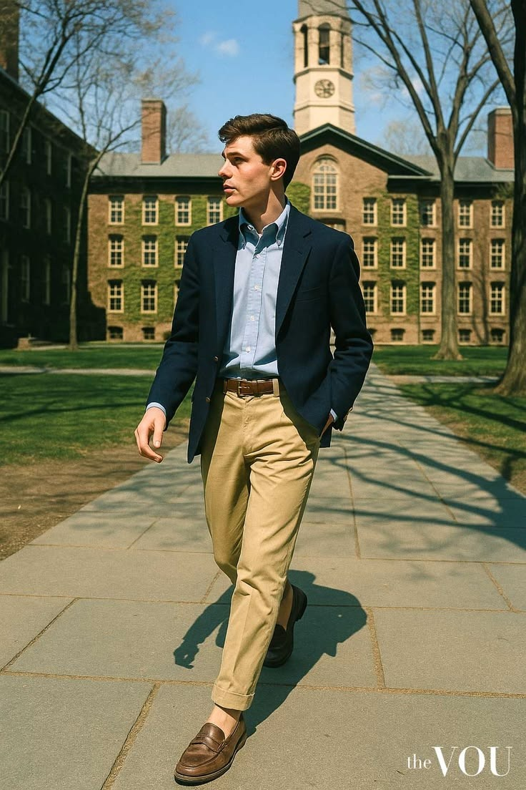
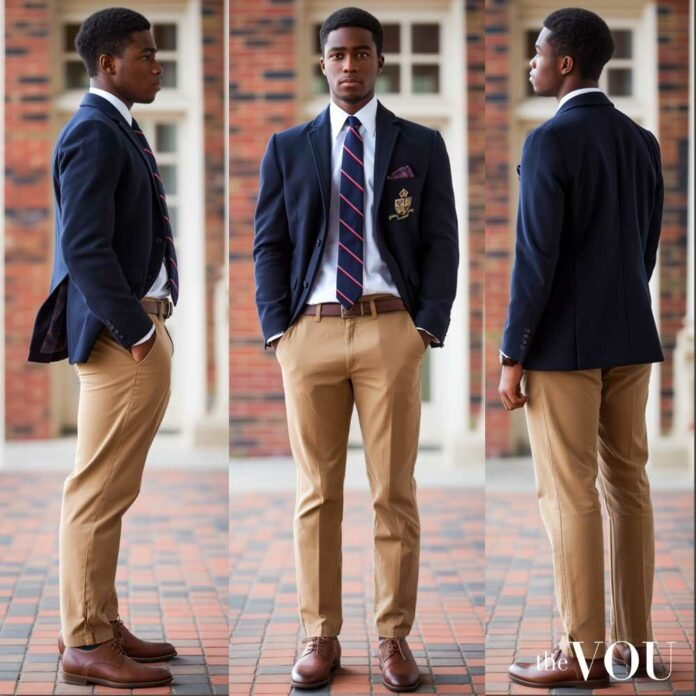
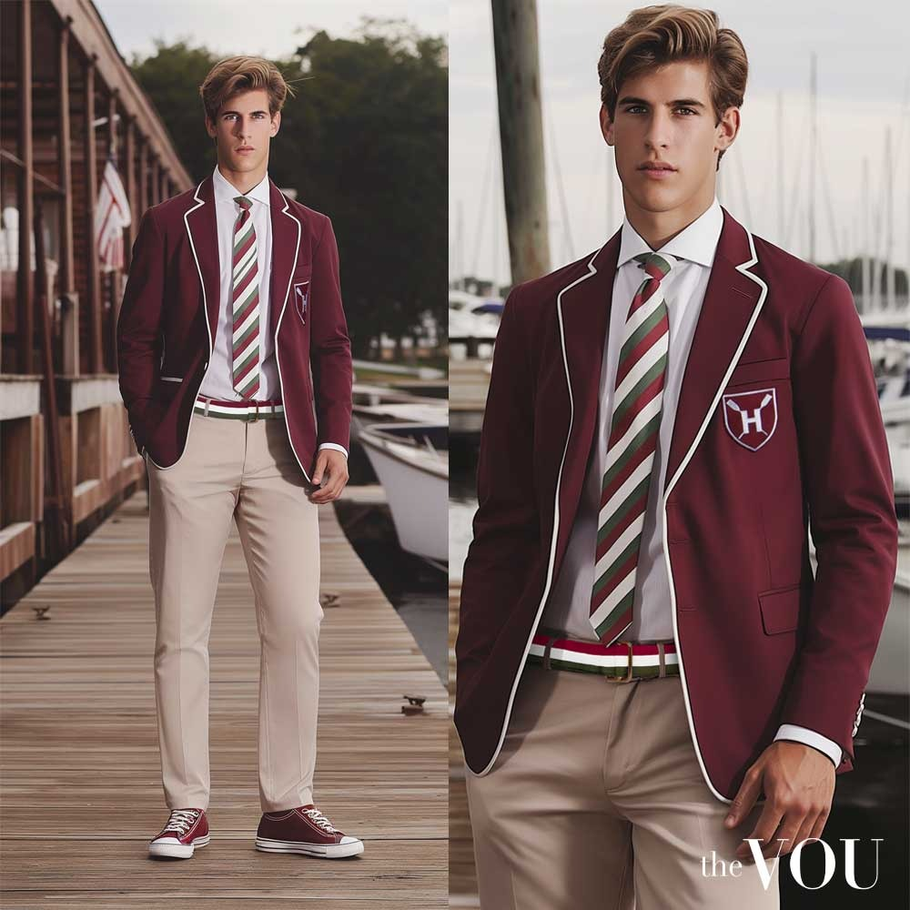

# 美式常春藤 (American Ivy League)

> **状态**: `reviewed` | **最后更新**: 2026-06-13

## 📖 概述

美式常春藤风格（American Ivy League Style），又称 **Ivy Style** 或 **Ivy Look**，是诞生于 20 世纪中叶美国东北部常春藤盟校（哈佛、耶鲁、普林斯顿等）校园的经典男性穿搭体系。它是**第一套真正意义上源自美国本土的男装传统**——融合了英国贵族运动服饰、军事剩余物资的实用主义与大学生随性不羁的态度，形成了一种"刻意的不经意"（studied negligence）。

其核心美学可概括为：**自然肩、无省道、牛津布、乐福鞋**——去结构化、反精致，却从不失体面。在 1957-1958 年巅峰期，美国约 **70% 的西装销售**属于 Ivy League 风格，可谓主宰了一个时代的男性着装。经由 1965 年日本写真集《TAKE IVY》的镜头，这种风格更在东瀛被神话化为永恒经典，催生了 **Ametora（アメトラ，美式传统）** 文化，最终形成了日本反过来"拯救"美式风格的传奇闭环。

今天，Ivy League 风格已超越其 WASP 精英的出身背景，成为全球男装语汇中不可或缺的核心篇章，并持续被 Aimé Leon Dore、Noah、Rowing Blazers 等当代品牌重新演绎。

---

## 📜 历史文化

### 校园起源（1920s-1930s）

常春藤风格的雏形最早可追溯到 **1920-1930 年代的普林斯顿大学**。这座哥特式校园孤立于新泽西乡村，男学生群体以 WASP（盎格鲁-撒克逊裔白人新教徒）为主，课余生活围绕着马球、赛艇、网球、帆船和高尔夫等英式休闲运动展开。学生们将英国的乡村与运动服装——粗花呢夹克、马球外套、纽扣领衬衫——挪用为日常校园穿着。

1933 年《Apparel Arts》杂志精准捕捉了这种态度：*"新生学到的第一件事，就是永远不要看起来'精心打扮'，但永远要看起来穿着得体。"*

### 战争催化（1940s）

**二战配给制**对 Ivy Style 的形塑起到了决定性作用。战时物资管制法令禁止了双排扣西装、裤褶和翻边裤脚等"多余"设计——这些元素战后也未能回归常春藤体系，反而被更简洁的单排扣平脚裤所取代。同时，大量退伍军人通过《退伍军人权利法案》（G.I. Bill）进入大学，他们穿着剩余的军装卡其棉布裤（chinos），将军事功能美学带入了校园。

### 黄金时代（1950s）

1954 年是一个分水岭。美国《生活》（Life）杂志刊登专题《The Ivy League Look Heads Across the U.S.》，首次公开使用了"The Ivy League Look"这一称呼，并点名 **Brooks Brothers** 和 **J. Press** 为该风格的首要代表品牌。此后三年间，Ivy League 风格席卷全美，不仅在校园中不可或缺，更成为中产阶级男性的日常制服——拥有常春藤风格的穿着，即使从未踏入哈佛校园，也象征着上层阶级的品味与地位。

当时哈佛等学校的食堂甚至规定不穿外套不打领带不得入内。这种制度性的"正式"反而催生了反抗性的"随意"——学生们在西装里穿皱巴巴的牛津衬衫，挽起袖口，让乐福鞋磨出毛边，用刻意的不修边幅宣告："我并非不懂规则，只是选择不太当真。"

### 《TAKE IVY》——一本写真集的神话化（1965）

1965 年 9 月 20 日，日本妇人画报社出版了由四位日本男装爱好者创作的摄影集《Take Ivy》。**林田昭庆（Teruyoshi Hayashida）** 担任摄影，**石津祥介（Shosuke Ishizu）**、**黑须敏之（Toshiyuki Kurosu）** 和 **长谷川元（Hajime Hasegawa）** 负责文案与协调。他们像备战考试一样研究常春藤校园的作息，捕捉学生在图书馆、船屋、草坪上阅读的瞬间——镜头里的美国大学生穿着牛津衬衫、斜纹裤、乐福鞋，画面洋溢着不经意的青春气息。

书分四章——College Life、College Fashion、Elements of "Ivy"、Take Ivy。书名灵感来自 Dave Brubeck 的爵士名曲《Take Five》。《纽约时报》后来称其为"时尚圈内部的秘藏宝藏"，全球销量超过五万册，原版在西方拍卖市场上曾拍出 **2000 美元**高价。

这本写真集在日本的冲击力远超美国——它让东京银座街头的年轻人疯狂追逐美式学院风，直接催生了日本长达半个世纪的 **Ametora** 风潮。Ralph Lauren、Tommy Hilfiger 和 J.Crew 等品牌的设计师都公开承认受其影响。英文首版直到 2010 年 8 月 31 日才由 powerHouse Books 出版（译者间部美穗，139 页精装）。

### Ametora——日本如何"拯救"了美式风格

日本对 Ivy Style 的吸收经历了一条独特路径。1951 年，石津谦介（Kensuke Ishizu）创立品牌 **VAN Jacket**，成为日本 Ivy 风格教父；他创办的杂志《Men's Club》扮演了"风格教科书"的角色。1976 年，Harajuku 诞生的生活方式零售商 **BEAMS**（全名 American Life Shop Beams）和杂志 **《POPEYE》**（副标题"Magazine for City Boys"）同年问世，标志着日本对美国文化的再创造进入系统化阶段——BEAMS 的第一家店就是按 UCLA 大学宿舍的风格装修的。

转折在 1986 年：日本服装巨头 Onward Kashiyama 收购了 **J. Press**。这是第一家被日本公司收购的美国经典品牌。更具象征意义的是，1965 年《Take Ivy》中真实常春藤学生的随意甚至邋遢，被插画家 **穗积和夫（Kazuo Hozumi）** 在 1980 年的《IVY Illustrated》中重新描绘为一丝不苟、尊重爱德华时代传统的优雅绅士——**日本人创造了一个比原版更"正宗"的 Ivy 版本**。

W. David Marx 在 2015 年出版的经典著作 **《Ametora: How Japan Saved American Style》**（中译本《洋风和魂》）完整记录了这六十年的文化往复，是理解 Ivy 风格全球传播的必读书。

---

## 🎨 美学特征

### 廓形（Silhouette）

Ivy League 的廓形可以用一个词概括：**去结构化（unstructured）**。与英式定制西装的收腰、法式时装的雕塑感截然不同，Ivy 追求自上而下的自然垂坠：

- **Sack Suit（布袋西装）**：单排扣夹克，前片无省道（no front darts），身体线条自然垂落，像布袋一样，故得此名。肩部为**自然肩（natural shoulder）**——无垫肩或极轻垫肩，呈现穿着者本来的肩线。
- **3-roll-2 扣位**：三粒纽扣，最上面一粒缝在翻领内卷处不显，实际只用两粒。这是 Ivy 西装最标志性的细节——优雅地传达"我不太在乎"的姿态。
- **钩形单开衩（hook vent）**：背后一个钩形小开衩，区别于英式西装的双侧开衩。
- **裤子**：平脚（flat front），无褶，通常有翻边（cuff），配腰带而非背带。

### 色板（Color Palette）

| 类别 | 用色 |
|------|------|
| **基础中性色** | 藏青（Navy）、卡其（Khaki）、灰色（Grey）、米白/奶油（Cream） |
| **浓郁暖色** | 勃艮第/牛血红（Burgundy/Oxblood）、驼色（Camel）、橄榄绿（Olive） |
| **夏季明亮色** | 楠塔基特红（Nantucket Red，褪色粉红）、马德拉斯彩格、淡粉、婴儿蓝、薄荷绿 |
| **学院代表色** | 哈佛深红、耶鲁蓝、普林斯顿橙黑、达特茅斯森林绿 |

整体原则是：**以中性色打底，用一到两种浓郁色或格纹作为点缀**，从不过于张扬。

### 面料（Fabrics）

Ivy 体系遵循严格的季节面料法则——这是空调普及前上层阶级生活方式的遗产：

| 季节 | 核心面料 | 代表单品 |
|------|----------|----------|
| **秋冬** | Harris Tweed、Shetland 羊毛、灰色法兰绒 | Sack jacket、绞花毛衣、达夫尔大衣 |
| **春夏** | Seersucker（泡泡纱）、Madras（马德拉斯棉格布）、亚麻、府绸 | Seersucker 西装、Madras 运动夹克、白牛仔裤 |
| **四季** | 牛津布（Oxford Cloth） | OCBD 衬衫 |

- **Harris Tweed**：产自苏格兰外赫布里底群岛的手工粗花呢，Ivy 风格中 odd jacket 的灵魂面料。
- **Shetland 羊毛**：绒面毛茸茸的"Shaggy Dog"毛衣是 Chipp 品牌的招牌，曾推出珊瑚、热粉、柠檬黄等夸张色——这被称为 **"Go-To-Hell"** 美学（1960 年代初的嬉皮书卷气）。
- **Seersucker**：波斯语 "shir-o-shakhar"（牛奶与糖），以平滑与褶皱条纹交替使面料远离皮肤，极致透气。1909 年新奥尔良的 Joseph Haspel, Sr. 将其商业化推广——他穿着 Seersucker 西装游过大西洋来证明其免熨特性。
- **Madras**：手织印度棉格布，Ivy 夏季的"万能用布"——衬衫、短裤、运动夹克甚至领带皆可 Madras。G. Bruce Boyer 回忆 1950-60 年代的 Ivy 夏季衣橱就是"**madras everything**"。
- **牛津布**：带有篮式编织纹理的中等厚度棉布，比普通府绸更耐用、纹理感更强，是唯一全年无休的面料。

### 标志性图案

- **Houndstooth（犬牙格）**：黑白交织，常用于粗花呢夹克
- **Herringbone（人字纹）**：锯齿形羊毛织物
- **Repp Stripe / Club Stripe**：领带上的斜条纹，每条纹路代表不同俱乐部或学校
- **Argyle（菱形格）**：针织背心上的经典菱格纹
- **Madras Plaid**：多色拼接格纹，越鲜艳越正宗

### 标志单品表

| 单品 | 关键特征 | 代表品牌/产地 |
|------|----------|---------------|
| **OCBD 牛津布纽扣领衬衫** | 软领无衬（unlined collar），领尖自然卷曲形成"天使之翼"（collar roll）；背后的锁环（locker loop）和第三个领扣是其纯血统标志；颜色以白、蓝、粉、黄、条纹为主 | Brooks Brothers（发明者，1896）、Mercer & Sons、Kamakura Shirts |
| **Sack Suit 布袋西装** | 3-roll-2 扣、自然肩、无前省道、钩形后开衩 | Brooks Brothers、J. Press、Sid Mashburn "Virgil" |
| **斜纹棉布裤（Chinos/Khakis）** | 平脚无褶，直筒或微锥形，卡其色最经典 | Bills Khakis、J.Crew |
| **灰色法兰绒西裤** | 秋冬正装裤标配，配粗花呢夹克或 Blazer | Brooks Brothers、Rowing Blazers |
| **Navy Blazer（藏青布雷泽）** | 单排扣、藏青色、黄铜纽扣（常带校徽/俱乐部徽章）、贴袋 | J. Press、Brooks Brothers |
| **Harris Tweed 运动夹克** | 3-roll-2 扣、肘部补丁（皮革或麂皮）、斜切口袋 | J. Press、Drake's |
| **Penny Loafers（便士乐福鞋）** | 鞋面有切口鞍带，可塞一枚硬币；牛血红（oxblood）最经典；圆头 | G.H. Bass "Weejuns"（1936 年发明）|
| **Boat Shoes（帆船鞋）** | 生皮系带环绕鞋帮，白色防滑底 | Sperry Top-Sider（1935 年发明） |
| **板球毛衣/网球毛衣（Cricket/Tennis Sweater）** | V 领、领口和袖口有对比色滚边 | Ralph Lauren、Drake's |
| **Shetland 圆领毛衣** | 毛茸茸质感，绞花或素面，常随意披在肩上 | J. Press "Shaggy Dog"、O'Connell's |
| **条纹领带 / 针织领带** | Repp stripe 斜纹丝质领带或窄款丝/羊毛针织领带 | J. Press、Brooks Brothers、Drake's |
| **马球大衣（Polo Coat）** | 骆驼毛或驼色羊毛，双排扣，宽翻领，带腰带 | Brooks Brothers |
| **泡泡纱西装（Seersucker Suit）** | 蓝白条纹，夏季半正式着装 | Haspel、J.Crew |
| **Madras 运动夹克** | 多色彩格，夏季休闲 | J. Press、Ralph Lauren |
| **橡胶底帆布鞋** | 白色或米色鞋面，红色/蓝色橡胶底 | Sperry CVO |

---

## 🏷️ 代表品牌

### 殿堂级

| 品牌 | 成立 | 地位 |
|------|------|------|
| **Brooks Brothers** | 1818 年，纽约 | 美国最古老男装品牌，OCBD 和 Sack Suit 的发明者。如果 Ivy 风格有一个物理故乡，那就是 Brooks Brothers 的麦迪逊大道旗舰店。 |
| **J. Press** | 1902 年，纽黑文（耶鲁大学旁） | 始于耶鲁校园旁的犹太移民裁缝店，定位比 Brooks 更年轻、更俏皮。领口第三扣、翻盖胸袋是其标识。1986 年被日本 Onward Kashiyama 收购，目前在日本的店铺数量是美国的六倍。2024-2025 年，Rowing Blazers 创始人 Jack Carlson 出任创意总监，正在推动品牌复兴。 |
| **G.H. Bass & Co.** | 1876 年，缅因州 | Weejuns 便士乐福鞋的创造者（1936 年）。鞋名是"Norwegian"的戏谑音译。Michael Jackson 的《Thriller》MV 开场就是一个 Weejuns 的特写。 |

### 全球传播者

| 品牌 | 角色 |
|------|------|
| **Ralph Lauren / Polo** | 将 Ivy/Preppy 审美推向全球的头号功臣。Lauren 本人年轻时曾在 Brooks Brothers 做销售，他说那里的风格代表着一种"安静的内行人的默契"。 |
| **BEAMS** | 1976 年成立于东京原宿，最初叫"American Life Shop Beams"，店设仿 UCLA 宿舍。现任社长设乐洋说品牌哲学是 **"Basic & Exciting"**——基本功才是最令人兴奋的。通过 BEAMS Plus 等支线，它至今是全球最精良的美式传统风格再创造者之一。 |
| **J.Crew** | 大众市场 Ivy 风格的门户品牌。1980 年代起将学院美学以更亲民的价格和更轻松的剪裁带给广泛消费者。 |

### 当代复兴者（Neo-Ivy）

| 品牌 | 贡献 |
|------|------|
| **Aimé Leon Dore（ALD）** | Teddy Santis 创立的纽约皇后区品牌，被公认为近年 Ivy 复兴的最大推手。以街头感的宽松廓形和 90 年代嘻哈审美重新诠释绞花毛衣、百褶裤、校队夹克和乐福鞋。 |
| **Noah** | 前 Supreme 创意总监 Brendon Babenzien 创立，将 Ivy 经典（牛津衬衫、橄榄球衫）与滑板文化和社会议题结合，打造"有良知的预备生"形象。 |
| **Rowing Blazers** | Jack Carlson 创立，以颠覆性彩色橄榄球衫、徽章 Blazer 和玩世不恭的态度著称。Carlson 本人也是 J. Press 现任创意总监。 |
| **Drake's** | 伦敦品牌但精神上极其 Ivy——软肩西装、Shetland 毛衣、真丝领带，被誉为"教授风"的极致。 |
| **Sid Mashburn** | 亚特兰大男装店，其 "Virgil" 西装被描述为"老式 Sack Suit，但更性感"——那不勒斯手工、全毛衬、3-roll-2 扣、无省道。 |
| **Thom Browne** | 将 Ivy/Preppy 基因极端化——灰西装、百慕大短裤、缩水廓形——使其成为高级时装语汇。 |
| **Bode** | 以古董面料和学院记忆为灵感的工艺品牌，其纽约旗舰店本身就是一座 Ivy 文化档案馆。 |

### 平价替代

- **UNIQLO**：与 BEAMS、POPEYE 体系深度合作的日系平价方案。U 系列的牛津衬衫和宽腿斜纹裤是 City Boy 入门标配。
- **MUJI Labo**：更克制的日式 Ivy。
- **Spier & Mackay**：加拿大的性价比之王，OCBD 和 Sack Suit 价位合理。
- **eBay 古着**：1970 年代之前产的 Brooks Brothers / J. Press Sack Suit，$100-200 即可购入真品，全毛衬美产，堪称最实惠的"纯血统"入口。

---

## 👤 风格偶像

### John F. Kennedy（1917-1963）

常春藤风格毋庸置疑的守护圣人。真实的哈佛毕业生（1940 届），他的穿衣方式本身就是一套宣言：裁剪得当的单排扣西装（来自 Savile Row 的 H. Harris of New York）、白色纽扣领衬衫、休闲时配卡其短裤。1960 年电视总统辩论中——对面是满头汗水的尼克松——肯尼迪看起来"就是现代活力的化身"。他生前声称时尚对他并不重要，**恰恰这种"不重视"才是他风格的终极秘密**。

### Paul Newman（1925-2008）

如果说肯尼迪是常春藤风格的贵族化身，Paul Newman 就是它的平民传道者。他在银幕上的招牌——牛津衬衫扎进浅色斜纹裤、乐福鞋、紧身白 T 打底——将 Ivy 从校园精英圈带进了美国主流大众的衣橱。《Hollywood and the Ivy Look》一书中将他与 Steve McQueen 和 Anthony Perkins 并列为"将 Ivy Look 推向酷的高度"的演员。

### Miles Davis（1926-1991）

1954 年前后，爵士推广人 Charles Bourgeois 带 Miles Davis 走进了哈佛广场的 **Andover Shop**——一个小型高级裁缝店。Miles 全身换装 Ivy 风格走出店铺的那一刻，在爵士史和男装史同时炸开了一枚炸弹。**一位黑人音乐家穿上 WASP 精英的制服**——这个动作本身就是一种颠覆性的文化宣言。他的绿色牛津衬衫（出现在 1958 年《Milestones》专辑封面）、Bass Weejuns 乐福鞋，让 Esquire 评论家 George Frazier 称他为 **"The Warlord of the Weejuns"（乐福鞋军阀）**。此后，Chet Baker、Gerry Mulligan、Stan Getz 等一代爵士明星都成为 Andover Shop 的顾客——**Ivy-Jazz 的交汇至今仍是美式风格史上最酷的章节之一**。

### 木滑良久 & 石川次郎（《POPEYE》创刊编辑）

这两位日本编辑从未在常春藤盟校读过书，但他们对 Ivy 风格在全球传播的影响不亚于任何美国设计师。1976 年创刊的《POPEYE》杂志，最初的任务就是派摄影师飞赴美国西海岸大学拍摄学生的穿着，带回日本供年轻人模仿。他们由此创造了"City Boy"这个文化符号——一种以 Ivy 为底、混入滑板和户外元素的日式生活美学。

### 《Take Ivy》创造者们

石津祥介（1935-2023，VAN Jacket 品牌创始人石津谦介之子）、林田昭庆（摄影师，生于东京青山）、黑须敏之、长谷川元——这四位日本绅士在 1965 年用相机记录下了一个美国人自己都未曾妥善保存的世界。他们的作品不仅是一部服装史文献，更是一种**东方的凝视**：用极致认真的目光，把随意的美式青春升华为不朽的神话。

### 其他风格偶像

- **Steve McQueen**：将 Ivy 的斜纹裤和粗花呢夹克融入硬汉气质。
- **Anthony Perkins**：银幕上的 Ivy 完美化身——软肩西装、窄领带、领尖纽扣。
- **Gianni Agnelli**：意大利菲亚特掌门人，将 Ivy 领带的不规则系法（手表戴在衬衫袖外）提升为个人商标。
- **木下孝浩（Takahiro Kinoshita）**：2012-2018 年任《POPEYE》主编，将濒临停刊的杂志起死回生（销量从 4 万册回到 10 万+），定义了一代亚洲男生的"City Boy"审美。

---

## 🔗 关联风格

### 父风格关系

Ivy League 是以下多个风格流派的共同母体：

**Ivy League（1950s）** → 分化为：
- → **American Preppy（1980s）**：Lisa Birnbach《The Official Preppy Handbook》（1980）将其娱乐化、商业化。更明亮的颜色、更多品牌 Logo、更自觉的"复古扮演"。Ralph Lauren 和 Tommy Hilfiger 是主要推动者。
- → **American Trad（1990s-2000s）**：更窄化、更教条化的 Ivy 复兴。强调"正宗"和"规则"，色彩更为保守。
- → **Ametora（アメトラ）/ City Boy（1970s 至今）**：日本的纯粹化再创造。从 VAN Jacket 到 BEAMS 到《POPEYE》，日本人建立了一套比美国原版更精细的 Ivy 语法体系。
- → **Neo-Ivy（2010s 至今）**：Aimé Leon Dore、Noah、Rowing Blazers 等品牌的时代。Ivy 被去权威化、街头化、全球化——不再是 WASP 的特权符号，而是一种可以自由拆解重组的美学积木。

### 子风格辨识

| 风格 | 与 Ivy League 的区别 |
|------|----------------------|
| **Preppy** | 更明亮、更大 Logo、更自觉的"扮演"，多了一层 80 年代的消费主义光泽 |
| **City Boy** | 日本滤镜、更宽大的廓形、混入滑板和户外单品、New Balance 替代乐福鞋 |
| **Old Money Aesthetic** | 更欧洲化、更安静奢侈、更少学院色彩；是 Ivy 的远亲而非直系后代 |
| **Dark Academia** | 偏哥特气质的欧洲学院臆想，非美式，与 Ivy 面料和色板的关联更弱 |

### 与 City Boy 的深度关系

《POPEYE》定义的 City Boy 以 Ivy 为骨架，但对其进行了三处关键改造：
1. **廓形放大**：Sack Suit 的宽松哲学被推到极致——衬衫、外套、裤子全部加大两码。
2. **鞋履替换**：传统乐福鞋/帆船鞋被 New Balance 复古跑鞋（尤其是 990 系列）取代。
3. **阶层消解**：Ivy 的 WASP 精英出身被日式"庶民"生活感覆盖——City Boy 可以是任何人。

木下孝浩的名言："City Boy 不是一种穿搭风格，是一种看世界的方式。"

---

## 📈 流行趋势（2025-2026）

### 最新动态

- **J. Press 品牌复兴**：2024-2025 年，Jack Carlson（Rowing Blazers 创始人）出任 J. Press 创意总监兼总裁，以《Take Ivy》为"北极星"，推动这家耶鲁校园旁诞生的品牌面向新一代年轻受众。J. Press Spring 2026 系列被 Yahoo Style 评价为"Ivy League 风格的重新想象"。
- **Pharrell Williams 执掌 LV 男装**：Louis Vuitton 2026 秋季男装胶囊系列中，Pharrell 将 Ivy 重新定义为"国际花花公子的制服"——加入了非洲色彩和全球视角。
- **Dior 男装首秀**：Jonathan Anderson 在 Dior 的首个系列大量使用 Repp 领带、粗花呢 Blazer 和乐福鞋。
- **Taylor Swift 与 Jenna Ortega 的女性 Preppy**：《The Telegraph》报道，女性 Preppy 正在以 Carolyn Bessette-Kennedy 式的 90 年代极简主义回潮——质地而非 Logo、干净的轮廓、麂皮和丝绸。
- **"老钱美学"热潮**：TikTok 上的 #OldMoney 话题引爆全球，虽然并非传统 Ivy，但它将藏青 Blazer、乐福鞋和牛津衬衫推向了 Z 世代的注意力中心。

### 核心趋势特征

1. **从 Cosplay 到混搭**：不再追求"从头到脚的历史还原"，而是取一两件单品（校队夹克、repp 领带）化入日常穿搭。
2. **反穿与错误穿法**：领带半系或反向佩戴成为潮流宣言。
3. **乐福鞋全面回归**：便士乐福、流苏乐福（tassel loafers）和船鞋是当下最重要的鞋履趋势。
4. **Socks with Loafers**：乐福鞋配彩袜曾是大忌，如今是必备技巧。
5. **正宗的复兴**：消费者对"真正的"无衬领卷、美国产 Sack Suit、Shaggy Dog 毛衣的需求大幅上升。**追求质感而非 Logo** 是这一轮复兴的核心价值观。

---

## 💡 穿搭建议

### 入门经典公式（出错率零）

**上衣**：白色或蓝色牛津布纽扣领衬衫（OCBD）  
**外套**：藏青单排扣 Blazer（黄铜纽扣）  
**裤装**：卡其斜纹棉布裤（直筒，无褶）  
**鞋履**：牛血红便士乐福鞋（配藏青色袜子或不穿袜子）  
**配饰**：repp stripe 斜纹领带（可选）、皮编腰带

### 进阶层次

**秋冬版**：
- 灰色法兰绒西裤 + Harris Tweed 粗花呢夹克 + Shetland 圆领毛衣 + OCBD
- 外加大衣：驼色马球大衣或达夫尔大衣

**春夏版**：
- Madras 运动夹克 + 白色 OCBD + 卡其短裤/轻薄斜纹裤 + 帆船鞋
- 或：Seersucker 西装 + 粉色 OCBD + Weejuns（不穿袜子）

### 核心哲学

Ivy 风格的精神内核从来不是规则本身，而是 **"知道规则后选择不太当真的姿态"**。被 G. Bruce Boyer 称为 **"incorrect correctness"（正确的错误）**——衬衫可以皱，鞋可以旧，领带可以略松，西装肩可以自然垂坠。不要穿得"太新"。

### 避雷指南

- ❌ 过度修身：Sack Suit 的"布袋"感是风格核心，修身版型是反 Ivy 的。
- ❌ 融合领/有衬领 OCBD：不能卷出"天使之翼"领型的 OCBD 失去了灵魂。
- ❌ 全身统一全新：Ivy 需要时间的痕迹——旧化是美的一部分。
- ❌ 回避颜色：觉得粉色或楠塔基特红"太招摇"就太拘谨了——Ivy 本来就有"Go-To-Hell"的俏皮一面。
- ❌ 忽视面料季节感：劳动节（美国 9 月第一个周一）后穿 Seersucker 或白裤子是真正的失礼。

### 最佳阅读

- 《Take Ivy》（林田昭庆等，1965 / 英文版 2010）
- 《Ametora: How Japan Saved American Style》（W. David Marx，2015 / 2023 更新版；中译本《洋风和魂》）
- 《Hollywood and the Ivy Look》（Tony Nourmand & Graham Marsh，2011）
- 《Preppy: Cultivating Ivy Style》（Jeffrey Banks & Doria de La Chapelle，2011）
- 《The Official Preppy Handbook》（Lisa Birnbach，1980）——半开玩笑但信息量巨大的风格指南
- 网站：Ivy-Style.com（专注常春藤风格的男装博客）
- 《POPEYE》杂志过刊（尤其是 2012-2018 年木下孝浩主编时期）

## 📸 风格图库

> 以下为风格代表性穿搭参考图，搜集自公开时尚媒体。

*风格穿搭参考*

*Five Ivy League Outfit Ideas for a Super Posh Collegiate Look*

*Five Ivy League Outfit Ideas for a Super Posh Collegiate Look*
