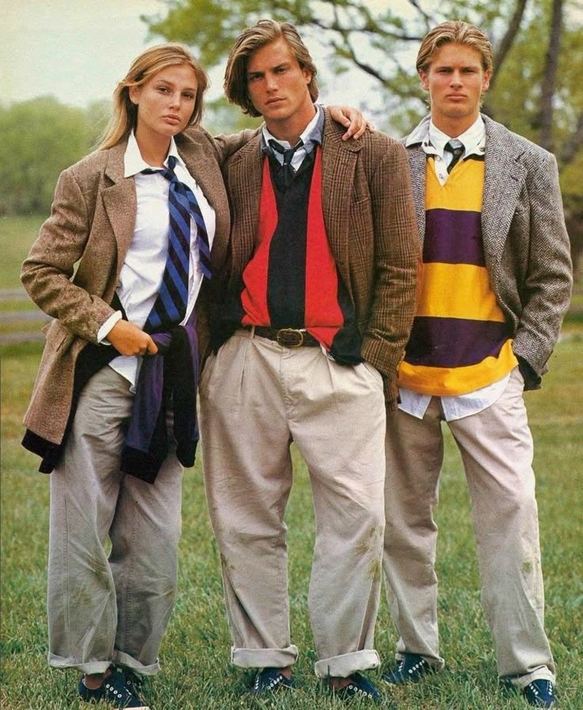
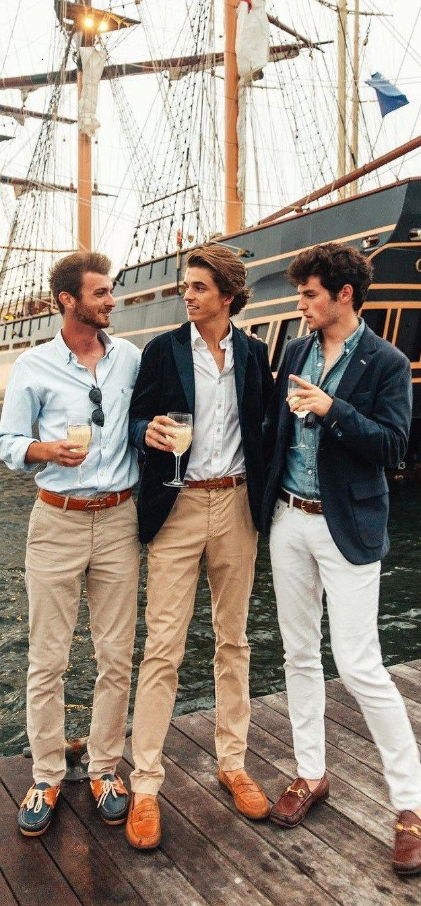
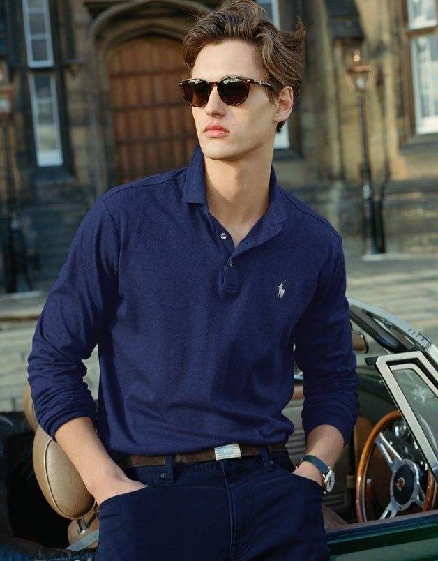

# 美式预科风 (American Preppy)

> **状态**: `reviewed` | **最后更新**: 2026-06-13 | **趋势**: 经典风格

## 📖 概述

美式预科风（American Preppy）是一种以美国东北部精英大学（常春藤联盟）校园着装为蓝本的经典穿搭风格。它并非刻意"时尚"，而是一套关于**身份归属**的视觉语言——海军蓝金扣西装夹克、牛津布纽扣领衬衫、卡其斜纹裤、雷普条纹领带、便士乐福鞋和设得兰羊毛衫构成了其核心单品矩阵。从1920年代的常春藤校园到2025年的Miu Miu秀场，Preppy经历了从"继承的阶层密码"到"可购买的全球视觉语言"的转变，持续被每一代人重新诠释。

## 📜 历史文化

### 常春藤起源（1920s–1950s）

Preppy风格的根源深植于20世纪初的常春藤盟校校园——哈佛、耶鲁、普林斯顿等。富裕的WASP（盎格鲁-撒克逊白人新教徒）学生形成了一套可辨识的"制服"：一切看起来都不应该是全新的，皱褶和磨损是荣誉勋章。关键早期品牌包括：

- **Brooks Brothers**（1818年创立）：发明了纽扣领牛津衬衫（Button-Down Oxford），创造了自然肩"美式西装"
- **J. Press**（1902年创立于耶鲁校园）：被视为常春藤风格（Ivy Style）的真正发源地，其西装版型40余年几乎不变
- **L.L. Bean**（1912年创立）：被《Preppy Handbook》形容为"Preppy圣地"

核心常春藤校服：**海军蓝西装夹克配金色纽扣、牛津布纽扣领衬衫、卡其斜纹裤、雷普条纹领带、便士乐福鞋、设得兰羊毛衫**。袜子是可选项——全年追求海滩度假般的轻松感。

### 《The Official Preppy Handbook》——1980年代的文化震撼

1980年10月，Workman Publishing出版了由Lisa Birnbach主编的《The Official Preppy Handbook》，一本224页的讽刺参考指南。封面语："Look, Muffy, a book for us."这本书以调侃的口吻详细拆解了Preppy生活的方方面面——从出生到乡村俱乐部暮年，涵盖该去哪所预科学校和大学、去哪避暑（楠塔基特、玛莎葡萄园）、穿什么（粉与绿、楠塔基特红、针绣腰带、破旧的Bean靴）、如何喝酒、社交、装修和度假。神圣法则是：**永远不要看起来是新的**。

这本书产生了矛盾而深远的影响：
- **民主化了Preppy文化**：将一套排他的、继承性的WASP密码变成了可复制的清单，任何人都可以参与
- **催生了J.Crew**：创始人Arthur Cinader明确表示J.Crew的创立就是受此书启发
- **将L.L. Bean推入主流**
- **引发了反弹**：普林斯顿学生开始出售反Preppy徽章（鳄鱼图案被红色斜杠划掉），"Nuke the Preppies" T恤随之出现

### 与Ivy League的区别

虽然常被混用，但Ivy Style与Preppy存在微妙差异：
- **Ivy Style**：更纯粹的历史性校园着装，忠于J. Press/Brooks Brothers传统，偏保守低调
- **Preppy**：Ivy Style的"时尚化"版本，更鲜艳的色彩（楠塔基特红、Kelly绿、电光粉），更大胆的图案（刺绣短裤、鲸鱼图案腰带），融合了度假和运动元素

Ralph Lauren是这一转变的关键人物——他没有简单复刻旧设计，而是将当代潮流与经典元素相结合，**创造了真正的"Preppy"时尚**，区别于纯粹的Ivy风格。

### 2024–2026复兴浪潮

Preppy风格正在经历一场重大复兴，但与过去截然不同：

**数据（Pinterest & Lyst, 2024–2025）：**
- "经典Preppy穿搭"搜索量增长 **2,625%**
- "2000年代Preppy美学"增长 **2,867%**
- "海军蓝条纹"增长 **3,925%**
- Ralph Lauren在Lyst指数中飙升 **151%**

**关键秀场推手：**
- **Miu Miu（S/S 2024–S/S 2025）**：引爆船鞋热潮，卡其微短裙、拉链Polo衫，几乎单枪匹马将Preppy重新带回时尚聚光灯
- **Celine（Resort 2026）**：Michael Rider（Ralph Lauren前员工）以不对称开衫、超大开衫V领、马球领针织打造"布尔乔亚Preppy"
- **Dior**：Jonathan Anderson以学院条纹、橄榄球衫、慵懒剪裁展现美式松弛感
- **Louis Vuitton（S/S 2026）**：Pharrell以校队夹克、字母标志逻辑重新混音Preppy密码

**2025版Preppy的关键差异：**
- **袜子成为宣言**：高筒袜露在乐福鞋上方、透明膝上袜、亮红色脚踝袜作为刻意色彩点缀
- **比例被夸张化**：超大西装夹克配超短裤，慵懒设得兰毛衣罩在挺括衬衫外
- **意想不到的搭配**：橄榄球衫配波西米亚长裙，牛津衬衫配皮革背心，谷仓夹克配船鞋
- **"错误鞋子理论"**：功能性跑鞋配A字迷你裙——刻意的违和感
- **Gen Z驱动**：以**二手、可持续**的视角重新诠释Preppy——"梦想二手发现"搜索量增长550%

## 🎨 美学特征

**核心色彩体系：**
- 海军蓝（Navy Blue）——绝对基础色
- 楠塔基特红（Nantucket Red）——洗褪的鲑鱼粉
- Kelly绿、猎人绿
- 白色、奶油色
- 黄色（特别是淡黄色Polo衫）
- 粉与绿的经典组合

**核心廓形与单品：**
- 自然肩西装夹克（Natural Shoulder Blazer），金色金属纽扣
- 牛津布纽扣领衬衫（OCBD Shirt）
- 卡其斜纹裤（Khaki Chinos）
- 雷普条纹领带（Repp Tie）
- 设得兰羊毛衫（Shetland Sweater），常披在肩上打结
- 便士乐福鞋（Penny Loafer）
- 船鞋（Boat Shoe）
- 刺绣斜纹短裤、鲸鱼图案腰带
- 泡泡纱（Seersucker）和棉质府绸面料

**2025版Preppy新增语汇：**
- 大廓形西装夹克
- 罗纹Polo衫超短裙
- 不对称单肩开衫
- 高筒袜配乐福鞋
- 橄榄球衫配飘逸长裙
- 谷仓夹克（Barn Jacket）混搭学院单品

**面料关键词：**
牛津布、设得兰羊毛、泡泡纱、棉府绸、斜纹棉布、马德拉斯棉、灯芯绒、麂皮

## 🏷️ 代表品牌

### 第一梯队：常春藤正统
| 品牌 | 定位 | 特色 |
|------|------|------|
| **Brooks Brothers** | 美国最古老的服装品牌（1818年） | 发明纽扣领牛津衬衫；自然肩美式西装 |
| **J. Press** | 耶鲁校园诞生（1902年） | 最忠于Ivy传统的品牌，版型几十年不变 |
| **L.L. Bean** | 户外生活方式（1912年） | 经典的Bean靴、挪威毛衣、托特包 |

### 第二梯队：Preppy时尚化
| 品牌 | 定位 | 特色 |
|------|------|------|
| **Ralph Lauren Polo** | Preppy风格的定义者 | 将Ivy传统时尚化，售卖完整的美国梦生活方式 |
| **Tommy Hilfiger** | 更年轻、更街头的Preppy | 红白蓝Logo，锐舞文化+学院风的融合 |
| **Vineyard Vines** | 玛莎葡萄园度假风（1998年） | 粉红鲸鱼Logo，极致度假休闲Preppy |
| **J.Crew** | 大众化Preppy（1983年） | 受《Preppy Handbook》启发创立，中产阶级Preppy入口 |

### 第三梯队：当代奢侈解构
| 品牌 | 贡献 |
|------|------|
| **Miu Miu** | 2024–2025 Preppy复兴的最大推手 |
| **Thom Browne** | 将Preppy制服极端化、形式化、戏剧化 |
| **Celine（Michael Rider）** | "布尔乔亚Preppy"——不对称开衫、超大V领 |
| **Dior（Jonathan Anderson）** | 学院条纹、慵懒剪裁的美式松弛感 |

## 👤 风格偶像

**历史原型：**
- **肯尼迪家族**（JFK）——常春藤Preppy的终极形象：Wayfarer墨镜、纽扣领衬衫、卡其裤，度假中的轻松优雅
- **F. Scott Fitzgerald**笔下的盖茨比——常春藤Preppy的文学化表达
- **Miles Davis**——常春藤时期：精细剪裁的常春藤西装，证明Preppy可以穿越种族界限

**1980s代表：**
- **Lisa Birnbach**与《Preppy Handbook》中虚构的"Muffy"和"Biff"

**当代诠释者：**
- **Tyler, the Creator**——将Preppy密码注入街头语境
- **A$AP Rocky**——Miu Miu男装Preppy造型
- **Timothée Chalamet**——红毯上的Preppy新诠释
- **Paul Mescal**——非正式Preppy（短裤+乐福鞋）

## 🔗 关联风格

- **Ivy League / Ivy Style**：Preppy的鼻祖，更纯粹、更保守
- **British Mod**：类似的青年亚文化地位，不同的美学执行（意式剪裁 vs 美式自然肩）
- **Amekaji（美式休闲·日系）**：日本对Ivy/Preppy的极致重构，见`../../american_workwear/encyclopedia.md`
- **New England Americana**：Preppy+工装+户外混合
- **Dark Academia**：Preppy的文学化、暗黑版本——更深沉的色调，更知性的氛围

## 📈 流行趋势

- Preppy正经历**第三次重大复兴浪潮**（第一次1980s、第二次2000s初期、第三次2024–2026）
- 核心驱动：Gen Z的二手/可持续消费、奢侈品牌的学院风系列、"安静的奢华"（Quiet Luxury）退潮后的色彩回归
- 与2020年代早期的"安静奢华"相比，2025 Preppy更**有趣、大胆、故意"出错"**
- 船鞋（Boat Shoe）作为Miu Miu病毒性单品回归，已成为2025版Preppy的核心符号
- 区域分化：美国版偏运动休闲，欧洲奢侈版偏解构，日本版（Amekaji侧）偏收藏级复刻

## 💡 穿搭建议

**亚洲男性穿搭要点：**

1. **自然肩是关键**：亚洲男性通常肩部较窄、斜方肌不突出，避免过硬的垫肩。选择自然肩或无垫肩的西装夹克（参考J. Press或Uniqlo U合作款）
2. **裤装比例**：卡其裤不宜过紧，选择直筒或微锥形。No Break（不堆叠）或Half Break（轻微堆叠）长度，配乐福鞋或船鞋不穿袜子
3. **层叠是灵魂**：OCBD衬衫 + 设得兰羊毛圆领/V领衫（或直接披在肩上）+ 海军蓝夹克，这是Preppy的经典三层叠穿公式
4. **色彩平衡**：底色以海军蓝/卡其/白为主，用一两件高饱和单品（如淡黄Polo衫、粉绿条纹领带、刺绣短裤）做点睛，避免全身堆满鲜艳色彩
5. **适老化处理**：亚洲男性穿全新Preppy单品容易显得"用力过猛"。优先选水洗牛津布、磨损效果的乐福鞋、轻微褪色的卡其裤——"不新"的感觉才是Preppy的精髓
6. **不穿袜子的技巧**：船鞋/乐福鞋不穿袜子是Preppy的标志性穿法。如果不习惯可穿隐形船袜，但确保袜子完全不可见
7. **2025版Preppy入门**：不想全套经典Preppy的话，可以尝试"一件Preppy单品+其他风格混搭"——例如橄榄球衫配工装裤、西装夹克配牛仔裤、船鞋配九分西裤

## 📸 风格图库

> 以下为风格代表性穿搭参考图，搜集自公开时尚媒体。

*风格穿搭参考*

*Simple Guide To Nail The Preppy Style With Ease | Preppy mens fashion ...*

*What Is Preppy Old Money Style ? | Polo ralph lauren, Abbigliamento ...*
