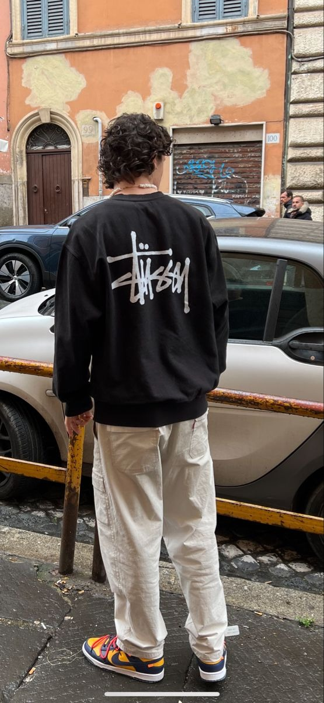
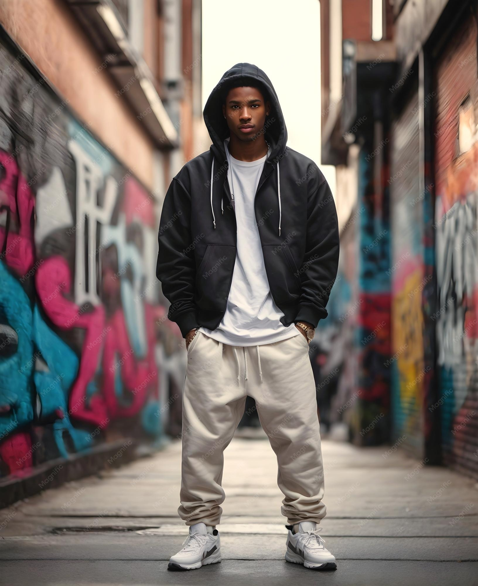
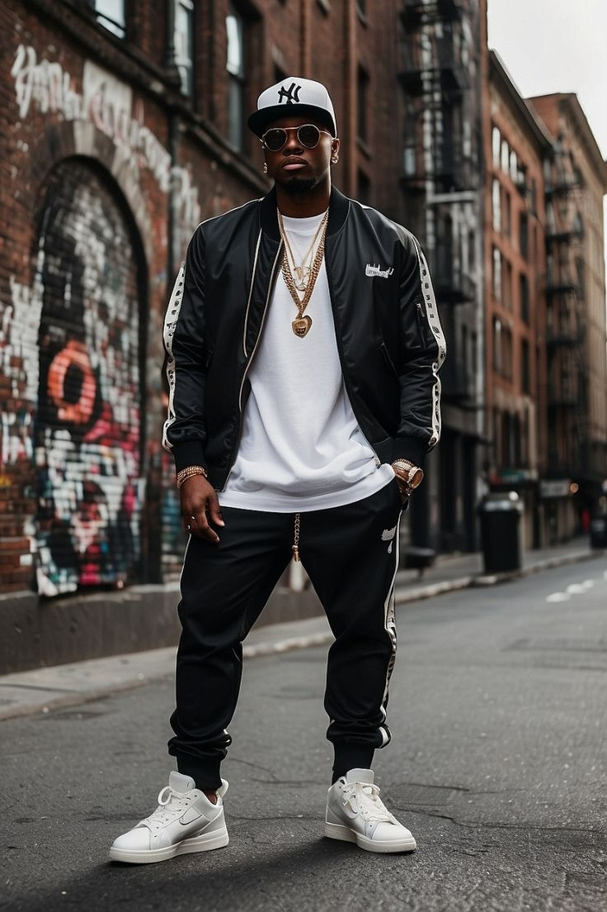

# 美式街头OG (American Streetwear OG)

> **状态**: `reviewed` | **最后更新**: 2026-06-13

## 📖 概述

美式街头OG（American Streetwear OG）指的是**1980年代末至1990年代中期**诞生于美国本土的第一代街头服饰品牌与文化运动。与后期全球化的、广义的"Streetwear"不同，美式街头OG具有明确的**地理-文化原点**和**亚文化根基**——滑板文化（Skate Culture）、嘻哈文化（Hip Hop）、朋克DIY精神以及反主流审美是其四大支柱。以Supreme（纽约，1994年）、Stussy（加州Laguna Beach，1980年）、FUCT（洛杉矶，1990年）和X-Large（洛杉矶，1991年）为四大创始品牌，这个时期的美国街头文化确立了我们今天所理解的"街头服饰"的基本语言：Logo T恤、连帽卫衣、棒球帽、限量发售、以及**将反叛和排他性编码为消费欲望**的商业模式。纽约与洛杉矶两座城市分别代表了街头文化的两条路径——前者更黑暗硬核的滑板/嘻哈，后者更阳光轻松的滑板/冲浪/派对文化。

## 📜 历史文化

### 起源：滑板+冲浪的交汇点——Stussy（1980）

街头服饰的起点通常追溯到**Shawn Stussy**。1980年，这位加州Laguna Beach的冲浪板制作者开始将自己的姓氏以涂鸦风格手写在T恤上，在自己的车上卖给海滩上的冲浪者和滑板者。Stussy最初不是一个时尚品牌——它是一种**有机的身份标记工具**。你穿Stussy，意味着你是这个国际冲浪/滑板/地下音乐社区的一部分。

Stussy的关键创新：
- 将**冲浪文化**、**滑板文化**和**嘻哈/俱乐部音乐**三个看似不相关的亚文化缝合在一起
- 1980年代末成立了"International Stussy Tribe"——一个由DJ、艺术家、滑板手和设计师组成的松散跨国网络，穿着Stussy在全球夜店相互辨识
- 以**限量稀缺性**制造渴望——在Supreme的"Drop"模式出现之前，Stussy已经在实践类似的策略
- Shawn Stussy的涂鸦签名Logo成为了街头Logo文化的始祖

### 洛杉矶的地下硬核——FUCT（1990）

如果说Stussy代表了加州街头的阳光面，那么**FUCT**（由Erik Brunetti于1990年在洛杉矶创立）代表了其黑暗面。Brunetti是一名滑板手和涂鸦艺术家，深受朋克和硬核音乐影响。FUCT的名字源于街头俚语（常被误解为"Friends U Can't Trust"的缩写），从一开始就充满了刻意的冒犯性和反商业立场。

FUCT的贡献：
- 将**政治讽刺、黑暗幽默和反权威图像**引入街头服饰——其图形设计直接引用无政府主义、反法西斯和劳工运动符号
- 第一个真正将**街头文化视为严肃艺术画布**的品牌，而非简单的青年服装
- 在法律层面建立了品牌命名的言论自由先例——2019年，美国最高法院在*Iancu v. Brunetti*案中一致裁定FUCT有权注册商标，推翻了联邦政府数十年来的"不道德或诽谤性"商标禁令。这是第一修正案的里程碑案件
- 影响了无数后来者：Supreme的叛逆性、Palace的反讽、Vetements的反时尚——其中都流淌着FUCT的DNA

### 纽约的滑板硬核之王——Supreme（1994）

**James Jebbia**（英国人，曾在Stussy工作）于1994年在纽约Lafayette Street开设了Supreme的第一家店铺。与Stussy和FUCT在加州的阳光/朋克根源不同，Supreme诞生于曼哈顿下城的滑板场景——1990年代初期的纽约滑板文化粗糙、危险、且极度排外。

Supreme的突破性创新：
- **将店铺作为文化中心**：Lafayette Street店铺被设计为滑板者可以带着滑板进来的空间，而非传统零售环境。店员本身就是滑板手——他们对外来者毫不客气，这种"粗鲁"恰恰成为了排他性吸引力的一部分
- **Drop模式（每周限量发售）**：将稀缺性从品牌的营销策略升级为其商业模式的核心引擎。消费者不是"买东西"，而是"抢到了"
- **跨文化联名策略**：Supreme最早意识到可以将街头Logo贴在几乎所有物品上并制造狂热——从滑板板面到MTA地铁卡，从奥利奥饼干到Louis Vuitton联名（2017年，Daniel Arnault的邀请）。这些联名的意义从来不只是产品——它们是**文化事件的制造工具**
- **纽约滑板文化 vs 加州滑板文化**：Supreme代表的是东海岸硬核滑板的攻击性和黑暗美学（video shooting、打架、地铁逃票），与加州滑板的阳光、流畅、竞赛文化形成鲜明对比

### 洛杉矶的Hip Hop交叉——X-Large（1991）

**X-Large**由Eli Bonerz和Adam Silverman于1991年在洛杉矶创立，位于Vermont Avenue。如果说Supreme是滑板硬核，Stussy是冲浪波西米亚，FUCT是地下朋克，那X-Large则代表了街头文化的**嘻哈维度**。

X-Large的关键角色：
- **Beastie Boys的Mike D**是早期合伙人和品牌推广者，将品牌直接连接到纽约和洛杉矶的嘻哈场景
- X-Large的宽松工装裤、超大Logo T恤和连帽卫衣成为了1990年代嘻哈穿搭的标准公式
- 在洛杉矶Vermont Avenue的店铺成为了滑板手、说唱歌手和艺术学生的汇聚点——一个真实的街头文化交叉空间
- Logo设计（猩猩头像）和图形语言清晰地指向嘻哈美学的版式偏好

### 纽约 vs 洛杉矶——两条街头路径

| 维度 | 纽约（East Coast） | 洛杉矶（West Coast） |
|------|-------------------|---------------------|
| **核心文化** | 硬核滑板 + 地下嘻哈 | 滑板 + 冲浪 + 派对嘻哈 |
| **代表性品牌** | Supreme, Alife, Zoo York, PNB Nation | Stussy, FUCT, X-Large, The Hundreds |
| **美学** | 黑暗、攻击性、排外、硬核 | 阳光、松弛、多元、包容（表面） |
| **滑板风格** | 街头滑板（Street），粗糙场地，video shooting | 垂直滑板（Vert）+ 街式，更流畅、更具竞技性 |
| **嘻哈关联** | 东海岸嘻哈（Wu-Tang, Nas, Mobb Deep）——更阴暗的叙事 | 西海岸嘻哈（N.W.A, Snoop Dogg, Pharcyde）——G-Funk、低底盘车、更轻松的摇摆 |
| **服装廓形** | 更紧身、分层更复杂 | 更宽松、更简单 |
| **代表店铺** | Supreme Lafayette, Union LA（后移至LA） | X-Large Vermont Ave, Stussy LA, Fred Segal |

### 嘻哈文化对街头服饰的塑造

嘻哈文化对美式街头OG的贡献无法被高估：
- **Run-D.M.C.** 将Adidas运动服、超大金链和渔夫帽确立为嘻哈街头正装
- **Wu-Tang Clan** 以其Logo为中心的商业帝国证明了街头品牌可以脱离传统音乐产业独立盈利——这是今天所有街头品牌的商业逻辑预演
- **Tupac** 和 **The Notorious B.I.G.** 的穿着选择（Carhartt帆布夹克、Versace丝绸衬衫、Timberland靴）决定了整整一代人的街头服饰欲望
- **Dapper Dan** 在哈莱姆区将奢侈品牌Logo丝网印到街头廓形上——非法但极富创造力的"bootleg"文化，后来被Gucci等品牌正式合作和认可

## 🎨 美学特征

**核心单品矩阵（1990s OG原型）：**

| 品类 | 单品 | 特征 |
|------|------|------|
| **头部** | 棒球帽（Snapback / Fitted） | 平檐（Flat Brim）或弯曲帽檐，团队Logo或品牌Logo |
| | 渔夫帽（Bucket Hat） | 嘻哈标志，Kangol/Ralph Lauren Polo |
| | Beanie（针织冷帽） | 全年佩戴，滑板手传统 |
| **上装** | Logo / Graphic T恤 | **街头服饰的灵魂单品**。白色打底，大型正面或背面图形 |
| | 连帽卫衣（Hoodie） | 超大廓形、袋鼠口袋、抽绳 |
| | 校队夹克（Varsity Jacket） | 嘻哈/说唱场景的标志性外衣 |
| | 法兰绒衬衫（Flannel Shirt） | 系在腰间或在T恤上敞开穿 |
| **下装** | 宽松牛仔裤/工装裤 | Baggy / Loose Fit，低腰，堆叠鞋面 |
| | 短裤 | 及膝或更长，滑板功能需要 |
| **足部** | 滑板鞋（Skate Shoe） | 厚底、麂皮鞋面、加厚鞋舌——Nike SB Dunk、Adidas Superstar、Vans Old Skool |
| | 篮球鞋（Basketball Sneaker） | Air Jordan系列——街头文化+运动文化的交叉 |
| | 工装靴（Work Boot） | Timberland 6" Boot—— 嘻哈文化和纽约冬天的标配 |

**OG街头图形设计的核心语言：**
- 涂鸦灵感的手写体Logo（Stussy — 原版）
- 粗体无衬线Sans-Serif（Supreme红框白字 — 对Barbara Kruger艺术的直接引用/挪用）
- 政治和反文化图像（FUCT — 反法西斯符号、骷髅、军事形象）
- 大字报风格排版（X-Large — 猩猩Logo+大胆文字组合）
- **注意**：OG街头品牌的Logo设计几乎都是对当代艺术、政治宣传或流行文化的**直接引用和挪用**——这种"盗猎"（Poaching）行为本身就是街头文化对知识产权和所有权概念的颠覆性态度

**1990s OG街头廓形：**
- 上宽下宽——Oversized一切
- T恤盖过臀部，牛仔裤在鞋面堆叠
- 连帽卫衣的版型是功能性滑板需求（保护摔倒+内搭护具）+ 嘻哈的宽松美学共同催生的

## 🏷️ 代表品牌

### OG四大创始品牌（1980–1994）

| 品牌 | 创立 | 城市 | 创始人 | 核心DNA |
|------|------|------|--------|---------|
| **Stussy** | 1980年 | Laguna Beach, CA | Shawn Stussy | 冲浪+滑板+DJ文化缝合者；街头Logo文化的始祖 |
| **FUCT** | 1990年 | Los Angeles, CA | Erik Brunetti | 朋克/硬核地下；反威权图像；美国最高法院言论自由里程碑 |
| **X-Large** | 1991年 | Los Angeles, CA | Eli Bonerz & Adam Silverman | 滑板+嘻哈交叉；Beastie Boys关联；宽松工装美学 |
| **Supreme** | 1994年 | New York, NY | James Jebbia | 纽约硬核滑板；Drop模式创造者；跨文化联名之王 |

### 第二波OG后卫（1990s–2000s初期）

| 品牌 | 创立 | 城市 | 特色 |
|------|------|------|------|
| **A Bathing Ape (BAPE)** | 1993年 | 东京 | 日本对美式街头OG的第一波回应。Nigo从Supreme/Stussy模式中学习，将"限量稀缺+Logo狂热"推向极致。迷彩图案和鲨鱼连帽卫衣 |
| **Alife** | 1999年 | 纽约下东区 | 艺术+滑板+鞋履精品店，延续Supreme的纽约硬核路线 |
| **The Hundreds** | 2003年 | 洛杉矶 | Bobby Hundreds将互联网直接注入OG逻辑——博客+品牌+社群，预演了社交媒体时代的街头品牌运营 |
| **Zoo York** | 1993年 | 纽约 | 以"Zoo York"涂鸦团队为背景，纯正东海岸滑板DNA |
| **SSUR** | 1990年 | 纽约 | 俄罗斯流亡艺术家Russ Karablin，政治图像+字母Logo的OG操作者 |

### 与"通用Streetwear"的明确区分

| 维度 | 美式街头OG（本条目） | 通用/全球Streetwear |
|------|---------------------|---------------------|
| **时间** | 1980–1990s | 2000s至今 |
| **地域** | 明确的地理-文化原点（NY/LA） | 全球化、去地域化 |
| **亚文化根基** | 真实的滑板/嘻哈/朋克参与 | 亚文化作为"灵感"或"美学参考" |
| **运作模式** | 独立、小众、排外 | 大规模、商业化、奢侈联名 |
| **代表性实体** | Supreme OG, Stussy OG, FUCT, X-Large | Off-White, Fear of God, Vetements, 任何奢侈品牌 × 街头联名 |
| **消费者关系** | 社群身份——消费者是"局内人" | 消费身份——消费者是"客户" |

**核心区别**：美式街头OG的创建者是亚文化参与者（滑板手、DJ、涂鸦艺术家、朋克乐手），他们为自己和自己的社群制作衣服。后期全球化Streetwear的创建者通常是受过正规训练的设计师，他们"借鉴"亚文化作为设计灵感，面向大众市场。

## 👤 风格偶像

**品牌创始人/核心人物：**
- **Shawn Stussy**——不是设计师，是冲浪板制作者。他的T恤是身份标记，不是商品
- **James Jebbia**——不是美国人，不是滑板手。他的天才在于将零售空间转化为文化汇聚地
- **Erik Brunetti（FUCT）**——真正的反叛者。不追求增长、不妥协、不道歉。他的法律胜利改变了美国商标法
- **Nigo（BAPE）**——不是美国人，但他是OG逻辑在日本的最早和最成功的操作者

**音乐/滑板界OG推手：**
- **Wu-Tang Clan**——独立品牌帝国在音乐产业之前；证明了Logo可以作为文化货币
- **Beastie Boys**——X-Large的推广者，将滑板和嘻哈混搭为一种可辨识的生活方式
- **Kurt Cobain**——虽然不是街头品牌穿着者，但他的Grunge审美（法兰绒+破洞牛仔裤+Converse）直接影响了1990s街头廓形
- **Run-D.M.C.**——将运动品牌（Adidas）转化为街头身份符号，开创了街头+运动品牌联名的基本逻辑
- **Pharrell Williams**——Billionaire Boys Club / Ice Cream的创造者，2000s初期将OG逻辑接入流行文化

**当代继承者：**
- **Virgil Abloh（Off-White, LV Men）**——第二代操作者：将OG的"挪用+限量"逻辑升级到奢侈品牌层面
- **Tyler, the Creator（Golf Wang）**——OGDIY精神+互联网原生+色彩朋克美学
- **Palace（伦敦）**——英国对Supreme的回应：同样滑板硬核，但更具英式幽默和自嘲

## 🔗 关联风格

- **Skate Culture（滑板文化）**：街头OG的核心根基之一。没有滑板就没有Supreme和Palace的创建逻辑
- **Hip Hop Fashion（嘻哈时尚）**：如同上述，OG街头与嘻哈文化深度交织
- **American Workwear（美式工装）**：Carhartt/Dickies/Levi's被街头OG大量采纳为日常穿着——工装是街头OG的服装原材料
- **Japanese Streetwear（日式街头）**：BAPE、Neighborhood、WTAPS——日本对OG逻辑的第一波回应和升级，形成独立话语
- **General Streetwear（通用街头）**：Off-White、Fear of God等第二代全球化商业街头——OG的逻辑被规模化
- **Punk / DIY / Zine Culture（朋克/DIY/Zine文化）**：FUCT和早期Stussy的图形设计DNA源头

## 📈 流行趋势

- **OG品牌价值重估**：Supreme于2020年以21亿美元被VF Corp收购，2024年以15亿美元被EssilorLuxottica收购——原始街头品牌已成为可估值、可交易的资产类别
- **档案狂热**：1990s OG Supreme Tee、Original Stussy和FUCT单品在二手市场（Grailed、StockX）拍卖价达到数万美元——街头服饰正在建立自己的"艺术/古董"市场
- **OG创始人退出/回归**：Shawn Stussy在1996年离开同名品牌后，2020年代又通过新项目（S/DOUBLE STUSSY等）回归视野；James Jebbia仍在Supreme保持创意控制但品牌已进入企业化阶段
- **"街头已死"的反复争论**：奢侈品牌大规模吞噬街头美学（Louis Vuitton × Supreme, Dior × Air Jordan, Gucci × The North Face）后，OG纯粹主义者在持续讨论真正街头文化的存续
- **新一代"OG精神"回归**：独立滑板品牌（如Call Me 917, Hockey, Sci-Fi Fantasy）和地下图形品牌（如Online Ceramics, Praying）复兴了早期OG的DIY、反商业、社区优先精神
- **Gen Z和Alpha世代的重新发现**：Vintage OG单品在TikTok/Instagram上被新一代发现和重新语境化——纽约街头风格被TikTok变为全球可复制的公式

## 💡 穿搭建议

**亚洲男性穿搭要点：**

1. **OG的廓形需要"重新比例化"**：1990s OG街头的极致宽松（T恤盖过臀部+牛仔裤堆叠鞋面）在现代语境中容易显得邋遢。2025年的正确操作是**保留宽松感但控制长度**——选择略宽但不超长的T恤（下摆在臀围线以上）、宽松直筒但不堆叠的牛仔裤（或选择微弯刀型Carpenter Jeans）、用一双有分量的鞋子（厚底Dunk、NB 990）来"接住"宽松裤脚
2. **一件Logo单品是入场券**：OG街头的核心身份标记是一件有正确Logo的单品——一件Supreme红框T恤、一顶Stussy涂鸦帽、一件FUCT图像连帽卫衣。把这件单品作为造型的唯一Logo焦点，其余全为基础款——**一个Logo，其余沉默**
3. **叠穿是东海岸/纽约路径的标志**：法兰绒衬衫系腰间+T恤+连帽卫衣+羽绒背心——这是纽约滑板手的经典叠穿分层。但亚洲男性需要注意层叠不要过度压低身高比例。选择薄款中层，保持外短内长的视觉比例
4. **棒球帽的正确戴法**：平檐直戴（不要弯曲帽檐），前额低戴。选购时注意帽深——亚洲人头型通常需要较浅的帽深才能避免帽子看起来像头盔。New Era的"Low Profile 59FIFTY"或调整过的Snapback更适合亚洲脸型
5. **鞋履选择是关键**：**
   - Nike SB Dunk（厚鞋舌+麂皮配色）——OG滑板鞋的皇冠
   - Vans Old Skool / Sk8-Hi——不需要任何解释的滑板鞋
   - Air Jordan 1/3/4——篮球鞋×街头的交叉点
   - Timberland 6" Boot——嘻哈传统+纽约冬季
   - Converse Chuck Taylor——Grunge/朋克侧的基础选择
6. **区分东海岸 vs 西海岸穿法**：
   - **东海岸（NY）**：更紧身、更多分层、更深色——修身牛仔裤+法兰绒+羽绒背心+Timberland靴
   - **西海岸（LA）**：更宽松、更简单、更明亮——宽松卡其短裤+白色Logo T恤+长筒白袜+Vans
7. **入门避坑**：
   - 不要堆砌多个品牌Logo——一件Supreme Tee + Stussy帽子 + BAPE迷彩裤 = 品牌目录模特，而非街头文化参与者
   - Supreme红框T恤虽然经典但极易撞衫，投资更个人化的图像款或小众OG品牌（FUCT、SSUR、X-Large）
   - 如果你不是滑板手，不要假装是——穿着滑板鞋是正确的，但携带滑板作为"道具"是可笑的
8. **当代OG穿搭公式（2025年基线）：**
   - 宽松直筒牛仔裤（水洗蓝或原色）+ 白色大图像T恤（一家OG品牌）+ 棒球帽 + 厚底运动鞋
   - 这是经过30年简化后的OG基底——简单，但每一个单品的品牌和版型选择决定你是"参与者"还是"游客"

## 📸 风格图库

> 以下为风格代表性穿搭参考图，搜集自公开时尚媒体。

*风格穿搭参考*

*Premium Photo | Urban hip hop fashion concept handsome african american ...*

*10 Awesome Hip Hop Style Tips for Men | Hip hop fashion, Men style tips ...*
