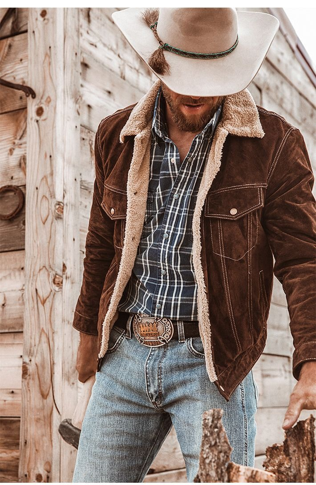
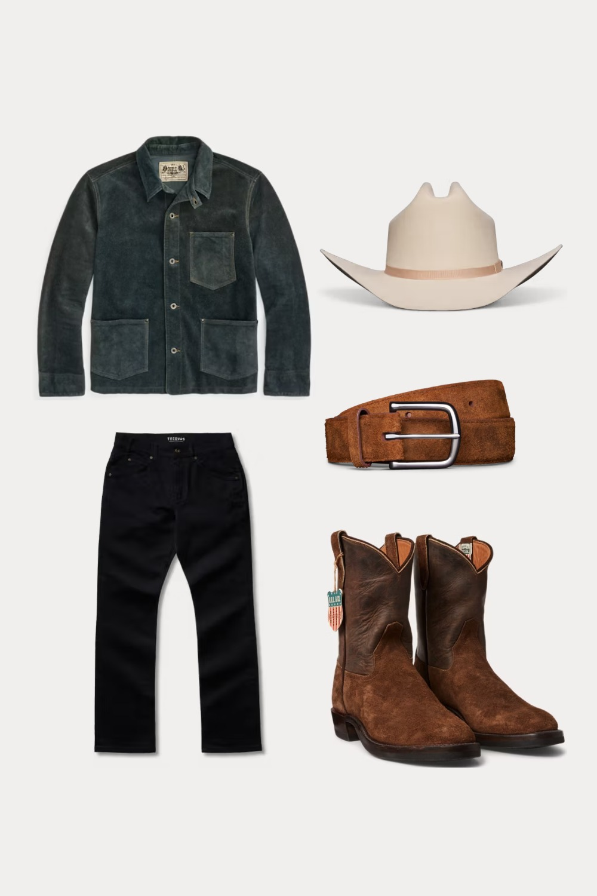
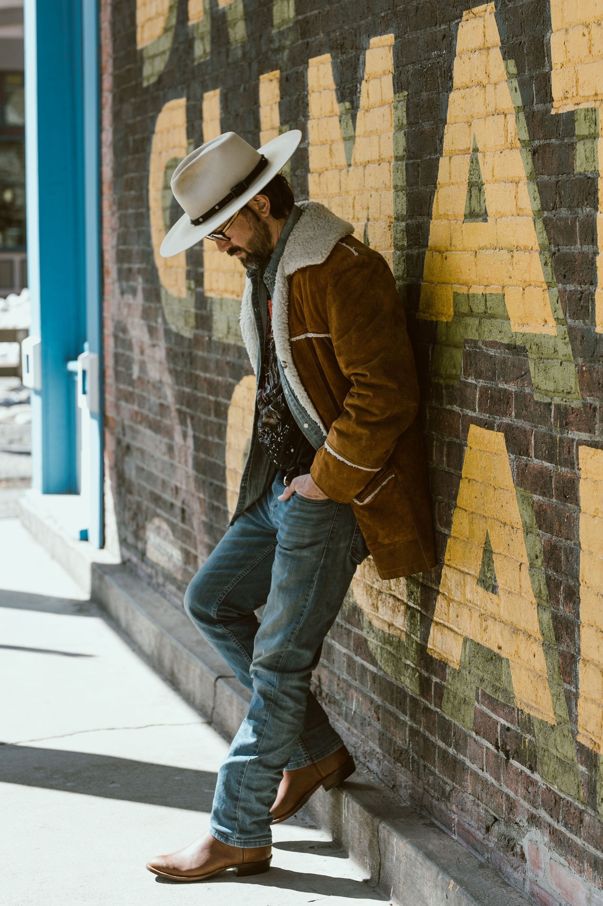

# 美式西部 (American Western)

> **状态**: `reviewed` | **最后更新**: 2026-06-13 | **趋势**: 经典风格

## 📖 概述

美式西部风格（American Western）是一种以19世纪美国牛仔文化为核心原型的穿搭风格。它根植于得克萨斯州及西部广袤土地上的牧场生活，核心单品包括牛仔靴（Cowboy Boots）、牛仔帽（Cowboy Hat）、西部衬衫（Western Shirt，以珍珠扣Snap Button为标志）、牛仔皮套裤（Chaps）和Bolo Tie（波洛领带/绳状领结）。2024–2025年，受Pharrell Williams的Louis Vuitton FW24系列、Beyoncé的乡村音乐转型、《Yellowstone》的全球现象级爆红三重文化推力，西部风格正经历一次前所未有的主流复兴。正如GQ台湾所总结：**"人人心中都有牛仔梦。"**

## 📜 历史文化

### 真实的西部（1800s–1900s）

美国西部风格的原型来源于**墨西哥Vaqueros（牛仔）**——西班牙殖民者将牛群和骑马牧牛技术带到美洲。墨西哥牛仔教导美国定居者如何放牧，并将他们的服装传统一并传入：宽边帽（Sombrero，牛仔帽的前身）、皮革护腿（Chaps的前身）、带马刺的皮靴。美国牛仔在此基础上发展出自己的着装体系，与19世纪后期蓬勃的畜牧产业（特别是得克萨斯州向北至蒙大拿的牛群运输路线）深度绑定。

牛仔服的核心功能逻辑：
- **牛仔靴**：高跟防止脚滑入马镫，尖头便于快速穿入马镫，高筒保护小腿
- **牛仔帽**：宽檐防晒防雨，可折叠用作水瓢或信号工具
- **西部衬衫**：珍珠扣（Snap Button）设计可以在紧急情况下被快速扯开——如果衬衫被树枝或马鞍挂住，可以防止骑手受伤
- **Bandana（方巾）**：遮脸防尘、擦汗、应急绷带——真正的多功能单品
- **Chaps（皮套裤）**：穿在裤子外的皮革护腿，防止骑马时被灌木划伤

### 好莱坞的浪漫化（1920s–1960s）

好莱坞西部片将粗粝的牧场工服装转化为一种**典型的美国男性形象**：
- **John Wayne**成为牛仔的终极银幕化身，其系扣衬衫+牛仔帽+靴子的形象定义了大众对西部的想象
- **Gene Autry**和**Roy Rogers**（"歌唱牛仔"）为西部风注入娱乐色彩，精致的刺绣西部衬衫流行开来
- **The Lone Ranger**（独行侠）等广播/电视角色持续强化西部英雄的原型

### 从牧场到T台（1970s–2020s）

- **1970s**：Ralph Lauren开始将西部元素融入其设计语言，"Polo Country"概念萌芽
- **1993年**：Ralph Lauren正式推出**RRL（Double RL）**，以其科罗拉多牧场命名，将西部、工装和军装三大美国服装传统融合为一个奢侈Heritage品牌
- **2000s–2010s**：西部元素在音乐节时尚（Coachella等）和街头品牌中零星出现
- **2024—Wallbreaking Moment**：Pharrell Williams为Louis Vuitton FW24系列将西部风推上全球最大时装舞台——绿松石装饰、达科他花卉图案（与Lakota/Dakota原住民艺术家合作）、Timberland LV联名靴、Bolo Tie和珍珠扣衬衫以奢侈品语言重新演绎

### 2024–2025西部复兴的三重推力

1. **Louis Vuitton FW24（Pharrell Williams）**：将Cowboy Style从风格亚文化推入高级时装主流话语
2. **Beyoncé**：以《Texas Hold 'Em》和宝石镶嵌牛仔帽带动乡村/西部风潮的流行跨界
3. **Taylor Sheridan的《Yellowstone》**：将粗犷牧场穿搭投射到数亿观众的屏幕上，Kevin Costner（John Dutton饰演者）身穿Schaefer Outfitter夹克的形象深入人心

## 🎨 美学特征

**核心色彩：**
- 沙色（Sand）、驼色（Tan）、生牛皮棕（Rawhide Brown）——西部大地色
- 靛蓝（Indigo Denim）
- 黑/白/奶油色——西部衬衫的基础色
- 绿松石（Turquoise）——印第安银饰的经典配色
- 达科他花卉图案的红色、黄色、蓝色

**标志性单品：**

| 品类 | 单品 | 关键细节 |
|------|------|----------|
| **头部** | 牛仔帽（Cowboy Hat） | 毛毡（Felt）或草编（Straw）；传统的Cattleman折痕 |
| **颈部** | Bolo Tie（波洛领带） | 编皮绳+金属/宝石扣头，西南部原住民银饰工艺 |
| **上装** | 西部衬衫（Western Shirt） | 珍珠扣（Pearl Snap）、锯齿形刺绣（Sawtooth Embroidery）、前后Yoke裁片（Western Yoke） |
| **下装** | 牛仔丹宁裤（Cowboy Cut Jeans） | 靴型剪裁（Bootcut），专为套在靴筒外设计 |
| **足部** | 牛仔靴（Cowboy Boots） | 尖头、斜根（Cuban Heel）、高筒、皮革鞋底，刺绣靴筒 |
| **腰部** | 大型皮带扣（Belt Buckle） | 银质雕刻、绿松石镶嵌，通常是牛仔竞技比赛的奖品 |
| **颈/面部** | Bandana / Wild Rag（野外围巾） | 丝绸方巾，保护颈部防风防尘 |

**面料与工艺关键词：**
- **Suede / Roughout Leather（麂皮/粗面皮革）**：西部夹克和背心的标志性面料
- **Selvedge Denim（赤耳丹宁）**：RRL等奢侈西部品牌的核心材料
- **Pendleton Wool（Pendleton羊毛）**：印第安图案羊毛织物，西部风格的传统外套面料
- **Pearl Snap（珍珠扣）**：西部衬衫的绝对标志——无需纽扣孔的按压式金属扣
- **Western Yoke（西部Yoke裁片）**：衬衫前后肩部的弧形裁片，是西部衬衫区别于普通衬衫的核心特征
- **Whipstitch（锁边缝线）**：西部皮具和皮靴上的装饰性手工缝线

## 🏷️ 代表品牌

### 原创牛仔竞技品牌

| 品牌 | 创立 | 定位 |
|------|------|------|
| **Wrangler** | 1947年 | 专为专业牛仔竞技运动员设计，牛仔裤的"W"口袋缝线是其标志。Texas Fit（1989年）仍是35年来的最畅销男款 |
| **Lee** | 1889年 | 第一条拉链牛仔裤的发明者，西部工装的重要玩家 |
| **Levi's** | 1853年 | 虽然更常关联工装，但501和517 Bootcut牛仔裤在西部文化中具有重要地位 |

### 当代西部靴/帽/配饰标杆

| 品牌 | 创立 | 特色 |
|------|------|------|
| **Stetson** | 1865年 | 牛仔帽的代名词。经典的"Boss of the Plains"型号定义了牛仔帽的标准形态 |
| **Lucchese** | 1883年 | 圣安东尼奥，手工牛仔靴的巅峰。每双靴子经历100多道工序 |
| **Tecovas** | 2015年 | 新兴DTC（直面消费者）牛仔靴品牌，将西部靴带入现代消费体验 |

### 奢侈Heritage品牌

| 品牌 | 创立 | 定位 |
|------|------|------|
| **RRL (Double RL)** | 1993年 | Ralph Lauren的"Americana实验室"。以Ralph和妻子Ricky的科罗拉多牧场命名，将西部、工装和军装三种美国服装DNA整合为最高端的Heritage系列。日本和美国赤耳丹宁、小批量限定版、西部Yoke夹克和M-65野战夹克的重构。2025年春季系列通过Huckberry和旗舰店发售 |
| **Schaefer Outfitter** | 1982年 | 由Francis "Cub" Schaefer（Rocky Mountain Featherbed的联合创始人）在怀俄明州Jackson Hole创立。以西部Yoke派克大衣背心、油蜡帆布夹克、RangeTek（极端炎热气候技术面料）线和珍珠扣衬衫著称。是《Yellowstone》剧组服装供应商，Kevin Costner在剧中穿着Schaefer服饰。Post Malone也是其客户。2025年推出Heritage Wild Rag Collection（100%丝绸方巾，35"×35"，手工卷边） |

### 高端西部风现代表达

| 品牌 | 贡献 |
|------|------|
| **Louis Vuitton（Pharrell）** | FW24将西部风推入奢侈主流 |
| **Visvim** | 以日式工艺对西部衬衫、牛仔靴进行艺术级重构 |
| **Kapital** | 前卫日本品牌，以Boro和Sashiko工艺重新构想西部和工装原型 |
| **Saint Laurent（Hedi Slimane时代）** | 持续的西部/摇滚融合——窄腿牛仔裤配牛仔靴、刺绣夹克 |

## 👤 风格偶像

**历史原型：**
- **John Wayne**——牛仔的终极银幕化身，定义了大众对西部服装的想象
- **Gene Autry & Roy Rogers**——"歌唱牛仔"，为西部衬衫带来精致的刺绣美学
- **The Vaqueros（墨西哥牛仔）**——西部风格的真正始祖，所有元素的原型来源
- **Native American silversmiths（原住民银匠）**——Bolo Tie、绿松石珠宝和银质皮带扣的工艺传统创造者

**流行文化推手：**
- **Ralph Lauren**——穿着双丹宁（"Texas Tuxedo"）走上自己的T台，以剪裁精度演绎西部双重丹宁
- **Kevin Costner（《Yellowstone》中的John Dutton）**——2020年代牧场穿搭的全球形象大使，Schaefer夹克+牛仔裤+牛仔靴+牛仔帽的现代牧场主形象
- **Post Malone**——经常穿着Schaefer珍珠扣衬衫和牛仔帽，将西部风带入嘻哈/流行现场
- **Beyoncé**——以《Texas Hold 'Em》和珠宝牛仔帽开启乡村/西部流行跨界
- **Pharrell Williams**——通过Louis Vuitton FW24将西部风重新定义为全球奢侈话语

**音乐与西部风的深层叙事：**
西部音乐（Country & Western）和西部服装一直是一体两面。从Nashville的Grand Ole Opry舞台到现代的Stagecoach音乐节，西部服装始终是表演身份的核心构成——刺绣Nudie Suits（Nudie Cohn为Gram Parsons、Elvis等定制的极致刺绣西部套装）本身就是一部独立的时尚史。

## 🔗 关联风格

- **American Workwear（美式工装）**：与西部风共享牛仔、帆布和功能性DNA，边界模糊（见`../american_workwear/encyclopedia.md`）
- **Americana / Heritage**：将西部、工装、军装、运动装整合为一体的元风格
- **Mexican Vaquero**：西部风的真实历史起源
- **Rocker / Biker**：牛仔靴、皮夹克、丹宁——西部与机车风格在服装层面的交叉
- **Native American / Southwest**：原住民工艺（银饰、绿松石、编织图案）是西部风的重要构成元素，需审慎对待文化挪用问题

## 📈 流行趋势

- **2024–2025是西部风"破圈"元年**：从风格亚文化和乡村音乐粉丝群体扩展至全球时尚主流
- **奢侈品牌"西进运动"**：Louis Vuitton FW24之后，预计更多奢侈品牌将推出西部风系列
- **RRL的持续上升**：作为最纯正的奢侈西部品牌，在Huckberry等DTC平台的推动下触及更广泛受众
- **《Yellowstone》效应**：电视剧终结后（2024年），其风格影响力已根深蒂固——"牧场核心"（Ranchcore）成为Pinterest和TikTok上的热门美学标签
- **Denim-on-Denim回归**："Texas Tuxedo"（双丹宁穿法）从"时尚灾难"标签转变为Ralph Lauren、Pharrell等的钦定高阶穿法
- **鞋履趋势**：牛仔靴作为日常鞋履（不限于西部语境）被越来越多时尚意见领袖采纳，Tecovas等DTC品牌降低了入门门槛
- **注意**：西部风的复兴也伴随着对**文化挪用**的讨论——原住民工艺（绿松石、银饰、图案）的商业化使用需要尊重和承认其来源

## 💡 穿搭建议

**亚洲男性穿搭要点：**

1. **从一件西部衬衫开始**：西部衬衫（Western Shirt，带珍珠扣和Yoke裁片）是最容易日常化的西部单品。选择白色/浅蓝色丹宁色的基础款，搭配黑色/蓝色修身牛仔裤（不需要Bootcut）和切尔西靴，是最低风险的入门方式。不要把衬衫塞进裤子——西部衬衫传统上外穿不塞
2. **珍珠扣是灵魂**：西部衬衫区别于普通工装衬衫的核心元素。Snap Button（按压扣）不仅在视觉上区别于普通纽扣，也是西部风的DNA标识
3. **牛仔靴的搭配技巧**：牛仔靴的靴筒较高，通常套在裤管内。但2025年的流行穿法是**搭配直筒九分裤，露出靴筒**，或选择及踝短靴款式（如RRL的Roper Boot）。对亚洲男性而言，高筒牛仔靴需要一定身高和气场支撑，建议从中低筒的Roper或Chelsea式西部靴开始
4. **Bolo Tie如何戴不俗气**：Bolo Tie是西部风中最容易"翻车"的单品。选择简约版本（素色编皮绳+小尺寸银扣），搭配无图案的纯色衬衫或西装，远离刺绣和绿松石——**将一件西部配饰融入极简造型**，而非堆砌西部元素
5. **Denim-on-Denim（Texas Tuxedo）的精髓**：上下丹宁颜色必须明显有差异——深靛蓝夹克+浅水洗蓝牛仔裤，或黑色丹宁夹克+靛蓝牛仔裤。中间用白色T恤或钱布雷衬衫做色块隔离。绝对不要上下同色同洗
6. **配色制胜**：沙色/驼色Jacket + 白色西部衬衫 + 靛蓝直筒牛仔裤 + 棕色皮靴——这是西部风的黄金配色公式，几乎不可能出错
7. **入门避坑**：
   - 不要一次戴牛仔帽+Bolo Tie+牛仔靴——全身西部元素会让亚洲男性看起来像主题乐园的工作人员，而非时装穿着者
   - 避免刺绣过于精美的西部衬衫（Nudie Suit风格）——那是舞台表演服装，不适合日常
   - 牛仔帽对亚洲脸型/气质挑战极大，除非你有非常自信的风格掌控力，否则用棒球帽或无帽替代
8. **西部风的"一半法则"**：一件西部单品配现代基础款。西部衬衫配修身黑色西裤+德比鞋。Bolo Tie配纯色亚麻西装。牛仔靴配九分直筒牛仔裤+白色Oversized T恤。一半西部一半现代，这才是2025年的正确穿法

## 📸 风格图库

> 以下为风格代表性穿搭参考图，搜集自公开时尚媒体。

*风格穿搭参考*

*Rugged Western Outfit | Indigo Suede Jacket, Black Denim & Cowboy Felt ...*

*Country Outfits For Men, Cowboy Outfit For Men, Boots Outfit Men, Rodeo ...*
