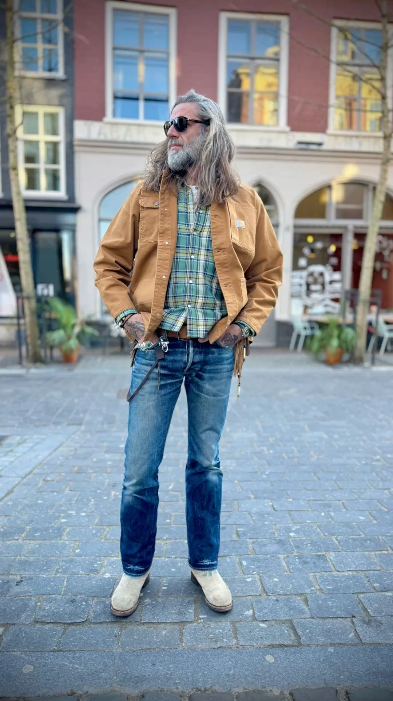
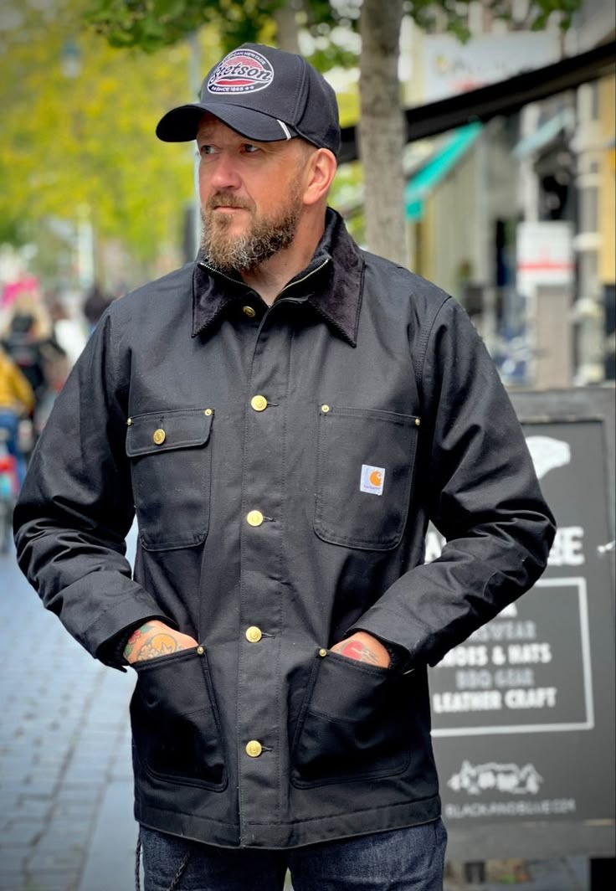
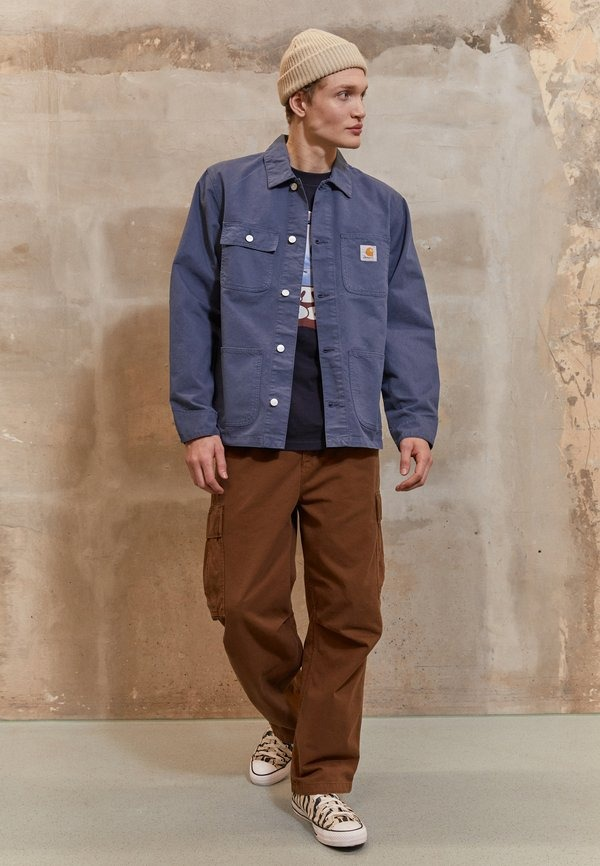

# 美式工装 (American Workwear)

> **状态**: `reviewed` | **最后更新**: 2026-06-13

## 📖 概述

美式工装（American Workwear）是一种以19–20世纪美国蓝领工人劳动服装为原型的穿搭风格。它诞生于矿井、铁路、农场和工厂的极端工作条件中，以**重型帆布（Canvas Duck）、牛仔布（Denim）和鼹鼠皮布（Moleskine）**三种耐用面料为核心，强调功能性、耐久性和实用性。从Levi's的铜铆钉牛仔裤（1873年）到Carhartt的底特律夹克（1930年代），再到Dickies的斜纹工装裤——这些原本为工人阶级设计的衣物，经过一个多世纪的文化转变，已成为全球时尚的重要支柱。值得注意的是，日本以"Amekaji"（アメカジ——美式休闲）的形式对这一风格进行了极致重构，创造了与原始美式工装截然不同的文化体系。

## 📜 历史文化

### 工业起源（1850s–1920s）

美国工装的历史与19世纪工业革命深度绑定。铁路扩张、金矿开采、农业机械化创造出庞大的工人阶级，他们需要能经受极端劳作的服装：

| 关键节点 | 事件 |
|----------|------|
| **1853年** | Levi Strauss在旧金山创立Levi's，为淘金热矿工提供帆布工装裤 |
| **1873年** | Levi's推出铜铆钉加固的牛仔"腰部工装裤"（waist overalls）——现代牛仔裤的原型 |
| **1880年代** | Levi's产品目录中出现"Sack Coat"（Chore Coat的前身） |
| **1889年** | Hamilton Carhartt在底特律创立Carhartt，标语"Honest value for an honest dollar" |
| **1917年** | Carhartt推出Engineer Sack Coat（工装工程师夹克） |
| **1922年** | Dickies在德克萨斯州成立，定位为南方农场和工厂工人的服装供应商 |
| **1925年** | Carhartt的棕色Duck帆布版Engineer Sack Coat成为产品目录常驻款式 |
| **1930年代** | Carhartt推出灯芯绒领的底特律夹克（Detroit Jacket）和密歇根夹克（Michigan Coat），成为工装经典 |

### 从劳动服到时尚（1950s–2000s）

- **1950s**：丹宁从工作面料转变为休闲服装，新一代人拥抱美式工人的粗犷、爱国形象
- **1960s–70s**：反文化偶像（Paul Newman在《Cool Hand Luke》中）、设计师（Yves Saint Laurent的1967年Safari夹克）将工装带入主流
- **1980s–90s**：嘻哈文化（Run-D.M.C.、Tupac）、Grunge（Kurt Cobain）和滑板文化大量采用Carhartt、Dickies和超大牛仔单品；Supreme开始重新诠释工装
- **2010s至今**：工装完成从功能服到高级时尚的全面转型——Gucci × Dickies、Sacai × Carhartt WIP、Fendi和Bottega Veneta秀场上的工装外套

### 2024-2025关键出版物

《Denim: The Fabric That Built America, 1935–1944》（Graham Marsh著，2024年10月出版）收录了250张FSA（农场安全管理局）档案照片，展示了Levi's、Wrangler、Carhartt、Lee和OshKosh如何在经济大萧条和二战时期装扮美国工人。"Blue Collar"（蓝领）这个词汇本身诞生于1920年代美国，字面意为穿着蓝色丹宁和工装外套的劳动者。

## 🎨 美学特征

**三大核心面料：**
- **Canvas Duck（帆布鸭）**：Carhartt的标志性棕色重型帆布，随着穿着呈现独特磨损纹理
- **Denim（丹宁/牛仔布）**：Levi's的靛蓝染色斜纹棉布，以"养牛"文化（长期穿着产生的自然落色）闻名
- **Moleskin（鼹鼠皮布）**：厚重棉质斜纹织物，表面拉绒处理，比帆布更柔软但同样耐用

**经典单品矩阵：**

| 品类 | 经典单品 | 代表品牌 |
|------|----------|----------|
| **外套** | Chore Coat（工装外套）、Detroit Jacket（底特律夹克）、Michigan Coat（密歇根夹克）、Denim Trucker Jacket（牛仔卡车司机夹克） | Carhartt, Levi's |
| **下装** | 原色丹宁牛仔裤（Raw Denim）、帆布工装裤（Canvas Work Pants）、Double Knee Pants（双膝加固裤） | Levi's 501, Carhartt B01, Dickies 874 |
| **上装** | Chambray衬衫（钱布雷衬衫）、Hickory Stripe工装衬衫（山核桃条纹）、Henley长袖T恤 | Levi's, Dickies |
| **外衣** | Bib Overalls（背带工装裤）、Insulated Coverall（保暖连体工装） | Carhartt, Dickies |

**色彩体系：**
- 棕色（Carhartt Brown）——工装帆布的代名词
- 靛蓝（Indigo）——原色丹宁的基础色
- 山核桃条纹（Hickory Stripe）——蓝白相间细条纹
- 卡其色/橄榄绿——军装交叉影响

**设计原则：**
- 三重缝合（Triple Stitching）——Carhartt的标志性工艺
- 铆钉加固——Levi's的专利传统
- 灯芯绒领——Carhartt夹克1960年代后的标志细节
- 实用口袋布局——工具口袋、锤环（Hammer Loop）、卷尺口袋

## 🏷️ 代表品牌

### 美国原创三巨头

| 品牌 | 创立 | 标志性贡献 |
|------|------|-----------|
| **Levi's** | 1853年，旧金山 | 501®牛仔裤、Trucker Jacket、铜铆钉专利 |
| **Carhartt** | 1889年，底特律 | Duck帆布底特律夹克、密歇根夹克、B01工装裤 |
| **Dickies** | 1922年，德克萨斯 | 874工装裤、Eisenhower夹克、双膝加固裤 |

### 美国工装继承者

| 品牌 | 定位 |
|------|------|
| **Wrangler** | 1947年以专业牛仔竞技牛仔裤起家，西部+工装交叉 |
| **Filson** | 1897年西雅图，户外+工装传统（锡布Tin Cloth、油蜡帆布） |
| **Red Wing** | 1905年明尼苏达，工装皮靴的代表 |
| **Ben Davis** | 1935年旧金山，西海岸工装代表 |

### Amekaji（日系美式工装重构）代表品牌

| 品牌 | 定位 | 特色 |
|------|------|------|
| **The Real McCoy's** | 极致复刻 | 对1960-70年代美式工装/军装的神级还原 |
| **Orslow** | 时代精确+现代可穿性 | 看似Vintage，实为全新设计 |
| **Visvim** | 工装奢华化 | 手工染色、泥染、艺术级工艺 |
| **Kapital** | 前卫工装解构 | Boro（补丁）、Sashiko（刺子绣）、靛蓝 |
| **Samurai Jeans** | 重磅丹宁专家 | 19oz+超重磅牛仔布 |
| **Fullcount / Warehouse / Studio D'Artisan** | "大阪五虎" | 日牛（Japanese Selvedge Denim）运动的奠基者 |
| **Beams Plus** | Amekaji入门桥梁 | 亲民的日式美式工装混搭 |

### 品牌分支说明

Carhartt分为两个独立实体：
- **Carhartt（主线）**：美国工人阶级工装，保持传统品质
- **Carhartt WIP（Work In Progress）**：1994年获得欧洲许可证后独立的街头/时尚线，在滑板、嘻哈和欧洲青年文化中具有独立地位

## 👤 风格偶像

**工人阶级原型（历史）：**
- 19世纪金矿矿工、铁路工人——工装最初的穿着者和"设计者"
- 1930年代FSA摄影档案中的农场工人——工装美学的原始视觉记录

**工装时尚化的推动者：**
- **Paul Newman**（《Cool Hand Luke》, 1967年）——穿着Chambray衬衫和丹宁裤，将工装带入反英雄男性魅力
- **Steve McQueen**——穿着Persol墨镜、Barbour/工装外套，粗犷优雅的典范
- **Bruce Springsteen**——Levi's丹宁和T恤，蓝领摇滚偶像
- **Kurt Cobain**——洗褪开衫、破洞牛仔裤，Grunge工装的终极形象
- **Tupac Shakur**——Carhartt帆布夹克和Dickies工装裤，西海岸嘻哈工装代表

**当代：**
- **Kanye West**——持续推动工装/军装单品进入高级时尚话语
- **Pharrell Williams**——Louis Vuitton男装系列中频繁引用工装原型
- **Frank Ocean**——低调的Carhartt/工装日常穿搭

## 🔗 关联风格

- **Amekaji（日系美式工装）**：日本对美式工装的极致重构，详见下方对比
- **American Western**：工装与西部风的交叉区域（见`../american_western/encyclopedia.md`）
- **American Streetwear OG**：工装被街头文化大量采纳（见`../american_streetwear/encyclopedia.md`）
- **Military Surplus**：军装风格，与工装共享功能性基因
- **Heritage / Americana**：将工装、西部、军装、运动装整合为"美国遗产风格"

---

### 专题：美式工装 (Original) vs 日系Amekaji (Japanese Reinterpretation)

Amekaji（アメカジ）是日语"American Casual"的缩写。它描述的是一个**纯粹的日本时尚文化**——并非穿美国Vintage，而是日本对美式工装、军装、常春藤和机车风格的**极具匠心、极尽考究的重新设计**。

核心差异：

| 维度 | 美式工装（原版） | Amekaji（日本重构版） |
|------|-----------------|----------------------|
| **哲学** | 功能优先，为劳动而生 | 传承优先，为鉴赏而生 |
| **版型** | 宽松方正，劳动适应型 | 精确修身，或经过深思熟虑的重新比例化 |
| **丹宁** | 现代大规模生产（主流Levi's） | 手工级窄幅织布机赤耳丹宁，来自工匠级织布厂 |
| **五金与细节** | 实用，可因成本调整 | 档案级还原；定制拉链、铆钉、缝线针数 |
| **价格带** | $40–$150（主线） | $200–$600+（如Samurai、The Real McCoy's、Orslow、Visvim） |
| **文化角色** | 工人阶级制服 | 收藏家/生活方式身份；"创造历史，购买历史" |
| **老化哲学** | 穿到烂为止 | 欣赏褪色、包浆和老化——作为艺术研究丹宁"落色地图" |

**Amekaji的四大支柱：**
1. **Ivy Style（常青藤）** —— 牛津布衬衫、斜纹裤、乐福鞋、校队夹克
2. **Biker/Rockabilly Style（机车风格）** —— 皮革夹克、工程师靴、赤耳丹宁
3. **Workwear Style（工装风格）** —— 工装外套、背带裤、靛蓝染色——大量参考Carhartt/Levi's/Dickies但由日本品牌制作
4. **Military Style（军事风格）** —— MA-1飞行员夹克、M-65野战夹克、G-1/A-2飞行夹克

**历史根源：**
- **1945年后**：美军占领日本，带来了Levi's牛仔裤、校队夹克、皮靴和军品剩余物资。对一代重建中的日本青年来说，这些衣物象征**自由、反叛和现代性**
- **1960年代**：摄影集《Take Ivy》记录了美国校园生活，点燃了日本对Ivy风格的痴迷
- **1980s–90s**：日本织布厂（仓纺等）和品牌（Big John、Evisu）逆向工程老式Levi's，将**赤耳丹宁**精炼到超越原版的水平

**2024–2025趋势：**
- Amekaji正在**东南亚**（特别是菲律宾）快速扩张——日本造型师Kiichiro Sibue在2022年移居马尼拉，组织的Amekaji快闪活动引发媒体报道
- 东京时装周2025春夏，**Hyke**以Amekaji为灵感（"Reminiscing"系列），重新诠释1980–90年代日本进口的美式工装
- "慢时尚/反炒作"运动将Amekaji定位为炒作文化的对立面——**"慢、微妙、永恒"** vs "快、响、Logo驱动"

## 📈 流行趋势

- **工装外套（Chore Coat）替代西装夹克**：后疫情时代办公着装崩塌后，工装外套成为许多男性"街头与商务之间半步"的首选
- **奢侈品牌持续"采矿"工装**：Gucci × Dickies、Sacai × Carhartt WIP延续，Fendi和Bottega Veneta秀场工装元素常态化
- **"养牛"（Raw Denim）文化持续**：小众但忠诚，全球爱好者社区活跃，日本品牌主导高端市场
- **可持续叙事**：Amekaji和Heritage风格的"可穿几十年的衣服"理念，与快时尚形成鲜明对比，契合2025年的可持续消费思潮
- **工装与机能（Techwear）融合**：如Nike ACG、Arc'teryx Veilance将工装功能性提升到高科技维度

## 💡 穿搭建议

**亚洲男性穿搭要点：**

1. **版型平衡是第一步**：Carhartt和Dickies原版美式工装通常版型偏宽大，亚洲男性可选择Carhartt WIP（欧洲线）——版型更修身、更适合东亚骨架。如果不介意日系品牌，Orslow和Beams Plus是绝佳的中转站
2. **一件好的工装外套是关键投资**：Chore Coat（工装外套）是最容易融入日常的工装单品。选择棕色帆布或靛蓝丹宁，内搭白T恤+直筒牛仔裤+帆布鞋即完成造型。不需要全身工装——**一件工装单品配现代基础款是最佳入门策略**
3. **裤装选择**：Dickies 874（高腰直筒斜纹裤）是百搭圣品，但原始版对亚洲体型可能偏大。建议搭配厚重鞋款（如德比鞋、工装靴、厚底板鞋）以平衡裤脚宽度。Double Knee Pants（双膝加固裤）是2024–2025街头热门款，但需要一定搭配功力
4. **钱布雷衬衫（Chambray Shirt）**：丹宁色但比丹宁衬衫轻薄的棉质织物，是美式工装夏季最核心的单品。选择水洗效果，不要全新的僵硬感
5. **配色原则**：棕色（Carhartt Brown）、靛蓝、橄榄绿、卡其、白色/米色。这些颜色天然和谐，几乎任意组合都不会出错
6. **鞋履呼应**：Red Wing（875/877/1907系列）、Birkenstock Boston、Converse Chuck Taylor、New Balance 990系列——都是工装风格的经典鞋款
7. **入门避坑**：
   - 避免一次穿满三个品牌（全身Carhartt看起来像穿工作服去上班）
   - 避免同时穿过多工装元素（Chore Coat + Bib Overall + Work Boots = 角色扮演感太强）
   - 选择水洗/旧化效果的单品，全新工装看起来过于僵硬

## 📸 风格图库

> 以下为风格代表性穿搭参考图，搜集自公开时尚媒体。

*风格穿搭参考*

*Carhartt Chore Coat in 2025 | Mannenoutfits, Herenmode*

*Carhartt WIP CHORE COAT - Denim jacket - blue one wash/blue denim ...*
