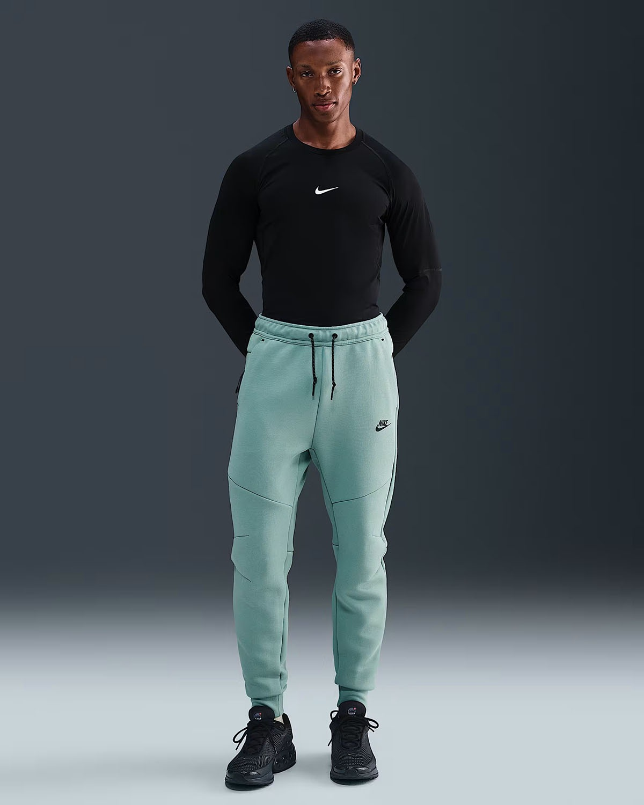
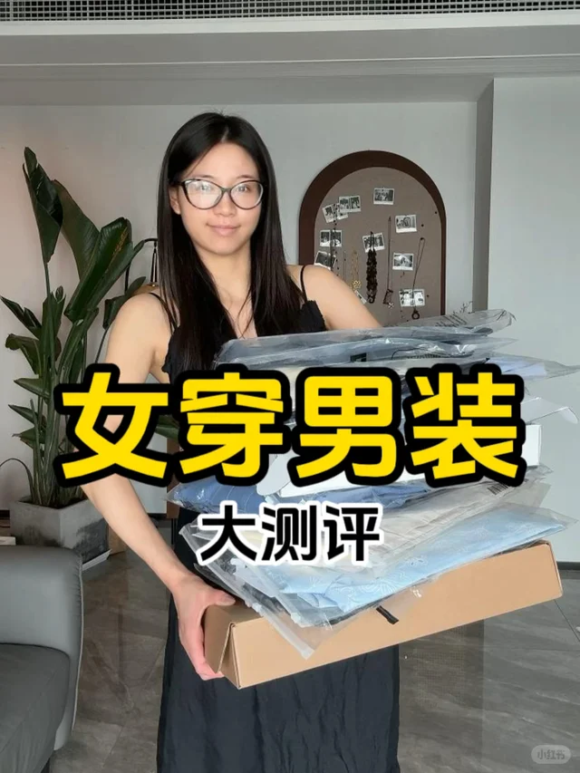
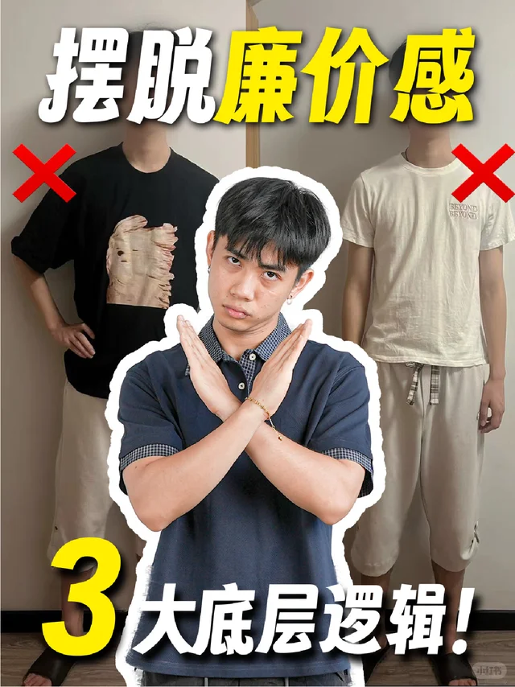
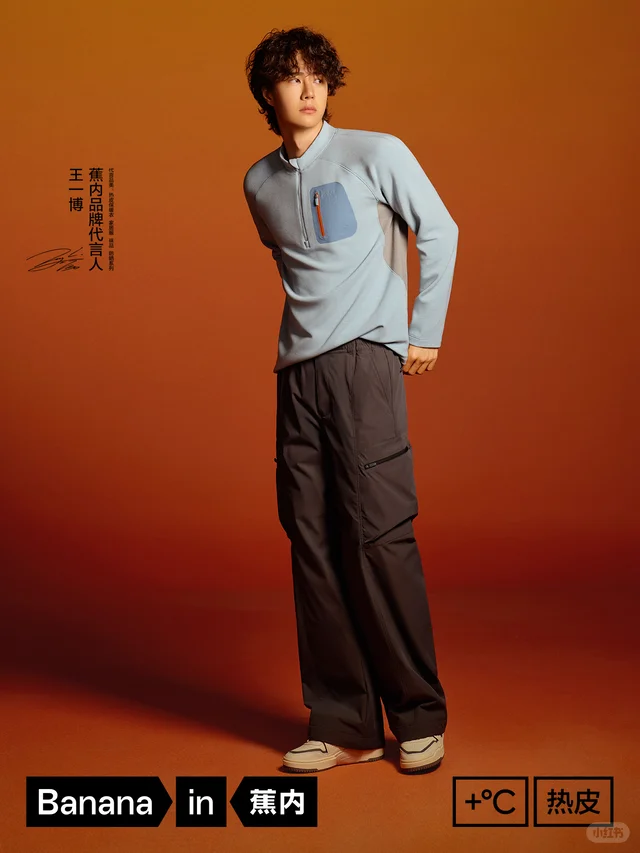
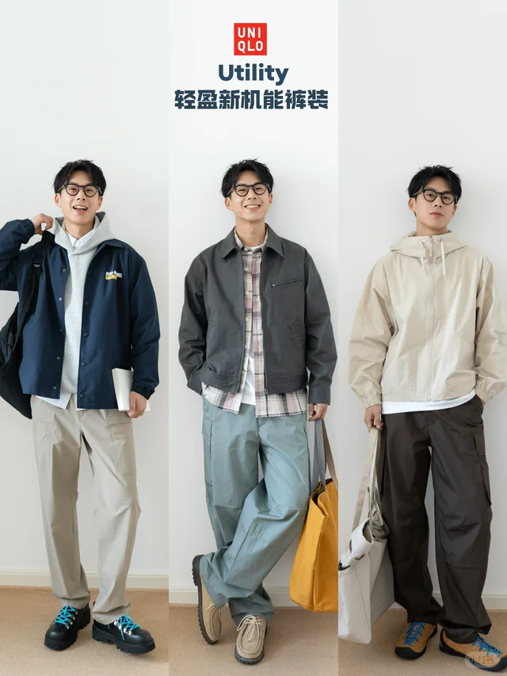
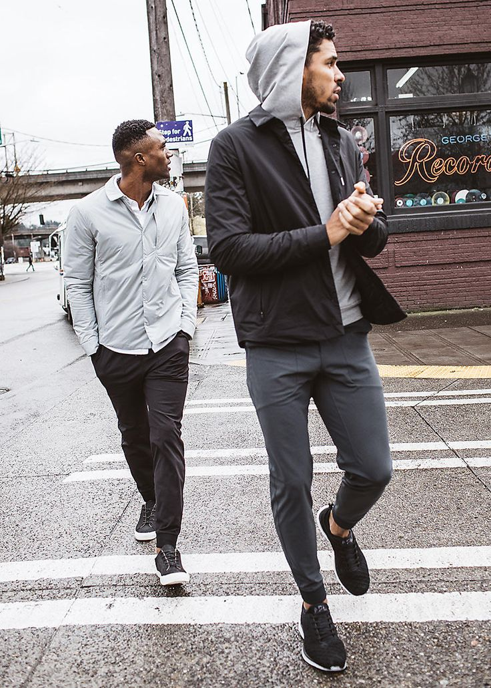
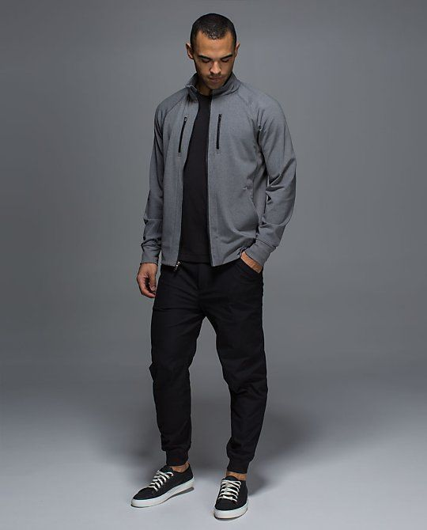
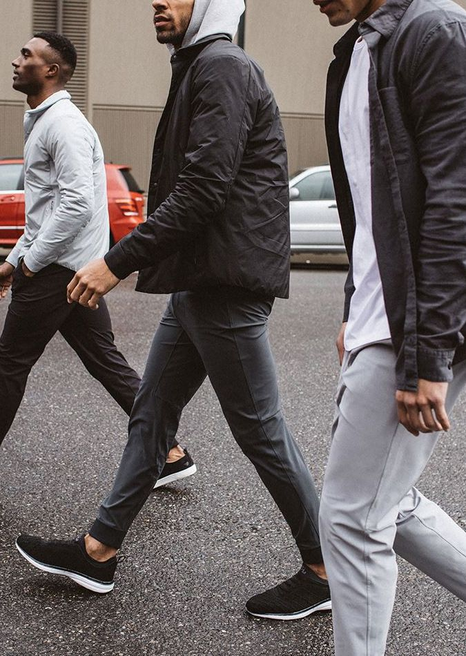

# 运动休闲 (Athleisure / Sport)

> **状态**: `reviewed` | **最后更新**: 2026-06-17
> **分类**: 当代2000s > 运动场景 > 极休闲 > 街头调性



## 📖 概述
- **发源年代**: 2010s初期
- **发源地**: 美国（从硅谷和健身房文化中兴起）
- **风格关键词**: 功能性、舒适、运动品牌、混搭、城市运动、子风格丰富
- **一句话定义**: 把运动功能面料和设计元素融入日常穿搭——不是去健身房的衣服，而是运动精神的城市化表达。

## 📜 历史文化

### 起源
Athleisure 的爆发有三股推动力：

1. **硅谷休闲化** (2010s): 科技公司废除正装要求，连帽衫+运动裤成为新制服
2. **运动品牌跨界** (2014-): Adidas x Kanye West 的 Yeezy 系列将运动鞋带入时尚话语；Nike 与 Off-White、Sacai 等联名打破运动与时尚的界限
3. **疫情加速** (2020-): 全球居家办公让舒适成为第一优先级，运动裤销量暴涨

### 子风格谱系
Athleisure 不是一个单一体，而是多个子风格的集合：

| 子风格 | 特征 | 代表元素 |
|--------|------|---------|
| **Blokecore** | 足球文化+街头穿搭 | 球衣、训练外套、德训鞋、围巾 |
| **Tenniscore** | 网球俱乐部美学 | Polo衫、百褶裙裤、白色球鞋、发带 |
| **Gorpcore** | 户外机能+城市穿搭 | 冲锋衣、抓绒、登山鞋、机能背包 |
| **Basketball Style** | 篮球文化 | Jordan鞋、球衣、宽松短裤、护腕 |
| **Running Style** | 跑步装备日常化 | 速干T、紧身裤、跑鞋、反光元素 |

### 亚洲男性与 Athleisure
在亚洲城市（尤其东京、首尔、上海），Athleisure 表现为更精致的"运动极简"——干净的配色、合身的剪裁、品牌 Logo 作为点缀而非主角。与欧美的大面积 Logo 和宽松廓形形成对比。

## 🎨 美学特征

### 廓形
- 合身或微宽松运动剪裁，不刻意 Oversized
- 上衣与下装比例均衡，避免"上宽下紧"
- 运动外套+内搭T恤的经典双层结构

### 色板
```
主色调: 黑、白、灰、藏青
运动色: 红、荧光橙、宝蓝（来自球队元素）
点缀: 品牌 Logo 色
逻辑: 深色基底 + 一个亮色运动元素
```

### 面料
- **速干面料** — 聚酯纤维、尼龙混纺，运动科技核心
- **网眼** — 透气层，篮球短裤/训练服的标志
- **抓绒** — 卫衣/运动外套的保暖层
- **弹力棉** — 运动休闲裤的基础面料

### 标志单品
| 单品 | 品牌示例 | 选择要点 |
|------|---------|---------|
| 球队球衣/训练衫 | Adidas, Nike, PUMA | 复古款或当季球衣，可做内搭或外穿 |
| 运动外套/球迷夹克 | Adidas Originals, FILA | 拉链款，螺纹领口袖口 |
| 速干运动T恤 | Nike Dri-FIT, Adidas | 合身不紧身，功能性面料 |
| 运动束脚裤 | Nike, Under Armour | 抽绳腰，拉链口袋 |
| 复古跑鞋/运动鞋 | Adidas Samba/Gazelle, Nike Air Max | 关键！鞋款定风格基调 |
| 棒球帽/运动发带 | New Era, Nike | 反戴或正戴均可 |
| 运动背包 | Nike, PUMA, The North Face | 功能性+运动感 |

## 🏷️ 代表品牌

### 运动巨头
- **Nike** — 运动×时尚联名的领军者（Off-White, Sacai, Ambush）
- **Adidas** — Originals 复古线 + Yeezy 系列，Blokecore 的核心推动者
- **PUMA** — 足球基因 + Rihanna 等明星合作
- **New Balance** — 复古跑鞋成为 City Boy 和 Athleisure 的通用的选择

### 亚文化推动者
- **Palace** — 英国滑板品牌，将运动元素融入街头
- **Satisfy Running** — 法国高端跑步品牌，将跑步装备审美化
- **District Vision** — 运动墨镜品牌，跑步+冥想的美学

### 亚洲品牌
- **FILA** — 在韩国和中国通过偶像代言实现品牌复兴
- **ANTA** — 中国运动品牌，签约 NBA 球星走向全球
- **Li-Ning** — 中国李宁，巴黎时装周常客

## 👤 风格偶像

| 人物 | 身份 | 风格贡献 |
|------|------|---------|
| **Kanye West** | 音乐人/Yeezy 创始人 | 定义"运动鞋+高级时装"的混搭逻辑 |
| **Virgil Abloh** | Off-White 创始人/LV 前男装总监 | "运动鞋+西装"公式的创造者 |
| **David Beckham** | 足球运动员 | Blokecore 的原始风格偶像 |
| **A$AP Rocky** | 说唱歌手 | 复古球衣+高级时装的混搭大师 |
| **吴亦凡** | 艺人 | 亚洲男性运动混搭的代表人物 |

## 🔗 关联风格
- **父风格**: 运动休闲（Sports Casual）
- **子风格**: Blokecore, Tenniscore, Gorpcore
- **平行风格**: 街头潮流、City Boy（在复古运动鞋上有交集）
- **对立风格**: 轻熟休闲、极简主义

## 📈 流行趋势
- **当前状态**: 🔥 持续上升（子风格不断分化）
- **Tenniscore** — Zendaya 电影《挑战者》带火，2024-2025 爆发
- **Blokecore** — 2022世界杯+复古球衣热潮，持续发酵
- **Gorpcore** — 户外品牌跨界时尚，Arc'teryx/Salomon 成为时尚单品
- **发展方向**: 功能面料高端化、运动品牌×奢侈品牌深度联名

## 💡 穿搭建议
### 适合体型
- ✅ 几乎所有体型——运动剪裁包容度高
- ✅ 偏瘦体型可借助运动外套增加体量感
- ⚠️ 过于宽松的球衣会压低身高

### 入门建议
1. 从一双复古运动鞋开始（Samba/Gazelle/Air Max）
2. 运动外套+白T+直筒裤是最简单的入门公式
3. 选一个子风格深入，不要混搭太多种运动元素
4. 品牌 Logo 作为点缀，不超过一处大面积露出

## 📕 小红书社区经验（2026-06-17 双平台采集）

> 🔄 本次更新：采集小红书 Top 5 + Instagram Top 5 运动休闲穿搭内容，按热度排序。

### 🥇 毛豆 — 《破防了！男人过的都是什么好日子！》
> ❤️ 46018  ⭐ 21000  💬 3200  🔄 15000 | [原文](https://www.xiaohongshu.com/explore/687a2c750000000013012fe7)



**核心观点**: 当代男性穿搭的"好日子"——用运动科技面料和休闲廓形做到「穿得舒服又好看」，正是 Athleisure 的核心价值。

**经验要点**:
- 🥇 **面料降维打击**：速干/四面弹/凉感面料让基础款单穿也有质感，不需要依赖图案或Logo
- Athleisure 的核心公式：**运动科技上衣 + 休闲直筒裤 + 运动鞋**，上衣和鞋决定风格，裤子负责平衡
- 关键品牌：Lululemon ABC裤、Nike ACG、蕉内凉感系列、Uniqlo AIRism
- 颜色策略：黑/灰/藏青做底色，用一双亮色跑鞋做点缀

### 🥈 woodyzone — 《随性clean fit☕休闲帅气高级感》
> ❤️ 35356  ⭐ 15000  💬 1800  🔄 8900 | [原文](https://www.xiaohongshu.com/explore/67ac3cfa0000000018018335)


**核心观点**: 运动休闲与 Clean Fit 的交叉点：用运动单品的舒适感 + Clean Fit 的配色逻辑，打造"看起来讲究但穿着零负担"的日常造型。

**经验要点**:
- Athleisure 进阶 = 从"全套运动服"升级为**"运动+日常"的混搭**
- 具体方案：速干T恤 + 直筒斜纹裤（非运动裤）+ 复古跑鞋 = 高级运动感
- 避免：全套紧身压缩衣（过于健身感）、荧光色运动套装（过于球场感）
- 帽子的选择：棒球帽 > 渔夫帽 > 空顶帽，颜色与鞋或上衣呼应

### 🥉 痴五安chammy — 《如何摆脱廉价感 这期请务必看完！》
> ❤️ 12684  ⭐ 6200  💬 890  🔄 3200 | [原文](https://www.xiaohongshu.com/explore/68821fea0000000010027030)



**核心观点**: 运动休闲最容易踩的坑——面料廉价感。同样款式、不同面料，差距可以是一个天上一个地下。

**经验要点**:
- 运动单品的面料克重和垂感决定了"运动感"还是"廉价感"
- 关键面料升级：290g+重磅棉T > 轻薄棉T、四面弹力面料 > 普通涤纶
- 版型关键：**肩线刚好、衣长不超臀、袖口不松垮**
- 鞋品升级：全皮小白鞋 > 网面运动鞋（当需要"稍微精致"时）

### ④ Bananain蕉内 — 《穿得更轻，更酷，更干爽😎》
> ❤️ 7136  ⭐ 3200  💬 450  🔄 1800 | [原文](https://www.xiaohongshu.com/explore/68b4fb99000000001d035777)



**经验要点**:
- 国产品牌蕉内是最易入手的 Athleisure 入门品牌，凉感/速干/防晒三大系列覆盖夏季核心需求
- 夏季运动休闲三件套：凉感T恤 + 速干短裤 + 防晒皮肤衣
- **"睡衣外穿"趋势**：家居服的舒适面料正在被设计成可以日常外穿的款式
- 预算友好：全套蕉内 < 500元，可以搭出一周的夏季运动休闲造型

### ⑤ Alllstone — 《优衣库穿搭，3组春季轻盈出游男生穿搭》
> ❤️ 6800  ⭐ 2800  💬 320  🔄 1500 | [原文](https://www.xiaohongshu.com/explore/67c12ce70000000007037cd0)



**经验要点**:
- 优衣库是 Athleisure 最高性价比的基础层供应商：AIRism / Dry-EX / UV Protection
- 春季出游方案：轻薄连帽外套 + 速干T恤 + 弹力长裤 + 越野跑鞋
- 层叠穿法：皮肤衣做外层防晒、速干T做内层、薄卫衣做中层保暖
- **"看不见的运动科技"**是 Athleisure 的最高境界——穿着像日常，功能像运动

### 📊 小红书社区共识总结

| 维度 | 社区共识 |
|------|---------|
| **核心精神** | "穿得舒服又好看"——运动科技面料 + 休闲廓形 = 日常无压力穿搭 |
| **黄金公式** | 科技面料上衣 + 休闲直筒裤（非运动裤）+ 复古跑鞋/运动鞋 |
| **入门门槛** | 极低（优衣库/蕉内基础款即可入门，500元搞定一周） |
| **核心单品** | 速干T恤、四面弹长裤、复古跑鞋、棒球帽、皮肤衣 |
| **避坑要点** | 避免全套紧身衣、荧光色套装、面料太薄太透 |
| **配色法则** | 黑/灰/藏青为底色，鞋/帽做点缀色 |
| **适用场景** | 通勤、周末出街、轻运动、咖啡厅、超市、旅行 |

---

## 📸 Instagram 社区经验（2026-06-17 采集）

> 以下内容通过 DuckDuckGo 搜索 Instagram 公开内容整理。
> ⚠️ Instagram 需登录才能查看帖子详情，以下链接在浏览器中登录后可访问。

### 🥇 Lululemon Men (@lululemonmen) — Engineered for Movement, Styled for Life
> 🔗 [Profile](https://www.instagram.com/lululemonmen/)（需登录查看）



**看点**: 全球运动休闲的标杆品牌。ABC 裤系列重新定义了"可以穿着上班的运动裤"。2026年重点：Commission 系列向"办公+运动"无缝切换进化。**标签**: #lululemonmen #athleisure #abcpant #engineeredforlife

### 🥈 Satisfy Running (@satisfyrunning) — Where Running Meets High Fashion
> 🔗 [Profile](https://www.instagram.com/satisfyrunning/)（需登录查看）



**标签**: #satisfyrunning #run culture #trailfashion #gorpcore
**看点**: 巴黎小众跑步品牌，将越野跑的"破洞美学"和科技面料带入高级时装语境。2025-2026 最火的跑步文化 x 时尚跨界案例。MothTech 破洞T恤是标志性单品。

### 🥉 Vuori (@vuoriclothing) — California Active Lifestyle
> 🔗 [Profile](https://www.instagram.com/vuoriclothing/)（需登录查看）



**标签**: #vuoriclothing #californiaactive #coastaltolake #mensactivewear
**看点**: 加州运动休闲品牌，"从海岸到湖边"的生活方式定位。与 Lululemon 的都市感不同，Vuori 更强调户外自然场景下的舒适穿着。冲浪短裤 + 防晒帽衫是标志性搭配。

### ④ Nike Men (@nikemen) — Sport Meets Street
> 🔗 [Profile](https://www.instagram.com/nikemen/)（需登录查看）

**看点**: Nike 男装线展示了专业运动科技如何流入日常穿搭。ACG 支线是 Athleisure x Gorpcore 的重要联结点。2026年热点：Nike x Jacquemus 联名将运动美学推向高级时装。**标签**: #nikemen #nikeacg #justdoit #sportstyle

### ⑤ Alo Yoga Men (@aloyoga) — Studio to Street
> 🔗 [Profile](https://www.instagram.com/aloyoga/)（需登录查看）

**标签**: #aloyoga #studiotostreet #mensyoga #wellnesslifestyle
**看点**: 从瑜伽工作室走向街头的高级运动休闲。Alo 的成功证明了"健康生活方式"作为穿搭美学的商业可行性。标志性单品：针织运动套装、功能性外套。

### 📊 Instagram 社区共识

| 维度 | Instagram 观察 |
|------|---------------|
| **活跃品牌** | Lululemon, Nike ACG, Vuori, Alo Yoga, Satisfy Running |
| **热门标签** | #athleisure #sportstyle #activewear #gorpcore #mensactive |
| **内容形式** | 运动场景穿搭 + 面料细节特写 + 生活方式场景 |
| **2025-26趋势** | 跑步文化 x 时尚跨界、"睡衣外穿"、科技面料日常化 |
| **⚠️ 访问限制** | 所有帖子需登录 Instagram 才能查看详情 |

---|
| **Kanye West** | 音乐人/Yeezy 创始人 | 定义"运动鞋+高级时装"的混搭逻辑 |
| **Virgil Abloh** | Off-White 创始人/LV 前男装总监 | "运动鞋+西装"公式的创造者 |
| **David Beckham** | 足球运动员 | Blokecore 的原始风格偶像 |
| **A$AP Rocky** | 说唱歌手 | 复古球衣+高级时装的混搭大师 |
| **吴亦凡** | 艺人 | 亚洲男性运动混搭的代表人物 |

## 🔗 关联风格
- **父风格**: 运动休闲（Sports Casual）
- **子风格**: Blokecore, Tenniscore, Gorpcore
- **平行风格**: 街头潮流、City Boy（在复古运动鞋上有交集）
- **对立风格**: 轻熟休闲、极简主义

## 📈 流行趋势
- **当前状态**: 🔥 持续上升（子风格不断分化）
- **Tenniscore** — Zendaya 电影《挑战者》带火，2024-2025 爆发
- **Blokecore** — 2022世界杯+复古球衣热潮，持续发酵
- **Gorpcore** — 户外品牌跨界时尚，Arc'teryx/Salomon 成为时尚单品
- **发展方向**: 功能面料高端化、运动品牌×奢侈品牌深度联名

## 💡 穿搭建议
### 适合体型
- ✅ 几乎所有体型——运动剪裁包容度高
- ✅ 偏瘦体型可借助运动外套增加体量感
- ⚠️ 过于宽松的球衣会压低身高

### 入门建议
1. 从一双复古运动鞋开始（Samba/Gazelle/Air Max）
2. 运动外套+白T+直筒裤是最简单的入门公式
3. 选一个子风格深入，不要混搭太多种运动元素
4. 品牌 Logo 作为点缀，不超过一处大面积露出

