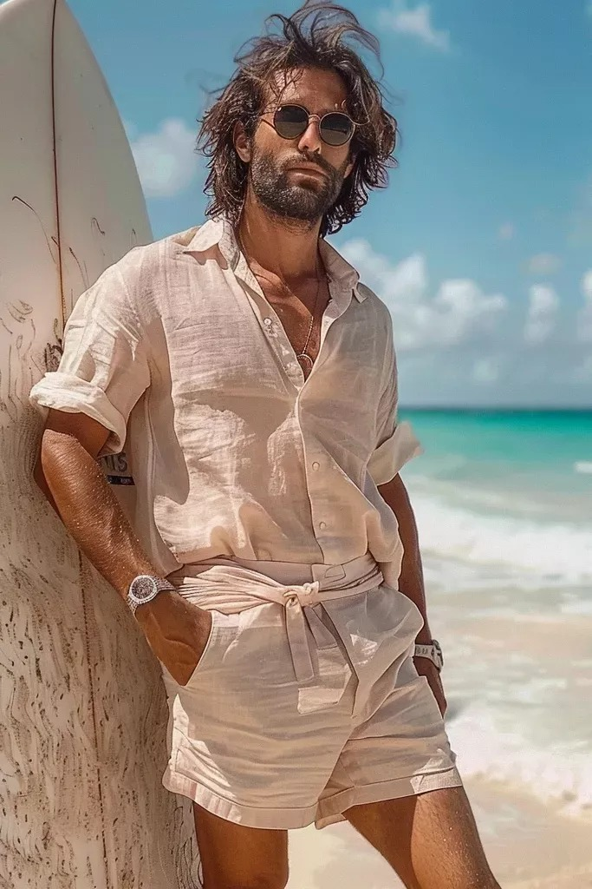
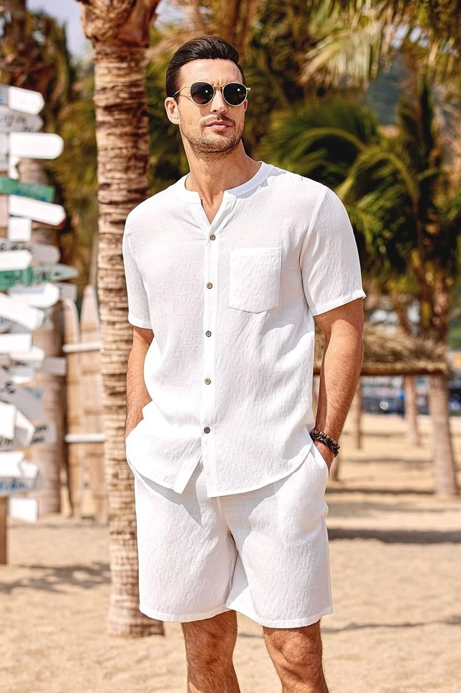
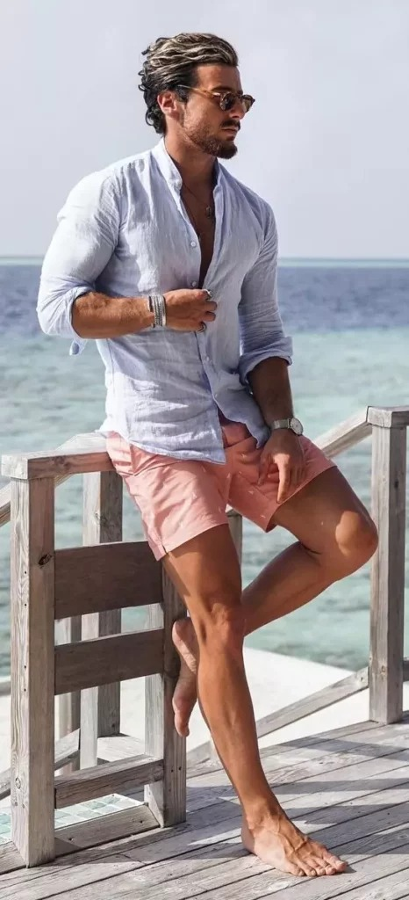

# 澳洲冲浪休闲 (Australian Surf Casual)
> **状态**: `reviewed` | **最后更新**: 2026-06-13 | **趋势**: 小众领域

## 📖 概述
澳洲冲浪休闲风格（Australian Surf Casual）源于澳大利亚黄金海岸和维州 Torquay 的海浪文化，**Quiksilver 和 Billabong 两个品牌定义了全球冲浪者的穿着方式**。从 1970 年代至今，这一风格从海滩功能装备进化为一种全球化的休闲生活方式：宽松冲浪短裤、大胆图案 T 恤、人字拖和做旧卫衣是其基础词汇。2024 年的澳洲冲浪休闲正在经历一场「精致化」转型——现代职业冲浪手穿着中性色调的西装裤和 Polo 衫走出水面，而同时 1990s 复古冲浪怀旧也在强力回归。

## 📜 历史文化
- **1960s–1970s 起源**：澳大利亚冲浪文化在维多利亚州 Torquay 和新南威尔士/昆士兰的黄金海岸自然生长。1970 年代 Board shorts（冲浪短裤）从笨重的帆布款进化为轻量尼龙款。
- **1969 Quiksilver 诞生**：Alan Green 和 John Law 在 Torquay 创立 Quiksilver，推出扇形下摆、Yoke 腰头和魔术贴闭合等革命性设计，重新定义了冲浪短裤。
- **1973 Billabong 诞生**：Gordon 和 Rena Merchant 在黄金海岸创立 Billabong，以耐用的冲浪短裤起家，迅速在 1990 年代扩展为全球海滩生活品牌。
- **1990s–2000s 巅峰**：冲浪风格成为全球青少年文化的主流——过膝冲浪短裤、荧光色 T 恤、Puka Shell 贝壳项链、逆向棒球帽。Quiksilver 和 Billabong 赞助世界级冲浪赛事，成为文化偶像。
- **2020s 变革**：Liberated Brands（持有 Quiksilver、Billabong 等美国许可的公司）在 2025 年初申请破产，所有 120 家美加门店关闭；但品牌本身于 2023 年已出售给 Authentic Brands Group（交易据报超 10 亿美元），正在寻找新的制造和分销合作伙伴——转型期的文化巨兽。

## 🎨 美学特征
| 类别 | 核心单品 |
|------|---------|
| **上装** | 图案/Logo T 恤（冲浪品牌、当地冲浪店）、连帽卫衣、法兰绒衬衫（澳洲冬季海滩篝火标配）、亨利领长袖 |
| **冲浪短裤** | 过膝 Board shorts（快速排水面料、鲜艳印花或纯色）；2024 年复古版为略短、更合身的剪裁 |
| **日常下装** | 宽松工装短裤、破洞牛仔、轻量卡其裤 |
| **鞋履** | 人字拖（Havaianas 或冲浪品牌款）、光脚（理所当然）、帆布鞋、Vans 滑板鞋 |
| **外套** | 连帽防风夹克（Windbreaker）、轻量尼龙 Parka、蓬松羽绒（冬季冲浪后保暖） |
| **配饰** | 棒球帽/渔夫帽、冲浪品牌背包、Puka Shell 贝壳项链、太阳镜（冲浪品牌或 Oakley） |

**色彩与纹理**：海洋蓝、阳光漂白的淡色、沙色、鲜亮印花（热带花卉/几何）、复古褪色。整体触感——衣服是「被阳光和盐水漂过的」，不追求新，追求穿着痕迹。

**两代风格对比**：
| 时代 | 风格特征 |
|------|---------|
| **1990s–2000s** | 过膝冲浪短裤、荧光色、Puka Shell 项链、霜染发梢、逆向棒球帽 |
| **2024–2025** | 90 年代怀旧档案款复兴 + 「冲浪后咖啡」精致化：Polo 衫、中性色西裤、皮革鞋配以经典冲浪短裤打底 |

## 🏷️ 代表品牌
| 品牌 | 地位 |
|------|------|
| **🏄 Quiksilver** | 冲浪服饰先驱（1969，Torquay）。山与浪 Logo 是冲浪文化的全球符号。其 Highline Pro 冲浪短裤和 Everyday T 恤持续是品类标杆。 |
| **🌊 Billabong** | 黄金海岸生活方式品牌（1973）。「Recycler Series」冲浪短裤由回收塑料瓶制成，代表冲浪产业的可持续方向。赞助 Billabong Pro Pipeline 世界冲浪联赛赛事。 |
| **♀️ Roxy** | Quiksilver 女性线（1990），定义女性冲浪时尚。 |
| **⚡ Volcom** | 滑板/冲浪/滑雪跨界品牌，更偏街头/叛逆。 |
| **🇦🇺 Rip Curl** | 另一澳洲冲浪巨头（1969，Torquay），以潜水服和冲浪手表闻名。 |
| **🆕 Former** | 职业冲浪手 Dane Reynolds 共同创立的当代冲浪品牌——将冲浪文化带入现代街头/运动服饰对话。 |
| **🆕 Rivvia Projects** | Julian Wilson 的品牌，模糊冲浪与运动的边界。 |

## 👤 风格偶像
| 偶像 | 标志性造型 |
|------|-----------|
| **Mick Fanning** | 澳洲冲浪冠军，Billabong 长期赞助对象——经典冲浪短裤 + 连帽卫衣的完美示范 |
| **Layne Beachley** | 澳洲女子冲浪传奇，Billabong 面孔，定义冲浪女性的自信休闲风格 |
| **Kelly Slater** | 全球最伟大冲浪手（美国），Quiksilver 赞助——冲浪服饰的终极代言人 |
| **Dane Reynolds** | 职业冲浪手 + Former 品牌创始人，新一代「冲浪后精致化」的代表 |

## 🔗 关联风格
- **Surf Style（冲浪风格）** — 同根，澳洲版更强调 Quiksilver/Billabong 的品牌文化
- **90s Casual / Retro Sportswear** — 共享怀旧运动服饰基因，1990s 冲浪风格近期回潮
- **Gorpcore** — 户外功能性与冲浪自然元素有一定交叉，但冲浪更轻、更湿、更阳光
- **California Casual** — 美国西海岸休闲风格与澳洲冲浪休闲高度平行，但前者带有好莱坞和滑板的影响

## 📈 流行趋势
2024–2025 年的澳洲冲浪休闲正经历双重动力：
- **1990s 怀旧回潮**：Quiksilver 和 Billabong 重新挖掘 1990s 档案款，复古印花和宽松剪裁在 TikTok 和 Instagram 上走红
- **精致化转型**：「冲浪后咖啡」美学——职业冲浪手穿着 Polo 衫、西裤和皮鞋走出海滩，冲浪品牌推出更多「上岸后」产品线
- **可持续浪潮**：Billabong Recycler Series 等回收材料产品成为行业标准方向
- **新品牌崛起**：Former、Rivvia Projects 等由冲浪手创立的独立品牌正在重新定义冲浪风格，将街头服饰、运动服饰和冲浪文化融合
- **商业变局**：Quiksilver 和 Billabong 在美国的零售网络崩塌，但品牌 IP 仍被看好——未来的授权合作重构值得关注

## 💡 穿搭建议
1. **入门公式**：Logo 图案 T 恤 + 过膝冲浪短裤 + 人字拖 → 海滩日标配
2. **「冲浪后咖啡」版本**：素色 Polo 衫 + 中性色调卡其裤/西裤 + 帆布鞋或皮革拖鞋 + 经典腕表
3. **澳洲冬季版**：连帽卫衣 + 法兰绒衬衫（外穿）+ 工装短裤或牛仔 + Vans
4. **复古冲浪版**：去 Depop/eBay 找 1990s Quiksilver/Billabong vintage T 恤，配现代合身短裤和帆布鞋——新旧平衡
5. **核心态度**：无论怎么穿，保持「刚从海边回来」的放松感——别过度搭配，让风、盐和阳光决定质感

## 📸 风格图库

> 以下为风格代表性穿搭参考图，搜集自公开时尚媒体。

*风格穿搭参考*

*Ekouaer Men's White Solid Button Up Short Sleeve Shirt & Short Set ...*

*23+ Comfy Men's Beach Outfits That'll Make Waves - Men Inspire*
