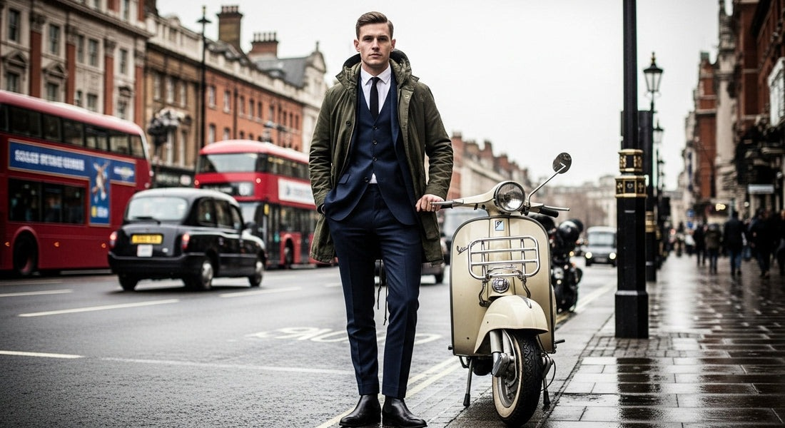
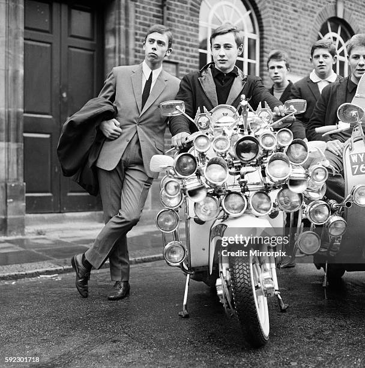
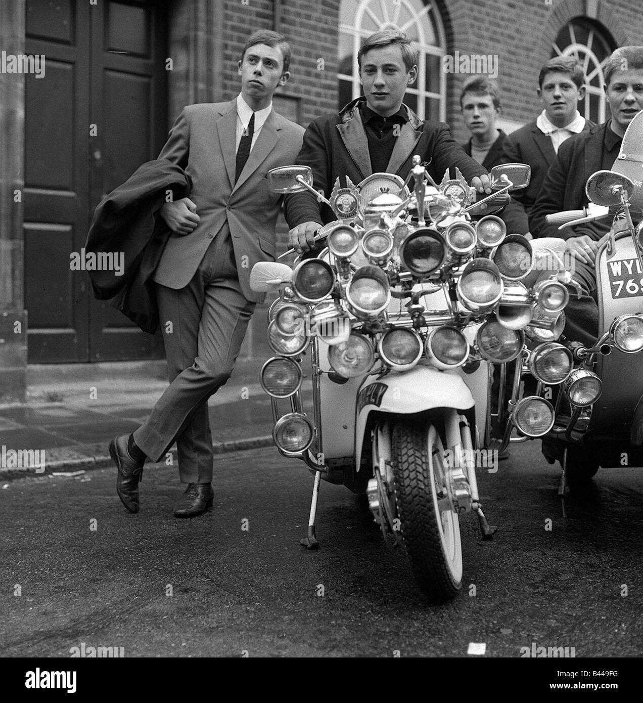

# 英式摩登 (British Mod)

> **状态**: `reviewed` | **最后更新**: 2026-06-13

## 📖 概述

英式摩登（British Mod）是源自1950年代末伦敦的工人阶级青年亚文化，其核心精神为**"以风格作为现代性宣言"**。Mod（Modernist的缩写）青年以意大利式精裁西装、美式R&B/灵魂乐/牙买加Ska唱片、意大利Vespa/Lambretta踏板车和安非他命驱动的通宵舞蹈构建了一套完整的生活方式。与其摇滚/油脂文化（Rockers/Teddy Boys）的前辈截然不同——Mod们拥抱的是现代爵士、欧洲大陆风尚和存在主义哲学。Mod文化在1964年与Rockers的布莱顿海滩冲突、The Who的《Quadrophenia》（1973年/1979年电影）以及Fred Perry Polo衫和Ben Sherman衬衫中找到了最具辨识度的文化符号。2024–2025年，Mod作为**男装史上最完整的亚文化风格系统**持续产生影响——它的裁剪语言、品牌矩阵和"服装优先于一切"的价值观，已成为当代男装设计的底层语法之一。

## 📜 历史文化

### 起源：Soho的"摩登主义者"（1958–1962）

Mod的故事始于1950年代末伦敦Soho区的一小群工人阶级年轻男性。他们自称为**"Modernist"**——有意识地拒绝上一代Teddy Boys的油脂摇滚美学，转而热爱：

- **现代爵士**（Miles Davis、John Coltrane、Dave Brubeck）
- **意大利和法国电影/文学**（安东尼奥尼、新浪潮、萨特的存在主义）
- **欧洲大陆的精裁时尚**——特别是意大利的窄身西装剪裁
- **安非他命**（"Purple Hearts"药丸）驱动的通宵舞蹈——在Soho的The Scene和The Flamingo等俱乐部

Mod运动最早的参与者人数极少，这群"精英"对自己的音乐口味、服装剪裁和消费选择怀有极端的排他性自豪。服装消费优先于一切——诗人John Cooper Clarke的回忆精准捕捉了Mod伦理：**"你把全部工资花在衣服上，甚至不是唱片。食物也不在优先清单上。"**

### 黄金时代：Swinging London（1963–1966）

到1963–1966年，Mod从地下精英亚文化扩张为伦敦青年文化的主流：

- **Carnaby Street**和**King's Road**成为Mod时尚的零售中心
- **《Ready Steady Go!》**（1963–1966年）是Mod青年每周必看的电视音乐节目，向全国青少年传播美式灵魂乐和英国Mod乐队
- **Mary Quant**在King's Road的Bazaar精品店发明了超短裙——为女性Mod定义了轮廓
- **Vidal Sassoon**的五点式波波头（Five-Point Bob）成为女性Mod的发型标志
- Mod美学开始影响平面设计、室内装饰和广告，通过英国文化入侵输出到美国
- 安东尼奥尼的电影**《Blowup》**（1966年）捕捉了Swinging London的Mod影响下的视觉美学

### 音乐：The Who、The Small Faces与The Beatles

音乐是Mod生活的生命线。Mod音乐品味经历了多个阶段：

**早期影响：**
- 现代爵士（Miles Davis、John Coltrane）
- 美国R&B和灵魂乐（Motown、Stax、Chess唱片公司）
- 牙买加Ska/Bluebeat（Prince Buster、The Skatalites、Derrick Morgan）

**核心英国Mod乐队：**

| 乐队 | 在Mod文化中的角色 |
|------|-------------------|
| **The Who** | 终极Mod乐队。将美国R&B与英国青年的侵略性能量结合。1973年概念专辑《Quadrophenia》将Mod vs Rocker冲突永远封存在文化记忆中。乐队以Union Jack（英国国旗）图案、波普艺术T恤和华丽的Mod风格进行自我包装 |
| **The Small Faces** | 名字直接来源于Mod俚语"face"（圈子内的有头有脸人物）。与The Who并列为最紧密关联Mod运动的乐队 |
| **The Kinks** | 捕捉了Mod体验中的能量、风格和阶级意识 |
| **The Spencer Davis Group** | Mod核心播放列表的常驻乐队 |

**The Beatles——"Mockers"**
The Beatles的角色是过渡性的：他们在1960年代早期从皮夹克转向Mod西装，Ringo Starr笑称自己是**"Mocker"**（一半Mod一半Rocker）。1964年电影《A Hard Day's Night》深受Mod美学影响，Beatle靴成为Mod鞋履的重要款式。但他们从未是纯粹的Mod乐队——他们超越了亚文化。

### 交通方式：Lambretta与Vespa——踏板车即身份

踏板车是Mod移动性的标志符号，选择原因兼具实际和风格：

- **意大利设计**——Vespa和Lambretta代表了欧洲大陆的精致——那是Mod渴望的方向
- **封闭式车身面板**——隐藏所有运动部件，因此机油和泥尘不会弄脏昂贵的精裁西装
- **极致定制化**——Mod们以数十个额外的后视镜、灯光、雾灯和定制涂装来装点踏板车
- **Parka（派克大衣）的连接**——军品M-51/M-65 Fishtail Parka在骑踏板车时穿着，专门用于保护西装免受风吹雨打

> 踏板车是Rockers油腻的摩托车的对立面——洁净 vs 肮脏，欧洲 vs 美国。

### Mods vs Rockers：1964年海滨冲突

Mod与Rockers的冲突在1964年于海滨度假胜地**布莱顿、马尔盖特和黑斯廷斯**达到暴力顶峰：

| Mods | Rockers |
|------|---------|
| 意大利踏板车（Lambretta/Vespa） | 英国摩托车（Triumph、Norton） |
| 精裁西装、Parka、Polo衫 | 黑色皮夹克、丹宁、工程师靴 |
| R&B、灵魂乐、Ska、The Who | 1950年代摇滚、Elvis、Gene Vincent |
| 安非他命（"Purple Hearts"） | Ace Café摩托车咖啡馆文化 |

这些冲突被媒体大肆渲染，社会学家**Stanley Cohen**基于他对Mod-Rocker冲突的研究**发明了"道德恐慌"（Moral Panic）一词**。事件在《Quadrophenia》中被永久固化，还影响了Anthony Burgess的《发条橙》。

### 衰落与派系分化（1967–1970s）

到1967–1968年，原始运动随着成员年龄增长、嬉皮运动崛起而消退。"Hard Mods"分裂成为早期**Skinhead亚文化**（保留Fred Perry、Ben Sherman、Sta-Prest裤子，但增加了背带和Dr. Martens马丁靴）。灵魂乐/Northern Soul的持续场景保留了Mod的音乐遗产。

### 1970s Mod复兴与《Quadrophenia》

- **1979年**《Quadrophenia》电影上映，引发重大Mod复兴
- **The Jam**（Paul Weller领衔）、**Secret Affair**、**The Purple Hearts**（以Mod药物命名）、**The Lambrettas**（以踏板车命名）形成1970s末Mod复兴的乐队核心
- **2 Tone Ska运动**（The Specials、Madness、The Selecter）具有深厚的Mod根源——黑白种族融合+定制造型

### Britpop与1990s

- **Paul Weller**的独唱生涯、**Ocean Colour Scene**、**Blur**将Mod影响带入Britpop时代
- Fred Perry Polo衫经历巨大复苏，被Britpop乐队大量穿着

### 2024–2025：当代Mod的持久存在

虽然Mod不再是大众青年文化，但它的遗产以多种方式持续：

- **Fred Perry和Ben Sherman**仍然是全球标志性品牌，被Mod复兴主义者、各类亚文化和主流时尚持续穿着
- **Lambretta和Vespa**保持忠实追随者，踏板车集会在英国和欧洲定期举行
- **Vintage和Heritage时尚**趋势将Mod裁剪、沙漠靴和Parka重新带入当代男装
- 高级时装继续引用Mod美学——**Saint Laurent**、**Prada**、**Junya Watanabe**都曾从Mod风格中汲取灵感
- 现代Mod场景在英国、德国（电子Mod场景）和日本持续存在，围绕Northern Soul之夜、踏板车俱乐部和复古时尚
- 《Quadrophenia》仍然是Cult经典，The Who继续巡演并影响新一代

## 🎨 美学特征

**Mod男士经典单品：**

| 品类 | 单品 | 细节 |
|------|------|------|
| **西装** | 三扣窄翻领精裁西装 | 马海毛（Mohair）或鲨鱼皮（Sharkskin）面料，意大利窄身剪裁 |
| **Polo衫** | Fred Perry Polo | 扣紧最上方扣子——这是Mod的亚文化制服 |
| **衬衫** | Ben Sherman纽扣领衬衫 | 尖领（Pointed Collar），另一Mod必备单品 |
| **领带** | 针织窄领带（Knitted Tie） | 薄型，通常系到最上方扣子 |
| **外衣** | M-51 / M-65 Fishtail Parka | 军品剩余物资，骑踏板车时保护西装 |
| **鞋履** | Chelsea Boots、Clarks Desert Boots、乐福鞋（Loafers）、抛光牛津鞋（Brogues） | |
| **发型** | "French Crop"（法国式短寸） | 短发、侧分、整洁——与Rockers的油腻长发截然相反 |

**Mod女性经典单品：**
- **Mary Quant超短裙**——Swinging London的定义性服装
- A字裙/直筒裙，大胆的几何图案（Op Art、波普艺术影响）
- **Vidal Sassoon五点式波波头**——锋利、建筑感的发型
- 平底鞋、玛丽珍鞋、白色Go-Go靴
- 模特**Twiggy**和**Jean Shrimpton**成为这一造型的面孔

**色彩体系：**
- 黑白对比——核心调色
- Union Jack（英国国旗）红色、白色、蓝色——被The Who和整个运动作为波普符号采纳
- 马海毛西装的灰色调
- 1965年后向迷幻方向演变——尼赫鲁领、荧光色

**核心设计原则：**
- **"Sharp"（锋利）**——剪裁必须精准，没有皱褶或多余布料
- **意大利灵感**——朝向欧洲大陆，远离美国和英国的粗犷传统
- **功能性外套+精裁内核**——Parka(军品/功能)穿在西装(精致/昂贵)外面，这是Mod最具辨识度的矛盾美学
- **服装优先级最高**——服装花费排名第一，高于食物、唱片和房租

## 🏷️ 代表品牌

### Mod纯粹主义品牌

| 品牌 | 创立 | Mod DNA |
|------|------|---------|
| **Fred Perry** | 1952年 | 三届温布尔登冠军Fred Perry创立，月桂花环Logo。Laurel Wreath Polo衫是Mod的"制服"——扣紧最上方扣子穿着。2025年仍然是被全球亚文化持续穿着的标志性品牌 |
| **Ben Sherman** | 1963年 | 英国衬衫品牌，尖领纽扣领衬衫是Mod的第二件必需品。其衬衫在1970s末Mod复兴和1990s Britpop中经历两次大规模回归 |
| **Lambretta** | 1947年（米兰） | 虽然不是服装品牌，但作为Mod交通方式的标志，Lambretta的品牌Logo和形象被大量授权在服装和配饰上，形成了一个围绕踏板车文化的服装品牌生态 |
| **Merc** | 1960s | 英国品牌，以Mod风格的Harrington夹克和针织Polo衫著称 |

### 1970s Mod复兴品牌

| 品牌 | 特色 |
|------|------|
| **Pretty Green** | 由Liam Gallagher（Oasis）于2009年创立，以Mod和Britpop美学为基础 |
| **Warrior Clothing** | Mod复兴和Northern Soul场景的传统造型供应商 |

### 当代奢侈品牌引用Mod

| 品牌 | Mod引用方式 |
|------|-------------|
| **Saint Laurent（Hedi Slimane时期）** | 窄身裁剪+切尔西靴+尖领衬衫——Mod的奢侈化表达 |
| **Prada** | 多季系列引用Mod的几何图形和窄身轮廓 |
| **Junya Watanabe** | 以解构视角重构Mod经典单品——Parka、窄身西装 |
| **Paul Smith** | 英国裁剪+波普色彩——Mod的当代化转译 |
| **Ralph Lauren** | 虽然是美式品牌，但Polo衫产品线直接引用Fred Perry的Mod逻辑 |

### Mod文化遗产的当代运营者

| 品牌/机构 | 角色 |
|-----------|------|
| **The Who（持续巡演）** | 《Quadrophenia》仍然是Mod文化的必要观看文本 |
| **Quadrophenia The Musical** | 2024–2025年英国巡演，将Mod叙事传递至新一代 |
| **Modraphenia / Modraphenia UK** | 全球Mod互联网社区，连接分散的当代Mod群体 |
| **Scooter Rally Europe / UK** | 年度踏板车集会，成千上万辆定制Lambretta和Vespa汇聚 |

## 👤 风格偶像

**1960s原始Mod：**
- **Steve Marriott（The Small Faces）**——Mod裁剪的终极展示者
- **Pete Townshend（The Who）**——Union Jack夹克和波普艺术T恤——Mod风格的视觉化
- **Paul Weller**——跨越1970s Mod复兴（The Jam）、1980s（The Style Council）和1990s独唱/Britpop，是Mod文化最具连续性的人物
- **Mary Quant**——不是穿着者但是创造者：她为女性Mod定义了服装语言
- **Twiggy & Jean Shrimpton**——女性Mod的面孔

**1970s Mod复兴偶像：**
- **Paul Weller（The Jam）**——灵魂乐+朋克+Mod裁剪的完美融合
- **The Specials / Madness**——2 Tone Ska的西装+乐福鞋+Rude Boy美学，源自Mod

**当代Mod精神继承者：**
- **Liam Gallagher（Oasis）**——虽然Oasis是Britpop不是Mod，但Liam的个人风格（Parka+窄身裁剪）和品牌（Pretty Green）直接连接Mod传统
- **Miles Kane & Alex Turner（The Last Shadow Puppets）**——2010s Mod复兴的代表
- **Bradley Wiggins（自行车手）**——公开的Mod爱好者，拥有自己的Mod品牌
- **Martin Freeman**——以Fred Perry Polo衫和Mod风格在日常中展现

## 🔗 关联风格

- **British Savile Row（英式萨维尔街）**：Mod精裁西装的传统与Savile Row隔了一层——Mod是工人阶层在廉价高街购买意式风格的西装，而非定制（见`../british_savile_row/encyclopedia.md`）
- **American Preppy（美式预科风）**：两者都是青年身份风格的体系化——但Preppy是继承的（Ivy League血统），Mod是购买的（工人阶级消费欧洲幻想）（见`../../american_preppy/encyclopedia.md`）
- **Skinhead（光头党）**：1960s后期"Hard Mods"的派生分支——保留了Fred Perry和Ben Sherman，增加了Dr. Martens和背带
- **2 Tone / Ska**：音乐层面与Mod深度交织——黑人白人种族融合+定制造型
- **Britpop**：1990s英国摇滚，在美学上大量引用Mod符号
- **Northern Soul**：1960s灵魂乐痴迷者的持续场景，保留了许多Mod的服装密码

## 📈 流行趋势

- **Parka作为当代男装基础外衣**：1960年代Mod的Fishtail Parka已经完全脱离亚文化语境，成为全球男装的主流外套选择
- **Fred Perry的持续相关性**：月桂花环Polo衫在跨越70年后仍被多个亚文化同时穿着——这是一个罕见的无阶级、无亚文化边界的产品
- **"Mod复兴"的周期规律**：Mod文化已被证明是"十年一复兴"的风格（1960s原始、1979–1982复兴、1990s Britpop、2010s Last Shadow Puppets——2025年可能是下一波的酝酿期）
- **Vintage Mod原件的价值飙升**：1960s Fred Perry品、原始的Ben Sherman尖领衬衫和Lambretta GP/DL踏板车在收藏家市场持续升值
- **奢侈品牌持续挖掘Swinging London**：Saint Laurent、Gucci的伦敦1960s系列、Dior的英国文化引用
- **日本Mod场景**：日本拥有世界上最专注的Mod复兴社区——Shimokitazawa的Vintage Mod精品店、精确到每一个针脚的1960s西装复刻、踏板车定制达到世界级水平

## 💡 穿搭建议

**亚洲男性穿搭要点：**

1. **Parka+精裁的矛盾美学是Mod的灵魂**：一件军绿色M-51/M-65 Fishtail Parka穿在纽扣领衬衫+针织领带外面——这是Mod最具辨识度的穿搭公式。Parka可以来自军品剩余商店或品牌复刻（如Alpha Industries、Real McCoy's），内搭不必是全套西装——Ben Sherman衬衫+卡其斜纹裤已足够
2. **Polo衫扣到顶**：Fred Perry Polo衫的Mod穿法是**扣紧最上方扣子**——这个细节直接区分Mod和随意穿着Polo的人。亚洲男性可选Fred Perry的Slim Fit亚洲版型（日本线），袖长和衣长更适合东亚体型。选择黑色/白色/海军蓝+白色月桂花环的基础配色
3. **窄身剪裁但不要过度**：Mod西装是窄身的但不是"韩版紧身"。三扣窄翻领、马海毛或棉质面料，选择Uniqlo U、COS或Vintage店铺的意式风格西装外套。亚洲男性特别需要注意肩宽匹配——Mod的西装肩部几乎无垫，自然落肩
4. **鞋履——Desert Boots是最安全入口**：Clarks Originals的沙漠靴（Desert Boot/Desert London）是Mod的经典鞋款，也是当代男装中最容易搭配的鞋履之一。沙色麂皮（Sand Suede）是最经典的配色。比切尔西靴更容易驾驭，对亚洲男性的腿部比例也更友好
5. **Harrington夹克（G9）作为Parka的轻便替代**：Baracuta G9 Harrington夹克是Mod的暖季外衣——站立领、格纹内衬。选择砂色或海军蓝，内搭Polo或Ben Sherman衬衫
6. **发型——Mod的"French Crop"**：短发、侧分、整洁。亚洲男性可能需要头顶留多一些长度以制造纹理，避免服帖。不需要过度造型——Mod的整洁是自然的，不是产品堆出来的
7. **色彩纪律**：黑白为底，以一件单色亮色做点缀（Fred Perry的红色/黄色Polo衫、一颗Target圆点口袋巾）——**一个焦点，其余黑白灰**
8. **入门避坑**：
   - 不要穿全套Mod"戏服"——Parka+窄身西装+Fred Perry+Ben Sherman+针织领带+Desert Boots+踏板车 = 过度装扮的装扮游戏。选择1–2件Mod核心单品，其余为基础款
   - Union Jack图案要谨慎——一张靶心（The Who的Logo）已经足够，全身Union Jack = 国旗游行
   - 不要买廉价Fred Perry仿品——月桂花环的刺绣精度是品牌价值的核心，廉价仿品的Logo间距和形状一眼可辨
9. **2025年Mod入门公式**：
   - 军绿色M-51 Parka + 白色Ben Sherman纽扣领衬衫 + 黑色修身斜纹裤 + Clarks沙漠靴
   - 或黑色Fred Perry Polo（扣到顶）+ 修身灰色羊毛长裤 + 黑色切尔西靴 + 一件单排扣黑色Car Coat

## 📸 风格图库

> 以下为风格代表性穿搭参考图，搜集自公开时尚媒体。

*风格穿搭参考*

*Mods Scooters Photos and Premium High Res Pictures - Getty Images*

*Youth Culture Mod Mods Swinging Sixties Collection May 1965 Mods ...*
