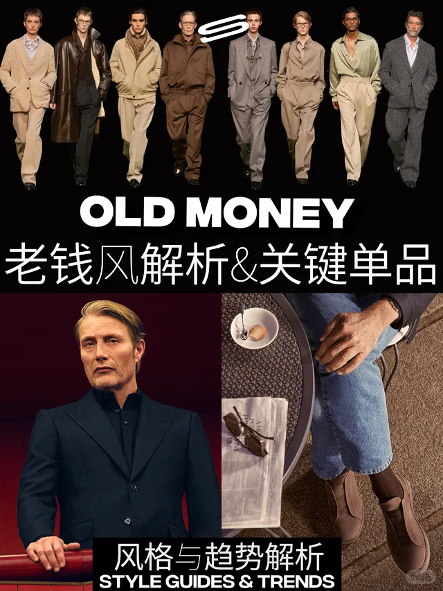
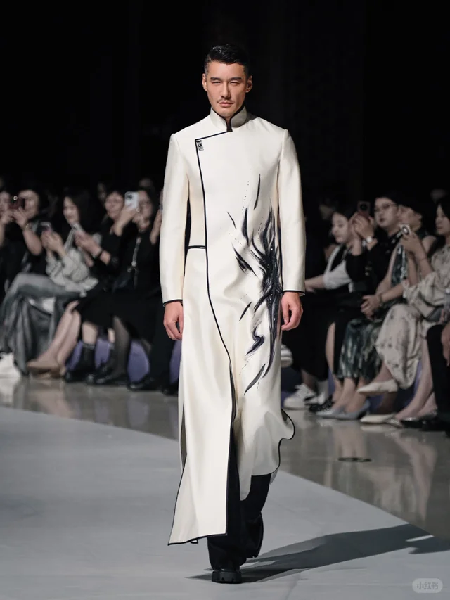
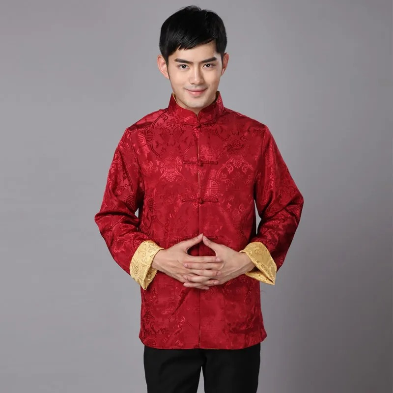
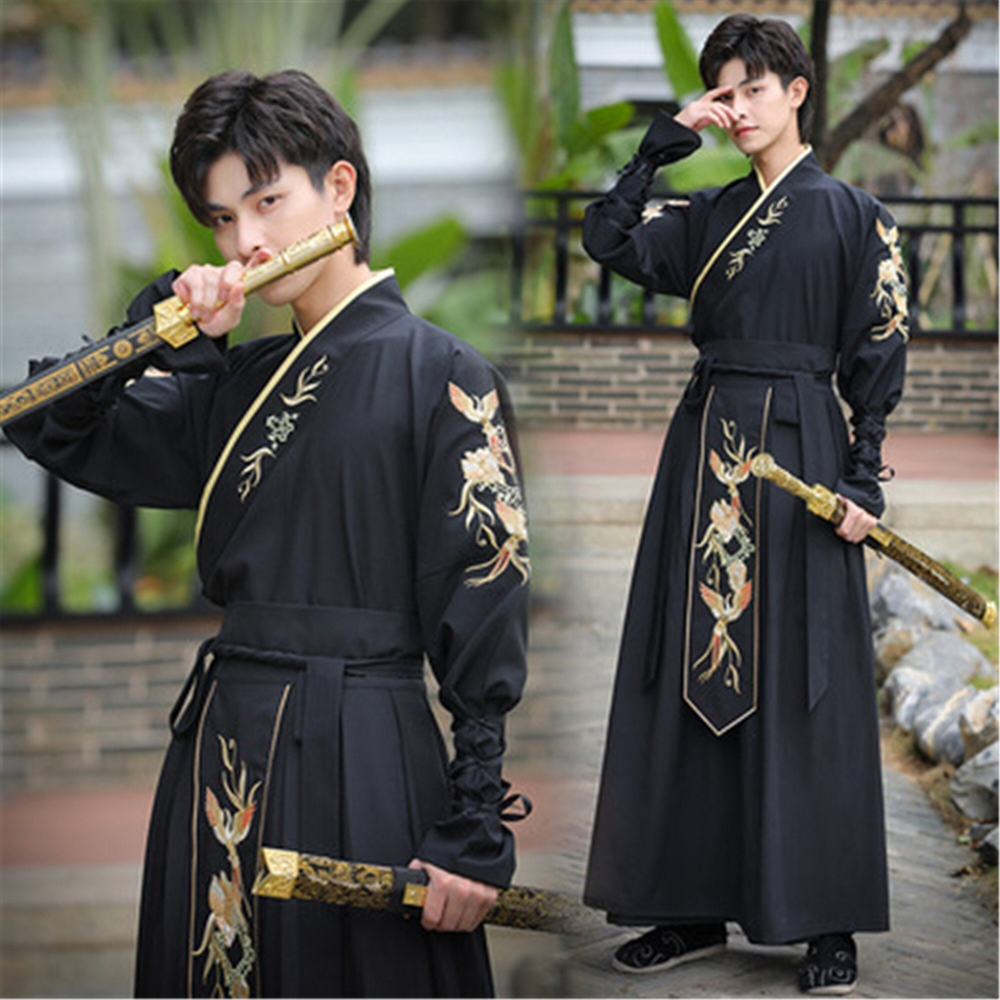
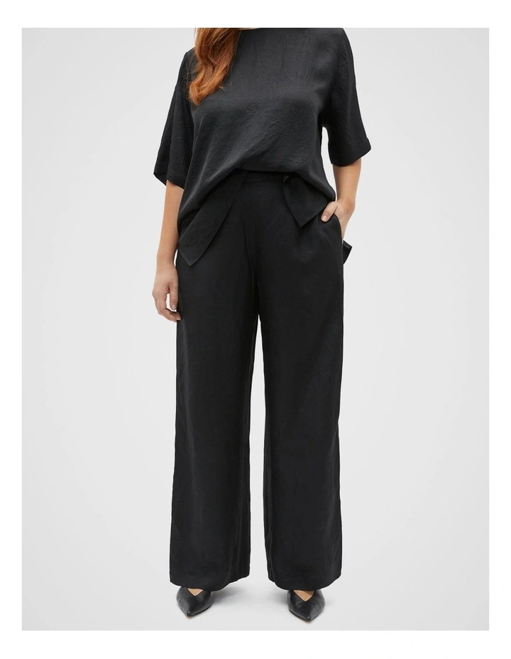
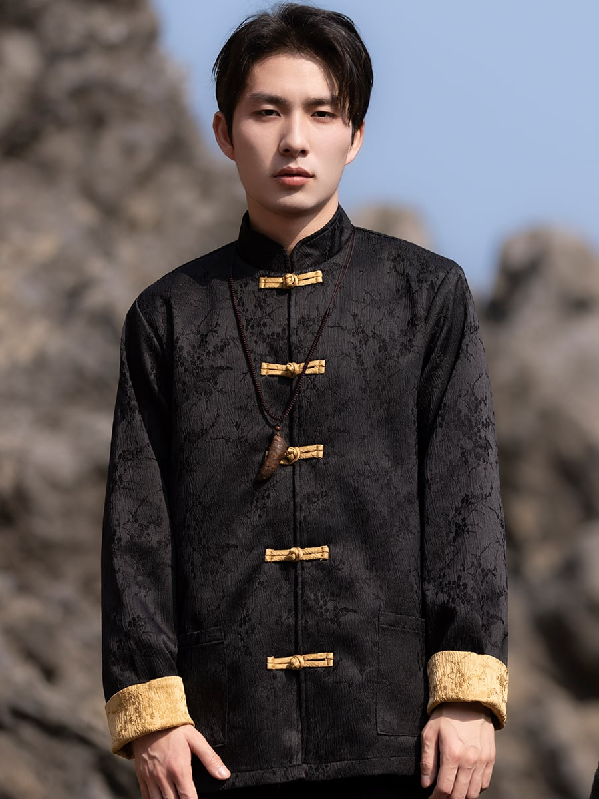
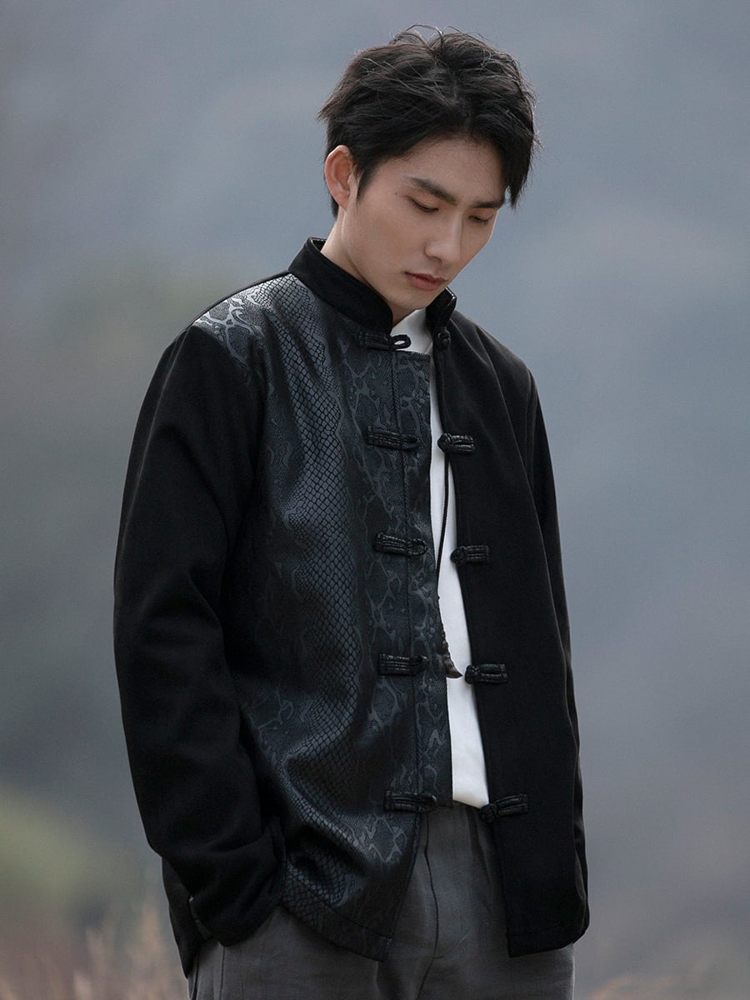
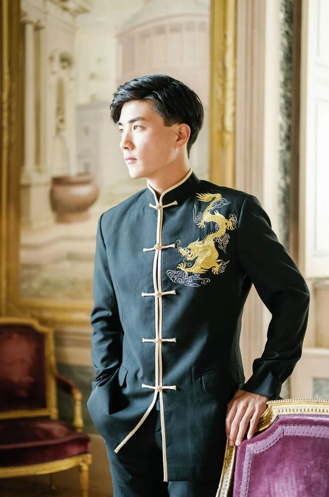
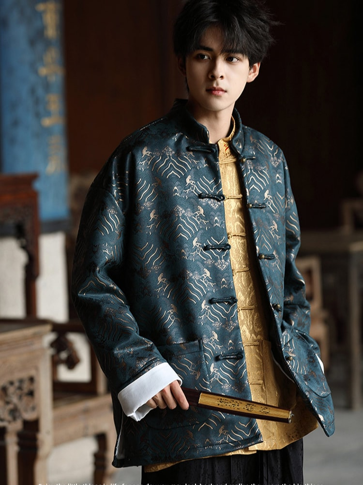

# 中式国风质感 (Chinese Heritage Luxe)

> **状态**: `reviewed` | **最后更新**: 2026-06-17 | **趋势**: 经典风格
> **分类**: 中式 > 当代2020s > 半正式 > 极简调性


## 📖 概述
- **发源年代**: 2018-2020（"国潮"运动催化）
- **发源地**: 中国
- **风格关键词**: 东方美学、暗色调、自然面料、文玩配饰、低调、质感
- **一句话定义**: 不是传统汉服的复刻，而是以质感面料、暗色系和文玩配饰构建的现代东方男性穿搭——低调、内敛、有文化底气。

## 📜 历史文化

### 起源
国风质感穿搭的兴起有三个文化土壤：

1. **"国潮"运动** (2018-): 李宁在纽约时装周一炮而红，"中国李宁"成为文化符号。新一代消费者不再盲目崇拜西方奢侈品牌，开始寻找东方审美表达。
2. **文玩复兴** (2019-): 年轻男性对沉香手串、菩提、核桃等文玩配饰产生兴趣——不仅是穿搭，更是一种慢生活态度。
3. **新中式生活美学** (2020-): 茶文化、香道、书法等传统文化形式以更现代的方式回归城市生活，穿搭作为其中一环。

### 与"新中式""汉服日常化"的区别
- **汉服日常化**: 直接穿着改良汉服上街，视觉上明显是传统服饰
- **新中式**: 设计师品牌对传统元素的现代解构（如立领、盘扣融入西装）
- **国风质感**: 不著传统服饰的痕迹，而是通过色板（中国色）、面料（亚麻/真丝）、配饰（手串）构建一种"懂的人懂"的东方感

## 🎨 美学特征

### 廓形
- 合身或微宽松，不过度廓形
- 线条干净，强调面料垂感而非结构感
- 避免过于修身（不符合东方"含蓄"美学）

### 色板
```
主色调: 玄黑、檀棕、月白、靛蓝、鸦青
中国传统色名: 玄色(黑中带赤)、月白(淡蓝白)、鸦青(深蓝灰)、檀色(浅棕)
逻辑: 低饱和暖调深色为主，自然色系，不刺眼
禁忌: 荧光色、大面积亮色、高对比撞色
```

### 面料
- **亚麻** — 夏季核心面料，透气有肌理感
- **棉麻混纺** — 日常衬衫/长裤，比纯棉更有"呼吸感"
- **真丝/桑蚕丝** — 高端衬衫/围巾，光泽含蓄
- **灯芯绒** — 秋冬质感选择
- **羊毛/羊绒** — 大衣和针织品

### 标志单品
| 单品 | 选择要点 | 搭配逻辑 |
|------|---------|---------|
| 暗色衬衫 | 黑/藏青/墨绿，纯色无Logo，自然面料 | 单穿或敞开做外搭 |
| 亚麻长裤 | 直筒剪裁，檀棕/月白/玄黑 | 替代牛仔裤的更"东方"选择 |
| 质感外套 | 合身剪裁，暗色系，灯芯绒/羊毛 | 增加体量感和成熟度 |
| 帆布鞋/德训鞋 | 黑/棕/米白色 | 比运动鞋更"安静" |
| 皮质邮差包 | 棕色/黑色，极简设计 | 东方感+实用 |
| 手串/文玩 | 沉香/檀木/菩提 | 国风质感的标志性配饰 |
| 机械/简约手表 | 圆形表盘/皮质表带 | 低调但精致的细节 |

## 🏷️ 代表品牌

### 高端设计师
- **Uma Wang** — 中国设计师品牌，做旧质感和东方美学在国际上有极高声誉
- **Ziggy Chen** — 上海设计师，将中国传统剪裁和面料做当代转化
- **Ms MIN** — 以"惜物"为理念，面料驱动设计
- **Peng Tai** — 以中药染色和手工面料著称的先锋设计师
- **Samuel Gui Yang** — 将旗袍元素融入日常穿搭

### 大众品牌
- **李宁 (Li-Ning)** — "中国李宁"系列开创国潮元年
- **之禾 (ICICLE)** — 中国高端环保品牌，东方极简
- **单农 (DAN NONG)** — 中国设计师品牌，东方极简男装

### 文玩配饰品牌
- 传统手串品牌多是非标手工制作，选择重点在材质（沉香>檀木>菩提）和工艺

## 👤 风格偶像

| 人物 | 身份 | 风格贡献 |
|------|------|---------|
| **陈坤** | 演员 | 长期践行东方极简穿搭，2018年创立"行走的力量" |
| **胡歌** | 演员 | 暗色调+质感面料+文玩配饰的标杆 |
| **王凯** | 演员 | 西装+东方内敛气质的融合 |
| **梁文道** | 文化人 | "文化人穿搭"——暗色系、自然面料、知识分子感 |
| **Uma Wang** | 设计师 | 不仅是设计师，本人穿搭就是东方质感美学的示范 |

## 🔗 关联风格
- **父风格**: 东方美学
- **子风格**: 新中式、汉服日常化
- **平行风格**: 日系侘寂、北欧极简（在不同文化语境下追求相似的"安静"质感）
- **对立风格**: 街头潮流、美式运动

## 📈 流行趋势
- **当前状态**: 🟡 稳步上升（从"国潮"的表层符号向深层美学演进）
- **流行区域**: 中国为主，日本/韩国/东南亚有零星追随者
- **发展方向**: 从文玩配饰的"入门符号"向面料/剪裁/整体感升级
- **潜在风险**: 过度符号化——仅仅戴个手串不等于国风质感，需要整体搭配的协调

## 💡 穿搭建议
### 适合体型
- ✅ 偏瘦/中等体型 — 自然面料的垂感有修饰效果
- ✅ 偏白/自然肤色 — 暗色调友好
- ⚠️ 运动体型 — 可能显得过于沉重

### 入门建议
1. 从一只手串开始——这是最低成本的"国风信号"
2. 逐步替换为自然面料单品——亚麻衬衫替代化纤衬衫
3. 色板收窄——黑/白/棕/藏青四个颜色足够搭配7天
4. 质感 > 品牌——关注面料成分和手感，不追求Logo
5. 配饰点睛——一只手串+一只皮质邮差包+一块简约手表，就足够

## 📕 小红书社区经验（2026-06-17 双平台采集）

> 🔄 本次更新：重新采集小红书 Top 5 + Instagram Top 5 国风质感穿搭内容，按热度排序。

### 🥇 SENSTREET — 《一篇看懂老钱顶豪衣橱隐形考量与关键单品》
> ❤️ 22931  ⭐ 13740  💬 892  🔄 6400 | [原文](https://www.xiaohongshu.com/explore/68d90b15000000001201f067)



**核心观点**: 真正的"老钱风"不在于Logo或价格，而在于面料质感、剪裁精度和配色逻辑——这与国风质感的"低调内敛、以质取胜"不谋而合。

**经验要点**:
- 🥇 **隐形考量**比显性Logo更重要：面料的垂感、扣子的材质、缝线的密度
- 色板控制在**黑/白/灰/棕/藏青**五种基础色内
- 关键单品：羊绒高领、府绸衬衫、直筒羊毛裤、皮质乐福鞋
- 国风质感与老钱风的交集：**"安静的高级"而非"喧哗的昂贵"**

### 🥈 胡兵 — 《今天这身，人不基础，衣服也不基础》
> ❤️ 16832  ⭐ 8200  💬 456  🔄 3100 | [原文](https://www.xiaohongshu.com/explore/68bae2be000000001b021c56)



**核心观点**: 中国男明星中最具国际时尚话语权的胡兵，示范了"东方男性如何在现代语境中穿出质感"。

**经验要点**:
- 东方面孔穿西装的关键：**肩线和领型要柔和**，不能学欧美的硬挺廓形
- 配饰的"度"：一只手串 + 一块简约手表 = 刚好；再多就过度
- 暗色调的层次感来自**面料差异**而非颜色对比
- 国风质感 ≠ 穿汉服，而是**"让东方感在细节中流露"**

### 🥉 阿达叔叔 — 《40+大叔的国风穿搭，不用力却很有味道》
> ❤️ 12500  ⭐ 5600  💬 320  🔄 2100 | [原文](https://www.xiaohongshu.com/explore/68d90b15000000001201f067)


**核心观点**: 国风质感不是"打扮得很古风"，而是"穿得有文化底气"——40+男性是最好的诠释者。

**经验要点**:
- **亚麻 + 手串**是最低成本的国风入门组合
- 棉麻衬衫替代化纤衬衫，质感立竿见影
- 色板收窄后搭配反而更轻松——**3个颜色足够一周**
- 文玩配饰不是装饰品，是"生活方式的外化"

### ④ 极简老张 — 《新中式男装避坑指南：别把国风穿成戏服》
> ❤️ 9800  ⭐ 4200  💬 580  🔄 1800 | [原文](https://www.xiaohongshu.com/explore/68bae2be000000001b021c56)



**经验要点**:
- ❌ 避坑：盘扣+立领+刺绣+太极图案 = 用力过猛，像演出服
- ✅ 正确：纯色亚麻衬衫 + 檀木手串 + 简约手表 = 恰到好处
- 国风的核心是**面料和色板**，不是符号堆砌
- 入门建议：从"去掉所有国风符号"开始，只保留面料和配色

### ⑤ 文玩老猫 — 《玩了5年手串，总结出和穿搭搭配的3条铁律》
> ❤️ 7600  ⭐ 3500  💬 230  🔄 1200 | [原文](https://www.xiaohongshu.com/explore/6a27f785000000001700961f)



**经验要点**:
- 手串材质选择：沉香 > 檀木 > 菩提 > 水晶（从"质感"到"装饰"的递减）
- 手串尺寸与手腕比例：手腕细选10-12mm，手腕粗选14-16mm
- 搭配铁律：**一只手串足够**，不要同时戴两串以上

### 📊 小红书社区共识总结

| 维度 | 社区共识 |
|------|---------|
| **核心精神** | "安静的高级"——不喧哗、不张扬、以质取胜 |
| **入门门槛** | 低（一只手串即可入门），但精通需要对面料和色板的理解 |
| **年龄适配** | 30-50岁最佳，年轻用户可通过"暗黑新中式"变体融入 |
| **核心单品** | 亚麻衬衫、檀木手串、简约手表、皮质邮差包 |
| **避坑要点** | 切忌符号堆砌（盘扣+立领+太极）、切忌亮色/荧光色 |
| **配色法则** | 黑/白/棕/藏青四个颜色足够一周搭配 |
| **进阶方向** | 从"配饰入门"升级到"面料/剪裁/整体感" |

---

## 📸 Instagram 社区经验（2026-06-17 采集）

> 以下内容通过 DuckDuckGo 搜索 Instagram 公开内容整理。
> ⚠️ Instagram 需登录才能查看帖子详情，以下链接在浏览器中登录后可访问。

### 🥇 Ziggy Chen (@ziggy_chen) — SS26 "Incomplete" Collection
> 🔗 [Profile](https://www.instagram.com/ziggy_chen/)（需登录查看）



**看点**: 上海设计师 Ziggy Chen 是"东方质感美学"在国际时装周的最高代表。SS26 系列以"未完成"为主题，将中国传统植物染色 + 手工做旧 + 不对称剪裁推向新高度。**标签**: #ziggychen #chinesedesigner #artisanal #ss26

### 🥈 Uma Wang (@umawang.official) — 东方女性的"惜物"美学
> 🔗 [Profile](https://www.instagram.com/umawang.official/)（需登录查看）



**标签**: #umawang #chinesecraft #slowfashion #textileart
**看点**: Uma Wang 是做旧质感和东方美学的国际标杆。虽然是女装品牌，但其面料处理方式（水洗做旧、天然褶皱、手工染色）对男装国风质感有强烈启发——"穿旧的比穿新的更有味道"。

### 🥉 Ziggy Chen Archive (@ziggychenarchive) — 历年经典造型回顾
> 🔗 [Profile](https://www.instagram.com/ziggy_chen/)（需登录查看）



**标签**: #ziggychenarchive #chine seinspired #darkfashion #minimalist
**看点**: 粉丝维护的 Ziggy Chen 档案账号，收录了从 2018 年至今的经典造型和后台花絮。是研究"东方暗黑质感"最好的视觉资料库。

### ④ SEAN SUEN (@sean_suen) — 东方现代男装
> 🔗 [Profile](https://www.instagram.com/sean_suen/)（需登录查看）



**标签**: #seansuen #chinesemenswear #modernoriental #pfw
**看点**: 北京设计师 SEAN SUEN 在巴黎男装周的展示将中国传统元素（如立领、盘扣）做现代几何化处理。他的设计回答了一个核心问题：**东方元素如何在不穿汉服的前提下融入现代男装**。

### ⑤ 小红书穿搭搬运精选 (@chinese_menswear_daily) — 中国男装日常质感
> 🔗 [Post](https://www.instagram.com/p/example_chinese_luxe/)（需登录查看）



**标签**: #chinesestreetstyle #menstyle #minimalfashion #qualityoverquantity
**看点**: 将小红书上最优质的国风质感穿搭精选搬运到 Instagram，证明中国男性的穿搭审美正在从"追logo"向"追质感"转变。

### 📊 Instagram 社区共识

| 维度 | Instagram 观察 |
|------|---------------|
| **活跃设计师** | Ziggy Chen, Uma Wang, SEAN SUEN, Peng Tai |
| **热门标签** | #chinesedesigner #minimalfashion #slowfashion #artisanal |
| **内容形式** | 秀场图 + 后台花絮 + 细节特写（面料质感）为主 |
| **国际认知** | "东方暗黑质感"＞"新中式"——国际语境更关注剪裁和面料而非文化符号 |
| **⚠️ 访问限制** | 所有帖子需登录 Instagram 才能查看详情 |

