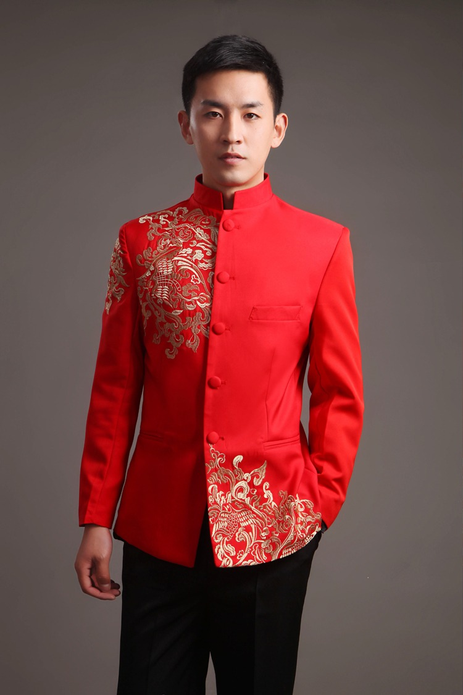
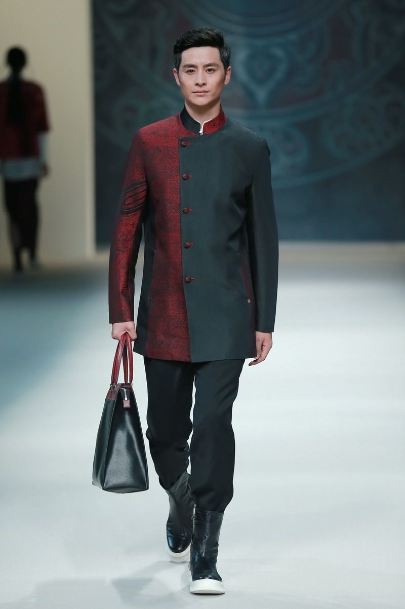
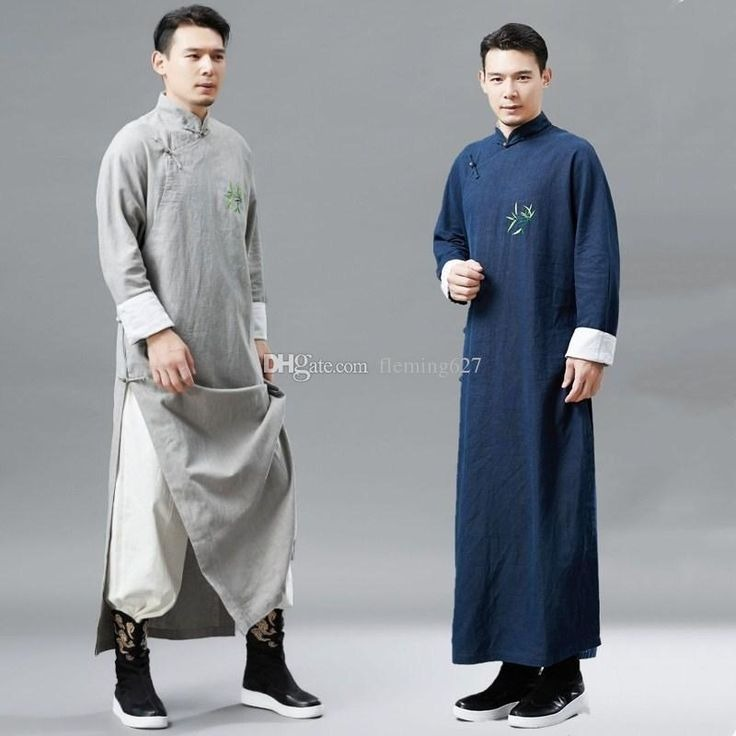

# 新中式 (New Chinese Traditional)

> **状态**: `reviewed` | **最后更新**: 2026-06-13
> **分类**: 中式 > 当代2020s > 半正式 > 社交场景 > 浪漫调性

## 📖 概述
- **发源年代**: 2018-2020
- **发源地**: 中国（上海/北京/杭州）
- **风格关键词**: 立领、盘扣、真丝、刺绣、东方剪裁、现代性、文化自信
- **一句话定义**: 将中国传统服饰元素（立领、盘扣、对襟、汉服廓形）用现代设计语言重新编码——不是穿古装，而是穿中国文化。

## 📜 历史文化

### "国潮"到"新中式"的进化
- 2018: 李宁"中国李宁"系列在纽约时装周引爆"国潮"，但主要以大量Logo和汉字为主
- 2020: "新中式"标签开始独立于"国潮"——从符号化的Logo转向更深层的剪裁和面料表达
- 2023-2024: 新中式在女装领域爆发（马面裙现象），男装紧随其后

### 与国风质感的区别
| 维度 | 国风质感 | 新中式 |
|------|---------|--------|
| 表达方式 | 含蓄、通过色板和配饰暗示 | 直接、通过剪裁和传统元素呈现 |
| 传统元素 | 暗含（色板/面料/配饰） | 明示（立领/盘扣/对襟） |
| 视觉识别 | "懂的人懂" | 一眼可见 |

## 🎨 美学特征

### 传统元素的现代转化
| 传统元素 | 现代转译 | 示例 |
|---------|---------|------|
| 立领 | 拉高领线但不僵硬 | 立领衬衫/立领夹克 |
| 盘扣 | 作为装饰或功能扣 | 盘扣衬衫/盘扣西装 |
| 对襟 | 前中开口设计 | 对襟外套/对襟衬衫 |
| 真丝/绸缎 | 保持面料但简化花纹 | 素色真丝衬衫 |
| 水墨/山水 | 印花或提花暗纹 | 山水暗纹西装 |
| 褂/袍 | 长款廓形外套 | 长袍式风衣 |

### 色板
```
核心: 玄黑、月白、靛蓝、朱红
中国传统色: 青色、鸦青、缁色、胭脂、松花
逻辑: 从中国传统色卡提取，低饱和为主
```

### 标志单品
| 单品 | 特征 |
|------|------|
| 立领衬衫 | 替代标准领衬衫 |
| 盘扣夹克 | 替代纽扣夹克 |
| 真丝/绸缎衬衫 | 暗纹提花，素色为主 |
| 对襟长外套 | 长款廓形，中式剪裁 |
| 亚麻长裤 | 宽腿设计，自然垂坠 |
| 布鞋/千层底 | 中式帆布鞋 |

## 🏷️ 代表品牌
- **Ms MIN** — 以"惜物"为理念，新中式标杆
- **Uma Wang** — 国际最知名的中国设计师之一
- **Ziggy Chen** — 将中国传统剪裁做当代转化
- **Samuel Gui Yang** — 旗袍元素融入日常
- **Peng Tai** — 中药染色+手工面料
- **Angel Chen** — 年轻化新中式，色彩更鲜艳
- **李宁 (Li-Ning)** — "中国李宁"国潮开创者
- **之禾 (ICICLE)** — 东方极简

## 👤 风格偶像
- **胡歌** — 暗色调+立领+质感配饰
- **陈坤** — 东方极简践行者
- **王嘉尔** — 将新中式带入 K-pop/国际视野
- **Uma Wang / Ziggy Chen** — 设计师本人就是风格示范

## 📈 流行趋势
- **当前状态**: 🔥 爆发增长（女装已成熟，男装正在追赶）
- **马面裙现象**: 2023-2024 年马面裙在年轻女性中爆发，为整个"新中式"打开认知
- **男装潜力**: 立领衬衫和盘扣夹克已成为可接受的日常单品

## 💡 穿搭建议
1. 从一件立领衬衫开始——这是最低成本的入场
2. 搭配日常单品（牛仔裤/直筒裤/帆布鞋）——不需要一身新中式
3. 中国传统色优先——月白/靛蓝/玄黑，不选荧光色


## 📸 风格图库

> 以下为风格代表性穿搭参考图，搜集自公开时尚媒体。


*风格穿搭参考*


*Models present creations from designer Zeng Fengfei at China's Fashion ...*


*Chinese tang suit for men cheongsam style male gown traditional long ...*
