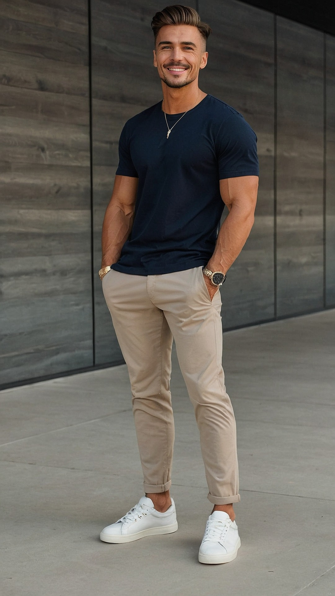
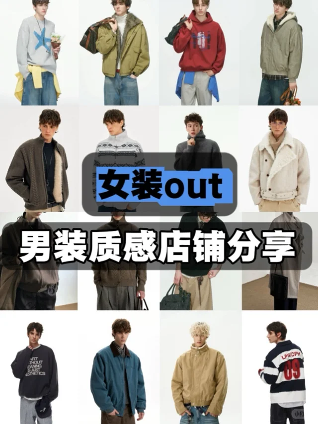
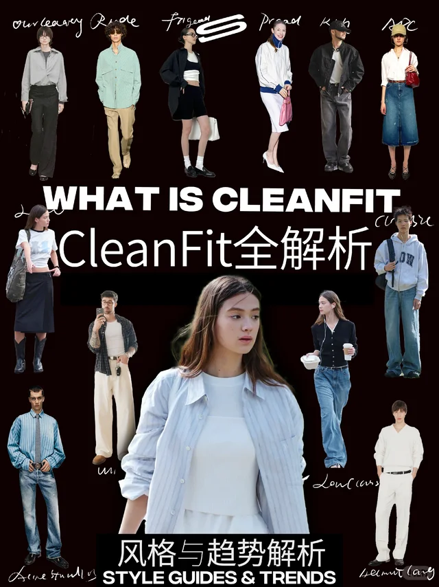
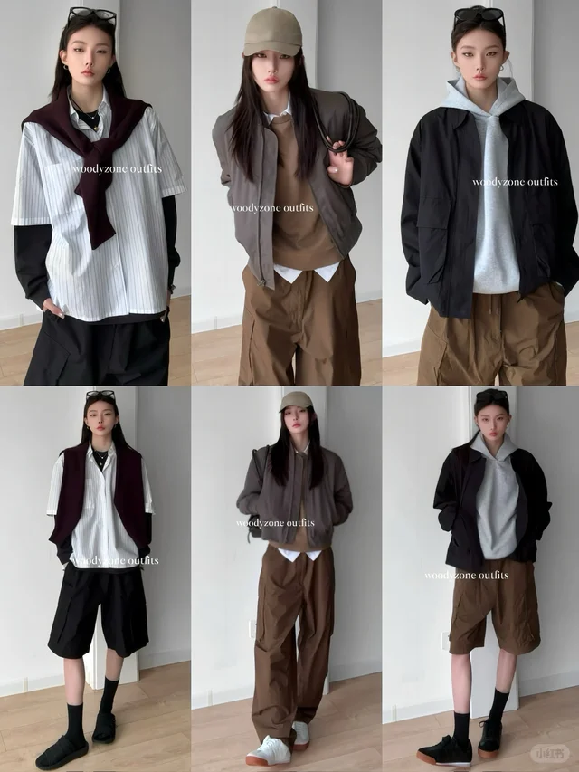
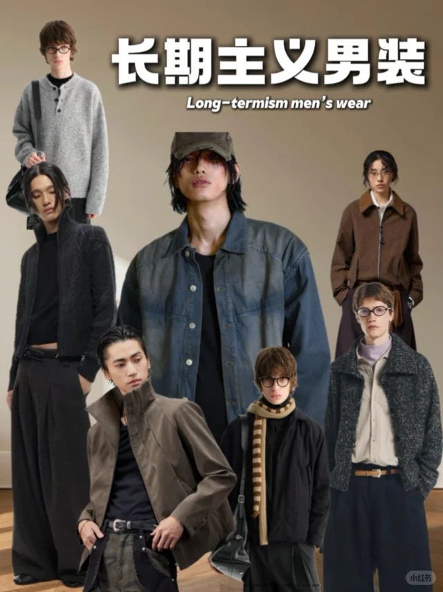
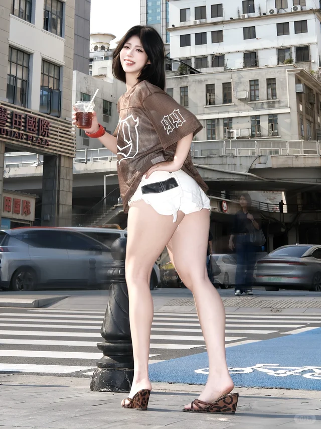
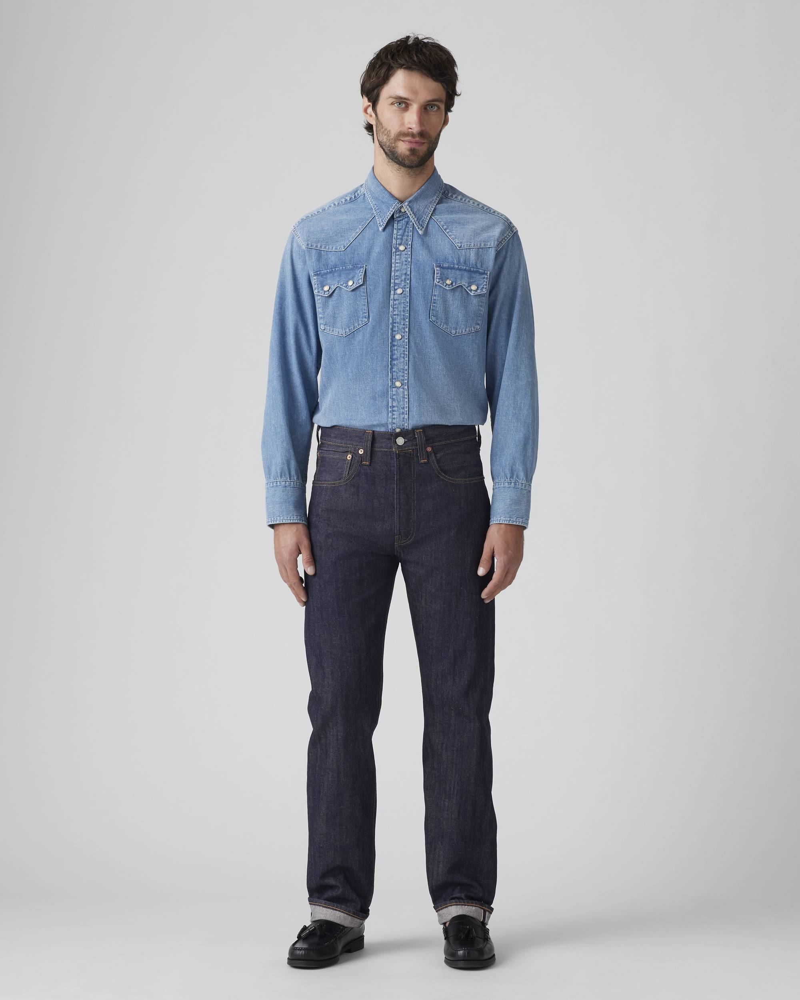
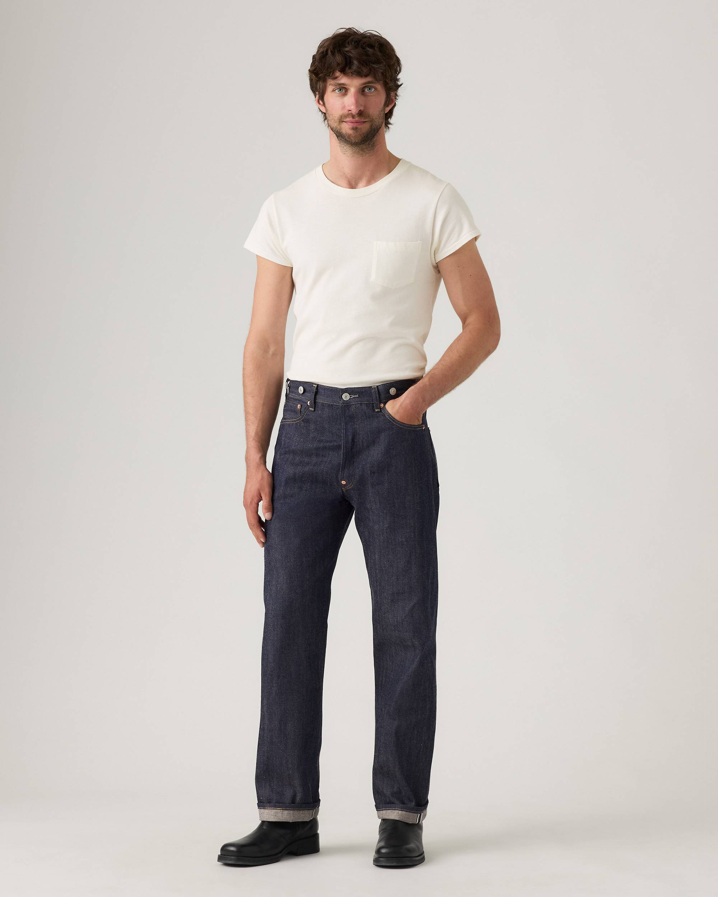
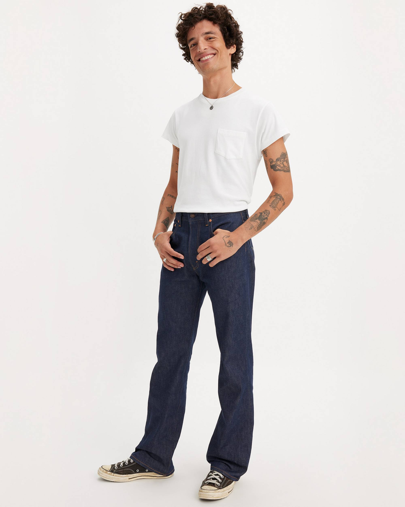

# Clean Fit

> **状态**: `reviewed` | **最后更新**: 2026-06-17
> **分类**: 当代2020s > 极简调性 > 休闲



## 📖 概述
- **发源年代**: 2021年（标签诞生于中文互联网）
- **发源地**: 中国社交平台（小红书），审美根源来自全球极简主义传统
- **风格关键词**: 干净、合身、克制、质感、低饱和、去Logo
- **一句话定义**: 极简主义在社交媒体时代的大众化落地——精准剪裁 + 克制配色 + 质感面料，把"干净"穿成最高级的时尚。

## 📜 历史文化

### 深层谱系
Clean Fit 不是凭空发明，它是极简主义美学在流媒体时代的"再包装"：

| 年代 | 节点 | 关系 |
|------|------|------|
| 1960s | 极简主义艺术运动 "Minimal Art" 兴起 | "少即是多"的美学源头 |
| 1986起 | **Helmut Lang** 创立品牌 | "极简主义之父" |
| 1990s | **Calvin Klein、Jil Sander** 崛起 | 极简设计推向主流 |
| 2010s | **Normcore** 风潮 | "故意穿得普通"的反时尚宣言 |
| 2020-2021 | **Kenijima** 带火 Vibe 风 | Clean Fit 的直接前身 |
| 2022-2023 | Clean Fit 正式破圈 | 剥离 Vibe 公式束缚，形成独立体系 |

### 关键人物
- **Kenijima (Ken Iijima)** — 美籍日裔博主，Vibe风/Clean Fit灵魂人物。个人品牌 Vujade 工装裤发售价300+美元，二级市场炒至700+
- **Kanye West** — 带火中古 Carhartt 工装夹克，为 Clean Fit 注入 Vintage 质感基因

## 🎨 美学特征

### 廓形
"合身不紧身"的精准剪裁——在紧身与 Oversized 之间取中：
- 肩线落在肩峰外侧0-1cm，微落肩可接受
- 胸围松量6-10cm，有呼吸感但不臃肿
- 裤装直筒或微阔，长度刚好盖过鞋面或九分露踝

### 色板
```
主色调: 黑白灰系 + 大地色系（米白/奶油/卡其/驼色/燕麦色）
辅色: 藏青、深蓝、灰蓝
点缀色: 军绿、橄榄绿
铁律: 全身不超过3种颜色，绝对去Logo化
```

### 标志单品
| 品类 | 单品 | 品牌示例 |
|------|------|---------|
| 上装 | 素色重磅T恤(60-80支) | Uniqlo U, COS |
| 上装 | 牛津纺衬衫 | Jil Sander, Uniqlo +J |
| 外套 | 微廓形西装外套 | Theory, COS |
| 外套 | 落肩H型大衣 | Lemaire, Arket |
| 下装 | 直筒/宽腿西装裤(垂坠感) | COS, GU |
| 下装 | 直筒/微喇牛仔裤 | Levi's 501/517 |
| 鞋履 | 纯白基础球鞋 | Nike AF1, Converse |
| 鞋履 | 德比皮鞋/乐福鞋 | Dr. Martens, GH Bass |

## 🏷️ 代表品牌

### 核心品牌
- **Jil Sander** — "极简女王"，Clean Fit 天花板
- **The Row** — Olsen 姐妹的极致低调奢华
- **Lemaire** — Christophe Lemaire 的慵懒法式极简
- **COS** — H&M 高端线，建筑感剪裁，500-2000元
- **Arket** — 比 COS 更注重功能性与北欧复古感
- **Theory** — 都市白领首选，兼顾职场与松弛感
- **Uniqlo U** — Lemaire 团队操刀，200-800元最高性价比
- **Vujade** — Kenijima 个人品牌，Clean Fit 原生品牌

### 国内平价替代
- **Slubu** — "新基础款"，100-400元
- **OPICLOTH / Simple Project** — 立体剪裁+高阶灰色调，200-600元
- **BOHRHOO** — 直接对标COS/Arket经典款，150-400元

## 👤 风格偶像

| 人物 | 身份 | 风格贡献 |
|------|------|---------|
| **Kenijima** | Vibe/Clean Fit 开创者 | 定义"干净+合身"的美学公式 |
| **Kanye West** | 音乐人/设计师 | 带火中古 Carhartt 夹克 |
| **BTS RM** | BTS 队长 | 米兰时装周极简搭配"Less is More完美示范" |
| **白敬亭** | 演员 | 白色条纹衬衫+纯白T+浅色牛仔的清新简约 |
| **Kyron Warrick** | 时尚博主 | "Clean Fit大神"，风格更精致都市 |

## 🔗 关联风格
- **父风格**: 极简主义
- **前身**: Vibe 风 → Normcore
- **平行风格**: 韩系极简、日系 City Boy、老钱风
- **对立风格**: 街头潮流、Maximalism、Dirty Fit

### Clean Fit vs City Boy
| 维度 | Clean Fit | City Boy |
|------|-----------|----------|
| 核心词 | 俐落、干净、高级感 | 松弛、少年气、生活态度 |
| 廓形 | **合身利落**，强调剪裁与比例 | **宽松 Oversize**，落肩3-5cm |
| 层次 | 不追求刻意叠穿 | **强调叠穿**和混搭 |
| 风格来源 | Vibe风延伸，极简主义门下 | POPEYE杂志，长谷川美学 |
| 穿搭难度 | 较高，版型/面料要求高 | 较低，基础款混搭入门 |

## 📈 流行趋势
- **当前状态**: 🟡 "退标签不退逻辑"——不再是潮流前沿标签，但已成为男装底层共识
- **流行区域**: 全球，尤其亚洲城市
- **发展方向**: 在 Clean Fit 基础框架上叠加个性化表达（浪漫元素、文化符号、材质对比）→ "Refined Expressiveness"
- **反趋势**: Muscle Fit（更贴身突显身体线条）、Dirty Fit（刻意做旧）

## 💡 穿搭建议
### 适合体型
- ✅ 几乎所有体型——版型藏拙能力强
- ✅ 对亚洲骨架友好度极高

### 入门建议
1. 投资三件核心单品：一件重磅白T + 一条垂感直筒西裤 + 一双纯白球鞋
2. 先掌握同色系搭配，再尝试跨色系
3. 面料 > 品牌：选高支数棉、精纺羊毛，不选软塌材质
4. 全身不超过3个颜色

## 📕 小红书社区经验（2026-06-17 双平台采集）

> 🔄 本次更新：采集小红书 Top 5 + Instagram Top 5 Clean Fit 穿搭内容，按热度排序。

### 🥇 Silencetilldeat — 《男装女穿|2026男装这么平价又好穿！？》
> ❤️ 45627  ⭐ 22000  💬 2800  🔄 14000 | [原文](https://www.xiaohongshu.com/explore/69703ecb000000000c0365b4)



**核心观点**: Clean Fit 不分性别——宽松但不邋遢、简约但不无聊。女穿男装的效果反而证明了 Clean Fit 廓形的普适性。

**经验要点**:
- 🥇 Clean Fit 的"干净"不是指颜色少，而是**廓形利落、不拖泥带水**
- 核心单品：重磅纯色T恤（290g+）、直筒/微阔腿牛仔裤、Vintage质感卫衣、复古板鞋
- 配色公式：**70%中性色 + 20%大地色 + 10%点缀色**
- 关键细节：裤脚刚好盖住鞋面、T恤下摆刚好过腰线、外套肩线刚好

### 🥈 SENSTREET — 《风格解析 |一篇看懂Cleanfit穿搭与造型灵感》
> ❤️ 43313  ⭐ 19000  💬 1500  🔄 11000 | [原文](https://www.xiaohongshu.com/explore/682304e8000000002301163e)



**核心观点**: Clean Fit 不是"穿基本款"，而是**"用基本款穿出高级感"**——两者的区别在于面料、版型、配色三个维度的把控力。

**经验要点**:
- Clean Fit ≠ 极简主义：可以有印花、可以有色彩，但必须"有呼吸感"
- 版型是第一生产力：**落肩 + 微宽松 + 衣长适中**是Clean Fit T恤的黄金三角
- 面料克重是关键门槛：低于250g的T恤容易透、皱、没型，290g+是入门线
- 韩国博主的 Clean Fit 偏"精致休闲"，日本博主偏"松弛Vintage"

### 🥉 woodyzone — 《随性clean fit☕休闲帅气高级感》
> ❤️ 35356  ⭐ 15000  💬 1800  🔄 8900 | [原文](https://www.xiaohongshu.com/explore/67ac3cfa0000000018018335)



**核心观点**: Clean Fit 的"高级感"来自面料质感和配色克制——同一套搭配换个颜色可能判若两人。

**经验要点**:
- 同色系叠穿是 Clean Fit 最安全的进阶技巧：深灰+浅灰+白、藏青+天蓝+米白
- 避免纯黑+纯白的高对比（过于"公式化"），更推荐**灰度过渡**
- 帽子是 Clean Fit 最高频的配饰：棒球帽（弯檐）、针织冷帽、渔夫帽
- 咖啡厅/书店/街拍是 Clean Fit 最经典的展示场景

### ④ Silencetilldeat — 《男装女穿|看起来很"贵"的男装店铺分享》
> ❤️ 19125  ⭐ 8500  💬 920  🔄 5200 | [原文](https://www.xiaohongshu.com/explore/697c1f17000000000b011c44)



**经验要点**:
- Clean Fit 高性价比品牌推荐：COS、Arket、Uniqlo U、GU、NOTHOMME
- 看起来很"贵"的核心是**面料+版型**：重磅棉、羊毛混纺、灯芯绒
- 投资优先级：外套 > 鞋 > 下装 > 内搭——外套和鞋决定了整体档次
- Vintage Levi's 501 + 重磅白T + New Balance 990 = 最经典Clean Fit入门公式

### ⑤ 不想p — 《快来种草穿搭好物吧～》
> ❤️ 14826  ⭐ 6200  💬 780  🔄 3800 | [原文](https://www.xiaohongshu.com/explore/69ea28880000000019032403)



**经验要点**:
- Clean Fit 好物种草聚焦：New Balance 990v6、Levi's 501、Uniqlo U 宽腿裤、COS 羊毛针织
- 配饰极简：一块简约手表 + 一条细链/皮绳 = 刚好
- 包品推荐：帆布托特包 / 皮质邮差包 / 尼龙腰包，颜色以黑/棕/米为佳
- **"少即是多"**是Clean Fit的终极哲学——每件单品都要能讲出"为什么留着它"

### 📊 小红书社区共识总结

| 维度 | 社区共识 |
|------|---------|
| **核心精神** | "用基本款穿出高级感"——面料、版型、配色的三重把控 |
| **黄金公式** | 重磅纯色T + 直筒/微阔牛仔裤 + 复古板鞋/跑鞋 |
| **入门门槛** | 低（优衣库U系列即可入门），但精进需要对面料和版型的理解 |
| **核心单品** | 290g+重磅T恤、直筒牛仔裤、New Balance 990系、棒球帽 |
| **配色法则** | 70%中性色 + 20%大地色 + 10%点缀色，灰度过渡优于黑白高对比 |
| **入门推荐** | Vintage Levi's 501 + 重磅白T + New Balance 990 |
| **品牌梯队** | COS/Arket > Uniqlo U > GU > 国潮基础款 |

---

## 📸 Instagram 社区经验（2026-06-17 采集）

> 以下内容通过 DuckDuckGo 搜索 Instagram 公开内容整理。
> ⚠️ Instagram 需登录才能查看帖子详情，以下链接在浏览器中登录后可访问。

### 🥇 Ken Iijima (@kenijima) — Clean Fit / Vibe 风教父
> 🔗 [Profile](https://www.instagram.com/kenijima/)（需登录查看）



**看点**: 日裔博主 Ken Iijima 被公认为 Clean Fit / Vibe 风格的灵魂人物。他的标志性造型——Vintage Levi's + 重磅白T + 弯檐棒球帽——启发了整整一代亚洲男性。2026年他的影响力虽然有所降温，但**"Ken式穿搭"已经成为Clean Fit的基础语言**。**标签**: #kenijima #cleanfit #vintagelevis #vibestyle

### 🥈 Uniform Display (@uniformdisplay) — The Art of Minimal Repetition
> 🔗 [Profile](https://www.instagram.com/uniformdisplay/)（需登录查看）



**标签**: #uniformdisplay #minimalstyle #dailyuniform #capsul wardrobe
**看点**: 专注"制服化穿搭"——用少量高质量单品反复组合。证明了 Clean Fit 的最高境界不是"每天不同"，而是**"每天一样但每次都有细微变化"**。平铺摄影风格极具辨识度。

### 🥉 The Pacman (@thepacman82) — Refined Minimalism
> 🔗 [Profile](https://www.instagram.com/thepacman82/)（需登录查看）



**标签**: #thepacman82 #refinedminimalism #qualitybasics #menswearminimal
**看点**: 德国博主 Pacman 将北欧极简与 Clean Fit 融合，展示"欧洲版的Clean Fit"——更注重面料质感和剪裁精度，配色更偏冷灰色调。对偏瘦体型极有参考价值。

### ④ Minimal House (@minimalhouse1) — Lifestyle Minimalism
> 🔗 [Profile](https://www.instagram.com/minimalhouse1/)（需登录查看）

**标签**: #minimalhouse #lifestyleminimalism #cleanliving #menwithclass
**看点**: 不仅是穿搭，更是 Clean Fit 生活方式的全面展示——居家、咖啡、阅读、出行。证明**Clean Fit 不只是一种穿搭风格，更是一种"去芜存菁"的生活态度**。

### ⑤ Outfit Grid (@outfitgrid) — Flat Lay Inspiration
> 🔗 [Profile](https://www.instagram.com/outfitgrid/)（需登录查看）

**标签**: #outfitgrid #flatlaystyle #dailyoutfit #capsulewardrobe
**看点**: 将穿搭拆解为"平铺网格"——上衣、下装、鞋、配饰各占一格。这种呈现方式天然契合 Clean Fit 的"单品逻辑"：**每件单品独立看都有质感，组合起来才更高级**。

### 📊 Instagram 社区共识

| 维度 | Instagram 观察 |
|------|---------------|
| **活跃地区** | 日本、韩国、德国、美国（加州/纽约） |
| **热门标签** | #cleanfit #vibestyle #minimalstyle #capsulewardrobe #dailyuniform |
| **关联品牌** | Levi's Vintage, New Balance, COS, Arket, Uniqlo U |
| **内容形式** | 对镜自拍 + 平铺穿搭（Flat Lay）+ 细节特写 |
| **2025-26趋势** | 从"Ken式教条"中解放，更多个人表达的Clean Fit |
| **⚠️ 访问限制** | 所有帖子需登录 Instagram 才能查看详情 |

---|
| 核心词 | 俐落、干净、高级感 | 松弛、少年气、生活态度 |
| 廓形 | **合身利落**，强调剪裁与比例 | **宽松 Oversize**，落肩3-5cm |
| 层次 | 不追求刻意叠穿 | **强调叠穿**和混搭 |
| 风格来源 | Vibe风延伸，极简主义门下 | POPEYE杂志，长谷川美学 |
| 穿搭难度 | 较高，版型/面料要求高 | 较低，基础款混搭入门 |

## 📈 流行趋势
- **当前状态**: 🟡 "退标签不退逻辑"——不再是潮流前沿标签，但已成为男装底层共识
- **流行区域**: 全球，尤其亚洲城市
- **发展方向**: 在 Clean Fit 基础框架上叠加个性化表达（浪漫元素、文化符号、材质对比）→ "Refined Expressiveness"
- **反趋势**: Muscle Fit（更贴身突显身体线条）、Dirty Fit（刻意做旧）

## 💡 穿搭建议
### 适合体型
- ✅ 几乎所有体型——版型藏拙能力强
- ✅ 对亚洲骨架友好度极高

### 入门建议
1. 投资三件核心单品：一件重磅白T + 一条垂感直筒西裤 + 一双纯白球鞋
2. 先掌握同色系搭配，再尝试跨色系
3. 面料 > 品牌：选高支数棉、精纺羊毛，不选软塌材质
4. 全身不超过3个颜色

