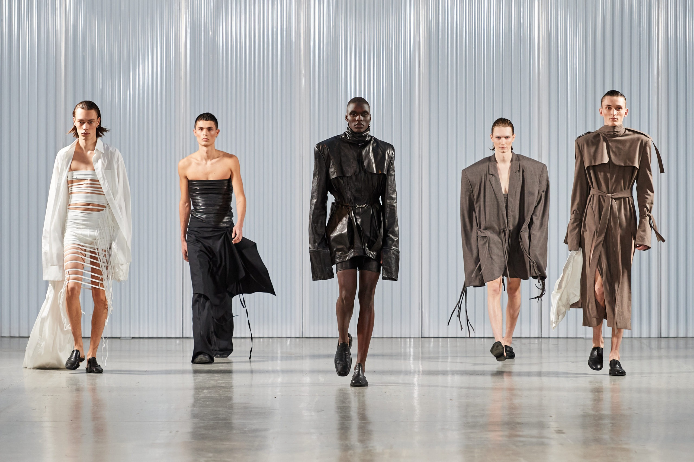
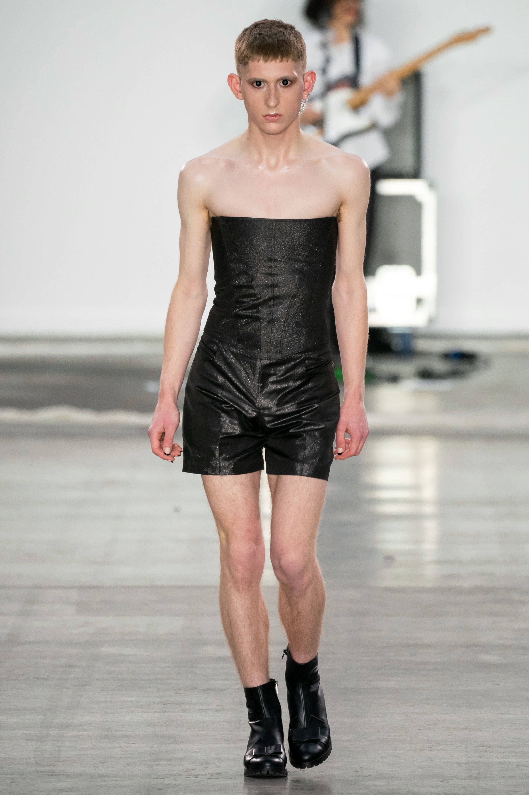
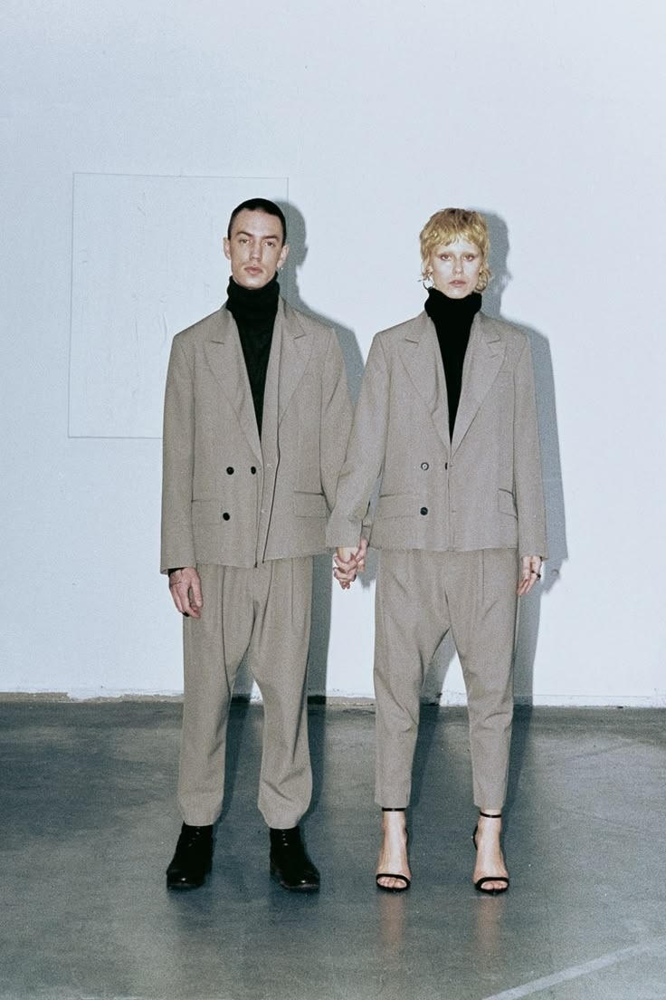

# 无性别穿搭 (Genderless Fashion)

> **状态**: `reviewed` | **最后更新**: 2026-06-13
> **分类**: 北欧 > 当代2020s > 休闲 > 前卫调性

## 📖 概述
- **发源年代**: 2015-2020
- **发源地**: 全球多点（东京/伦敦/哥本哈根/纽约）
- **风格关键词**: 性别流动、廓形为先、去标签化、解构传统、自我表达
- **一句话定义**: 衣服没有性别——以廓形和舒适度而非男女标签来选择穿搭。

## 📜 历史文化

### 先驱者
- **David Bowie** (1970s) — Ziggy Stardust 时期挑战性别二元
- **Kurt Cobain** (1990s) — 穿裙子演出，Grunge 的性别模糊
- **Jean Paul Gaultier** (1985) — 男裙系列在当时的巨大争议
- **Rad Hourani** (2007) — 第一个在巴黎高定周展示无性别系列的设计师
- **Jaden Smith** (2016) — 穿裙子为 Louis Vuitton 女装拍广告
- **Harry Styles** (2020) — Vogue 封面穿裙子，将无性别穿搭推向主流

### K-pop 推动
BTS、GOT7、Stray Kids 等 K-pop 偶像在舞台上穿束带、choker、裙子、蕾丝，让无性别穿搭在亚洲男性中开始被接受。G-Dragon 是亚洲性别流动穿搭的最重要先驱。

## 🎨 美学特征
- **核心逻辑**: 不是"男穿女装"，而是**忽略性别标签**，只关注廓形/面料/颜色是否适合自己
- **廓形**: 通常以 Oversized 和垂坠廓形为主，避免过于贴身的性别化剪裁
- **色板**: 无固定色板——这是最大特点
- **标志元素**: 裙子/裙裤、珍珠项链、束带、蕾丝、透视面料、宽松垂坠单品

## 🏷️ 代表品牌
- **Telfar** — "Not for you — for everyone" 的口号定义了无性别时尚
- **Rad Hourani** — 无性别高级定制的先驱
- **Palomo Spain** — 西班牙品牌，男性穿蕾丝和荷叶边
- **Ludovic de Saint Sernin** — 性别流动的性感
- **Willy Chavarria** — 拉丁裔社区的无性别表达
- **Aries** — 伦敦品牌，街头+无性别
- **Namilia** — 柏林品牌，激进的无性别宣言

## 👤 风格偶像
- **Harry Styles** — 将无性别穿搭带入主流
- **Jaden Smith** — LV女装广告打破界限
- **Lil Nas X** — 从牛仔帽到闪片礼服，无惧任何标签
- **G-Dragon** — 亚洲性别流动穿搭第一人
- **Ezra Miller** — 红毯无性别造型

## 📈 流行趋势
- Gen Z 和 Gen Alpha 对性别标签的态度远低于前代，无性别穿搭将持续增长
- 品牌层面，"Genderless" 或 "Agender" 标签正在替代传统的"Men/Women"分类
- 2026: Gucci 新创意总监 Demna 推动性别流动剪裁

## 💡 穿搭建议
1. 从配饰开始——一条珍珠项链或丝巾是最低门槛的尝试
2. Oversized 廓形是无性别穿搭的安全区
3. 关注面料——垂坠感面料比性别标签更重要

## 📸 风格图库

> 以下为风格代表性穿搭参考图，搜集自公开时尚媒体。

*风格穿搭参考*

*Art School Spring 2020 Menswear Fashion Show - Vogue | Genderless ...*

*Adnym's Progressive, Genderless Designs Meet Your #WFH Needs ...*
