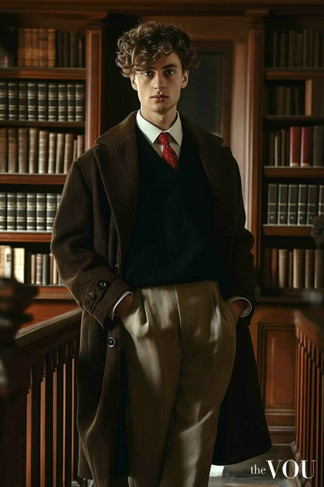
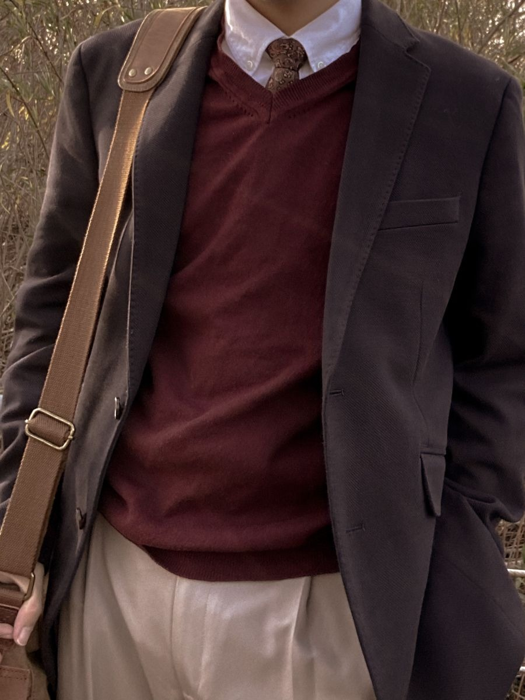
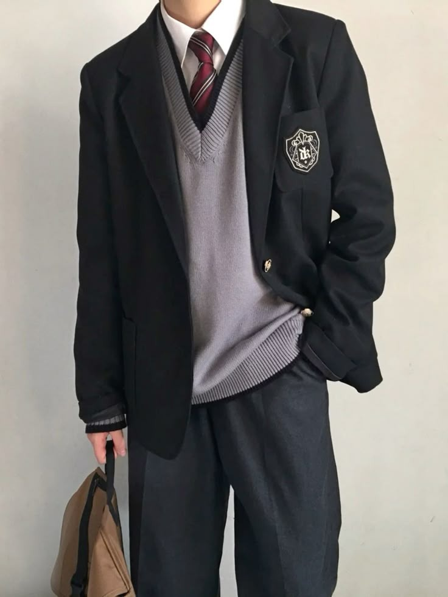

# 叛逆学长风 (Detention-Core)
> **状态**: `reviewed` | **最后更新**: 2026-06-13

## 📖 概述
Detention-Core（叛逆学长风）是 2024–2025 年男装界最有辨识度的新语法之一——它把私立学校的预科生制服**故意穿乱**。领带松垮歪斜、衬衫一半塞进裤子一半拖在外面、毛衣像刚从肩上滑下来又被随手捞住。它介于 Ivy League 的精英教养和青春期的叛逆冲动之间，仿佛一个刚从留堂教室（Detention）走出来、毫不在乎的男孩。Celine 和 Boss 等品牌将其推上 T 台，Miu Miu SS24 的「凌乱船鞋」为这一美学定下了基调——preppy，但 undone。

## 📜 历史文化
- **根源——Ivy League / Preppy**：美国东北部常春藤盟校的校服文化是其 DNA 源头——牛津衬衫、斜纹领带、绞花毛衣、乐福鞋。但 Detention-Core 不再追求整洁，而是刻意破坏这整套体系。
- **2022–2023 预科风复兴**：Tyler, the Creator、Aimé Leon Dore 等推动的新 preppy 运动让宽松版型的预科服饰回到主流视野，为 Detention-Core 铺垫了材料。
- **2024 关键催化剂**：
  - **Miu Miu SS24**——船鞋以「松弛、凌乱、natural」的方式呈现，定义了一种「我刚起床但我穿的是 preppy 品牌」的心态。
  - **Jacob Elordi 在《Saltburn》**——浸透了怀旧而颠覆的预科生气质，将「坏小子在贵族校园」的形象钉入流行文化。
- **2024–2025 品牌推动**：**Celine Homme** 和 **Boss** 相继在男装系列中使用宽松剪裁的衬衫+领带+肩披毛衣的松垮组合，将 Detention-Core 从亚文化梗推入高级时装话语。

## 🎨 美学特征
| 类别 | 核心单品 |
|------|---------|
| **衬衫** | 牛津衬衫或细条纹衬衫——**关键在穿着方式**：至少两个扣子不系、下摆一半塞一半不塞、领子翻起或歪斜 |
| **领带** | 细窄斜纹学院领带或针织领带——**关键**：松松垮垮地系在打开两个扣子的领口上，或者干脆只挂在脖子上不系 |
| **毛衣** | 绞花针织毛衣或 V 领开衫——**关键技法**：披在肩上（袖口在胸前打结），或者直接套在外面但袖管过长 |
| **外套** | 宽松海军蓝/灰色西装外套（像从失物招领箱里借来的）、棒球夹克、粗花呢夹克（Tweed） |
| **裤装** | 宽腿斜纹裤、宽松卡其裤、褪色直筒牛仔——绝不修身 |
| **鞋履** | 乐福鞋（Penny Loafer）、船鞋（Boat Shoe——切勿系紧）、Paraboots、帆布鞋 |
| **配饰** | 复古腕表、松垮的帆布包（替代书包）、笨拙的耳机线 |

**廓形**：全身宽松、箱型、louche（慵懒）。任何紧身都会破坏语境。

**色调**：海军蓝、灰色、米白、卡其、森林绿、酒红。学院预科的色板，但整体偏脏、旧、褪色。

**与经典 Preppy 的核心对比**：
| 维度 | 经典 Preppy | Detention-Core |
|------|------------|----------------|
| 衬衫 | 整齐扣好、塞进裤子 | 半敞开、半塞半露 |
| 领带 | 整齐温莎结 | 松散歪斜、挂在开口上 |
| 毛衣 | 端正穿着或整齐披肩 | 随意滑落、潦草打结 |
| 廓形 | 修身 | Boxy、宽大、慵懒 |
| 氛围 | 乡村俱乐部 | 留堂教室 |

## 🏷️ 代表品牌
| 品牌 | 角色 |
|------|------|
| **Celine Homme** | 2024–2025 推动 Detention-Core 的高级时装核心力量，松垮学院剪裁的标杆 |
| **Boss** | 2024–2025 系列中引入刻意凌乱的 preppy 元素——领带松散+肩披毛衣 |
| **Miu Miu** | SS24 船鞋造型被认为点燃了这一美学的引爆点 |
| **JW Anderson / Loewe** | 大色块、宽松廓形，V 领针织背心和船鞋的松垮呈现 |
| **Aimé Leon Dore** | 当代 preppy 复兴的基石，提供 Detention-Core 的基础物料（宽松衬衫、绞花毛衣） |
| **Drake's** | 英伦软剪裁的优雅版——如果你想把 Detention-Core 做得「更像正装而非玩笑」，从这里开始 |
| **Aaron Levine** | 前 Abercrombie 设计师，自创品牌以宽松比例复兴 preppy，是 Detention-Core 轮廓的重要输出者 |
| **Wales Bonner** | 将学术/学院美学与跨文化叙事融合，更高维度的学院反叛 |

## 👤 风格偶像
| 偶像 | 标志性造型 |
|------|-----------|
| **Jacob Elordi** | 《Saltburn》中的颠覆性预科生形象——Detention-Core 在银幕上的文化锚定点 |
| **Tyler, the Creator** | 宽松卡其裤 + 乐福鞋 + 鲜艳毛衣 + 松弛态度——新 preppy 的嘻哈/滑板跨界者 |
| **Timothée Chalamet** | 红毯上的「解构正装」——衬衫敞领+松散剪裁，Detention-Core 的奢侈版本 |
| **Aaron Levine** | 自身即是最佳广告——宽松卷边裤 + 衬衫 + 随意乐福鞋，中年男性的 Detention-Core 范本 |

## 🔗 关联风格
- **Preppy / Ivy League** — Detention-Core 的母体风格
- **Dark Academia** — 共享学院浪漫，但 Detention-Core 更青春期叛逆而非哥特文学
- **Sleaze-Core** — 共享「故意不整洁」精神，Sleaze-Core 来自 70s 坏小子，Detention-Core 来自校园
- **Normcore** — 共享「不费力」表面，但 Detention-Core 穿衣需要大量的「故意」才达到这种凌乱

## 📈 流行趋势
- 2024 年 Miu Miu SS24 船鞋引爆社交媒体，「凌乱 preppy」成为 TikTok 和 Instagram 的热门关键词
- Celine、Boss 等品牌相继推出「松散学院」造型，将该趋势固化为高级时装的正当命题
- 「Half-tuck」（半塞衬衫）和「messy tie」（凌乱领带）的搜索量在 Pinterest 上显著上升
- Gen Z 尤其欢迎这一美学——它提供了「穿得像精英，但态度像局外人」的张力，符合这一代人对体制的矛盾态度
- 2025 年持续扩散：更多快时尚品牌（Zara、Mango Man）推出「loose preppy」胶囊系列

## 💡 穿搭建议
1. **入门公式**：细条纹牛津衬衫（上面两颗扣子不系） + 细窄领带松松挂在脖子上 + 宽腿卡其裤 + 乐福鞋
2. **毛衣关键技法**：把一件轻薄的绞花毛衣披在肩上，袖子在锁骨前松松系一个结——不要整齐，要「好像随时会滑下去」
3. **半塞法则**：衬衫前面塞进裤子，后面和侧面全部露在外面——这是 Detention-Core 区分于正常穿着的核心视觉符号
4. **选对廓形**：裤子一定要宽，衬衫一定要大一号，所有合身的选择都会让你看起来像一个真的在遵守校规的好学生
5. **态度比衣服更重要**：发型略凌乱，双手插袋，眼神有点睥睨——你刚从留堂教室走出来，不是从教堂走出来

## 📸 风格图库

> 以下为风格代表性穿搭参考图，搜集自公开时尚媒体。

*风格穿搭参考*

*dark academia | Academia aesthetic outfit men, Mens outfits, Academia ...*

*😭🤚🏽1 | School uniform outfits, Boys school uniform, School outfits*
