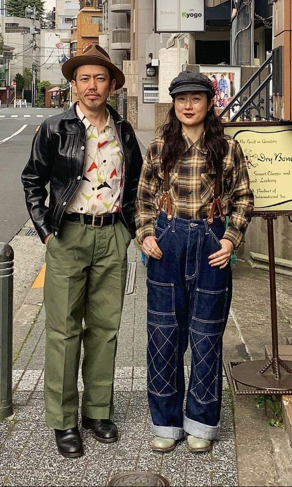
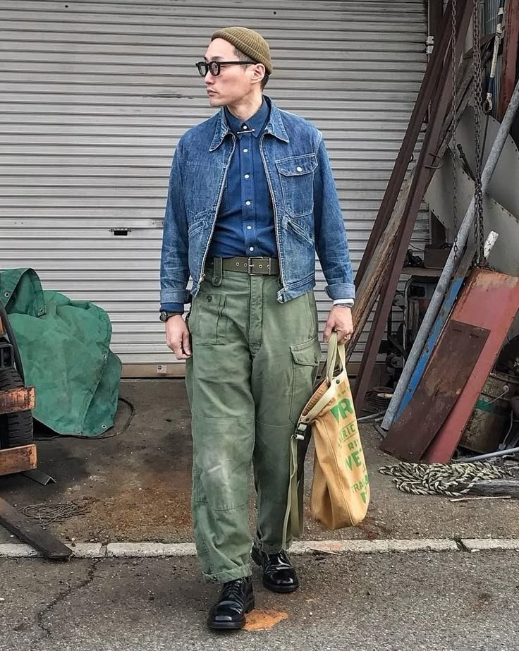
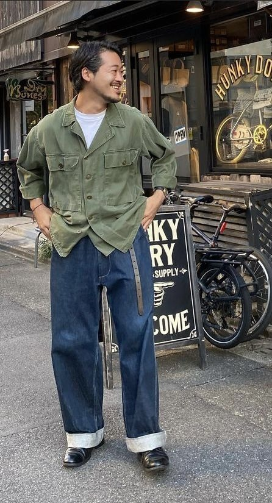

# 日系阿美咔叽 (Japanese Amekaji)

> **状态**: `reviewed` | **最后更新**: 2026-06-13 | **趋势**: 经典风格
> **分类**: 日系 > 1990s复古 > 休闲 > 复古调性

## 📖 概述
- **发源年代**: 1980s-1990s
- **发源地**: 日本
- **风格关键词**: 美式复古、日本解构、牛仔、工装、军装、机车、匠人精神
- **一句话定义**: 日本人将美式休闲服饰研究到极致后进行的"日式反向输出"——比美国人更懂美式风格。

## 📜 历史文化

### Ametora 现象
"Ametora"（American Traditional 的日式缩写）是文化史学家 **W. David Marx** 在 2015 年同名著作中系统阐述的现象：

> "日本人痴迷地研究、保存并最终完善了美国人自己已经抛弃的美式服装传统。"

### 起源：战后日本的美式崇拜
1. **1945-1952 占领期**: 美国大兵的休闲穿着让日本年轻人第一次大规模接触美式服装
2. **1960s**: 《POPEYE》杂志的前身《made in USA》专门介绍美式时尚，带回 Levi's、Converse
3. **1970s-80s**: 日本商人飞去美国扫荡 Vintage 店铺，成箱运回东京。日本成为全球最大的美式古着市场
4. **1990s**: 日本品牌不再满足于贩卖原版，开始自己生产"更好的美式服装"

### "比美国人更懂美式"的五个品类
日本在以下五个领域走到了美国前面：

| 品类 | 美国原版 | 日本进化版 |
|------|---------|-----------|
| **牛仔** | Levi's 批量生产 | 大阪五虎（Evisu/Fullcount等）使用老式梭织机，比 Levi's 更"正宗" |
| **工装** | Carhartt 功能性工作服 | Engineered Garments 将工装解构为时尚单品 |
| **军装** | 美军制服 | WTAPS/Neighborhood 将军装提炼为街头美学 |
| **机车** | Schott NYC 皮夹克 | The Real McCoy's 的复刻精度让 Schott 汗颜 |
| **Ivy** | Brooks Brothers | 日本品牌将 Ivy Style 研究到美国原生品牌无法企及的深度 |

### 《TAKE IVY》(1965)
摄影师林田昭庆（Teruyoshi Hayashida）拍摄的《TAKE IVY》写真集记录了 1960s 美国常春藤校园穿搭。这本书在日本被奉为"圣经"，但在美国几乎无人知晓——直到2010年英文版出版，美国人才发现日本人已经替他们保存了 Ivy Style 的全部记忆。

## 🎨 美学特征

### 廓形
- 从"忠实复刻"到"日式解构"
- 传统阿美咔叽: 合身或微宽松，忠实于原版剪裁
- 当代进化: 宽松廓形，不对称设计，功能口袋重新配置

### 色板
```
核心: 靛蓝、橄榄绿、卡其、黑、灰
工装色: 棕色、沙色、军绿
牛仔蓝: 从原牛深靛到水洗浅蓝
逻辑: 完全从美式传统色板中提取
```

### 面料
- **Selvedge Denim (赤耳牛仔)** — 老式梭织机生产，织边有红色/白色线
- **Hickory Stripe** — 铁路工装条纹布
- **Jungle Cloth** — 美军热带作战服面料
- **Horsehide** — 马皮，日本机车夹克的顶级材质

### 标志单品
| 单品 | 日本代表品牌 | 美国原版对照 |
|------|------------|------------|
| 赤耳原牛 | Momotaro, Samurai | Levi's Vintage Clothing |
| 工装夹克 | Engineered Garments | Carhartt |
| 军装Parka | WTAPS, Buzz Rickson's | 美军M-51/M-65 |
| 机车皮夹克 | The Real McCoy's | Schott NYC |
| 字母校队夹克 | TOYO/Houston | Golden Bear |
| 帆布鞋 | MoonStar, Shoes Like Pottery | Converse |
| 渔夫毛衣 | Inis Meáin (日本分销版) | LL Bean |

## 🏷️ 代表品牌

### 大阪五虎 (Osaka Five)
日本复刻牛仔的顶峰：
- **Evisu** — 山根英彦创立，海鸥袋花是标志
- **Fullcount** — 辻田幹晴创立，津巴布韦棉
- **Studio D'Artisan** — 小猪 Logo，最早做复刻牛的品牌之一
- **Denime** — 林芳亨创立，被 Warehouse 收购
- **Warehouse** — 盐谷兄弟创立，追求"究极的复刻"

### 当代阿美咔叽
- **The Real McCoy's** — 从皮夹克到T恤，复刻精度的最高标准
- **Engineered Garments** （铃木大器） — 美式工装的日式解构重构
- **WTAPS** （西山彻） — 军事工装柔化为街头语言
- **Neighborhood** （泷泽伸介） — 机车文化的日式暗黑表达
- **Kapital** — 冈山品牌，牛仔+民俗+嬉皮的狂野融合
- **Visvim** （中村世纪） — 阿美咔叽的"奢侈化"
- **OrSlow** — 児島品牌，教科书式美式基础款
- **Buzz Rickson's** — 东洋企业旗下，二战美军飞行夹克复刻权威

## 👤 风格偶像

| 人物 | 身份 | 说明 |
|------|------|------|
| **木下孝浩** | 《POPEYE》前主编 | Ametora 文化的编年史者和推手 |
| **西山彻** | WTAPS/DESCENDANT 创始人 | 军事工装如何成为街头语言的教科书 |
| **铃木大器** | Engineered Garments 创始人 | 美式工装解构的最高水准 |
| **W. David Marx** | 文化史学家 | 《Ametora》一书系统阐述了整个现象 |
| **John Mayer** | 音乐人 | Visvim 狂热收藏者，日本阿美咔叽的西方代言人 |

## 🔗 关联风格
- **父风格**: 美式工装、美式常春藤、美军军装
- **平行风格**: City Boy（Ametora 的《POPEYE》系分支）、街头潮流（WTAPS/Neighborhood 分支）
- **对立风格**: 意式 Sprezzatura、韩系极简

## 📈 流行趋势
- **当前状态**: 🔥 持续全球输出——日本已将 Ametora 变成文化出口产品
- **原牛市场**: 稳定但小众，大阪五虎在日本以外的知名度持续增长
- **Kapital 效应**: Kanye West、A$AP Rocky 等西方明星频繁穿着 Kapital，将阿美咔叽推向全球

## 💡 穿搭建议
### 适合体型
- ✅ 偏瘦/中等体型 — 日式剪裁对亚洲骨架友好
- ✅ 工装夹克结构感有助于增加肩宽

### 入门三步
1. 从一条日本赤耳原牛开始（Momotaro 或 Fullcount）——感受老式梭织机的质感
2. 搭配一件工装夹克（OrSlow 或 Engineered Garments）或军装 Parka
3. 一双日本产帆布鞋（MoonStar 或 Shoes Like Pottery）收尾


## 📸 风格图库

> 以下为风格代表性穿搭参考图，搜集自公开时尚媒体。


*风格穿搭参考*


*Pin by Daniela Bueno on Amekaji Inspiration in 2025 | Americana fashion ...*


*20+ Japanese Fashion Men Have to Wear This Year*
