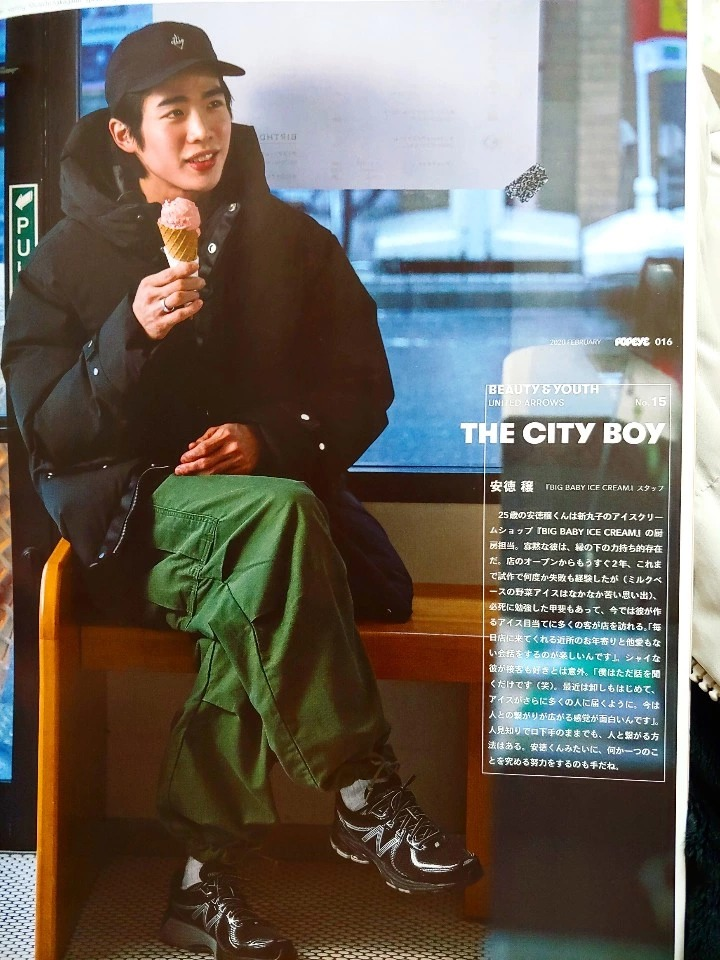
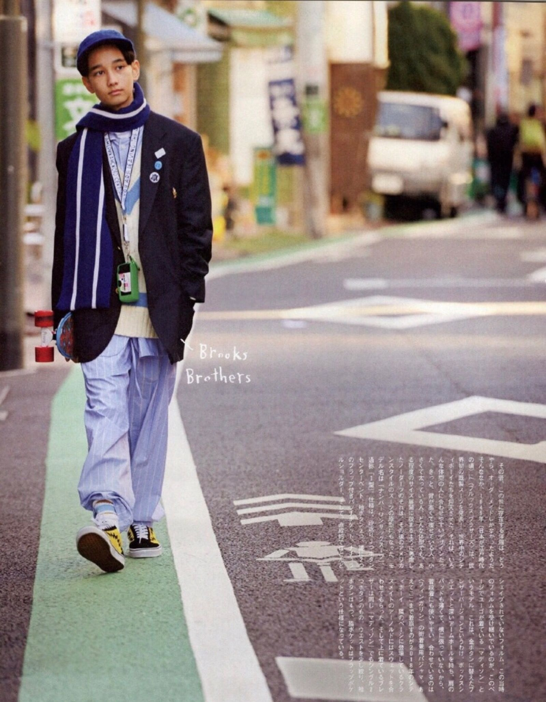
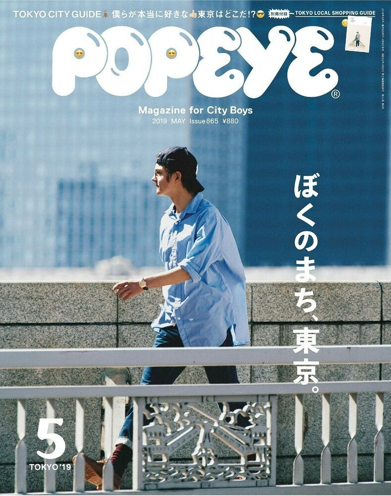
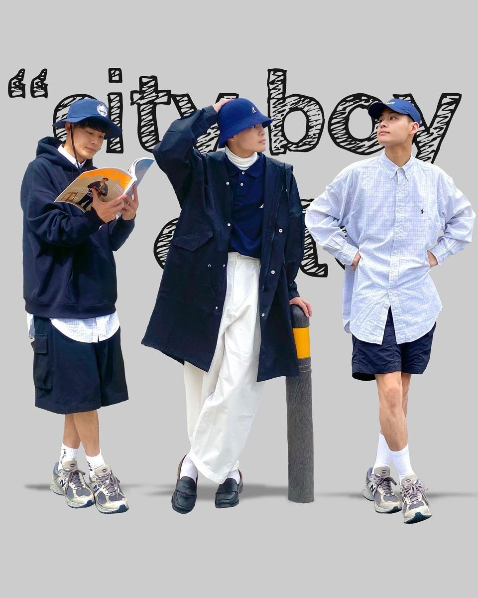
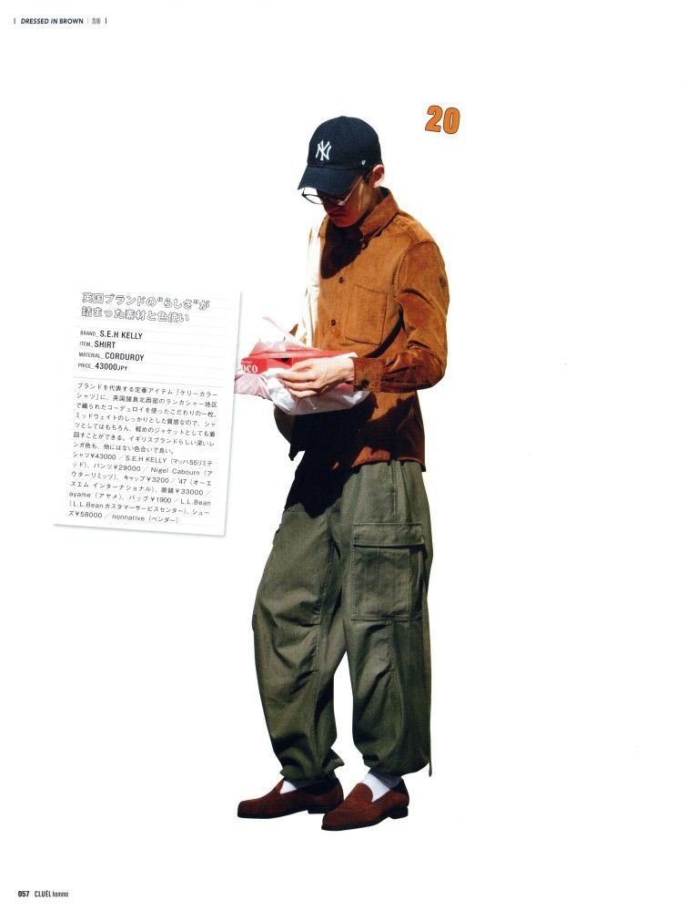

# 日系 City Boy (Japanese City Boy)

> **状态**: `reviewed` | **最后更新**: 2026-06-13
> **分类**: 日系 > 休闲 > 当代2000s > 极简调性

## 📖 概述
- **发源年代**: 1976年
- **发源地**: 日本东京（《POPEYE》杂志）
- **风格关键词**: 宽松、叠穿、少年感、帆布鞋、白袜、松弛
- **一句话定义**: 从一本杂志中诞生的穿搭体系——以宽松廓形和层次叠穿为核心，强调"舒适至上"的生活态度而非固定公式。

## 📜 历史文化

### 起源
City Boy 是现代时尚史上极少数**完全从一本杂志中诞生**的风格。1976年7月，Magazine House 创办男性时尚杂志《POPEYE》，封面标语 **"Magazine for City Boys"** 定义了一个时代。创刊号派出编辑飞往洛杉矶报道加州青年文化，将 Nike 球鞋、Patagonia 橄榄球衫、UCLA 校园装备引入日本。文化史学家 W. David Marx 将此称为 **Ametora（American Traditional）**——日本人痴迷地研究、保存并最终完善了美国人自己已经抛弃的美式服装传统。

### 发展脉络
- **1976**: 《POPEYE》创刊，"City Boy"一词被凭空发明
- **1980s**: 初期偏 Ivy League / Preppy 学院风
- **1990s-2000s**: 杂志衰落，City Boy 概念进入低潮
- **2012-2018 黄金复兴**: **木下孝浩**出任主编 + **长谷川昭雄**担任造型总监，重新定义 City Boy 为生活方式。杂志销量从7万涨至12万册
- **2018**: 木下孝浩加入优衣库主编《LifeWear》；长谷川昭雄创立线上媒体 AH.H
- **2020**: 长谷川出任 Nautica Japan 创意总监，重塑为 City Boy 现象级品牌
- **2023**: 长谷川创立自主品牌 CAHLUMN
- **2024-2026**: City Boy 从"模板化潮流"回归为日常穿搭底层逻辑，热度下降但理念深入人心

### 木下孝浩的经典定义
> "不论外表，而是绅士礼貌又有上进心的男生。他们所代表的是一种更丰富的精神和生活方式——对流行敏感，追求好品味的生活，同时又轻盈地保持着自己的价值观。不管年龄几何身处何处，只要拥有这样的精神，谁都是硬核的 City Boy。"

## 🎨 美学特征

### 廓形
- **上衣**: 宽松/落肩/箱型/H型，衣长偏长营造"偷穿大人衣服"的少年感
- **下装**: 宽松直筒或微阔腿裤，裤脚堆叠白袜
- **层次**: 经典三层叠穿——基础打底 → 图案/衬衫中层 → 机能外套外层
- 长谷川昭雄只提供 L、XL、2XL 尺码，以尺码设限强制标志性宽松廓形

### 色板
```
主色调: 海军蓝(Navy)、藏青、卡其、橄榄绿、灰、白、黑
点缀色: 姜黄、橙色
禁忌色: 荧光色、大面积亮色、高饱和色
配色逻辑: 低饱和冷色主调 + 1个暖色点缀，同色系不同饱和度叠穿
```
长谷川形容理想的哑光色泽："像浓缩咖啡和牛奶碰撞而成的拿铁、奶茶的颜色。"

### 标志单品
| 单品 | 品牌示例 | 选择要点 |
|------|---------|---------|
| 教练夹克 | Nautica Japan, BEAMS | 加厚填充版是冬季灵魂 |
| M-51/M-65 Parka | WTAPS, Nanamica | 军装改良，宽松剪裁 |
| 条纹牛津衬衫 | Engineered Garments | 标志性夏季单品，可当防晒外套外穿 |
| 连帽衫 | Champion, Patagonia | 抽绳折叠收纳，叠穿关键中层 |
| 长袖口袋T恤 | Uniqlo U, CAHLUMN | 版型必须宽松，重磅棉 |
| 宽松直筒牛仔裤 | Levi's, OrSlow | 五袋水洗，直筒剪裁 |
| Gurkha军裤/多袋机能裤 | Gramicci, DAIWA PIER 39 | 军事工装元素 |
| New Balance 990系/993/997 | New Balance | City Boy 最经典鞋履搭档 |
| 帆布鞋 | Converse, Vans | 米白/姜黄色 |
| 白袜堆叠 | Uniqlo, CHUP | 关键细节！中筒棉袜 |

## 🏷️ 代表品牌

### 核心品牌
- **BEAMS** (1976) — 日系选货店鼻祖，City Boy 最重要的零售载体。SSZ 支线是极致大廓形研究
- **Nautica Japan** (2020长谷川接手) — 保留航海基因+City Boy色彩，被重塑为现象级品牌
- **WTAPS** (1997西山彻) — 军事工装柔化为"街头随意军风"
- **Nanamica** (2003本间永一郎) — "穿在身上的机能"，GORE-TEX+美式经典。2026上海武康路开店
- **Engineered Garments** (1999铃木大器) — 美式工装/军装的日本式解构重构
- **DAIWA PIER 39** — 渔具品牌服饰线，城市户外机能风格
- **CAHLUMN** (2023长谷川) — 长谷川自主品牌，三位数平价入门
- **DESCENDANT** (西山彻) — 家庭主题，柔和化美式休闲

### 平价替代
- **Uniqlo U** — 宽腿打褶裤、牛津衬衫、尼龙短裤，最易入手
- **GU** — 更低价的宽松单品
- **MUJI Labo** — 极简剪裁更考究
- **NOTHOMME**（国内）— 日系基底+军工户外元素
- **714street**（国内）— 中性款 City Boy 既视感
- **蒙马特 MENTMATE**（国内）— 极致性价比基础款

## 👤 风格偶像 & 名人

| 人物 | 身份 | 风格贡献 |
|------|------|---------|
| **木下孝浩** | 《POPEYE》前主编(2012-2018)，优衣库《LifeWear》主编 | 将 City Boy 从穿搭升华为生活方式哲学 |
| **长谷川昭雄** | 造型师/AH.H/Nautica Japan 创意总监 | "City Boy 之父"，塑造全部视觉语言 |
| **木滑良久** | POPEYE 创刊主编 | 1976年开启概念原点 |
| **铃木大器** | Engineered Garments 创始人 | 美式工装最高水平的日本式解构 |
| **坂口健太郎** | 演员/模特 | 盐系男代表，City Boy"干净清爽"的完美体现 |
| **菅田将晖** | 演员 | 多变风格中融入City Boy层次叠穿 |
| **许光汉** | 演员 | "华语 City Boy 代表" |
| **平野步梦** | 冬奥金牌滑雪运动员 | "从 POPEYE 走出来的运动员" |

## 👗 秀场 & 时装周

> **核心事实**: City Boy 不是秀场驱动型风格。它的传播载体是杂志页面而非T台。

关联品牌的秀场表现:
- **Engineered Garments** — Pitti Uomo 常客，纽约展示
- **Sacai、Junya Watanabe、Comme des Garçons Homme Plus** — 巴黎男装周固定班底，在解构美式经典、叠穿层次上与 City Boy 精神共振
- **BEAMS** — 店内发布+快闪+杂志合作，不走传统秀场

## 🔗 关联风格
- **父风格**: 日系休闲
- **子风格**: 日系山系、日系阿美咔叽、日系机能
- **平行风格**: Clean Fit、韩系简约
- **对立风格**: 欧美正装、意式 Sprezzatura

## 📈 流行趋势
- **当前状态**: 🔥→🟡 从现象级潮流回归为日常穿搭底层逻辑
- **流行区域**: 亚洲（日本、中国、韩国、台湾）
- **发展方向**: 面料升级、与 Gorpcore/轻户外融合、去模板化
- **衰退风险**: 低（已沉淀为经典日系风格，不会被遗忘）

## 💡 穿搭建议
### 适合体型
- ✅ 偏瘦/中等体型（宽松剪裁天然修饰）
- ⚠️ 偏胖体型慎选过于宽松的廓形
- ✅ 身高170cm+较佳

### 适合肤色
- ✅ 偏白肤色 — 冷色系友好
- ✅ 自然肤色 — 大地色系友好
- ⚠️ 深肤色 — 需调整色板偏向暖色

### 适合场合
- ✅ 日常出街/逛街/咖啡厅
- ✅ 创意工作/自媒体
- ⚠️ 正式商务会议
- ❌ 晚宴/婚礼

### 入门建议
1. 从一件宽松牛津衬衫（做外搭）+ 重磅白T + 直筒牛仔裤 + New Balance 开始
2. 白袜是关键细节，不要忽略
3. 先掌握同色系叠穿，再尝试加入暖色点缀
4. 不追求"买大两码"——关键是肩线和垂感

---

## 📕 小红书社区经验（2026-06 采集）

> 以下内容整理自小红书社区真实穿搭分享，反映国内 City Boy 爱好者的实战经验与穿搭思路。

### 👤 信仔 — 《男生穿搭知识库:要学会City Boy风格穿搭》
> 综合热度: ❤️ 783  👍 735  💬 6  🔄 278

**核心观点**: City boy 是将不同的元素和谐混搭在一起，形成充满活力、阳光、热爱生活的风格。

**经验要点**:
- 大胆尝试**叠穿**，融入**机能元素**并用**亮色点缀**
- 最终呈现"懂得生活，热爱生活，阳光男孩"的形象
- 关键是**不同风格元素的混搭能力**，而非固定公式

### 👤 查理叔叔 — 《👨🏻40+叔叔｜5套男生穿搭学会蓝色搭卡其色》
> 综合热度: ❤️ 2034（高互动爆款）

**核心观点**: 蓝色搭配卡其色是 City Boy 最易上手的配色方案。

**经验要点**:
- 🥇 **蓝+卡其**是 City Boy 最经典的配色公式，零基础也能穿好
- 涵盖单品：衬衫、长裤、短裤、Polo衫、跑鞋、皮鞋
- 适合 **40+ 年龄段**，证明 City Boy 并非年轻人的专利
- 强调**胶囊衣橱**思路：少量单品搭配出多套造型

### 👤 猫头鹰 — 《日系boy出游不重样穿搭》
> 综合热度: ❤️ 603

**经验要点**:
- **一周穿搭不重样**的核心是基础款+配饰变换
- 工装元素与 City Boy 结合（工装裤、多口袋设计）
- 夏季出游穿搭关键词：清爽、叠穿、层次感

### 👤 卡平K克 — 《本周穿搭分享 | Cityboy杭州氛围感街拍》
> 综合热度: ❤️ 206

**经验要点**:
- City Boy 在街拍场景中的核心是**氛围感**——穿搭要与环境互动
- 杭州/复古建筑背景下的 City Boy：低饱和色+复古元素
- **少年感穿搭**在镜头前的呈现技巧

### 👤 米斯特 outfit — 《夏日city boy怎么穿，这份教程快收好》
> 综合热度: ❤️ 189

**经验要点**:
- 夏季 City Boy 以**轻薄叠穿**替代厚重层次
- 短袖衬衫作外搭+白T内搭是夏季经典组合
- 配色向浅色系偏移（米白、浅蓝、卡其）

### 📊 社区共识总结

| 维度 | 小红书社区共识 |
|------|--------------|
| **入门配色** | 蓝+卡其是最安全且出效果的首选 |
| **年龄段** | 20-50岁均可驾驭，关键在配色调整 |
| **场景** | 日常出街、旅行、街拍、咖啡厅 |
| **季节** | 四季皆宜，夏季注重轻薄叠穿 |
| **核心单品** | 牛津衬衫、白T、直筒裤、New Balance |
| **风格精神** | "懂得生活、热爱生活"的生活态度 |
| **进阶技巧** | 叠穿+机能元素+亮色点缀 |

---

## 📸 风格图库

> 以下为风格代表性穿搭参考图，搜集自公开时尚媒体。


*风格穿搭参考*


*Popeye | Japanese street fashion, Guys fits, Japanese skater style*


*From Japan Popeye Japanese Magazine for City Boys Issue May 2019 | ポパイ ...*


*风格穿搭参考*


*风格穿搭参考*

*本文基于多源研究整理，人工审核。*
