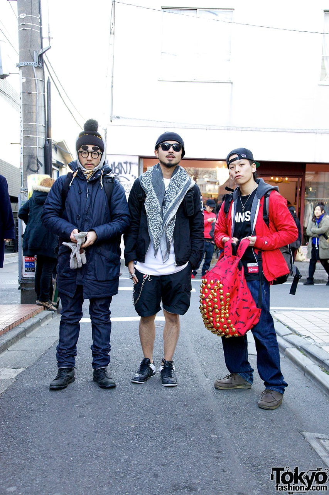
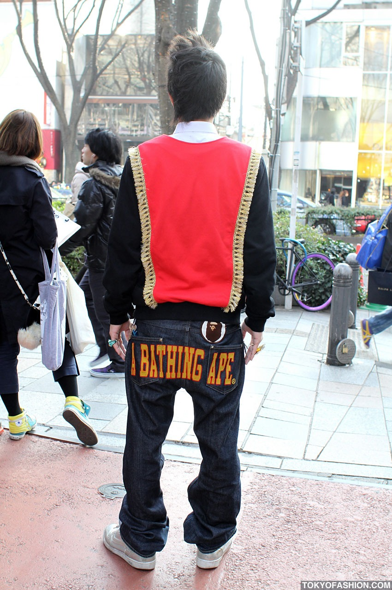
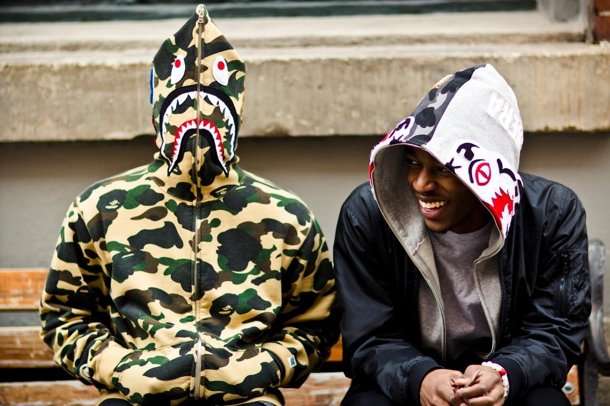

# 日系里原宿 (Japanese Urahara)

> **状态**: `reviewed` | **最后更新**: 2026-06-13

## 📖 概述

日系里原宿（Urahara / Ura-Harajuku，字面意为"原宿的背后"）是 1990 年代在东京原宿后街兴起的一场街头时尚革命。它融合了美国嘻哈、滑板、朋克文化与日本独特的工艺精神和极简美学，彻底改写了全球街头服饰的版图。这场运动的影响至今深远——当代街头品牌的稀缺营销、限量发售、品牌叙事等几乎所有核心玩法，都源自里原宿教父们的手笔。

严格意义上的"Urahara Kei"（裏原系），指涉原宿后街（Bunkamura 大道至明治通之间的小巷区域）那几个街区内产生的、以独立品牌与店铺小圈子为核心、音乐-服装-夜生活三位一体的青年亚文化。

## 📜 历史文化

### 诞生背景：1980 年代末至 1990 年代初的东京

1980 年代末，东京原宿的后街区域（原宿与青山之间）布满了古着店、独立唱片行和收藏品店铺。这个半地下化的街区天然吸引着痴迷西方亚文化的日本青年——他们在这里寻找美国古着、英国朋克周边、嘻哈黑胶，形成了一个与表参道奢侈精品店截然对立的波西米亚地带。

**藤原浩（Hiroshi Fujiwara）——教父的诞生**

若里原宿只有一位奠基人，那便是藤原浩。1980 年代，他作为 DJ 前往伦敦，结识了 Sex Pistols 经纪人 Malcolm McLaren，后者对他说了一句改变日本时尚史的话：**"不要再搞朋克和新浪潮了，你应该去纽约搞嘻哈。"** 随后，藤原浩成为 **International Stüssy Tribe 的第一位日本成员**，每月收到从美国寄来的 Stüssy 新品并分发给东京的意见领袖。他在《宝岛》杂志的专栏 **"Last Orgy"（最后的狂欢）**，成为日本青年接触说唱、朋克、滑板和 DJ 文化的"圣经"。

**NOWHERE 与 AFFA——火种的点燃**

1993 年 4 月 1 日，两位 Bunka 服装学院的同学——**Nigo（长尾智明）** 与 **高桥盾（Jun Takahashi）**——以仅 ¥40 万日元（约 $4,000 美元）的微薄预算，在原宿开了一家名为 **NOWHERE** 的小店。店铺一分为二：一边是高桥盾的 **UNDERCOVER**，另一边是 Nigo 的精选货品（很快催生出 **A Bathing Ape / BAPE**）。店名来自披头士的《Nowhere Man》和 Sex Pistols 的视觉设计。

1994 年，藤原浩与高桥盾共同创立品牌 **AFFA**（ANARCHY FOREVER FOREVER ANARCHY），以 Karl Marx、Che Guevara 和 Vivienne Westwood 的精神为灵感。AFFA 首次引发了排队长龙（camping/waiting culture）——这一现象后来成为全球街头品牌的标准操作。

### 里原宿的黄金时代（1996-2005）

到 1996 年，一种被称为"Urahara Kei"的统一着装风格已在日本青年中成型：

| 品类 | 代表性单品 |
|------|-----------|
| **上衣** | 品牌印花 T 恤、迷彩夹克、条纹滑板 Tee |
| **裤装** | 深色原色赤耳丹宁（selvedge denim） |
| **鞋履** | Nike Air Max 95、Adidas Superstars、Clarks Wallabees |
| **配件** | 高科技感背包 |

在 1996 年《Asayan》杂志的一次民意调查中，**没有任何流行明星或演员进入"最受崇拜人物"榜单**——榜单前两名是藤原浩和高桥盾，NOWHERE 被评为最受欢迎的店铺。这标志着："穿什么"比"当什么"更重要。

### 全球征服与遗产瓦解

**Pharrell Williams** 在 2003 年前后发现了 BAPE，成为其全球推广大使。随后 Kanye West、Kid Cudi、Soulja Boy 等嘻哈巨星纷纷追捧，里原宿美学由此走向世界。Nigo 于 2013 年将 BAPE 出售给香港 I.T 集团，被普遍视为里原宿黄金时代的象征性终结。NOWHERE 则早在 2000 年就已关闭。

然而，里原宿的文化 DNA 无处不在：Supreme 的限量发售机制、Off-White 的品牌叙事、Fear of God 的奢华街头定位——其商业逻辑根本皆来源于原宿后街那几家小店的偶然实验。

## 🎨 美学特征

- **文化混血性**：美式嘻哈 × 日式工艺 × 英式朋克的三重融合。不是简单的"日西合璧"，而是一种文化循环——🇯🇵 日本青年吸收美式亚文化→ 🇯🇵 在里原宿进行独创性再诠释 → 🌍 形成全新日本街头美学 → 🇺🇸 美国巨星反过来狂热追捧
- **稀缺性与神秘感**：Nigo 最初因预算有限只能小批量生产，将半数产品送给了朋友——无意间发明了街头品牌的饥饿营销蓝图。藤原浩的 fragment design 则把"联名"变成了一种稀缺货币
- **平面设计的至高地位**：BAPE 的猿人头 logo、迷彩、鲨鱼连帽衫，皆出自"幽灵写手"**Sk8thing（中村晋一郎）** 之手。他不是坐在电脑前画设计稿的设计师，而是将美式波普和日本漫画语法融合的视觉天才
- **Oversized + 层次感**：宽松廓形是标配，但不同于美式街头的松垮，里原宿的 oversized 带着日式的克制——轮廓清晰、比例精准、细节考究
- **军事与工装元素**：迷彩、M-65 夹克、工装裤的持续引用，源自日本对美式 vintage 文化的执着

## 🏷️ 代表品牌

### 核心开创品牌

| 品牌 | 创立者 | 创立年份 | 核心贡献 |
|------|--------|----------|---------|
| **A Bathing Ape (BAPE)** | Nigo（长尾智明） | 1993 | 定义了"限量稀缺"的街头品牌模式。标志性设计：猿人头 logo、抽象猿脸迷彩、鲨鱼连帽衫、BAPE STA 运动鞋 |
| **UNDERCOVER** | 高桥盾（Jun Takahashi） | 1990 | Paul Smith 口中"从未出卖灵魂"的品牌。从街头印花 T 到巴黎时装周概念大秀，完成了从亚文化到高级时装的跨界。2002 年成为首位在巴黎时装周走秀的里原宿设计师 |
| **fragment design** | 藤原浩（Hiroshi Fujiwara） | 2003（前身 GOODENOUGH 1990）| 联名帝国——闪电 logo 成为"酷的认证标记"，与 Nike、Louis Vuitton、Moncler、Starbucks 等均有合作 |
| **NEIGHBORHOOD** | 泷泽伸介（Shinsuke Takizawa） | 1994 | 机车/朋克/军事风格遗产品牌，骷髅图案和"Craft With Pride"精神。赤耳丹宁和皮夹克是招牌 |

### 同期及后继品牌

| 品牌 | 创立者 | 定位 |
|------|--------|------|
| **WTAPS** | 西山彻（Tet Nishiyama） | 军事灵感工装，与 Supreme 有深度合作历史 |
| **Bounty Hunter** | 岩永光（Hikaru Iwanaga） | 最初是 vinyl 玩具品牌，后演变为街头服饰 |
| **Cav Empt (C.E.)** | Sk8thing + Toby Feltwell | 里原宿原班人马的后数字时代品牌，反乌托邦声效 |
| **Human Made** | Nigo | Nigo 售出 BAPE 后的"回归初心"作品，vintage Americana × 日本精工 |
| **Wacko Maria** | 森敦彦（Atsuhiko Mori） | 坏男孩气质的里原宿后继者，夏威夷衬衫和豹纹是标志 |

## 👤 风格偶像

**日本教父三人组**
- **藤原浩（Hiroshi Fujiwara）**："街头教父"（Godfather of Streetwear）。不是最耀眼的设计师，但始终是最重要的文化节点——连接东西方、朋克与嘻哈、音乐与时装的枢纽人物
- **Nigo（长尾智明）**：被 Pharrell 称为"街头宗教中的一位神祇"。2021 年起任 KENZO 创意总监，2025 年伦敦 Design Museum 为他举办大型回顾展《Nigo: From Japan With Love》。他的绰号"Nigo"（"藤原浩二号"）本身就是一种自嘲式的致敬
- **高桥盾（Jun Takahashi）**：三人中最具艺术野心的设计师。UNDERCOVER 在 2025 年迎来 35 周年，复刻了 2004 年传奇系列"But Beautiful"
- **Sk8thing（中村晋一郎）**：从不露面的"幽灵写手"——设计了 BAPE 猿人头、UNDERCOVER 图案、Cav Empt 视觉体系。没有他，里原宿就没有视觉识别

**国际推手**
- **Pharrell Williams**：Nigo 的挚友，将 BAPE 推向美国主流。通过 Billionaire Boys Club 与 Nigo 深度共创，2026 年联手 Louis Vuitton
- **Kanye West**："College Dropout" BAPE STA 是他职业生涯第一双零售运动鞋
- **Virgil Abloh**（已故）：称 Nigo 为"帮助奢侈品理解如何连接新一代"的先驱
- **Verbal（Teriyaki Boyz / AMBUSH）**：东京-纽约之间的活链接，AMBUSH 从珠宝延伸至成衣

## 🔗 关联风格

- **日系山系/Urban Outdoor** → 里原宿的工装/军事支线直接演化为山系美学的基础
- **美式嘻哈街头** → 文化源头之一，但里原宿不是复制品，而是"日式滤镜下的美式街头"
- **当代韩系街头** → 韩国街头品牌（如 thisisneverthat、ADER ERROR）的商业模式和视觉策略深受里原宿遗产影响
- **奢华街头（Luxury Streetwear）** → Off-White、Fear of God 等品牌的全部商业策略都能追溯到里原宿的实验

## 📈 流行趋势

- **Nigo 时代 2.0**：在 KENZO 的加持下，Nigo 的影响力从街头向奢侈品全面渗透。2024-2025 年与 Nike 达成正式合作（推出 Air Force 3 联名），堪称"世纪大和解"——Nike 此前曾因 BAPE STA 起诉 BAPE
- **档案文化复兴**：BAPE 和 NEIGHBORHOOD 的 90 年代古着在二级市场价格飙升，年轻一代消费者重新发现里原宿黄金时代的魅力
- **NOWHERE 精神复燃**：2025 年 BAPE 与 NEIGHBORHOOD 联合回到原宿原点做联名——两个品牌 30 年后再次并肩而立
- **里原宿 × 机能/户外**：Human Made 的狩猎夹克、Wacko Maria 的戶外線，暗示里原宿正吸收山系/机能血液

## 💡 穿搭建议

**基础里原宿公式**

| 层级 | 单品 | 要点 |
|------|------|------|
| **内搭** | 图案 T 恤（品牌印花或 vintage 古着） | 不是 logo 大小的区别，是"谁设计的图案"——图案本身承载亚文化叙事 |
| **中间层** | 迷彩衬衫 / 工装夹克 / 连帽卫衣 | 迷彩可以是抽象的（BAPE camo）而非写实的。廓形宽松但不松垮 |
| **外套** | M-65 夹克 / 丹宁夹克 / MA-1 | 面料质感比品牌更重要——日式做旧工艺让新衣服也有"穿过的故事感" |
| **裤装** | 原色赤耳丹宁 / 宽松工装裤 | 裤脚自然堆积或轻微卷边，拒绝紧身剪裁 |
| **鞋履** | Nike Air Max 95 / Adidas Superstar / Clarks Wallabees | 运动鞋选"有文化故事"的型号，不是最新的科技款 |

**穿搭原则**
- **"Not too clean, not too dirty"** — 干净整洁但有"穿着的痕迹"，拒绝全新开箱即穿的完美感，也拒绝故意做旧的刻意感
- **品牌是密码，不是身份** — 懂的人通过一件 T 恤上的图案或一个口袋的位置就能识别彼此
- **音乐和态度比衣服更重要** — 里原宿归根结底是一个文化运动，穿它的衣服应该表达某种音乐偏好或文化立场，而非为了穿而穿

**现代里原宿着装演进**

当代里原宿已经分化为两条路线：
1. **"怀旧派"**：坚持 90 年代的原始配方——宽松丹宁 + 印花 T + BAPESTA，像朝圣一样维持正统
2. **"进化派"**：吸收山系、机能甚至极简的元素——UNDERCOVER 的西裤式工装裤、Human Made 的精致复古、Wacko Maria 的成熟坏男孩

无论哪条路线，里原宿的精神核心始终不变：**"穿衣服不是为了融入，而是为了表达自己属于某个理解你的部落。"**

## 📸 风格图库

> 以下为风格代表性穿搭参考图，搜集自公开时尚媒体。

*风格穿搭参考*

*Ambush Rings & Bathing Ape Streetwear in Harajuku - Tokyo Fashion*

*Bape (A Bathing Ape) is a Japanese street wear clothing brand*
