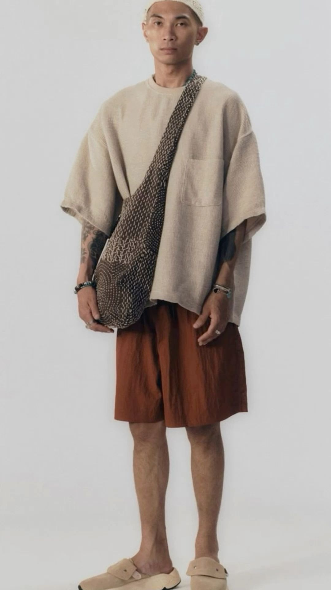
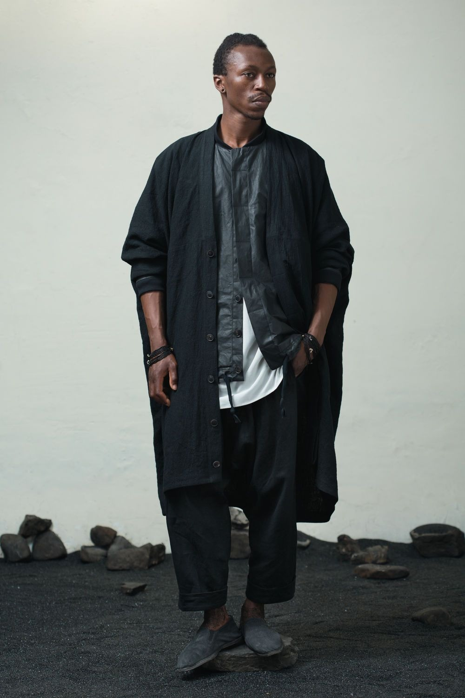
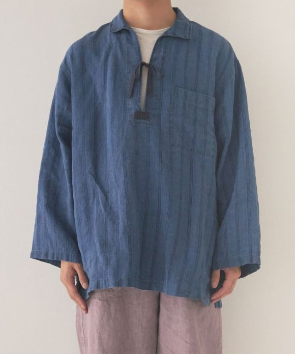

# 日系侘寂极简 (Japanese Wabi-Sabi Minimal)

> **状态**: `reviewed` | **最后更新**: 2026-06-13 | **趋势**: 经典风格

## 📖 概述

日系侘寂极简（Wabi-Sabi Minimal）是将日本传统美学"侘寂"（侘び寂び）投射到当代服装设计中的穿衣哲学。它不是空洞的"极简主义"（minimalism），不是北欧的冷峻理性，不是硅谷的"减少决策疲劳"——而是一种**温润的、有触感的、拥抱不完美与时间流逝的穿着态度**。

这个流派的品牌有一个共同信条：**衣服不是用来展示的，是让人好好生活的。** 它们的服装没有显眼 logo、没有趋势驱动、没有季节性剧变——只有对面料、廓形和"穿着者感受"的近乎偏执的追求。

在 2024-2026 年的全球"静奢（Quiet Luxury）"浪潮中，日本侘寂极简体系成为了最高级的表达形式：Loro Piana 和 Brunello Cucinelli 是意大利式的显性静奢，而 Auralee、COMOLI、yaeca 则是日本式的隐性静奢——前者是"我知道你穿得贵"，后者是"你感受到了，但说不清为什么好"。

## 📜 历史文化

### 侘寂的根源

**侘寂**是日本三大核心审美意识之一（另外两个是"幽玄"和"涩"），其根源可追溯至 15 世纪的茶道宗师千利休：

- **侘（Wabi）** — 朴素、寂静、不完美中的安然。在千利休的茶室里，粗糙的土墙、自然的木纹、带有裂纹的茶碗，都被视为比黄金更珍贵的审美体验
- **寂（Sabi）** — 时间留下的痕迹。铜器上的锈绿、旧衣上的褪色、老木头上的磨损——这些不是"破旧"，而是"故事"和"深度"

日本作家谷崎润一郎在《阴翳礼赞》中写道："我们喜爱那些附着有尘垢、烟熏和风雨印记的东西，喜爱那些能唤起回忆的色彩和光泽。"

### 从哲学到服装

侘寂在服装中的表达经历了三个关键转折点：

1. **1981 年巴黎冲击波**：当川久保玲和山本耀司在巴黎展示黑色、破洞、不对称的作品时，西方媒体以"广岛时尚"嘲讽，但"不完美的美"从此在高级时装中获得了合法性——这是侘寂服饰的"暴力宣言"阶段
2. **1990-2000 年代**：Margiela 的解构延续了侘寂精神，但日本本土出现了一条更温柔、更日常的脉络——不以"视觉冲击"为目标，而是在"日常穿着的舒适与美好"中实践侘寂
3. **2010 年代至今**：Auralee（2015）、COMOLI（2011）、yaeca（2002）等品牌崛起，将侘寂从先锋艺术转化为"可穿着的日常生活美学"——这是侘寂服饰的"静水流深"阶段

### 自然面料传统

侘寂极简的服装体系对面料有近乎宗教性的执念：

| 面料 | 侘寂特质 |
|------|---------|
| **亚麻（Linen）** | 天然皱褶、粗粝质感、随着穿着越来越柔软。每条折痕都像"时间的笔记" |
| **棉（Cotton）** | 柔软亲肤，但追求的是高支数的细腻触感和自然旧化效果，而非工业化的"抗皱免烫" |
| **羊毛（Wool）** | 粗花呢、哈里斯毛、美利奴等未经过度处理的毛料。起球和褪色被视为加分项 |
| **丹宁（Denim）** | 赤耳原色丹宁，穿三年才有自己的"人格"，下水频率越低越好 |
| **丝绸（Silk）** | 特殊水洗处理以削弱光泽感，让丝绸也有"暗哑的质感"（如 Auralee 的 washable silk fleece） |

## 🎨 美学特征

- **"间"（Ma）——身体与衣服之间的空气感**：COMOLI 设计师小森启二郎说，最重要的设计元素是"穿着者身体与衣服之间的空气。"宽松但不邋遢，廓形慷慨但有克制。衣服不贴在身上，而是"漂浮"在身体周围
- **色彩是温柔的，不是宣言的**：棕色、驼色、斑鸠灰、象牙白、炭黑、艾草绿——所有颜色都像被大自然褪了一层色。Auralee 创始人岩井良太的独家技术：在生棉阶段就染色并混合多支色股，让色调"沉"进纤维内部而非浮在表面
- **质感是主角，不是配角**：鼹鼠皮绒、起绒马海毛、皱缩埃及棉斜纹、水洗丝绒、硬捻丹宁、羊绒鼹鼠皮……一件 Auralee 或 COMOLI 的夹克，闭上眼睛触摸到的信息比睁开眼睛看到的更多
- **不完美即完美**：不对称下摆、故意留着的毛边、未修整的针脚——不是"做旧"，是"不允许工业化完美抹掉手工感"
- **时间友好型设计**：COMOLI 的设计哲学是"衣服越旧越好看"——他们选择的面料和廓形在刚买时是一种味道，穿三年后是另一种味道，但都不会变丑。Auralee 的岩井良太甚至说，他的目标是让顾客**"分辨不出一件衣服是哪一季哪一年生产的"**
- **没有 logo，没有图案，没有装饰**——衣服必须以自身的面料、剪裁和廓形来说话。日本侘寂极简主义中，"去 logo"不是营销策略，而是对"一件衣服凭什么值得存在"这一根本问题的回答

## 🏷️ 代表品牌

### 核心品牌：日系侘寂极简四天王

| 品牌 | 设计师/创立者 | 创立年份 | 核心哲学 |
|------|-------------|---------|---------|
| **Auralee** | 岩井良太（Ryota Iwai） | 2015 | "面料极致的超基础单品"。Bunka 服装学院出身，曾在 Norikoike 做版师和针织设计师。每季不从灵感板开始，而是从蒙古、新西兰、秘鲁的牧场开始——亲自采购原毛，和日本织厂共同开发独家面料。2024 年登陆巴黎时装周，年营收约 ¥36 亿日元（约 $2,400 万美元），但**从不打折、不设销售额目标**。与新百伦和丹麦家居品牌 Tekla 有合作 |
| **COMOLI** | 小森启二郎（Keijiro Komori） | 2011 | "侘寂"与"间"的最忠实肉身。品牌成立近 15 年不做社交媒体，直到 2024 年底才开设 Instagram。旗舰店在东京南青山一座安藤忠雄设计的混凝土建筑中。被 Highsnobiety 称为"日本时尚最隐秘的秘密"。面料与意大利、日本工匠共同开发——毡化羊毛、酥脆府绸、毛圈针织棉、斑点棉结灯芯绒、羊皮、棉绢混纺…… |
| **yaeca** | 服部哲弘（Tetsuhiro Hattori）+ 井出恭子（Kyoko Ide） | 2002 | "不可避免的简洁"。品牌名源自"八重"（yae），意为"八倍的重复"——寓意可日日穿着而永不厌烦的服装。坚持全流程 in-house 控制，所有面料 100% 日本生产。即使一件白衬衫，也会为之纠结"白色应该到哪个色号、面料克重应该多少克"。几乎不做联名合作，几乎不在社交媒体发声 |
| **A.PRESSE** | — | 2010s | "服装编辑部"理念——用真丝混纺、羊绒等顶级面料重制 Carhartt 式的工装廓形。远看是工装夹克，摸到才知道是丝绸。代表静奢（Quiet Luxury）在日本男装中的最高表达之一 |

### 相关及衍生品牌

| 品牌 | 定位 |
|------|------|
| **ssstein** | 极简中的极简，阔腿裤版型尤为出色。设计师的名字不公开，品牌低调到几乎没有公开信息 |
| **Cale**（佐藤由紀） | 全日本搜寻面料，所有产品（含皮革和丹宁）在同一家工厂完成。"谦虚但完美主义" |
| **HERILL** | 日产水洗丹宁和做旧军裤，同价位综合素质极高，不同落色程度的洗水单品是招牌 |
| **Graphpaper** | 买手店起家的品牌，主打素色基础款的"完美版型"。T 恤和卫衣是入门首选 |
| **yoko sakamoto** | 天然染色专家——柿涩、黄花、墨汁、艾草、红豆等植物染料，功能性与日常实穿并重 |

### 备注：关于 Arpege Story

Arpege Story 成立于 1981 年，是一家著名的日本女性时尚精品集合店（Select Shop），隶属于 TSI Holdings。它以"Make your or"为主题，集合 Apuweiser-riche、JUSGLITTY、Rirandture、Mystrada 等日系女装品牌，以优雅通勤、松弛都市、成熟甜美的风格著称。虽然它不经营男装，但其"在日常生活中悄然闪耀"的美学逻辑与侘寂极简的男装精神相通——都强调衣服是为人服务的，而非反过来。

## 👤 风格偶像

侘寂极简不同于其他风格——它**几乎没有"风格偶像"或知名意见领袖的公开代言**。这不是偶然，而是一种刻意：

- **设计师即是隐士**：COMOLI 的小森启二郎 15 年不做社交，yaeca 的服部哲弘说"Instagram 和 Twitter 我不擅长也不在乎"，Auralee 的岩井良太虽然出版了但采访时谈的永远是面料而非生活方式
- **这个流派的意见领袖是"不存在的"**——这也是它最核心的哲学：**让穿着者本人成为风格的中心，不让衣服喧宾夺主**
- **如果一定要提名**：穿着 AURALEE 的 **A$AP Rocky**、穿着 COMOLI 的日本造型师 **服部昌孝**、在巴黎时装周前排低调现身的**Lewis Hamilton**——但他们只是"被镜头拍到穿着这些衣服的人"，而非"代言人"。他们从未为这些品牌站台

## 🔗 关联风格

- **日系解构主义** → 侘寂极简与解构主义共享"不完美的美"这一核心价值，但前者更日常化、更温柔、更"可穿"。如果说川久保玲和山本耀司是侘寂的"愤怒宣言"，Auralee 和 COMOLI 则是侘寂的"日常默祷"
- **日式静奢（Japanese Quiet Luxury）** → 欧美媒体将这个流派归入"静奢"大趋势，但岩井良太明确拒绝这个标签："把所有极简品牌放在一个保护伞下有点奇怪——我们要做的是更细腻、更细密的事情。"
- **北欧极简（Scandinavian Minimal）** → 共享低饱和度色彩和简洁廓形，但本质区别：北欧极简是理性的、克制的、近乎禁欲的；日系侘寂极简是感性的、有温度的、欢迎时间参与创作的
- **日系机能 →** 侘寂极简中的"功能性"不是多口袋和防水拉链，而是"穿着这件衣服在早上的公园里骑车去买咖啡，它是否让你感觉对"
- **山系/Urban Outdoor** → COMOLI 和 yaeca 都有工装/户外的影子，但从不以"户外"为叙事主线

## 📈 流行趋势

- **"静奢"全球热潮下的日本派系**：2024-2026年，静奢（Quiet Luxury）成为全球时尚关键词。意大利派（Loro Piana、Brunello Cucinelli）靠羊绒和品牌传承说话，法国派（Lemaire、The Row）靠剪裁和知识分子气质说话，而日本派（Auralee、COMOLI、A.PRESSE）靠**面料触感**和**时间哲学**说话——在三个派系中，日系是最"无形"也最"深厚"的
- **"后 logo 时代"的最终形态**：从 2016 年 Vetements 的 DHL T 恤，到 2023 年 "静奢"对 logo 的全面拒绝，再到 2025 年日本侘寂品牌的全球扩张——"无 logo"从反叛姿态变成了终极奢侈
- **男装质感的"触觉觉醒"**：越来越多男性消费者开始关注"触感"（hand feel），品牌需要描述一件夹克的"手感"和"穿着三年后的效果"，而非仅展示它的外观。这在极简男装社区中已成为新的评判标准
- **面料叙事成为新竞争力**：Auralee 的"蒙古 baby suri alpaca → 日本工厂定制纺纱 → 独家染色"故事链条，正在成为其他品牌仿效的模板。消费者购买的不再是"一件毛衣"，而是"一种关于纤维来源、工艺过程和设计哲学的全套叙事"
- **中国市场觉醒**：2025年，日本极简男装在中国男装爱好者社区（如"什么值得买"、小红书）中爆发式增长。A.PRESSE、COMOLI、Auralee 被称为"日系静奢三巨头"，各类实穿对比指南大量涌现
- **巴黎时装周东移**：2024年 Auralee 正式登陆巴黎时装周男装日程，2025-2026年更多日本极简品牌被纳入国际日程表的视野——新一代表参道到玛黑区的通路正在形成

## 💡 穿搭建议

**侘寂极简穿搭的三条铁律**

1. **面料先行**：在选择廓形或颜色之前，先摸面料。如果一件衣服在屏幕上看很美但拿到手里触感不对，不要买。侘寂极简的核心愉悦感来自触觉，而非视觉
2. **廓形要有"空气"**：衣服和身体之间必须留出空间。不是 oversized 的量级问题，而是"有没有空气感"的质感问题。衣服应该飘在身体周围，而非贴在或挂在身体上
3. **接受并欢迎时间**：一件 COMOLI 的羊毛夹克在三年的穿着后褪色、膝盖处出现自然的磨损——这不是"旧了"，是"成熟了"。侘寂极简的养护不是"保持如新"，而是"让时间的痕迹好看"

**入门穿搭公式**

| 季节 | 单品组合 | 面料要点 |
|------|---------|---------|
| **春夏** | 宽松亚麻衬衫 + 宽腿斜纹裤 + 皮革凉鞋或帆布鞋 | 亚麻要选未经抗皱处理的，让它自然皱——那些皱褶是"风的痕迹" |
| **春秋** | 落肩羊毛针织衫 + 直筒丹宁 + Clarks Wallabees / Paraboot Michaels | 针织衫的微起球在侘寂体系中是美德，不是缺陷 |
| **冬季** | 毡化羊毛 Balmacaan 大衣 + 高领羊绒衫 + 灯芯绒宽裤 | 整身没有 logo 但面料质感丰富到爆炸——内行能通过反光率和肌理分辨材质 |

**色彩指南**

整个色盘围绕"被时间褪了一层色"的感觉构建：
- **基础色**：象牙白（不是荧光白）、驼色、斑鸠灰、炭黑
- **进阶色**：艾草绿、铁锈褐、墨黑蓝（看起来是黑，在阳光下泛出藏蓝）
- **点缀色**：熟柿橙、苔藓绿、砂金色——极少量使用，作为"季节的提示"

**最重要的一条原则**

> 侘寂极简的终极目标不是"穿得好看"，而是"穿着这件衣服能过好一天"。
>
> Auralee 的岩井良太说：*"我认为生活中有一些我们无法改变的事情，但我相信我们可以用衣服来软化它们。穿某些衣服能让你感觉更放松。"*
>
> 如果你的衣服让你感到紧张（怕弄脏、怕起皱、怕过时），那就不是侘寂极简的衣服。

## 📸 风格图库

> 以下为风格代表性穿搭参考图，搜集自公开时尚媒体。

*风格穿搭参考*

*Linen style fashion, Style, Japan fashion*

*Linen Indigo Stripe Sailor Smock Shirt｜nest Robe International Online ...*
