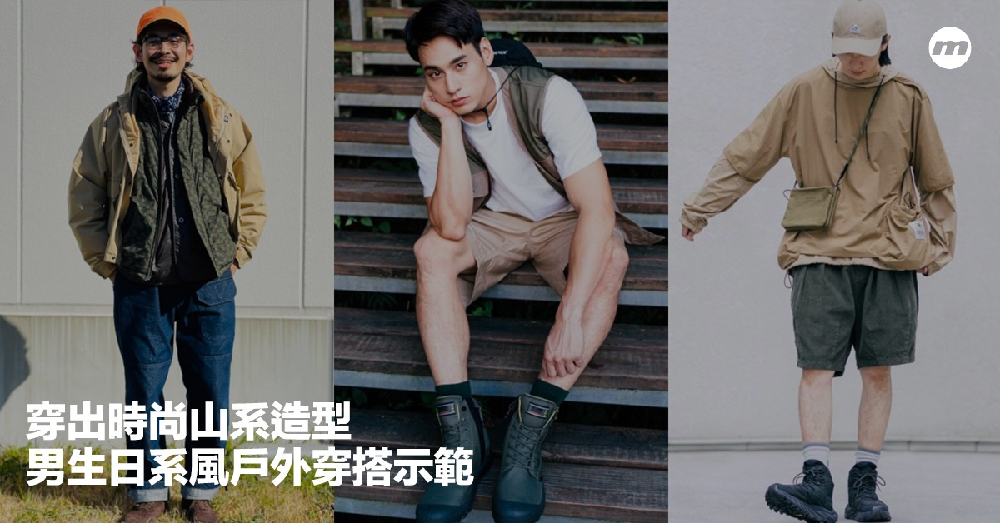
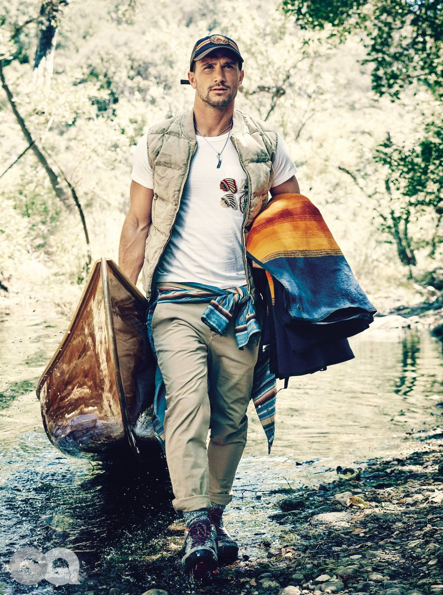
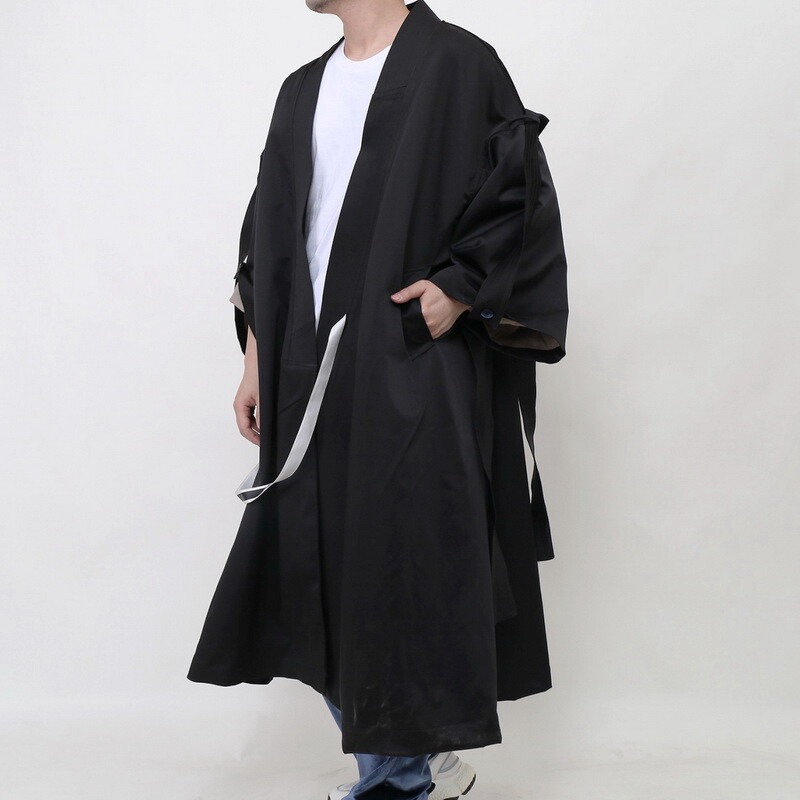

# 日系山系 (Japanese Yama Style)

> **状态**: `reviewed` | **最后更新**: 2026-06-13 | **趋势**: 小众领域

## 📖 概述

**日系山系**（Japanese Yama Style / 山系スタイル）是源自日本的一种将户外功能服装融入都市日常生活的穿搭美学。"山系"（やまけい / Yama Kei）——字面意为"山的流派"——在中文语境中直接保留了日文汉字的表述，指代一种**将专业户外装备"软化"为日常可穿服饰**的独特风格。

与西方语境下的 Gorpcore 相比，日系山系呈现出几个关键差异：配色更柔和克制，廓形更适合亚洲身型，品牌偏好以日本本土品牌为主，且背后有一套完整的**"户外生活方式"**哲学——不仅关乎穿衣，更关乎一种"城市与自然之间自由切换"的生活态度。

日系山系的核心单品与 Gorpcore 高度重叠（冲锋衣、摇粒绒、机能裤、登山鞋），但其精神气质完全不同：如果 Gorpcore 是"穿着 Arc'teryx 的纽约人去买咖啡"，那日系山系就是"穿着 nanamica 的东京人去富士山脚下露营，顺便在 GO OUT JAMBOREE 喝一杯手冲咖啡"。

---

## 📜 历史文化

### 日本户外文化的深层土壤

日本是一个**70% 国土为山地**的国家，自然与人的关系深刻嵌入文化基因。从传统的山岳信仰（修验道）到20世纪的登山热潮，日本人对"山"的情感远不止于运动——它是一种精神归属。

1960-1980年代，随着经济腾飞，日本掀起了第一次大规模的户外运动热潮。1990年代，"露营"作为一种家庭休闲方式普及，催生了 Snow Peak（1958年创立但在90年代迎来爆发）、Montbell（1975年）、LOGOS（1928年）等本土户外品牌的发展。

### 山系风格的诞生（2000年代-2010年代初）

日系山系作为一种**明确的穿搭风格**，其形成与以下关键因素密不可分：

**1. 《GO OUT》杂志的创立（2007年）**

2007年创刊的《GO OUT》是日本最具影响力的户外生活方式月刊，被广泛认为是"山系穿搭的百科全书"。它不同于传统的户外杂志（后者关注装备参数和登山路线），《GO OUT》的核心内容围绕**"如何将户外装备穿得好看"**展开，同时涵盖露营、美食、音乐、汽车等生活方式维度。

《GO OUT》每年8月在富士山脚下举办 **GO OUT JAMBOREE**——全球最大规模的户外露营音乐节，集结了服装市集、露营展览、音乐演出和美食体验。这个活动成为山系文化从杂志到现实生活的关键枢纽。

**2. "Urban Outdoor"（都市户外）理念的兴起**

2003年，设计师**本间永一郎**（Eiichiro Homma）创立 **nanamica**，首次明确提出"Urban Outdoor"的概念——将 Gore-Tex、COOLMAX、Polartec 等功能面料与经典的西装、衬衫、卡其裤廓形结合，创造"能在暴雨中保护西装不湿的日常服装"。同年，nanamica 与 Goldwin 公司合作推出 **The North Face Purple Label**（紫标），这条仅在日本和韩国发售的支线，将 TNF 的户外经典以日式都市视角重新诠释，成为山系风格的标志性标签。

**3. 东京时装周的推动**

2006年，曾是渡边淳弥（Junya Watanabe）门徒的**相泽阳介**创立 **White Mountaineering**，2009年登上东京时装周。他将 Comme des Garcons 体系中的解构、拼接、图案设计手法注入户外服装，让"登山装备"第一次以高级时装的面貌出现在 T 台上。2016年 White Mountaineering 登上巴黎时装周，标志着日系山系在国际时装体系中的正式入场。

**4. 2011年的"轻户外"转向**

2011年夏天，从三宅一生（ISSEY MIYAKE）离职的池内启太和森美穗子夫妇创立 **and wander**。其创立的契机颇具故事性：池内启太被朋友邀请去露营，在多家户外商店里找不到一件自己喜欢的东西——"要么太硬核，要么太难看"。and wander 的诞生标志着山系风格的一次"软化"：他们针对的不是攀登 6000 米高峰的极限登山者，而是**"只想周末逃离城市、在大自然中放松享受"**的普通城市居民。

### COVID-19 疫情后的加速（2020-2025）

与 Gorpcore 类似，COVID-19 疫情极大加速了日系山系的普及：日本国内露营热潮爆发（被称为"ソロキャンプ"即 solo camping 的兴起）、都市居民对"低欲望"（低欲望）生活方式的向往、以及"里山"（城市近郊山林）文化的复兴，让山系风格从亚文化走向了日本男性的主流穿搭选择。

2025年，日系山系已从日本辐射至亚洲全域——中国大陆、台湾、香港、韩国的男性穿搭社区中，"山系"是一个独立且高频的关键词，与"City Boy""日系机能""Gorpcore"等风格高度交叉。

---

## 🎨 美学特征

### 与 Gorpcore 的核心异同

日系山系与 Gorpcore 共享"户外装备日常化"的底层逻辑，但在表达方式上有显著差异：

| 维度 | 日系山系（Yama Style） | Gorpcore |
|------|----------------------|----------|
| **配色哲学** | 柔和克制——沙色、浅灰、雾蓝、淡橄榄绿、米白；亮色极少且饱和度低 | 大地色 + 撞色亮色——亮橙、正红、明黄作为视觉焦点 |
| **廓形倾向** | 偏短偏宽——适应亚洲身型，衣长偏短、肩宽适度、裤装多为宽松锥形/直筒 | 偏长偏大——欧美 Oversized 逻辑，袖长偏长、衣长盖臀 |
| **品牌偏好** | 日本本土品牌主导——nanamica、White Mountaineering、and wander、Snow Peak | 欧美户外品牌主导——Arc'teryx、Patagonia、Salomon、The North Face |
| **视觉情绪** | "安静地融入自然"——低欲望美学、不张扬 | "被看见在去户外的路上"——功能性即识别性 |
| **面料追求** | 技术面料 + 天然面料的平衡——棉涤混纺、羊毛户外款、和纸面料实验 | 纯技术面料主导——Gore-Tex、Polartec、Primaloft |
| **灵感参照** | 日本露营文化、里山生活、垂钓、森林浴 | 北美/欧洲登山传统、Pacific Crest Trail 穿越文化 |

一句话区分：**Gorpcore 像是 Patagonia 的产品目录活了过来，日系山系则是《POPEYE》杂志做了一个露营特辑。**

### 配色方案

日系山系的配色遵循日本传统的美学原则——**"涡味"（わびさび / Wabi-sabi）**，即在不完美与克制中发现美。

**主色板**：
- **大地色系**：米白（生成り）、沙色（砂色）、卡其、浅驼
- **绿色系**：橄榄绿（オリーブ）、灰绿、苔绿——饱和度较低，偏向军绿而非翠绿
- **蓝色系**：藏青（紺色）、雾蓝、灰蓝、靛蓝——几乎不使用亮蓝
- **灰色系**：炭灰、中灰、米灰——作为所有颜色的过渡
- **黑色**：仅在少量单品中出现，不作为主色调

**配色原则**：
1. **全身上下的颜色通常不超过3种**
2. **永远有一个"白色/米白"作为底色**——白T恤、白衬衫或米白内搭是日系山系不变的底层
3. **亮色仅用于"一个配件的面积"**——如一条亮橙色户外方巾、一顶颜色跳脱的渔夫帽
4. **同色系渐变 > 对比撞色**——卡其裤 + 沙色外套 + 米白内搭 优于 军绿裤 + 亮橙外套

### 关键廓形

日系山系的廓形核心是**"宽松但有结构"**：

- **上衣**：落肩设计、衣长到臀部中央（不过长）、袖口偏宽可卷起
- **裤装**：腰部宽松（常用抽绳或松紧带）、大腿有空间、小腿处锥形收口或直筒
- **外套**：长度到臀部上方或大腿中部、肩部不做垫肩、面料有自然垂坠感
- **层次**：至少三层但每层都很薄——轻薄打底 + 衬衫/卫衣 + 一件风壳或尼龙夹克

### 关键面料

| 面料 | 在山系中的应用 |
|------|---------------|
| **GORE-TEX** | 冲锋衣和雨衣——但更多选择哑光/棉感面料的版本（如 TNF Purple Label 的 Gore-Tex 棉感风衣） |
| **Polartec** | 摇粒绒中层——但通常选择低毛高/短绒版本，看起来更利落 |
| **Pertex Quantum** | 轻量羽绒/棉服外壳——追求极度轻量与可压缩性 |
| **COOLMAX / 速干涤纶** | 夏季基础打底——用于T恤、短裤 |
| **有机棉 / 再生棉** | 内搭T恤、衬衫、袜子——日系品牌大量使用天然/再生纤维 |
| **和纸（Washi）混纺** | 部分高端山系品牌的实验性面料——轻薄、透气、独特触感 |
| **Cordura 尼龙** | 背包、裤装补强、马甲 |

---

## 🏷️ 代表品牌

### 日本"三大山系品牌"

这是中文和日文时尚媒体公认的日本山系三巨头：

#### 1. Nanamica（ナナミカ）——都市户外的奠基者

| 项目 | 详情 |
|------|------|
| **创始人** | 本间永一郎（Eiichiro Homma） |
| **创立年份** | 2003年 |
| **品牌名含义** | "七海之家"，源于创始人对海洋的热爱 |
| **核心定位** | "Utility + Sports"——将科技面料注入经典男装廓形 |

Nanamica 是日系山系**无可争议的起点**。创始人本间永一郎在 Goldwin 公司（TNF 日本运营商）工作了18年，深谙功能性面料，但他不想做一件"看起来像要去登山的衣服"——他想要一件**"能在暴雨中保护你，但看起来依然体面的日常外套"**。

Nanamica 的设计语言极度克制：没有明显的户外标识，没有荧光拉链，没有魔术贴——你将一件 Nanamica 的 Gore-Tex 外套挂在衣柜里，它看起来像一件做工精良的休闲外套，而不是一件冲锋衣。

同时，Nanamica 设计团队全权负责**The North Face Purple Label（紫标）**的产品设计。紫标保留了 TNF 的经典基因，但以日式审美重新处理廓形、配色和面料选择。紫标系列仅在日本和韩国发售，常年断货。

**标志性单品**：Gore-Tex 轻量风壳、甲板夹克（Cruiser Jacket）、Coolmax 宽松衬衫

#### 2. White Mountaineering（白山）——时装屋级别的户外

| 项目 | 详情 |
|------|------|
| **创始人** | 相泽阳介（Yosuke Aizawa） |
| **创立年份** | 2006年 |
| **教育背景** | 多摩美术大学纺织品设计 |
| **前职** | 渡边淳弥（Junya Watanabe / Comme des Garcons）团队设计师 |

如果 Nanamica 是"让户外装备不再像户外装备"，那 White Mountaineering 就是**"让户外装备成为高级时装"**。

相泽阳介将在 Comme des Garcons 体系中学到的**拼接、不对称剪裁、图案设计、异材质组合**等手法，全部应用于户外服装。White Mountaineering 的冲锋衣可能有格纹拼接、花卉刺绣、或是从腰部开始的材质转换——这在传统户外品牌中是不可思议的。

**关键里程碑**：
- 2009年：登上东京时装周
- 2015年：与 adidas Originals 开启长期联名（鞋履 & 服装）
- 2016年：登上巴黎时装周，正式进入国际时装体系
- 2023年：被意大利滑雪品牌 Colmar 任命为高端支线 Revolution 创意总监

**标志性单品**：拼接冲锋衣、adidas 联名 SeeULater 登山靴、图案工装裤

#### 3. and wander（アンドワンダー）——"轻户外"的完美表达

| 项目 | 详情 |
|------|------|
| **创始人** | 池内启太（Keita Ikeuchi）& 森美穗子（Mihoko Mori）夫妇 |
| **创立年份** | 2011年夏 |
| **前职** | 两人均来自三宅一生（ISSEY MIYAKE） |

and wander 是三个品牌中最"年轻"、也最"轻盈"的一个。其核心理念是：**户外不是运动目标，而是一种生活态度**。品牌针对的是"周末想去大自然待一会儿"的人——不是极限登山者，不是专业徒步者，就是想逃离城市呼吸一下新鲜空气的普通人。

这种定位使得 and wander 的审美与硬核户外截然不同：廓形更柔和、配色更低饱和度、面料更多选用哑光/棉感材质。品牌采用三座山峰 vs 单座山峰的标签系统来区分产品的"野外强度"——三座山适合登山，一座山则是"日常生活的延伸"。

and wander 的 Lookbook 以极高的摄影美学水准著称，拍摄地点往往选在日本的山林、溪流和雪地中，画面充满了静谧的诗意——这在时尚品牌中是少有的"不露脸、不摆拍、不耍酷"的表达方式。

**标志性单品**：摇粒绒抓绒服（品牌自己研发的面料）、轻量尼龙防风夹克、腰包/胸包

### 其他重要品牌

| 品牌 | 创立年份 | 定位与特色 |
|------|----------|-----------|
| **Snow Peak** | 1958年 | 日本老牌露营品牌，服装线近年来迅速崛起。以"燕三条"金属工艺闻名，服装同样注重材质与工艺。Gorpcore 圈内地位堪比 Patagonia。 |
| **Meanswhile** | 2014年 | 设计师藤崎直树创立，以极端复杂的结构设计和"衣服即工具"的理念著称。多模块系统——可拆卸袖子、可变形的口袋、自收纳设计。 |
| **F/CE.** | 2010年 | 山根敏史创立，融合音乐巡演文化（创始人是乐队贝斯手）与户外机能。擅长用防水面料做日常包袋。 |
| **Comfy Outdoor Garment** | 1915年（美国创立）/ 日本复活 | 原为美国户外品牌，被日本买手店复活后成为山系标志。以"户外羽绒背心"和机能马甲出名。 |
| **Nanga** | 1941年 | 日本顶级羽绒品牌——以 800 蓬以上的高等级鹅绒著称，睡袋起家。 |
| **WBSJ (Wild Bird Society of Japan)** | 1934年 | 日本野鸟协会的公益品牌，以可折叠及膝雨靴闻名，是山系穿搭的高频配件。 |
| **The North Face Purple Label** | 2003年 | 由 nanamica 设计团队操刀的日韩限定支线。标志性蓝标变紫标，廓形更亚洲化，面料更多棉感选择。 |
| **Goldwin** | 1951年 | TNF 日本运营商，近年以自有品牌 Goldwin 推出极简户外服装，被评价为"科技面料版的 MUJI"。 |
| **Pilgrim Surf+Supply** | 2005年（纽约创立）/ 日本延伸 | 冲浪 x 户外 x 都市的混合品牌，是《POPEYE》City Boy 风格的标准配置。 |

---

## 👤 风格偶像

日系山系的风格偶像与西方 Gorpcore 不同——主要不是娱乐明星，而是**设计师本人、杂志造型师、买手店主理人**。这与日本时尚文化的特质一致：信任"做衣服的人"多于"穿衣服的人"。

### 本间永一郎（Eiichiro Homma）——山系的精神教父

Nanamica 创始人是"Urban Outdoor"理念的首个提出者。他在采访中说过一句广为流传的话：

> *"好的衣服是支撑人类生活的好工具。"*

Homma 本人的穿搭——一件 nanamica 轻薄风壳 + 白色牛津衬衫 + 卡其裤 + 帆布鞋——就是山系穿搭的最佳示范：你几乎看不出任何"户外"元素，但每一件衣服都在功能性上达到了户外标准。

### 相泽阳介（Yosuke Aizawa）——时装山系的旗手

White Mountaineering 创始人的每一次谢幕造型都是媒体焦点——他通常穿着一件品牌当季最复杂的拼接冲锋衣，搭配运动鞋或登山靴，展示了山系在"T台语境"中的完整表达。

### 木村拓哉（Kimura Takuya）——山系的大众化推手

日本国民偶像木村拓哉在 2019 年电视剧《Grand Maison 东京》片场和私服中多次穿着 The North Face Purple Label 和 nanamica，被粉丝和媒体大量捕捉。他的穿着方式极为贴合山系精神——紫标风壳 + 宽松白T + 牛仔/卡其裤 + New Balance——自然、舒适、不刻意。木村的穿着让紫标系列一度在日本大规模售罄，也帮助山系风格从"小众玩家圈"进入了"普通男性的穿搭参考"。

### 松田翔太（Shota Matsuda）

日本演员松田翔太是另一位以自然、户外风格著称的男艺人。他经常在 Instagram 上分享自己的露营生活和山系穿搭，风格偏向 and wander 和 Snow Peak 的单品。

### GO OUT 杂志的素人街拍

与大多数时尚杂志不同，《GO OUT》的一个核心栏目是**素人露营者的街拍**——真实的读者穿着他们在露营时自己搭配的服装，被摄影师捕捉。这些"非专业模特"的穿搭示范，比明星更贴近普通人的生活场景，也成为山系风格最真实的风格档案。

### 国际关注者

虽然日系山系的核心偶像在日本，但 Gorpcore 热潮让国际时尚界重新发现了日本山系品牌。Frank Ocean 被拍到穿着 nanamica、A$AP Rocky 穿过 White Mountaineering 单品——这些时刻让日系山系品牌在西方市场获得了显著关注。

---

## 🔗 关联风格

### Gorpcore（户外风）

日系山系与 Gorpcore 是"兄弟风格"——共享底层逻辑（户外装备日常化），但在审美表达上分道扬镳。详见 [Gorpcore 百科](../contemporary_gorpcore/encyclopedia.md)。

**关系比喻**：如果时尚界是一棵树，Gorpcore 和日系山系是同一树干上的两根分支——树干是"户外技术服装的都市化"，Gorpcore 朝西（欧美审美——更大胆、更直接、更"可识别"），日系山系朝东（日本审美——更克制、更柔和、更"看不太出来"）。

### City Boy（城市男孩风）

由日本传奇杂志《POPEYE》定义的美学体系，强调宽松廓形、Ivy-prep 混搭、层次叠穿和一种"刚刚好的慵懒感"。City Boy 与日系山系的交叉点极为密集：

- Nanamica 同时是 City Boy 和山系的标志性品牌
- The North Face Purple Label 的风壳是 City Boy 秋季定番单品
- Pilgrim Surf+Supply 的户外灵感衬衫和短裤横跨两个体系
- 《POPEYE》和《GO OUT》两本杂志的读者群高度重合

**区别**：City Boy 更偏向"城市街区"，山系更偏向"城市到自然的过渡带"。你可以同时是 City Boy 和山系——穿一件紫标风壳、白T恤、宽松卡其裤、New Balance 990v6，这就是两者最完美的交集点。

### 日系机能（Japanese Technical）

日系机能是日本独有的一个流派，品牌包括 **ACRONYM（德国品牌但在日本亚文化中地位极高）、Porter-Yoshida、Master-Piece、F/CE.** 等。它与山系的区别在于：

- **机能**强调"城市生存"——防水、防盗、隐藏口袋、模块化
- **山系**强调"自然适应"——透气、轻量、舒适、融入环境

实际穿搭中，两者经常混合：一个 Master-Piece 的防水背包 + and wander 的防风夹克 + White Mountaineering 的工装裤 = 机能 x 山系的完美 crossover。

### Outdoor Kimono / 和风户外

这是一个小众但有趣的亚支流：将和服/作务衣的元素融入户外服装。品牌如 **Sou-Sou** 和 **KAPITAL** 在部分系列中探索了这种融合——比如用日本传统蓝染面料制作的露营夹克，或以和服插袖为基础设计的户外风衣。它代表了山系哲学中最"日本"的一面——不是模仿西方户外传统，而是从日本自己的服装传统中寻找与山对话的方式。

### Mori Girl（森女系）

虽然"森女系"（Mori Girl）是女装流派，但其精神与山系相通——追求"像住在森林里一样"的自然感、层次叠穿、天然面料、柔和色调。在日本时尚体系内，Mori Girl 和 Yama Style 常被并置讨论，作为"自然回归"主题在女装和男装中的对应表达。

---

## 📈 流行趋势（2025-2026）

### 1. 全球化加速

日系山系品牌正在经历前所未有的国际扩张：

- **and wander** 已进入全球 13 个国家、30+ 精选买手店
- **White Mountaineering** 的欧洲展厅业务在 2024 年显著增长
- **Nanamica** 的海外旗舰店从纽约扩展到伦敦和北京
- **Snow Peak** 服装线在北美市场的增长率超过品牌传统的露营装备线

### 2. "低欲望山系"与静奢风的融合

2025-2026 年，日系山系中出现了一个向"更低调、更昂贵"方向发展的趋势：Goldwin 的自有品牌线推出了无任何可见品牌标识的 Gore-Tex 风衣，售价超过 10 万日元，仍然瞬间售罄。这表明山系的消费者正在从"辨识度"转向"内在品质"——他们想要的是"懂的人自然懂"的安静信号。

### 3. 中国市场的"山系热"

2024-2025 年，中国大陆出现了显著的"山系穿搭"热潮。小红书、得物等平台的山系内容数量爆发，本土品牌如 **An Ko Rau**（安高若）、**Nothomme BLUE** 等开始以"中式山系"为定位。值得注意的是，中国语境下的"山系"常常直接引用日系山系的视觉语言和品牌体系，而非从零开始构建——这意味着日本山系品牌在中国市场的品牌认知红利仍在持续。

### 4. 户外音乐节作为风格展示场

随着中国露营文化的兴起（尤其是2023-2025年的露营爆发期），音乐节和露营活动成为山系穿搭的关键展示场景。GO OUT JAMBOREE 模式正在被复制到亚洲其他地区——中国的"草莓音乐节露营区"、台湾的"Camp de Amigo"都成为山系穿搭的真实秀场。

### 5. 可持续山系

日本品牌在可持续性方面走在前列：nanamica 使用再生尼龙制作部分系列、Snow Peak 推出服装修补服务、and wander 减少塑料包装——这些行动契合了山系消费者的价值观。2026 年，"这件冲锋衣能穿几年？"正在替代"这件冲锋衣是哪一季的？"成为购买决策的核心问题。

---

## 💡 穿搭建议

### 入门公式

> **渔夫帽 + 白色基础T恤 + 一件山系外套 + 宽松卡其裤/军绿裤 + 低帮徒步鞋/复古跑鞋**

这是《GO OUT》杂志上最常见的搭配模板。不需要全身都是户外品牌：T恤可以是优衣库的，裤子可以是 Muji 的，只要外套和鞋子提供了"山"的气质。

### 核心法则

#### 法则一：底白法则
日系山系的底层永远有一个**白色/米白色单品**作为"呼吸空间"。白色T恤、米白牛津衬衫、浅灰白卫衣——它承担着色板中"留白"的角色。在一身橄榄绿和卡其色中，那一抹白色是山系风格不可或缺的视觉空隙。

#### 法则二：三件足够
全身只需要**最多三件具有"户外感"的单品**。与 Gorpcore 相同——你不是去远征，你只是想过一个有自然气息的周末。一件尼龙防风夹克 + 一双登山鞋 + 一个机能背包，其余全是日常基础款。

#### 法则三：配色"融于自然"
想象你站在秋天的山毛榉林里——你的衣服颜色应该在那个场景中和谐。橄榄绿、沙色、米白、灰棕、浅灰——这些颜色不需要彼此搭配，因为它们天然就是"一套"的。

#### 法则四：关注廓形长度
日系山系的**上衣长度**以"刚好盖住腰带但不盖住屁股"或"刚好到屁股底下"为最佳（取决于个人偏好和身高）。裤子选择宽松直筒或锥形——避免紧身和超宽两种极端。裤脚可以卷起一折，露出脚踝上方的羊毛袜。

#### 法则五：配件是山系的灵魂
- **渔夫帽**（首选尼龙材质、有防风绳）+ **五片帽**
- **机能胸包/腰包**（and wander、F/CE. 出品最佳）
- **羊毛袜**——一定要让它"被看到"，裤脚卷起露出袜子是山系的标志性细节
- **轻量折叠雨伞不如一件好风壳**——山系的雨天态度是"穿一件防风防雨的外套，不打伞"
- **眼镜选择**：圆框金属/玳瑁眼镜 优于 运动墨镜

### 场景化搭配

| 场景 | 推荐搭配 |
|------|----------|
| **城市通勤** | TNF Purple Label 轻量风壳 + 白色牛津衬衫 + 宽松卡其裤 + New Balance 990v6 |
| **周末咖啡馆** | and wander 摇粒绒外套 + 白色T恤 + 军绿色 Gramicci Pant + Salomon XT-6 |
| **露营/轻度徒步** | Snow Peak 尼龙钓鱼马甲 + 速干长袖T恤 + 宽松尼龙短裤 + KEEN Uneek 凉鞋 + 渔夫帽 |
| **雨天出行** | Nanamica Gore-Tex 派克大衣 + 灰色卫衣 + 黑色宽松锥形裤 + Danner Mountain Light 登山靴 |
| **秋季音乐节** | White Mountaineering 拼接冲锋衣（亮色内衬可翻出）+ 白色T恤 + 阔腿工装裤 + Hoka Tor Ultra |

### 避雷指南

| 该做 | 该避免 |
|------|--------|
| 用紫标风壳替代你的所有日常外套 | 从头到脚穿同一品牌的完整系列（不像山系，像店员） |
| 同一色系渐变搭配（沙 → 卡其 → 橄榄绿） | 高饱和度的红黄蓝三色同时出现 |
| 裤脚卷起露出羊毛袜 | 把裤脚塞进登山靴里（那是军靴穿法，不是山系） |
| 选择没有大 logo 的款式 | 浑身 Patagonia/Arc'teryx 大 logo（太过 Gorpcore，不够 Yama） |
| 渔夫帽选尼龙材质、有防风绳的 | 棒球帽 + 冲锋衣 + 登山靴（像游客，不像山系） |
| 用一本《GO OUT》杂志或一个 Snow Peak 钛杯作为道具 | 带着登山杖去市区 |
| 尝试日本品牌——它们为亚洲人身型设计 | 直接套用欧美 Gorpcore 品牌的尺码和剪裁 |

### 预算友好入门品牌

如果三大山系品牌（Nanamica、White Mountaineering、and wander）的价位偏高（通常外套在 30000-80000 日元），可以从以下品牌入门：

| 品牌 | 价位 | 推荐单品 |
|------|------|----------|
| **Gramicci** | ¥5,000-15,000 | Gramicci Pant（攀岩裤，腰部一体式尼龙腰带，山系入门必入） |
| **Uniqlo U / Uniqlo C** | ¥2,000-10,000 | 尼龙工装裤、轻量防风夹克 |
| **Muji Labo** | ¥3,000-15,000 | 有机棉宽松衬衫、轻量尼龙外套 |
| **Montbell** | ¥5,000-20,000 | 日本国民户外品牌，性价比极高，抓绒和轻量羽绒品质不输大牌 |
| **Daiwa Pier39** | ¥8,000-25,000 | 钓鱼文化 x 都市机能，马甲和外套非常山系 |
| **Nothomme BLUE** | ¥3,000-10,000 | 韩国品牌但深受日系山系影响，价位友好 |

---

*撰写参考：GO OUT杂志、Hypebeast日本版、The Spin-off (nanamica专访)、POPEYE、Fashionsnap、Rakuten Fashion Week Tokyo*

## 📸 风格图库

> 以下为风格代表性穿搭参考图，搜集自公开时尚媒体。

*风格穿搭参考*

*What To Wear Every Day This August | Hiking outfit men, Summer hiking ...*

*Mens Cyberpunk Overcoat Urban Outdoor Techwear Yama Style Coat Japanese ...*
