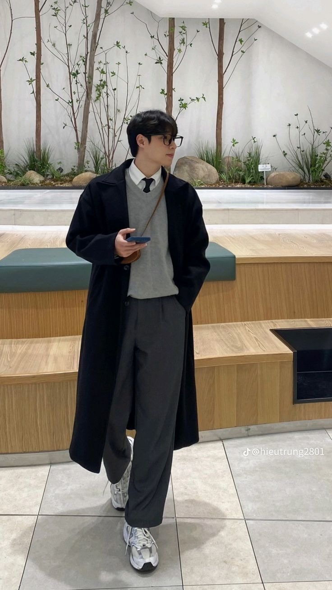
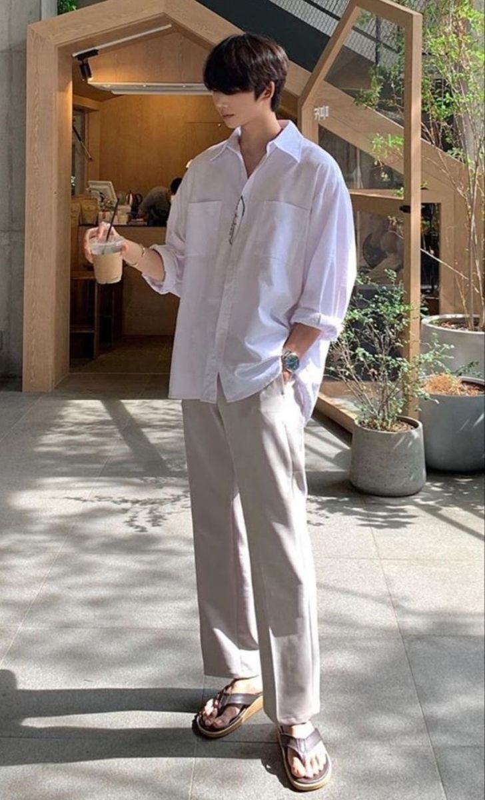
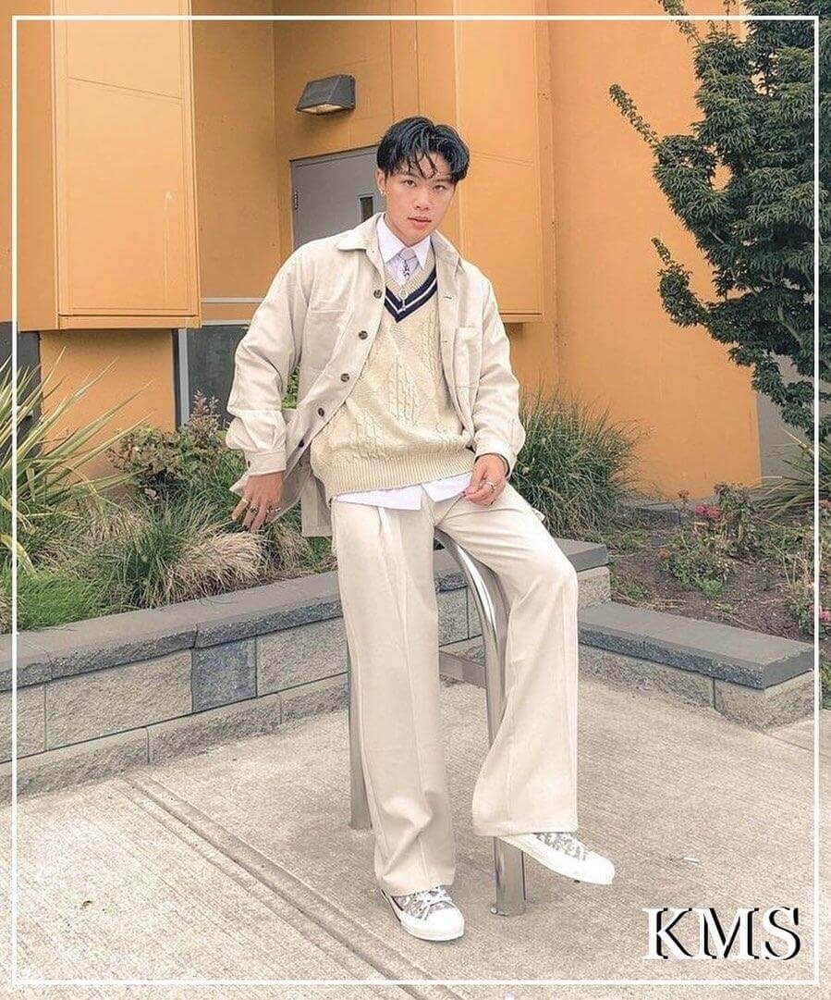

# 韩系极简 (Korean Minimal)

> **状态**: `reviewed` | **最后更新**: 2026-06-13

---

## 📖 概述

**韩系极简**（Korean Minimalism）是源自韩国的一种男性穿搭美学，以干净利落的剪裁、柔和的廓形、低饱和度的中性色板和高品质面料为基础。"不刻意的精致"（effortless polish）是其核心精神 —— 看似随手穿搭，实则每一处比例、面料和色彩都经过深思熟虑。

与日系极简的"侘寂"（wabi-sabi，残缺之美）、欧美极简的"理性几何"不同，韩系极简追求的是一种**自然的不造作感**（no-artfulness），强调衣物与身体的柔和关系 —— 不过分收紧也不过度宽松，如同首尔咖啡馆午后阳光般的舒适与克制。这一风格深受 K-Drama 男性角色和 K-pop 偶像的日常穿搭影响，已从首尔走向全球，成为亚洲男性都市穿搭的重要范式。

---

## 📜 历史文化

### 起源：Woo Youngmi 与首尔奥运会（1988年）

韩系极简男装的起源可追溯到 **1988年**。彼时，首尔举办夏季奥运会，韩国经济腾飞，文化开始对外开放。29岁的设计师 **Woo Youngmi**（禹英美，1959年生于首尔）在首尔开设了一家小型精品店，创立品牌 **Solid Homme**。她是韩国历史上**第一位女性男装成衣设计师**，毕业于成均馆大学时装设计专业，1983年曾获得大阪国际时装大奖。

Woo Youngmi 回忆创立初衷："那是大胆而鲁莽的想法 —— 打破当时韩国男装的硬朗和僵化，创造更柔软、更可触感的男性服装。"Solid Homme 品牌名来源于她收集的布料中反复出现的共同特质 —— 对**材质品质**的执着追求。她将欧洲的优雅剪裁与 Bauhaus（包豪斯）的"形式服从功能"理念相融合，奠定了韩系极简男装的基调：**克制、干净、建筑感**。

### 走向国际：WOOYOUNGMI 与巴黎（2002年）

2002年，Woo Youngmi 在巴黎推出同名高端品牌 **WOOYOUNGMI**，成为首位正式加入巴黎时装周日程的韩国男装设计师。与 Solid Homme 的实穿都市定位不同，WOOYOUNGMI 定位奢侈设计线，更重艺术性与建筑感，从现代艺术和建筑中汲取灵感。2014年，女儿 **Katie Chung**（Woo Youngmi 之女）出任联合创意总监，母女二人共同执掌品牌，将韩系极简推向更国际化的舞台。两人双双入选 **Business of Fashion 500** 全球时尚影响力榜单。

### 关键时间线

| 年份 | 事件 |
|------|------|
| **1983** | Woo Youngmi 获大阪国际时装大奖 |
| **1988** | Solid Homme 创立，韩系极简男装诞生 |
| **1993** | Woo Youngmi 发起"New Wave"项目，推动首尔时装周创立 |
| **2002** | WOOYOUNGMI 品牌在巴黎推出，首位韩国男装设计师进入巴黎时装周 |
| **2007** | Juun.J 在巴黎推出同名品牌，"街头剪裁"概念震动男装界 |
| **2010–2015** | K-pop 全球化浪潮（BTS、EXO 等），韩国时尚获得全球关注 |
| **2014** | Katie Chung 出任 WOOYOUNGMI 联合创意总监 |
| **2016** | Solid Homme 进入欧洲市场（Harrods、Printemps 等） |
| **2017** | System 品牌正式进入巴黎时装周日程 |
| **2020s** | "安静奢华"（Quiet Luxury）全球趋势与韩系极简天然共鸣 |
| **2025** | Post Archive Faction 成为 Pitti Uomo 108 客座设计师，韩系概念男装进入新纪元 |

---

## 🎨 美学特征

### 廓形（Silhouette）

韩系极简的廓形核心是**宽松但有结构** —— 在 oversize 与 tailoring 之间找到精妙的平衡：

- **肩部**：微落肩或自然肩线，不强调极致宽肩，营造柔和的建筑感
- **上身**：适度宽松的廓形（boxy but not baggy），修身但绝不紧身
- **下身**：直筒或微阔腿裤型，裤长通常在脚踝处有微妙裁剪（cropped），露出鞋面
- **比例感**：高腰 + 略短上装（或塞入裤腰），拉长亚洲男性下半身比例
- **层次感**：通过不同长度单品叠穿制造视觉节奏 —— 内层贴身（T恤/高领）、中层松弛（衬衫/针织开衫）、外层有型（大衣/风衣/西装夹克）

**关键公式**：宽腿裤 + 合身上衣 + 长外套 = 经典韩系极简廓形

### 色板（Color Palette）

韩系极简的色板像一个"首尔滤镜" —— 低饱和度、暖底色：

| 类别 | 色彩 |
|------|------|
| **核心中性色** | 米白、奶油白、浅灰、碳灰、黑 |
| **温暖大地色** | 驼色、燕麦色、卡其、深棕、沙色 |
| **冷调重音色** | 藏蓝、深灰蓝、炭黑 |
| **柔和点缀色** | 鼠尾草绿、雾霾蓝、浅玫瑰棕、淡紫灰 |
| **季节变奏** | 春夏偏浅（奶白/淡蓝/亚麻色），秋冬偏深（巧克力棕/勃艮第红/深橄榄） |

**核心原则**：全身不超过 2-3 个色阶，以**同色系不同材质**制造层次，几乎不用大面积印花或 Logo。

### 面料与材质

韩系极简极其重视面料品质 —— 这可能是与快时尚韩风最本质的区别：

- **天然纤维**：高支棉、亚麻、羊毛、羊绒、真丝混纺
- **质感面料**：灯芯绒、麂皮、磨毛棉、双层纱
- **现代科技面料**：OEKO-TEX 认证混纺、透气防水棉锦、抗皱技术面料
- **面料研发**：AMOMENTO 等品牌在日本和韩国进行 in-house 面料开发

**关键体验**：远看干净简约，近看面料肌理丰富，触摸柔软舒适，"穿着比看着更好"是最高标准。

### 关键单品

| 品类 | 单品 | 风格角色 |
|------|------|----------|
| **外套** | 长款羊毛大衣、结构感风衣、廓形西装夹克、短款夹克 | 奠定整体轮廓的"建筑框架" |
| **上衣** | 高领/半高领针织衫（fine-gauge turtleneck）、牛津衬衫、垂感T恤、针织背心 | 内层或中间层的质感载体 |
| **下装** | 直筒西裤、微阔腿棉麻裤、修身深色牛仔裤 | 拉长比例的"地基" |
| **鞋履** | 素面皮质乐福鞋、切尔西靴、简约白色运动鞋 | 干净收尾，绝不抢戏 |
| **配饰** | 极简皮质腕表、细银链/戒指、结构感斜挎包、宽皮带 | 点到为止的点缀 |

---

## 🏷️ 代表品牌

### 殿堂级：韩系极简的奠基者

#### WOOYOUNGMI（2002年，首尔/巴黎）

- **创始人**：Woo Youngmi，现任创意总监 Katie Chung
- **定位**：奢侈设计线，巴黎时装周常客
- **美学关键词**：建筑感、艺术化、流动廓形、未来主义优雅
- **价格区间**：奢侈级（€400–2,000+）
- **适合人群**：追求设计师语言的成熟男性，艺术与建筑行业从业者

#### Solid Homme（1988年，首尔）

- **创始人**：Woo Youngmi
- **定位**：高端当代男装，比 WOOYOUNGMI 更实穿、价位更亲民
- **美学关键词**：干净剪裁、Bauhaus 功能主义、都市考究感
- **价格区间**：高端当代（€150–800）
- **全球分布**：24+ 韩国门店，入驻 Harrods、Printemps、SSENSE 等

#### System / System Homme（1990年，首尔）

- **创始人**：Hee-Soo Kim，隶属于 The Handsome Group
- **定位**：当代极简 × 细节至上，2017年起进入巴黎时装周
- **美学关键词**："理论上极简，实践上极致"；镂空、嵌合硬件、解构廓形
- **价格区间**：当代中高端（€200–600）
- **里程碑**：2025年在巴黎玛黑区开设首家旗舰店，SS26 以"办公室白日梦"主题亮相巴黎

### 当代实力派

#### Juun.J（2007年，首尔/巴黎）

- **创始人**：Jung Wook Jun（郑旭俊）
- **定位**：先锋奢侈男装，"街头剪裁"（street tailoring）开创者
- **美学关键词**：超大廓形、经典剪裁 × 街头叛逆、建筑感解构
- **里程碑**：继 Woo Youngmi 后第二位在巴黎男装周固定走秀的韩国设计师；与 Adidas、Canada Goose 等联名

#### AMOMENTO（2016年，首尔）

- **创始人**：Lee Mee-Kung
- **定位**：安静奢华的当代极简
- **美学关键词**：有机廓形、in-house 面料开发（日韩采购）、被比作"韩国版 Jil Sander/Helmut Lang"
- **价格区间**：当代中高端（€200–700）
- **适合人群**：追求"安静奢华"的投资型衣橱建设者

#### Ader Error（2014年，首尔）

- **创始人**：匿名创意集体（时尚、插画、平面设计、建筑背景）
- **定位**：前卫极简 × 青年文化
- **美学关键词**："But near missed things"（发现被忽视的美）；解构西装、错视拼接、招牌群青蓝
- **关键动态**：2025年推出子品牌 **Significant** 及 **Black Tag** 系列，专注纯黑极简剪裁
- **价格区间**：当代中端（€100–500）

#### Post Archive Faction（PAF，2018年，首尔）

- **创始人**：Dongjoon Lim & Sookyo Jeong
- **定位**：未来主义概念男装，技术极简
- **美学关键词**：雕塑感、皱缩处理、冷峻单色、后工业氛围
- **关键动态**：2025年6月成为 **Pitti Uomo 108** 客座设计师（继 Juun.J 后第二位获此荣誉的韩国品牌），FW25 在巴黎男装周以"床上醒来"的戏剧化走秀引发关注
- **价格区间**：当代中高端（€200–900）

### 实用主义中端

#### thisisneverthat（2009年，首尔）

- **定位**：90年代/00年代极简街头风格
- **美学关键词**：标语 T 恤、宽松卫衣、羽绒夹克，韩风街头入门首选
- **价格区间**：平易近人（€50–200）

#### Unaffected（2015年，首尔）

- **定位**：极简工业街头风
- **美学关键词**：实用主义细节 × 极简廓形；与 ASICS、G-SHOCK 联名
- **价格区间**：中端（€80–300）

#### Andersson Bell（2014年，首尔）

- **定位**：斯堪的纳维亚极简 × 韩式色彩
- **美学关键词**：干净廓形搭配意外亮色或印花，适合想要极简但有活力的男性
- **价格区间**：中端（€100–400）

#### Recto（2015年，首尔）

- **定位**：中性极简剪裁
- **美学关键词**：单色调、雕塑感衬衫与西服、跨季节基础单品
- **价格区间**：中端（€100–350）

---

## 👤 风格偶像 & 名人

### K-pop 偶像：极简穿搭的全球推手

K-pop 偶像对韩系极简的全球化起到了至关重要的作用。他们的日常机场穿搭（airport fashion）、MV 造型、品牌代言，将韩系极简的美学传递给全球数亿粉丝：

- **BTS 防弹少年团**：成员 **Jin** 以"少即是多"的精致私服著称 —— 高领针织衫 + 宽松西装裤 + 长款大衣是他的标志组合。**Jungkook**（田柾国）与 **Mingyu**（SEVENTEEN）均为 **Calvin Klein** 品牌大使，将 CK 的极简基因与韩系审美完美融合。
- **Cha Eun-Woo**（车银优，ASTRO）：2024年起担任 Calvin Klein 品牌大使，以纯净面孔和极简穿搭被誉为"行走的 CK 画报"。
- **Rowoon**（路云，SF9）：185cm 的身高完美示范韩系极简廓形——长款大衣、垂感衬衫、宽松西裤，是韩系极简的最佳"人体衣架"之一。

### K-Drama 男主角：剧内剧外的风格教科书

韩国电视剧（K-Drama）男性角色几乎清一色采用极简穿搭美学，从《鬼怪》中 Gong Yoo（孔刘）的长款大衣到《爱的迫降》中 Hyun Bin（玄彬）的军装风极简夹克，这些角色成为了亚洲男性穿搭的最高参照：

- **Gong Yoo**（孔刘）：韩系极简的活化石，《鬼怪》中的驼色长款大衣 + 高领毛衣风靡全亚洲
- **Hyun Bin**（玄彬）：硬朗但极简的军装大衣 + 高领内搭组合
- **Park Seo-Joon**（朴叙俊）：将极简融入休闲运动风格，T恤 + 西装裤 + 运动鞋的混搭大师

### 设计师偶像

韩国时装设计师自身也成为风格偶像。Woo Youngmi 本人的装扮 —— 利落短发、素色衣着、极简配饰 —— 本身就是品牌美学的最佳代言。Jung Wook Jun（Juun.J）以全黑极简造型出席每场秀后，成为韩国设计师群体的视觉签名。

---

## 👗 秀场 & 时装周

### 巴黎时装周：韩系极简的主战场

巴黎男装周是韩系极简最高级别的展示舞台。目前固定出席的韩国品牌包括：

- **WOOYOUNGMI**：自 2002 年起，每年两季固定走秀。最近的 SS25 系列以"折叠与流动"为主题，将折纸般精确的领口与飘逸廓形结合
- **Juun.J**：自 2007 年起，以巴黎男装周为阵地演绎"街头剪裁"
- **System**：自 2017 年起进入巴黎时装周官方日程，2025 SS26 以"办公室白日梦"主题探索职场单调中的逃逸美学
- **Post Archive Faction（PAF）**：FW25 首次在巴黎男装周以 full runway show 亮相，模特在床上醒来的戏剧化呈现成为当季话题

### 首尔时装周：本土创意孵化器

首尔时装周（Seoul Fashion Week）每年在 **DDP（东大门设计广场）** 举办，是韩国新生代设计师的孵化平台。2025年 SS26 正值首尔时装周 25 周年，通过 **"The Selects"** 项目向全球买手展示新锐品牌。首尔时装周的风格相比巴黎更实验、更多元 —— 从极简到街头到解构，形成了"巴黎看商业高度，首尔看创意宽度"的双城格局。

### Pitti Uomo：韩国男装的历史性突破

意大利佛罗伦萨的 **Pitti Uomo** 是全球最重要的男装展。韩国品牌在此的突破性事件：

- **Juun.J**：首位受邀 Pitti Uomo 的韩国客座设计师
- **Post Archive Faction**（2025年6月，第108届）：第二位获此殊荣的韩国品牌，标志着韩国概念男装从巴黎边缘走向佛罗伦萨中心

---

## 🔗 关联风格

### 韩系极简 vs 日系极简

| 维度 | 韩系极简 | 日系极简 |
|------|----------|----------|
| **哲学根基** | 自然的不造作（no-artfulness），柔和本色 | 侘寂（wabi-sabi），残缺、不对称、不完美之美 |
| **廓形** | 柔和结构，宽松但修身 | 宽大包裹、平面剪裁（和服基因）、非对称垂坠 |
| **色板** | 暖底中性色 + 低饱和度柔和色 | 靛蓝、炭灰、燕麦、苔绿，会随穿着老化的深沉色调 |
| **面料** | 柔软混纺（羊绒、丝棉、科技面料）、触感舒适 | 原生质感面料（粗棉、手工麻、蓝染丹宁） |
| **精神氛围** | 首尔咖啡馆的精致舒适 | 京都禅寺的沉静冥想 |
| **代表品牌** | WOOYOUNGMI、System、AMOMENTO | Yohji Yamamoto、Issey Miyake、Auralee、Visvim |

### 韩系极简 vs 欧美极简

| 维度 | 韩系极简 | 欧美极简 |
|------|----------|----------|
| **哲学根基** | 自然的柔和，随性优雅 | 理性还原（形式服从功能），机器时代的精准 |
| **廓形** | 柔和流线，有温度的宽松 | 锐利几何，硬挺结构 |
| **色板** | 暖底中性、柔和米色系 | 冷调单色：纯黑、纯白、灰、海军蓝 |
| **面料** | 柔软舒适、亲肤触感 | 挺括精准：精纺羊毛、皮革、高科技合成 |
| **精神氛围** | 咖啡与阳光的松弛 | 董事会室的权力与精密 |
| **代表品牌** | WOOYOUNGMI、AMOMENTO | Jil Sander、COS、The Row、Calvin Klein（早期） |

### 韩系极简 vs 韩系街头

韩系极简与韩系街头（Korean Streetwear）是同一文化土壤上两条不同路径：

- **韩系极简**：克制、柔和、精致、偏正式/商务休闲
- **韩系街头**：宽松 oversized、运动元素、Logo/印花、受 hip-hop 和滑板文化影响
- **交汇地带**：Ader Error 和 thisisneverthat 在两者之间架桥，将街头的松弛感注入极简框架

### 可融合风格

韩系极简天生的包容性使其成为"风格基底层"：
- **韩系极简 + 斯堪的纳维亚**（Andersson Bell 路线）= 干净廓形 + 意外亮色
- **韩系极简 + 军事/工装**（Unaffected 路线）= 极简框架 + 功能性细节
- **韩系极简 + 未来主义**（PAF 路线）= 单色 + 技术性结构

---

## 📈 流行趋势

### 2025–2026 关键词

#### 1. 安静奢华 2.0（Quiet Luxury 2.0）

全球"安静奢华"趋势在韩国找到天然土壤。2025–2026年的韩系极简已从"无 Logo 的昂贵"进化为"**无声的设计语言**"—— 品牌辨识度不再依赖于任何视觉标识，而是通过**剪裁、面料垂坠感和色彩比例**让懂的人自然识别。AMOMENTO 和 System 的 SS26 系列都是这一趋势的最佳例证。

#### 2. 超宽松轮廓的精细化（Refined Oversize）

Oversize 不再是"穿大两号"，而是**结构的重新设计**：肩线经过精密计算、袖长微调至恰好盖住手腕、裤长在脚面形成一道自然的折痕。Ader Error 的 Black Tag 系列和 Juun.J 的最新剪裁代表了这个方向。

#### 3. 黑色极简回潮（Black-on-Black）

纯黑造型回归，但强调**材质对比**：哑光羊毛 + 光泽丝绸 + 粗犷针织在同一个黑色底色下做出层次。Ader Error 的 Significant/Black Tag 系列（2025）即是这一趋势的宣言。

#### 4. 中性/去性别廓形（Gender-fluid Silhouette）

WOOYOUNGMI 和 Recto 推进的中性剪裁 —— 同一件衬衫或大衣设计为男女皆可穿着。宽大但优雅的廓形模糊了传统男装的结构边界。

#### 5. 可持续与技术面料（Sustainability + Tech Fabric）

韩国品牌大量投资环保面料开发：AMOMENTO 的 in-house 日韩面料体系、Solid Homme 的 OEKO-TEX 认证面料，以及各品牌对再生纤维和抗皱技术面料的采用，将"极简"延伸到生产伦理层面。

#### 6. 韩剧联名与内容驱动销售

K-Drama 角色穿搭（PPL 植入）直接驱动单品销量。2025年趋势是品牌主动与剧组服装造型师合作，将当季系列预植入即将播出的热门剧集。

### 市场数据

- 韩国时尚市场预计 **2029年达到 251.5亿美元**
- 韩国人已成为**全球人均奢侈品消费最高**的国家
- 韩国男装出口和全球零售渠道在过去五年增长显著，尤其在中国大陆、日本、东南亚和欧洲市场

---

## 💡 穿搭建议

### 入门三步法

**第一步：建立中性色基础衣橱**
- 2件高质量白色/黑色T恤（高支棉，不透视）
- 1件灰色/驼色半高领针织衫
- 1条黑色直筒西裤 + 1条米色微阔腿棉麻裤
- 1件中性色长款羊毛大衣（冬季）/ 1件卡其色风衣（春秋）

**第二步：掌握层次节奏**
- 内搭（T恤/高领）→ 中间层（牛津衬衫/针织开衫/马甲）→ 外层（西装夹克/大衣/风衣）
- 每层长度微差（内短外长，或内长外短），避免全部齐平
- 利用面料对比制造深度（精细针织 × 挺括棉质 × 毛呢外套）

**第三步：鞋履与配饰收尾**
- 一双纯白皮质运动鞋（百搭春夏）
- 一双深色切尔西靴或乐福鞋（秋冬/正式）
- 一只极简皮质手表（棕色或黑色表带）
- 一条细银链/一个简单戒指（非必需，但可提升精致度）

### 亚洲男性身形适配

- **窄肩/偏瘦体型**：选择微落肩西装和略有结构的外套，避免过于贴身的剪裁；直筒裤比紧身裤更能平衡上下比例
- **偏壮/运动体型**：选择垂感好的宽松T恤和微阔腿裤，避免紧身上衣；长款大衣能拉长视觉线条
- **偏矮体型**：高腰裤 + 上衣塞入 + 同色系鞋裤延伸腿部线条；避免过长外套（控制在膝盖以上）
- **深肤色**：暖底中性色（驼色、燕麦色、沙色）比冷灰色更衬肤色

### 场景穿搭公式

| 场景 | 公式 | 示例 |
|------|------|------|
| **日常通勤** | 直筒西裤 + 牛津衬衫/高领针织 + 微廓西装 + 乐福鞋 | 灰西裤 + 白衬衫 + 深蓝西装 + 黑乐福鞋 |
| **周末休闲** | 阔腿棉麻裤 + 垂感T恤 + 针织开衫 + 白球鞋 | 米色阔腿裤 + 白T + 燕麦针织衫 + 白运动鞋 |
| **晚间约会** | 深色直筒裤 + 黑色半高领 + 结构西装夹克 + 切尔西靴 | 黑裤 + 黑高领 + 灰西装 + 黑切尔西靴 |
| **咖啡/看展** | 微阔牛仔裤 + 落肩衬衫 + 长款风衣 + 简约帆布鞋 | 深蓝牛仔裤 + 白落肩衬衫 + 卡其风衣 + 帆布鞋 |
| **正式场合** | 同色系三件式（西装+马甲+西裤）+ 极简领带或无领带 | 全炭灰西装三件套 + 白衬衫 + 德比鞋 |

### 品牌入门推荐（按预算）

| 预算水平 | 入门品牌 | 核心单品推荐 |
|----------|----------|--------------|
| **入门（€50–150）** | thisisneverthat、Unaffected | 基础 T恤、卫衣、宽松裤装 |
| **进阶（€150–400）** | Ader Error、Andersson Bell、Recto | 廓形西装、解构衬衫、设计感大衣 |
| **高阶（€400–800）** | Solid Homme、System、AMOMENTO | 长款羊毛大衣、精裁西裤、羊绒针织 |
| **顶级（€800+）** | WOOYOUNGMI、Juun.J | 秀场款西装、建筑感大衣、设计师联名单品 |

---

> **风格金句**：韩系极简不是穿得少，而是每一件都在说话 —— 说得轻，但分量重。

## 📸 风格图库

> 以下为风格代表性穿搭参考图，搜集自公开时尚媒体。

*风格穿搭参考*

*Pin by Joshua Cheng on Fall/Winter 2024 | Korean summer outfits, Korean ...*

*35 Date Outfit Ideas Casual Men Korean*
