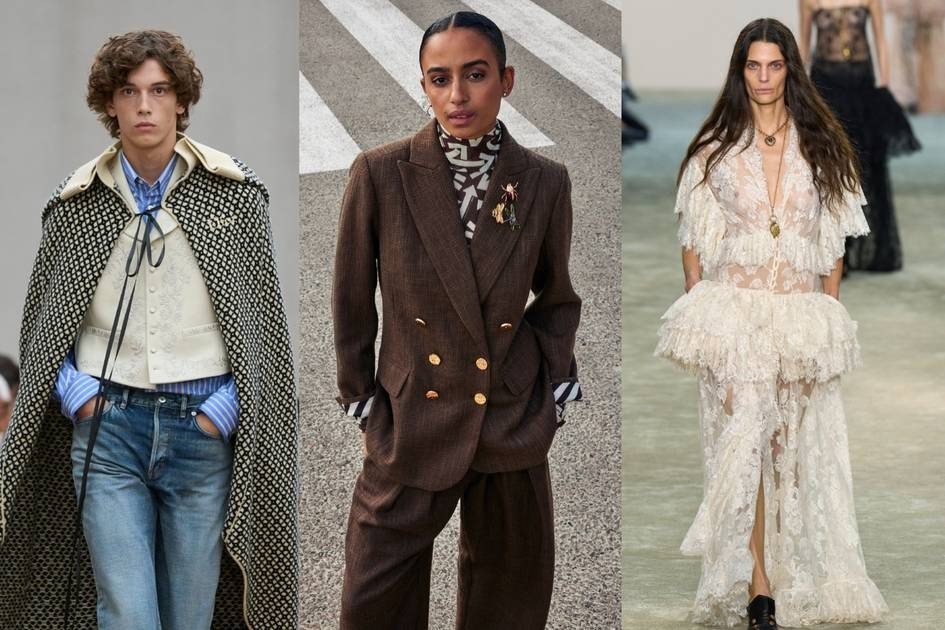
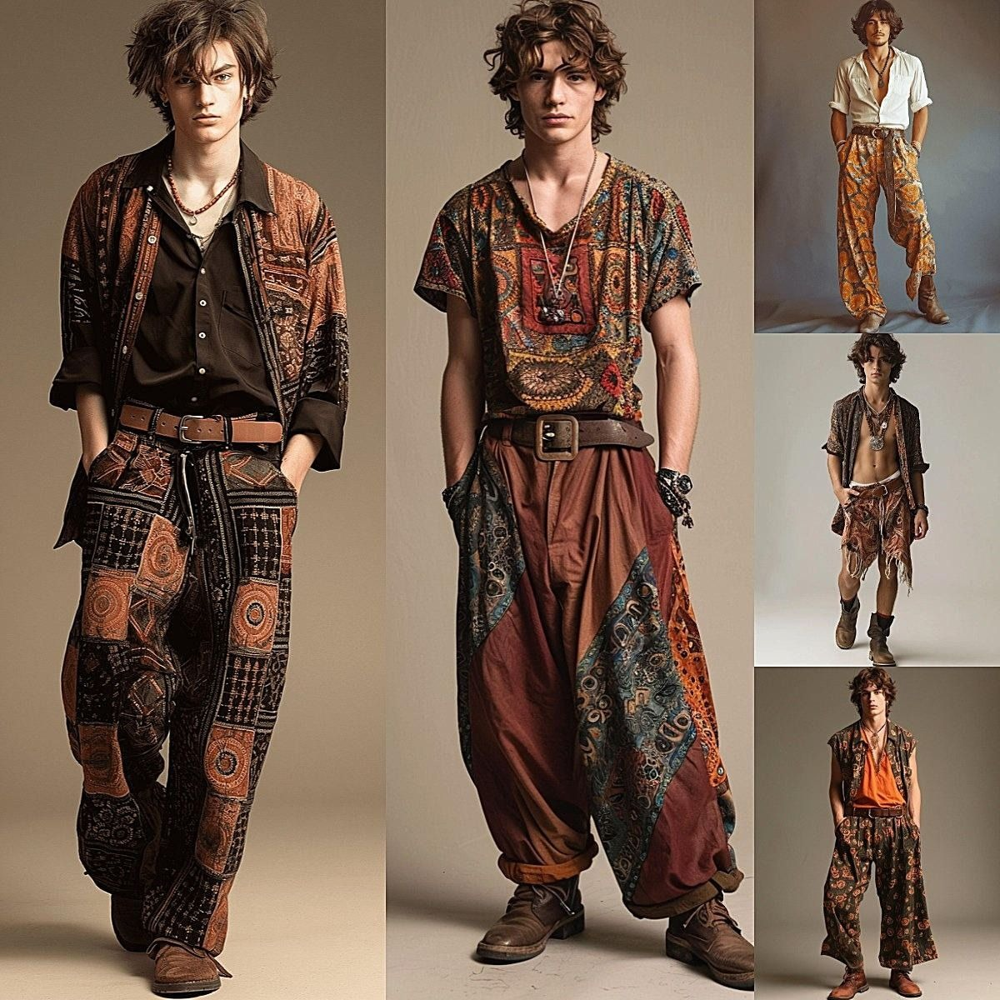
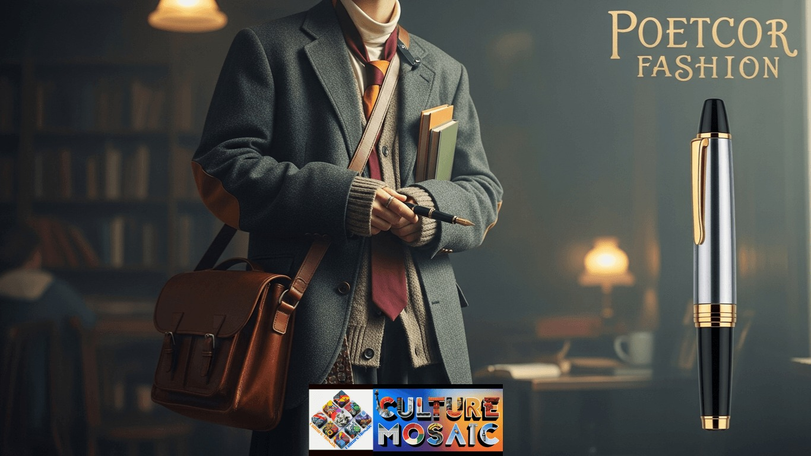

# 诗人美学 (Poetcore)
> **状态**: `reviewed` | **最后更新**: 2026-06-13

## 📖 概述
Poetcore（诗人美学）是 2025 年男装最诗意的答案——它把浪漫主义文学的孤独与智识注入穿衣，用**流动的衬衫、灯芯绒的触感、和一个旧旧的信使包**构成视觉语言。它不追求锋利、不追求「酷」，而是追求一种温暖而若有所思的氛围：仿佛你刚从图书馆走出来，要去邮局寄一封信，然后在秋日阳光下散步。Dior Men（Kim Jones 时期）以其飘逸的诗人衬衫和浪漫剪裁成为这一趋势的高级时装旗舰；2025–2026 年的 T 台上，Ann Demeulemeester、McQueen 和 Ralph Lauren 也纷纷重拾诗人衬衫。

## 📜 历史文化
- **19 世纪浪漫主义根源**：诗人衬衫（Poet Blouse）原是欧洲贵族的内衣——荷叶边领口、蓬松袖管、前襟褶皱——后来被 19 世纪的艺术家、知识分子和作家作为日常穿着，成为「创造性灵魂」的视觉符号。
- **1960s–1970s 反文化复兴**：Jimi Hendrix、Jim Morrison 等音乐人将诗人衬衫带入摇滚舞台，赋予其波希米亚和不羁的当代气质。
- **1990s–2000s 极简主义压制**：浪漫主义男装在极简主义主导的时代退居边缘。
- **2020s 文学审美回潮**：Dark Academia 和 Light Academia 的社交媒体爆发为 Poetcore 铺垫了文化土壤——TikTok 上 #darkacademia 数十亿播放量证明了人们对「像文学主角一样穿衣」的渴望。
- **2024–2025 Dior Men 推动**：Kim Jones 在 Dior 男装系列中使用飘逸的浪漫剪裁——流动线条、柔软织物、诗人领口——将 Poetcore 推进高级时装的核心议程。2025 秋冬 T 台显示 Ann Demeulemeester、McQueen、Chloé 和 Ralph Lauren 全部重新呈现了诗人衬衫。

## 🎨 美学特征
| 类别 | 核心单品 |
|------|---------|
| **上装** | **诗人衬衫（Poet Blouse）**——飘逸的面料（棉/亚麻/丝混纺）、荷叶边领口、蓬松袖管、前襟褶皱或细绳系带；宽松廓形的亚麻/棉质长袖衬衫；轻薄高领针织衫（燕麦色/奶白色） |
| **外套** | **灯芯绒/斜纹软呢/人字纹西装外套**——「从祖父那借来的」宽松版型，纹理丰富而非华丽；风衣（Trench Coat）——柔软织物版本，不要硬挺结构 |
| **裤装** | 宽腿西裤（深灰、炭色、奶白）；灯芯绒直筒长裤；褪色宽松牛仔 |
| **包袋** | **皮质信使包/邮差包**——旧旧的、磨损的、棕色调——仿佛里面装着手稿 |
| **鞋履** | 乐福鞋、Paraboots、穿旧的皮革德比鞋、简单帆布鞋 |
| **配饰** | 简单的金属吊坠项链、旧皮革腕带、一条老围巾（随意搭在肩上）、复古眼镜 |

**面料与质感**：流动的丝/棉/亚麻（衬衫）vs. 结实的灯芯绒/斜纹软呢（外套）——**软与硬的对比是 Poetcore 的感官核心**。

**色调（Poetcore Palette）**：
- 羊皮纸奶油/米白
- 苔绿 / 橄榄 / 鼠尾草
- 炭黑 / 墨色
- 深棕 / 焦糖
- 褪色靛蓝
- 温酒红

**核心哲学**：Poetcore 彻底拒绝快时尚。衣服应有「岁月的包浆」——二手市场、古董店和传家衣橱是优先货源。一件诗人衬衫在你祖父身上和在 Dior Men T 台上的距离，并没有你想象的那么远。

## 🏷️ 代表品牌
| 品牌 | 定位 |
|------|------|
| **Dior Men（Kim Jones）** | Poetcore 高级时装的旗舰——飘逸剪裁、诗人领口、浪漫主义男装的当代界定者 |
| **Ann Demeulemeester** | 暗黑浪漫主义的老牌诗人——2025 FW 重新呈现诗人衬衫 |
| **Alexander McQueen** | 哥特浪漫的极致——戏剧化的诗人衬衫和流动廓形 |
| **Ralph Lauren** | 2025 FW 中也加入了诗人衬衫——美式经典对浪漫主义的吸收 |
| **Loewe** | 手工感和工匠精神让 Loewe 的宽松衬衫和风衣天然契合 Poetcore |
| **Drake's** | 英伦软剪裁的灯芯绒西装外套和围巾，是被译成绅士语的 Poetcore |
| **Margaret Howell** | 英国低调知识分子风格——亚麻衬衫和宽腿裤的天然契合 |
| **LEMAIRE** | 流动廓形和诗意日常的完美呈现——无需强调，本身就是 Poetcore |

## 👤 风格偶像
| 偶像 | 标志性造型 |
|------|-----------|
| **Jim Morrison (The Doors)** | 诗人衬衫 + 皮裤 + 凌乱卷发——诗人的摇滚版本 |
| **Jimi Hendrix** | 飘逸的荷叶边袖衬衫 + 天鹅绒外套——把浪漫主义带入迷幻摇滚 |
| **Timothée Chalamet** | 红毯上的流动剪裁和柔软面料——当代 Poetcore 的银幕身体 |
| **Josh O'Connor** | 日常中宽松亚麻衬衫 + 灯芯绒外套的轻松示范——更接近普通人可穿的 Poetcore |
| **Harry Styles** | 性别流动的浪漫衬衫 + 珍珠项链——Poetcore 的商业化偶像 |

## 🔗 关联风格
- **Dark Academia** — 共享文学浪漫和学者氛围，但 Poetcore 更柔软、更阳光、不那么哥特
- **Light Academia** — 与 Poetcore 高度重叠，侧重于更明亮、更田园的版本
- **Boho / Bohemian** — 历史上的波希米亚风格是 Poetcore 的前身，Poetcore 减去民族印花和繁复配饰
- **Romanticism** — 19 世纪浪漫主义运动是其精神血统
- **Soft Tailoring（软剪裁）** — Poetcore 的西装部分取自软剪裁传统（Drake's、Boglioli）
- **Rugged Comfort** — 令人意外的关联——两者共享「有质感的面料」「旧感」「反快时尚」的价值观，但 Poetcore 更柔弱、更知识分子，Rugged Comfort 更粗犷、更体力劳动

## 📈 流行趋势
- 2025 FW 被 L'Officiel USA 定义为「诗人衬衫回归季」——Dior、Ann Demeulemeester、McQueen、Chloé、Ralph Lauren 同时推出诗人衬衫
- Lifestyle Collective（2026 年 3 月）首次为 Poetcore 命名并系统阐释——将其定位为「知识分子对极简主义的回答」
- 社交媒体上 Dark Academia 标签数十亿播放量催生了对「文学穿衣」的广泛需求，Poetcore 是一个自然的子集和进化
- 慢时尚（Slow Fashion）和反 fast-fashion 的消费运动为 Poetcore 的「投资旧物、反对浪费」精神提供了道德基础
- 男性气质边界的持续扩展使流动面料和女性化剪裁在男装中更易被接受——Poetcore 受益于这一文化转向

## 💡 穿搭建议
1. **入门公式**：宽松亚麻/棉长袖衬衫（飘逸感）+ 灯芯绒直筒裤 + 穿旧的皮革德比鞋 → 零风险知识分子造型
2. **进阶的「软硬对比」**：诗人荷叶边衬衫 + 结构感灯芯绒西装外套 + 宽腿炭灰西裤——Poetcore 的核心张力
3. **诗人衬衫怎么选**：
   - 入门：Uniqlo 宽松亚麻衬衫（简单，不夸张）
   - 进阶：Dior Men 的诗人领衬衫（真正的荷叶边和蓬松袖）
   - 中档：Cos 或 Margaret Howell 的柔软衬衫
4. **包袋是关键**：一个旧的棕色皮质信使包——不是运动背包，不是公文包，不是斜挎小包——是那种跨在身上的邮差包。这是 Poetcore 最被低估的识别符。
5. **围巾的使用**：一条长围巾随便搭在脖子上——棉/羊毛混纺，中性色，不需要系，自然垂落——Poetcore 的标志性动作
6. **禁忌**：不要穿任何 Logo 明显的、不要穿运动鞋（除非是极度简单的帆布款）、不要让任何单品看起来是「全新的」——Poetcore 是关于时间的痕迹

## 📸 风格图库

> 以下为风格代表性穿搭参考图，搜集自公开时尚媒体。

*风格穿搭参考*

*Pin by James Gettys on My Style | Boho men style, Bohemian outfit men ...*

*Poetcore: 7 Essential Ways to Master This Literary Aesthetic*
