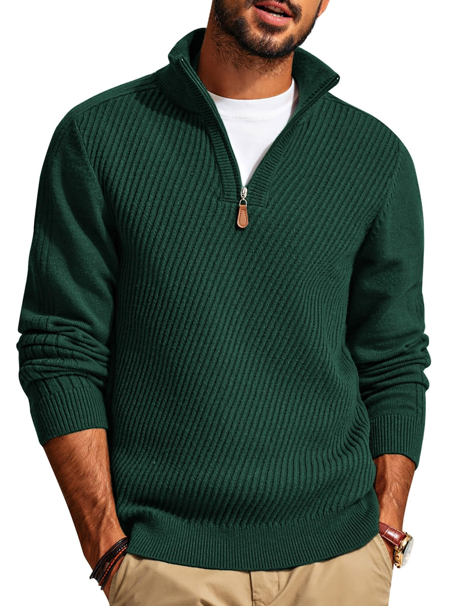
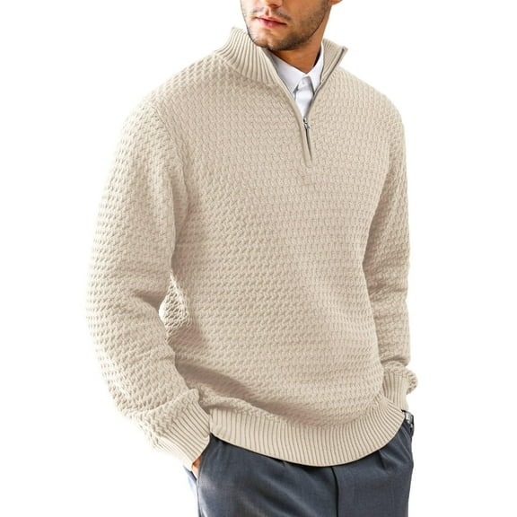
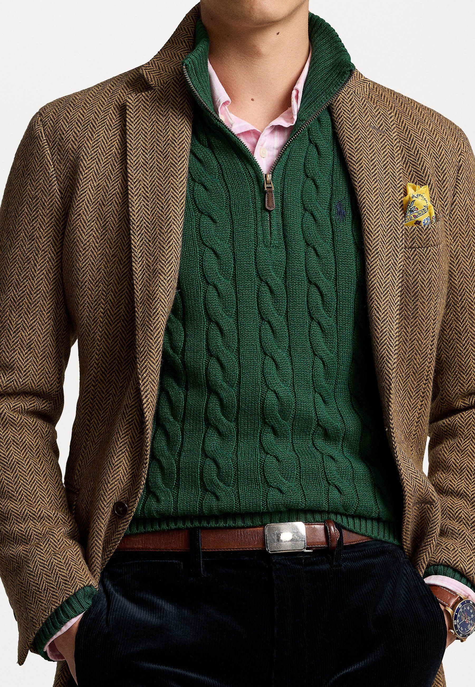

# 1/4拉链复兴 (Quarter-Zip Revival)

> **状态**: `reviewed` | **最后更新**: 2026-06-13 | **趋势**: 流行趋势
> **分类**: 美式 > 当代2020s > 半正式 > 职场 > 复古调性

## 📖 概述
- **发源年代**: 2024-2025（TikTok引爆）
- **发源地**: 纽约布朗克斯（两个22岁青年发视频引爆）
- **风格关键词**: 四分之一拉链、针织衫、厚框眼镜、职场休闲、知识分子感
- **一句话定义**: 一度被视为"爸爸工装"的 Quarter-Zip 针织衫，被 Gen Z 重新发现为"知识分子穿搭"的新符号。

## 📜 历史文化
2025 年 Q4，纽约布朗克斯的两名 22 岁青年在 TikTok 发布视频展示自己的 Quarter-Zip 穿搭，引发病毒式传播。#quarterzip 标签在 TikTok 获得 5500万+ 播放。Lyst 数据显示 Quarter-Zip 针织衫搜索需求上涨 31%。

本质上，这是 Gen Z 在"安静奢华"退潮后找到的新身份符号——比西装随意，比T恤精致，正好卡在"看起来花了心思但没过度"的甜蜜点。

## 🎨 美学特征
- **Quarter-Zip 本身是焦点**——不是内搭，而是外穿的造型核心
- 搭配逻辑：Quarter-Zip + 休闲裤/牛仔裤 + 乐福鞋/球鞋
- 色板：奶油色、海军蓝、深灰、驼色、橄榄绿
- 面料：美利奴羊毛、羊绒混纺、重磅棉

### 标志搭配
| 搭配方案 | 场景 |
|---------|------|
| Quarter-Zip + 卡其裤 + 乐福鞋 | 职场/半正式 |
| Quarter-Zip + 水洗牛仔裤 + 德训鞋 | 周末/咖啡厅 |
| Quarter-Zip + 西装外套 + 西裤 | 商务休闲（替代衬衫+领带）|

## 🏷️ 代表品牌
- **Loewe** — 奢侈 Quarter-Zip 的代表
- **Lacoste** — 网球×Quarter-Zip 的传统玩家
- **Ralph Lauren** — Preppy Quarter-Zip 的经典来源
- **Uniqlo** — 平价美利奴 Quarter-Zip，入门首选
- **COS / Arket** — 极简版 Quarter-Zip

## 👤 风格偶像
- **Central Cee** — 英国说唱歌手，Quarter-Zip 穿搭的 TikTok 推手
- **T-Pain** — 意外成为 Quarter-Zip 风格参考
- **Jacob Elordi** — 将 Quarter-Zip 融入高端休闲
- **Jeremy Allen White** — 《熊家餐馆》中的厨房到街头穿搭

## 📈 流行趋势
- 2025-2026 持续上升，从 TikTok 趋势沉淀为实际购买行为
- 对亚洲男性友好——拉链针织结构感好，可增加肩部视觉宽度

## 💡 穿搭建议
1. 第一件选奶油色或海军蓝美利奴羊毛——最百搭
2. 里面穿白T恤，下摆露出1-2cm
3. 搭配直筒卡其裤+乐福鞋=最安全公式

## 📸 风格图库

> 以下为风格代表性穿搭参考图，搜集自公开时尚媒体。

*风格穿搭参考*

*DAFPZW Men's Quarter Zip Pullover Sweater Cable Knit Casual Mock Neck ...*

*Polo Ralph Lauren CABLE KNIT COTTON QUARTER ZIP SWEATER - Džemperis ...*
