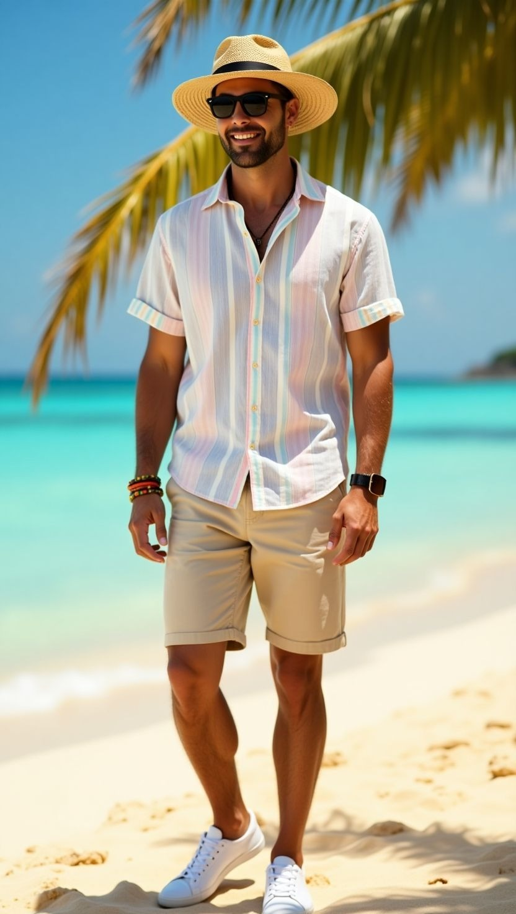

# 度假休闲 (Resort Vacation)
> **状态**: `reviewed` | **最后更新**: 2026-06-17

## 📖 概述

**度假休闲风格（Resort Wear / Cruise Wear）**是男装体系中专门应对温暖气候度假场景的着装美学。它的核心理念是：**在炎热环境中依然保持体面、从容与精致感，同时不牺牲舒适性。**

这一风格诞生于20世纪初跨大西洋豪华邮轮的头等舱甲板，成熟于战后地中海与加勒比海的黄金度假年代，并持续演化至今。从夏威夷的 Aloha 衬衫、地中海的亚麻西装，到加勒比海的瓜亚贝拉衬衫，度假休闲风格天然具有跨文化基因——它融合了欧洲的剪裁传统、亚洲的纺织品工艺、拉丁美洲的休闲廓形，以及热带岛屿的色彩美学。

在当代男装语境中，度假休闲已不再是仅限假日的"特殊着装"，而演变为一种全年通用的**生活态度**——它代表从容、懂得享受、低调而不失品位。

---

## 📜 历史文化

### 1. 邮轮时代：度假装的诞生（1920s-1930s）

度假休闲风格的源头可追溯至20世纪初。富裕的北半球精英为躲避寒冬，乘坐跨大西洋豪华邮轮前往加勒比海、佛罗里达和地中海。这让服装面临实际问题：既要在甲板上保持体面，又要在热带目的地保持凉爽。

于是**"邮轮系列"（Cruise Collection / Collection Croisière）**应运而生——这是介于秋冬与春夏之间的季间产品线，专为旅行场景设计。早期的度假装以轻盈的棉质和亚麻面料为主，廓形比日常正装更松弛，但依然保留了一定的结构感。

### 2. 夏威夷衬衫（Aloha Shirt）的传奇

夏威夷衬衫——正式名称为 **Aloha 衬衫**——是度假休闲风格中最具辨识度的单品。它的起源是夏威夷多族裔移民文化交融的产物：

- **1920年代**：日裔移民女性将和服（Kimono）与浴衣（Yukata）面料改制成男士衬衫，日本图案（富士山、樱花、竹子）成为早期主流。Gordon S. Young——一位夏威夷大学学生——据传在1926年将一批这种衬衫带到华盛顿大学，引发校园热议。
- **1930年代**：华裔商人 Ellery Chun 在威基基（Waikiki）的 King-Smith 布店开始批量生产印花衬衫，使游客无需等待定制。他于1937年注册了 **"Aloha Shirt"** 商标。
- **1935年6月28日**：檀香山广告报（Honolulu Advertiser）首次在印刷品中出现"Aloha shirt"一词——Musa-Shiya 布店的广告标价 95 美分起。
- **二战后**：从太平洋战场归国的美军将夏威夷衬衫带回本土。珍珠港事件后，日本图案暂时式微，夏威夷本土花卉、呼啦舞者、岛屿风景成为主流。
- **1959年**：夏威夷正式成为美国第50个州，全民对夏威夷文化产生狂热。1966年，夏威夷官方推广 **"Aloha Friday"** ——周五穿夏威夷衬衫上班——这被认为是美国本土 **"休闲星期五"（Casual Friday）** 文化的起源。

### 3. 地中海度假文化与 Riviera 风格

法国与意大利里维埃拉（Riviera）是度假休闲风格的另一个精神故乡。从19世纪末开始，欧洲贵族和艺术家们聚集于尼斯、戛纳、圣特罗佩和波托菲诺，形成了独特的"Riviera 美学"。

**核心元素来源：**
- **法国海军**：布列塔尼条纹衫（marinière tricot rayé），1858年成为法国海军正式制服，后由 Coco Chanel 引入时尚语境。
- **意大利剪裁**：1950年代 Brioni 引领的"欧洲大陆风格"（Continental Look）——柔软构造、纤瘦廓形、大量使用丝和亚麻，直接挑战英式定制正教的僵硬传统。正如1956年《Vogue》所言："意大利对男装的影响已成事实。"
- **渔夫与农民**：草编帆布鞋（espadrilles）起源于13世纪比利牛斯山区的加泰罗尼亚农家；亚麻和棉麻混纺面料则来自地中海周边数千年的穿着传统。

### 4. 瓜亚贝拉衬衫与古巴领的传播

**1959年古巴革命**是度假男装史上的转折点。大量古巴流亡者涌入迈阿密和纽约，带来了**瓜亚贝拉衬衫（Guayabera）**——一种轻质、多口袋、开领的工作衬衫，根源可追溯至16-18世纪的墨西哥、古巴和菲律宾。这种衬衫的宽大翻领（后来被称为古巴领 / Camp Collar）本是热带工人的实用设计——让衬衫在极端湿热中远离脖颈。

美国冲浪者迅速接纳了这种廓形，缩短了袖长和下摆，形成了现代"度假衬衫"的盒子型直下摆轮廓。

### 5. 泡泡纱（Seersucker）的逆袭

泡泡纱是度假面料中最具戏剧性的故事。它起源于 **18世纪印度孟加拉地区**，名称来自波斯语 ***"shir o shakar"***（牛奶与糖）——形容面料上的平滑条纹（牛奶）与皱褶条纹（糖）的交替质感。皱褶结构使面料不完全贴肤，形成微小空气层，促进蒸发降温。

在美国，泡泡纱最初是**廉价工装布**——奴隶的衣物、铁路工人的工装裤、内战时期南部邦联士兵的制服。20世纪初，新奥尔良的 **Haspel 兄弟**将泡泡纱推广为正装面料（传说中 Joseph Haspel 曾穿着泡泡纱西装走入大西洋，下午晾干后穿着参加晚宴）。1920年代，普林斯顿等常春藤盟校的学生开始穿着泡泡纱夹克，以**"反向势利"（reverse snobbery）**姿态——富人故意穿着穷人的皱皱布料，反而成就了预科生风格的最高象征。1996年至2012年，美国参议院每年六月举行 **"泡泡纱星期四"（Seersucker Thursday）** 跨党派着装传统。

---

## 🎨 美学特征

### 廓形（Silhouette）

度假休闲的核心廓形哲学是：**松弛但不邋遢，流动但不松垮。**

| 廓形类型 | 特征 | 典型单品 |
|---------|------|---------|
| **宽松直筒** | 盒子型剪裁、直下摆、不塞裤子 | 夏威夷衬衫、古巴领衬衫 |
| **柔软解构** | 无衬里、无垫肩、柔软肩线 | 亚麻西装、无结构西服 |
| **垂坠流动** | 高腰打褶、宽松裤管、九分收口 | 亚麻长裤、抽绳裤 |
| **合身短裁** | 中腿长、平整腰头、侧调节扣 | 定制泳裤、奇诺短裤 |

### 色板（Color Palette）

度假休闲的色彩体系分为三个层次：

**基础中性层（70%）：**
- 沙色（Sand）、米白（Ecru）、象牙白（Bone）、奶油白（Cream）、石色（Stone）、橄榄绿（Olive）

**暖调大地色（20%）：**
- 赤陶（Terracotta）、锈橙（Rust）、烟草棕（Tobacco）、暖卡其（Warm Khaki）

**点睛强调色（10%）：**
- 地中海蓝（Aegean Blue）、珊瑚红（Coral）、水绿色（Aquamarine）、芙蓉粉（Hibiscus Pink）、开心果绿（Pistachio）、柠檬黄（Buttermilk Yellow）

**黄金准则：** 整套搭配中让**一件单品**承担视觉重点。印花衬衫配素色短裤；素色亚麻套装配一双色彩鞋履。Zegna 近年整体系列就是同色系叠穿的教科书——沙色、米白、骨色的层层递进。

### 面料（Fabrics）

| 面料 | 特性 | 适用场景 |
|------|------|---------|
| **亚麻（Linen）** | 极致透气、吸湿排汗、自然皱褶是魅力而非瑕疵 | 衬衫、长裤、西装外套 |
| **泡泡纱（Seersucker）** | 皱褶结构不贴肤、微空气层降温、免烫 | 西装、衬衫、短裤 |
| **棉府绸（Cotton Poplin）** | 轻质、挺括、好打理 | 各类型衬衫 |
| **真丝（Silk）** | 垂坠优美、亲肤凉爽、视觉奢华 | 夏威夷衬衫、围巾 |
| **人造丝（Rayon）** | 柔滑飘逸、复古热带质感 | 印花度假衬衫 |
| **毛巾布（Terry Towelling）** | 吸水、复古 Riviera 质感 | Polo 衫、短裤、外套 |
| **棉麻混纺** | 保留亚麻呼吸性、提升抗皱性 | 长裤、衬衫 |
| **天丝（Tencel/Lyocell）** | 吸湿、垂感好、可持续 | 各类度假单品 |
| **轻质灯芯绒** | 1950年代复古质感、肌理丰富 | 开领衬衫 |

### 标志单品表

| 单品 | 关键特征 | 文化出处 |
|------|---------|---------|
| **夏威夷衫/Aloha Shirt** | 满地印花（花卉/棕榈/岛屿）、开领、短袖、直下摆、不塞裤子 | 夏威夷 / 日本和服面料 × 华人制衣 |
| **古巴领衬衫/Camp Collar Shirt** | 无领座双层翻领、宽松廓形、深V开衩 | 古巴 Guayabera × 1959年流亡文化 |
| **亚麻长裤** | 高腰打褶或弹性抽绳腰、宽腿流畅剪裁、九分或卷边 | 地中海沿岸 |
| **泡泡纱西装** | 蓝白/粉白条纹、无结构、半衬里或无衬里 | 印度 × 美国南方 × 常春藤 |
| **定制泳裤/Tailored Swim Shorts** | 中腿长（约5英寸）、快干面料、侧调节扣或抽绳、可当日常短裤 | 英国（Orlebar Brown 2007开创此品类） |
| **渔夫帽/Bucket Hat** | 宽檐、透气棉质、可折叠携带 | 爱尔兰渔夫 × 1960年代Mod文化 |
| **巴拿马草帽/Panama Hat** | 厄瓜多尔托奎拉草编织、轻盈透气、奶油色 | 厄瓜多尔 × 19世纪淘金热旅客 |
| **墨镜/Sunglasses** | 飞行员款（Aviator）、旅行者款（Wayfarer）、圆框复古款 | 多源 |
| **麻绳帆布鞋/Espadrilles** | 帆布或亚麻鞋面、黄麻绳编鞋底、无袜穿着 | 13世纪加泰罗尼亚 × YSL 1970年代高定改造 |
| **乐福鞋/Loafers** | 无鞋带便鞋、麂皮或光面皮、赤脚穿着 | 挪威 × 美国常春藤 |
| **皮凉鞋/Leather Sandals** | 极简横带、优质植鞣皮、可配长裤或短裤 | 古罗马 × 当代极简主义 |
| **布列塔尼条纹衫/Breton Stripe Tee** | 海军蓝横条纹、船领、七分袖 | 1858年法国海军 × Chanel |
| **针织 Polo 衫** | 开放式编织、棉麻混纺、柔软无结构 | 网球运动 × 度假改良 |

---

## 🏷️ 代表品牌

### 核心/顶奢品牌

| 品牌 | 国家 | 度假风格贡献 |
|------|------|------------|
| **Loro Piana** | 意大利 | Resort 2026 以精纺棉麻为核心，推出 Traveller 亚麻马甲、André 衬衫；珊瑚红、水绿色、正红色为主打。**"精密放松"美学**——城市到度假地的无缝切换。 |
| **Brunello Cucinelli** | 意大利 | "Mediterranea" 度假胶囊系列——亚麻西装、帆布鞋、泳装、针织品，精工意式乡村优雅。 |
| **Zegna** | 意大利 | 同色系沙色调中性美学引领者；液态剪裁（fluid tailoring）在度假语境的商业化标杆。 |
| **Giorgio Armani** | 意大利 | Archivio 亚麻衬衫，鼠尾草绿、银灰橄榄色等内敛地中海色系。 |
| **Tom Ford** | 美国 | Resort 2026 Haider Ackermann 操刀——优雅拉长廓形、青铜鳄鱼压纹真丝、电力色点缀。 |
| **Dior (Dioriviera)** | 法国 | Jonathan Anderson 设计的 2026 胶囊：植物印花、流动衬衫、Oblique 运动鞋；米科诺斯、博德鲁姆、圣特罗佩等全球快闪店。 |
| **Louis Vuitton** | 法国 | Pharrell Williams 的 SS2026 Pre-Collection——英式剪裁 × 全球旅行者松弛感。 |
| **Celine** | 法国 | Resort 2026 Michael Rider 首秀——常春藤元素碰撞锐利西装，真丝围巾 + 松弛奇诺裤。 |
| **ETRO** | 意大利 | Resort 2026 自由精神系列——地中海蓝、大地中性色、芙蓉粉点缀；夏日西装、真丝长袍、轻薄针织。 |
| **Rubinacci** | 意大利 | 那不勒斯剪裁王朝（始于1932），无结构软肩亚麻单品的原教旨主义者。 |
| **Hermès** | 法国 | 高奢度假印花丝巾和亚麻成衣，含蓄的旧世界 Riviera 优雅。 |

### 平价/轻奢品牌

| 品牌 | 国家 | 定位与贡献 |
|------|------|----------|
| **Tommy Bahama** | 美国 | 虚构人物"Tommy Bahama"——1992年由两位前运动装高管在西雅图创立。理念**"让生活成为永久的周末"**。从真丝印花衬衫起家，发展为年营收超10亿美元的生活方式帝国（服装 + 朗姆酒 + 餐厅 + 度假酒店）。核心客群：35-60岁。 |
| **Orlebar Brown** | 英国 | 2007年发明**"定制泳裤"品类**——中腿长、侧调节扣、日常短裤级设计。007 官方泳装合作商。 |
| **Frescobol Carioca** | 巴西/英国 | 2013年创立，里约海滩生活方式 × 英式剪裁精度。2026年首次推出秋冬系列，标志度假装全年化趋势。 |
| **Massimo Dutti** | 西班牙 | 高性价比亚麻和棉麻衬衫，常规版型和地中海基础色，入门首选。 |
| **Sunspel** | 英国 | 1860年创立的诺丁汉内衣品牌，制作了 Daniel Craig 在《皇家赌场》中穿的标志性 Riviera Polo 衫。 |
| **The Resort Co** | 瑞典 | 北欧极简 × 地中海暖调，同色系奢华度假装。 |
| **ISTO.** | 葡萄牙 | 里斯本透明供应链品牌，度假基础款——素色亚麻衬衫、奇诺短裤。 |
| **Rodd & Gunn** | 新西兰 | 传统男装工艺，无衬里亚麻西装外套（~$298），历久弥新。 |
| **Hemingsworth** | 英国 | Savile Row 灵感度假装——泡泡纱西装、泳裤、针织 Polo、针织品（£75-£695）。2026年进入美国市场。 |
| **Europann** | 法国 | 1991年圣特罗佩创立，意大利亚麻和棉布上的独家地中海印花。 |
| **Brooks Brothers** | 美国 | 1818年创立，约1830年首次将泡泡纱进口至美国，泡泡纱西装的美洲引路人。 |
| **Haspel** | 美国 | 新奥尔良品牌，泡泡纱西装的民间化身。标志性营销：创始人穿着西装走入大西洋。 |
| **Castañer** | 西班牙 | 1927年加泰罗尼亚创立，帆布鞋黄金标准。1970年与 YSL 合作制造了第一双坡跟帆布鞋。此后为 Chanel、Hermès、Louboutin 等代工。 |

### 新兴/独立品牌

| 品牌 | 特色 |
|------|------|
| **UNDERCOVER** | 日本前卫设计师品牌，Resort 2026 引入"睡衣着装"和轻盈尼龙工装裤，解构度假语境。 |
| **David Gandy Wellwear** | 英国超模 David Gandy 创立，触感优先——毛巾布和针织面料的度假家居化。 |
| **Wax London** | 英国，复古 Riviera 融入伦敦街头感。 |
| **ASKET** | 瑞典极简，永久衣橱理念，度假基础款——亚麻衬衫、游泳裤。 |
| **LESTRANGE** | 英国，模块化季外设计，适合旅行打包。 |

---

## 👤 风格偶像 & 名人

### 电影/文化偶像

| 人物 | 标志性度假造型 | 影响力 |
|------|--------------|-------|
| **Cary Grant** | 《捉贼记》(1955) 法国蔚蓝海岸：细条纹水手衫、双褶法兰绒宽腿裤、颈巾（foularino）、Brioni 西装 | 定义了整个 Riviera 美学——看似随意实则精确。Grant 因少年杂技训练留下的18英寸粗脖颈，几乎永远穿有领衣物来修饰，这也间接塑造了他"永远得体"的形象。 |
| **Sean Connery（詹姆斯·邦德）** | 《金手指》(1964) 迈阿密方丹白露酒店：粉蓝色毛巾布连体短裤；《雷霆万钧》(1965) 巴哈马：粉色古巴领衬衫配白色奇诺短裤 | 证明了大胆单品在度假场景中的可行性——自信超越性别刻板印象。 |
| **Daniel Craig（詹姆斯·邦德）** | 《皇家赌场》(2006) 巴哈马：紧身蓝色泳裤（Sunspel 定制）、海军蓝 Riviera Polo | 重新定义了 21 世纪男性泳装——短而合身、功能性优先。 |
| **Roger Moore（詹姆斯·邦德）** | 《金枪客》(1974)：白色丛林猎装夹克；《金刚钻》(1971)：米色毛巾布狩猎衬衫 | 优雅的度假冒险感——结构中有松弛。 |
| **Alain Delon** | 1960年代法国蔚蓝海岸：中性色调西装外套、浅色长裤、乐福鞋 | 法国"詹姆斯·迪恩"，塑造了典型欧洲 Riviera 的忧郁优雅形象。 |
| **Elvis Presley** | 《蓝色夏威夷》(1961)：Alfred Shaheen 设计的红色花卉 Aloha 衬衫，成为专辑封面 | 将夏威夷衬衫从旅游纪念品升格为全球青年反叛符号。 |
| **Tom Selleck** | 《夏威夷神探》(1980s)：Aloha 衬衫 + 高腰牛仔裤 + 法拉利 | 将夏威夷衬衫变为粗犷、悠闲、男子气概的代名词。 |
| **Don Johnson** | 《迈阿密风云》(1980s)：帆布鞋 + 休闲西装 + T恤，定义了1980年代男性度假奢华。 | 将帆布鞋从欧洲 Riviera 引入全球语境。 |
| **Ernest Hemingway** | 哈瓦那生活时期：瓜亚贝拉衬衫、古巴领、不塞裤子的松弛感 | 文学版的度假男子气概——粗粝中的从容。 |

### 当代风格参考

| 人物 | 贡献 |
|------|------|
| **Pharrell Williams** | Louis Vuitton 男装创意总监，将全球旅行者松弛感注入高奢度假语境 |
| **David Gandy** | 英国超模，Wellwear 品牌推动毛巾布等度假面料的当代复兴 |
| **Jude Law** | 《天才雷普利》(1999) 意大利海岸，亚麻西装 + 帆布鞋的教科书级别演绎 |

### 虚构角色影响

**James Bond（007）**是度假男装史上最具持续影响力的虚构角色。从 Connery 的粉色古巴领到 Craig 的贴身泳裤，邦德的度假衣橱始终遵循同一哲学：**轻质自然面料、合身但不约束、大胆单品需自信承载。** 正如一位造型师所说："真正的情报人员穿粉色。"

---

## 🔗 关联风格

| 关联风格 | 关系 | 共同元素 |
|---------|------|---------|
| **常春藤预科生（Ivy/Preppy）** | 深度交叉——泡泡纱西装、乐福鞋、奇诺短裤均共享。1920年代普林斯顿学生穿泡泡纱是反向势利的起源。 | 泡泡纱、奇诺裤、乐福鞋 |
| **航海风格（Nautical/Maritime）** | 度假休闲的结构性骨架。布列塔尼条纹衫、海军蓝+白+红的配色体系、黄铜纽扣西装外套均源自海军传统。 | 条纹衫、海军蓝、黄铜纽扣西装 |
| **那不勒斯剪裁（Neapolitan Tailoring）** | Rubinacci 等品牌的无结构软肩亚麻剪裁直接定义了高端度假装的西装语言。 | 无结构西装、亚麻面料、软肩 |
| **里维埃拉风格（Riviera Style）** | 度假休闲的精神内衬。欧洲蔚蓝海岸的综合美学——帆船运动服 × 法国水手装 × 意大利剪裁 × 好莱坞魅力。 | 帆布鞋、颈巾、条纹衫、亚麻西装 |
| **热带绅士（Tropical Gentleman）** | 度假休闲在殖民地语境下的分支——英属印度、法属印度支那、荷属东印度的欧洲侨民着装传统。 | 泡泡纱、狩猎夹克、轻质棉麻 |
| **静奢风（Quiet Luxury）** | 2020年代的当代复兴——Loro Piana、Zegna、Brunello Cucinelli 的同色系无 Logo 度假装恰好完美契合静奢美学。 | 中性色调、顶级面料、零 Logo |
| **棕榈泉/中世纪现代（Palm Springs Mid-Century）** | 美国西海岸沙漠度假美学——更强调色彩饱和度和几何图案。 | 大胆印花、复古色调、鸡尾酒文化 |

---

## 📈 流行趋势（2025-2026）

### 1. 度假装"去季节化"
度假装品牌如 Frescobol Carioca 开始推出秋冬系列，Loro Piana 和 Brunello Cucinelli 也将度假元素融入全年产品线。度假装不再是一年两季的"特殊品类"，而是持续存在的衣橱模块。

### 2. 从飞机到泳池（Plane-to-Pool）
多功能单品成为设计核心——一件亚麻古巴领衬衫可以从机舱穿到沙滩再到晚餐。Hemingsworth 的"Savile Row 泳裤"和 Orlebar Brown 的定制泳裤都体现了这种"一衣多穿"的理念。

### 3. 短裤西装（Short Suit）
Dior Men 和 Fendi 引领的潮流——用精裁西装面料制作的短裤套装，在正式与松弛之间找到了新的平衡点。

### 4. 中性色同色系叠穿（Tonal Neutrals Dressing）
沙色、骨色、米白的不同层次堆叠——这是 Zegna 和 Loro Piana 近年主推的"静奢度假"公式。零 Logo，面料说话。

### 5. 天然纤维至上
亚麻、真丝、泡泡纱、有机棉——合成纤维在高端度假装中的份额持续下降。可持续性也促进了天丝（Tencel）等新型天然纤维的应用。

### 6. 定制泳裤的日常化
泳裤不再只在水中穿着。Orlebar Brown 的创始人 Adam Brown 说："如果你的泳裤不能穿着从海滩走到酒吧，那它还不够好。"定制级泳裤正在取代传统短裤的度假功能。

### 7. 复古夏威夷衬衫回潮
高定时装屋（Prada、Gucci、Saint Laurent）从2010年代后期开始重新拥抱 Aloha 衬衫，2025-2026年持续升温。年轻消费者将 vintage 1950s-1960s 夏威夷衬衫视为收藏品。

### 8. 亚洲市场的崛起
随着三亚、巴厘岛、普吉岛、冲绳等亚洲度假目的地的国际化和中国出境游市场的扩张，亚洲男性对度假装的需求快速增长。日本品牌（UNDERCOVER、Kapital、Visvim）和韩国品牌在度假语境中提供了更适合亚洲体型的剪裁选择。

---

## 💡 穿搭建议

### 适合体型

| 体型 | 建议策略 | 具体单品 |
|------|---------|---------|
| **偏瘦/窄身型** | 增加体积感和层次感。选择稍有结构的亚麻西装、箱型古巴领衬衫（不塞裤子可增加视觉宽度）、双褶宽松长裤。避开过于紧身的泳裤。 | 箱型夏威夷衫、双层叠穿（开衫 + T恤）、宽腿裤 |
| **运动/倒三角型** | 肩宽胸厚，度假装天然友好。利用古巴领衬衫的深V开口柔化上半身的厚重感。高腰宽腿裤平衡上下比例。中长泳裤（5-6英寸）比超短款更适合。 | 古巴领衬衫、高腰亚麻长裤、定制泳裤 |
| **偏圆润/腹部突出型** | 直筒垂坠面料优先。深色中性色 + 垂直条纹视觉拉长。避开紧身或亮色面积过大。抽绳腰亚麻长裤比西裤腰更适合。衬衫永远不塞进裤子。 | 深色泡泡纱衬衫、直筒亚麻长裤、无结构西装 |
| **矮小型** | 上下同色系延伸视觉长度。短款夹克和衬衫（下摆在髋部以上）。九分裤露出脚踝。避开过于宽大的廓形。 | 同色系亚麻套装、九分奇诺裤、简洁帆布鞋 |

### 肤色建议

| 肤色 | 推荐色系 | 慎选 |
|------|---------|------|
| **浅肤色（冷调）** | 地中海蓝、海军蓝、薄荷绿、冷灰、淡粉 | 大面积米白（显苍白）、亮橙 |
| **浅肤色（暖调）** | 沙色、赤陶、橄榄绿、金棕色 | 过于冰冷的蓝色调 |
| **亚洲黄皮肤** | 深海蓝、珊瑚红、象牙白、开心果绿、中性灰 | 强烈的亮黄、荧光色 |
| **深肤色** | 象牙白、黄色调、赤陶、水绿色、亮珊瑚 | 过于贴近肤色的暗褐/巧克力色 |

### 场合指南

| 场合 | 核心单品组合 | 鞋履 |
|------|------------|------|
| **海滩/泳池** | 古巴领衬衫（敞开穿）+ 定制泳裤 | 皮革拖鞋 |
| **日间观光/早午餐** | 亚麻衬衫（袖口卷起）+ 奇诺或抽绳长裤 | 帆布鞋或乐福鞋 |
| **海边日落晚餐** | 针织 Polo + 浅色奇诺长裤 + 无结构亚麻西装 | 麂皮乐福鞋 |
| **夜间正式晚宴** | 长袖亚麻衬衫 + 软肩西装外套 + 精裁亚麻长裤 | 皮革乐福鞋 |
| **游艇/派对** | 印花夏威夷衬衫（扣好）+ 素色短裤 | 帆布鞋 |

### 入门建议（新手四件套）

如果你刚开始构建度假衣橱，以下四件单品可以提供最大化的搭配组合：

1. **一件乳白色亚麻古巴领衬衫**——配任何下装，日间到夜间全场景覆盖。
2. **一条沙色亚麻抽绳长裤**——配任何上装，松弛但绝不邋遢。
3. **一条深蓝色定制泳裤**——可下水，可配衬衫进餐厅。
4. **一双米色帆布鞋或棕色麂皮乐福鞋**——两双鞋覆盖所有场合。

**四件单品可组成的完整搭配：**
- 亚麻衬衫 + 亚麻长裤 + 乐福鞋 = 晚餐
- 亚麻衬衫（敞开）+ 泳裤 + 帆布鞋 = 海滩
- 亚麻衬衫 + 泳裤 + 帆布鞋 = 日间
- 任何 T恤/白T + 亚麻长裤 + 帆布鞋 = 街拍

---

## 📚 延伸阅读

- *Resort Fashion: Style in Sun-Drenched Climates* — Caroline Rennolds Milbank, Rizzoli (2009)
- *The Aloha Shirt: Spirit of the Islands* — Dale Hope, Patagonia Books
- *To Catch a Thief* (1955) — Alfred Hitchcock, 主演 Cary Grant & Grace Kelly — 最完整的 Riviera 风格电影档案
- *The Talented Mr. Ripley* (1999) — 意大利海岸度假装的当代经典
- *Casino Royale* (2006) & *Thunderball* (1965) — 007 度假造型的两种范式

---

> **风格箴言：** 度假休闲的本质是"精心营造的漫不经心"（studied nonchalance）。最好的度假装看起来像你随手从行李箱里抽出来就穿上了——但实际上，每一件面料、每一条褶皱、每一个卷起的袖口，都是深思熟虑的结果。

## 📱 小红书社区经验

以下内容采集自小红书社区热门帖子，反映resort_vacation风格在中文社交平台的实际穿搭实践：

- 🥇 **SENSTREET** ❤️22931 — [一篇看懂老钱顶豪衣橱隐形考量与关键单品](https://www.xiaohongshu.com/explore/68d90b15000000001201f067)
- 🥈 **戎阁** ❤️6269 — [难怪大家都说现在的尺寸太离谱了…](https://www.xiaohongshu.com/explore/68ef48a800000000050035ac)
- 🥉 **陈畅** ❤️5807 — [我的一周度假穿搭🏖️](https://www.xiaohongshu.com/explore/69ddb599000000001a028a0c)
- ④ **王总kk** ❤️5626 — [情侣夏日穿搭可以准备起来了！](https://www.xiaohongshu.com/explore/69ad481200000000150208f0)
- ⑤ **康有美美** ❤️5503 — [184&172🌞 |适合恋爱的季节](https://www.xiaohongshu.com/explore/69b65f6d000000002003a772)

## 📸 Instagram 穿搭灵感

以下 Instagram 账号是 度假休闲 风格的优质参考来源（部分需登录查看）：

- 🥇 **@mistermort** — [Mister Mort — 度假休闲穿搭灵感](https://www.instagram.com/mistermort/)
- 🥈 **@resortecollection** — [Resorte — 度假男装品牌](https://www.instagram.com/orlebar_brown/)
- 🥉 **@theresortcapsule** — [The Resort Capsule — 度假胶囊衣橱](https://www.instagram.com/tommybahama/)
- ④ **@linenandloafers** — [Linen & Loafers — 亚麻度假风](https://www.instagram.com/frescobolcarioca/)
- ⑤ **@summerstyleguide** — [Summer Style Guide — 夏日穿搭指南](https://www.instagram.com/clubmed/)

