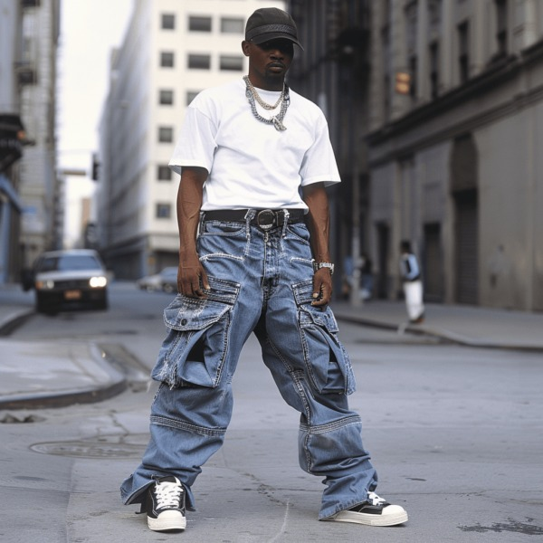
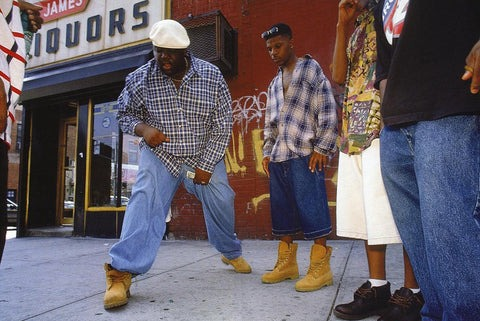
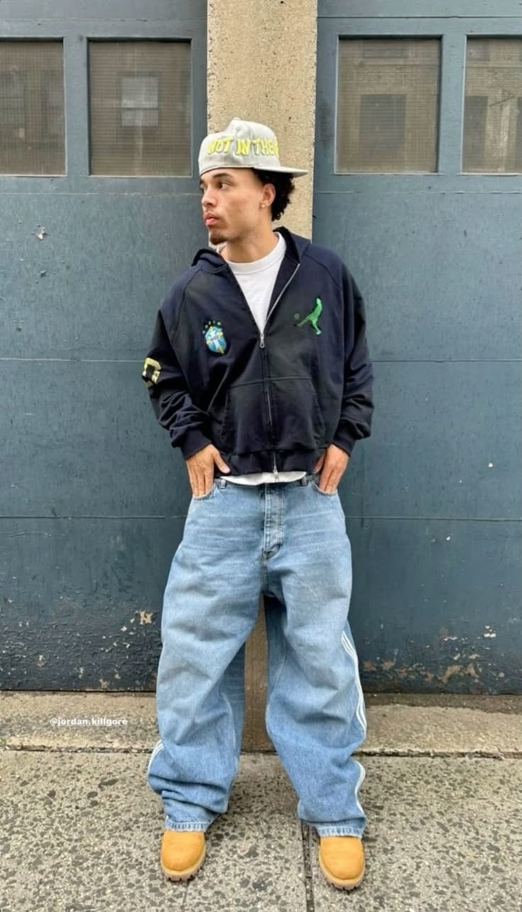

# 90s 嘻哈 (90s Hip-Hop)
> **状态**: `reviewed` | **最后更新**: 2026-06-13

## 📖 概述
1990 年代是说唱的「黄金时代」——Wu-Tang Clan、Tupac Shakur、The Notorious B.I.G. 不仅改写了音乐史，更将街头变成了全球最具影响力的 T 台。90s Hip-Hop 风格的核心语言就一个字：**大**——超大号牛仔、oversized 球衣、厚重的 Timberland 工装靴。它不只是一种穿着方式，更是一种街头声明：「我在这里，我不在乎你的规则。」 东西海岸在色调和态度上分化，但共同塑造了现代街头服饰的 DNA。

## 📜 历史文化
- **1980s 过渡**：Run-DMC、LL Cool J 将运动服、Kangol 桶帽和 Adidas 运动鞋带入嘻哈，为 90 年代的爆发奠定基础。
- **1990s 黄金时代**：街头品牌爆炸式增长——FUBU（"For Us, By Us"）、Karl Kani、Wu Wear、Sean John 相继创立。嘻哈服装从借来的运动服变为自主的文化产业。
- **区域分化**：东海岸（NYC）倾向深色、工装、厚重；西海岸（LA）倾向卡其色、宽松、轻松。两大阵营在风格上互相竞争，在细节上互相借鉴。
- **1990s 末至 2000s 初**：嘻哈风格从街头上升为奢侈品——Biggie 的 Coogi 毛衣、Jay-Z 的 Rocawear、Puffy 的 Sean John，标志着「奢华街头」的诞生。

## 🎨 美学特征
| 类别 | 核心单品 |
|------|---------|
| **上装** | Oversized 图案 T 恤、复古篮球球衣、超大号连帽卫衣、法兰绒格子衬衫（敞开穿） |
| **外套** | Starter/Sports Specialties 棒球夹克（羊毛身+皮袖）、彩色拼接风衣（尼龙材质、荧光色块）、蓬松面包羽绒服（东海岸冬日标配） |
| **裤装** | **宽松/超宽牛仔裤**（JNCO、FUBU、Karl Kani）、工装裤（多口袋功能感）、牛仔背带裤（一侧背带不扣，终极 90s 动作） |
| **鞋履** | **Timberland 6" 小麦色工装靴**（东海岸王道）、Air Jordan 运动鞋、Converse 帆布鞋（西海岸轻松感） |
| **配饰** | Paisley 印花头巾（Tupac 额头标志）、Kangol 桶帽、Snapback 棒球帽、粗金链（Cuban link/Rope chain）、Durags |
| **品牌印记** | FUBU、Karl Kani、Tommy Hilfiger、Cross Colours、Phat Farm、Wu Wear、Sean John |

**东西海岸风格对照**：

| 维度 | 🗽 东海岸（NYC/布鲁克林/斯塔滕岛）| 🌴 西海岸（LA/奥克兰/康普顿）|
|------|------|------|
| **色调** | 黑、炭灰、海军蓝、森林绿 | 大地色系、卡其、棕、浅色点缀 |
| **气场** | 硬朗、工装感、混凝土丛林 | 轻松、慵懒、不费力 |
| **鞋履** | Timberland 小麦靴、Air Jordan | Converse Chucks、Nike Cortez |
| **关键单品** | 厚重面包羽绒、Carhartt、Dickies | 法兰绒衬衫（只扣最上面一颗）、宽松卡其裤、头巾 |
| **代表艺人** | Wu-Tang、Biggie、Nas、Jay-Z | Tupac、Snoop Dogg、Dr. Dre、Ice Cube |

## 🏷️ 代表品牌
| 品牌 | 地位 |
|------|------|
| **FUBU** | "For Us, By Us"——黑人创业宣言，嘻哈服装自主权的里程碑 |
| **Karl Kani** | 「街头服饰教父」，大胆 Logo、超大廓形 |
| **Tommy Hilfiger** | 被嘻哈文化重新语境化的 preppy 品牌——街头认证的逆向美学 |
| **Carhartt / Dickies** | 廉价耐用工装被街头文化征用 |
| **Wu Wear** | Wu-Tang Clan 自有服装线——最早的音乐人自主街头品牌 |
| **Timberland** | 小麦色 6 英寸靴成为东海岸街头象征 |
| **Cross Colours** | 泛非色彩、团结信息的街头宣言 |
| **Sean John** | Puff Daddy 桥接街头与奢华的尝试 |

## 👤 风格偶像
| 偶像 | 标志性造型 |
|------|-----------|
| **🐝 Wu-Tang Clan** | 迷彩、Carhartt 工装、Timberland、头巾系额、暗黑街头硬朗风格 |
| **🔥 Tupac Shakur** | Paisley 头巾（前额绑法）、法兰绒衬衫敞开配白背心/赤膊、宽松牛仔、粗金链、鼻环 |
| **👑 The Notorious B.I.G.** | Coogi 彩色针织毛衣、Versace 墨镜、Kangol 绅士帽/圆顶礼帽、宽松 Polo 衫——「纽约之王」奢华街头 |
| **🎤 LL Cool J** | Kangol Bermuda 红色桶帽——将 Kangol 品牌推到销量巅峰 |
| **🌴 Snoop Dogg** | 宽松卡其裤 + 法兰绒衬衫 + 长卷发——西海岸慵懒的终极代言 |

## 🔗 关联风格
- **Streetwear（街头服饰）**— 90s 嘻哈是现代街头服饰的直接源头
- **Grunge** — 西海岸嘻哈与 Grunge 共享法兰绒衬衫和「不刻意」态度
- **Workwear / Utility** — Carhartt、Dickies、Timberland 等品牌从工地走进录音棚
- **Luxury Streetwear** — 从 Biggie 的 Coogi 到 Virgil Abloh 的 Louis Vuitton，一脉相承

## 📈 流行趋势
90s 嘻哈风格在 2023–2025 年持续霸榜：
- **Fear of God、Balenciaga、Off-White、Aimé Leon Dore** 等现代品牌大量借用 90s 嘻哈宽松廓形
- **小麦色 Timberland 再次成为街头宠儿**，搭配宽松牛仔和连帽卫衣
- **Vintage 运动品牌回潮**：Starter 夹克、Mitchell & Ness 复古球衣成为二级市场热门
- **社交媒体推动**：#90sHipHop 内容在 TikTok 上持续走红，Gen Z 重新发现宽松美学
- **音乐人品牌复兴**：新一代说唱歌手如 Kendrick Lamar、Tyler, the Creator 在致敬 90s 的同时重塑经典

## 💡 穿搭建议
1. **入门公式**：Oversized 图案 T 恤 + 宽松直筒/阔腿牛仔 + 小麦色 Timberland 6" 靴
2. **东海岸版**：在入门公式外加一件深色连帽卫衣 + 一件面包羽绒服，加一条粗金链
3. **西海岸版**：法兰绒衬衫（只扣最上面一颗）+ 宽松卡其裤/Dickies + Converse Chucks + 口袋里的 Paisley 头巾
4. **鞋子决定区域**：Timbs = 东海岸；Chucks = 西海岸——你选哪一边？
5. **关键是「松」**：整个廓形必须是宽松的，合身的 90s 嘻哈不是真 90s 嘻哈

## 📸 风格图库

> 以下为风格代表性穿搭参考图，搜集自公开时尚媒体。

*风格穿搭参考*

*90s Hip Hop Fashion For Any Party - 13 Ideas - My Black Clothing*

*Baggy denim> | Mens outfits, Street fashion men streetwear, Streetwear ...*
