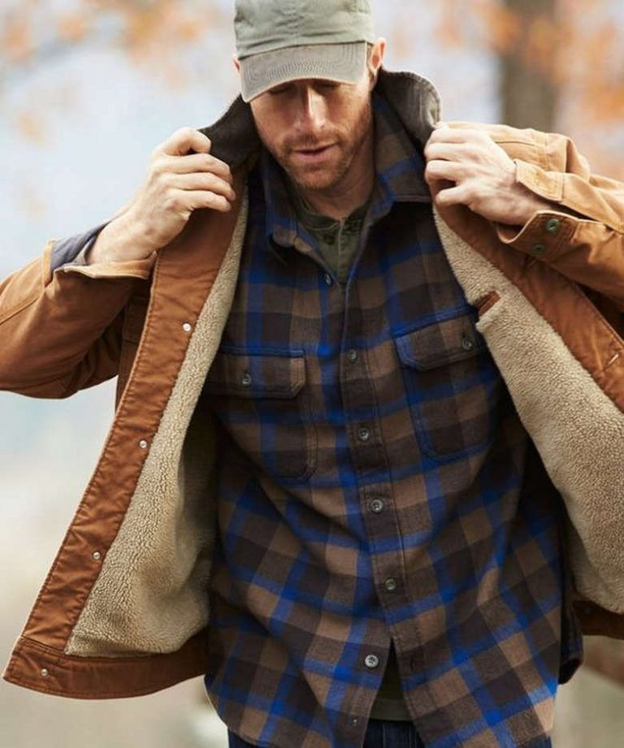
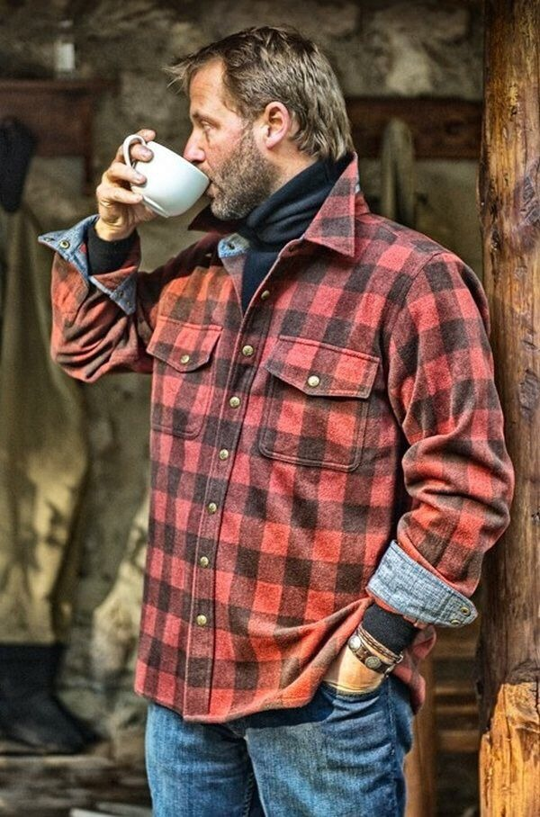
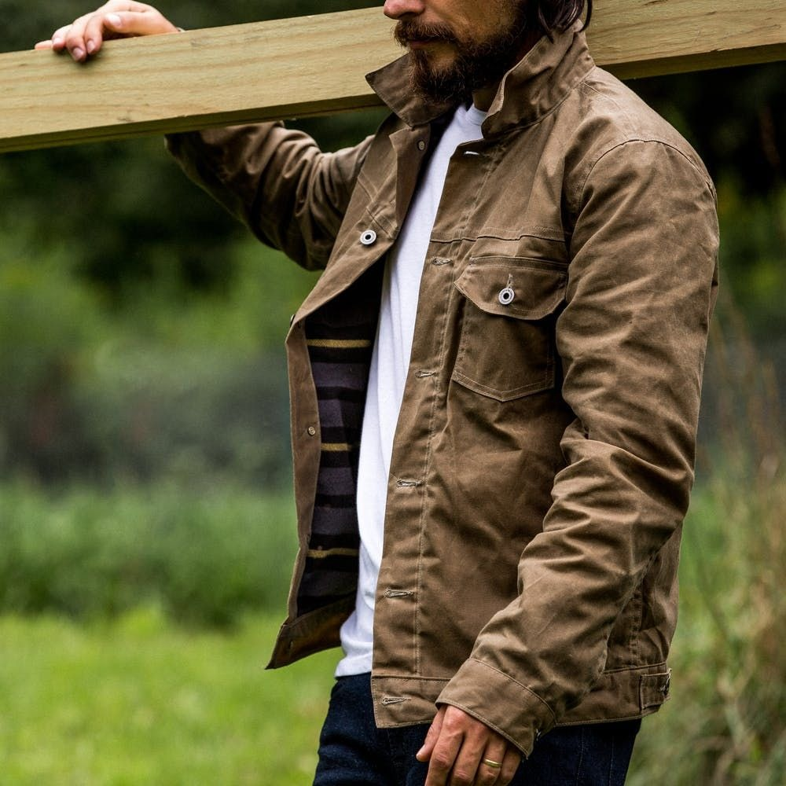

# 粗砺舒适 (Rugged Comfort)
> **状态**: `reviewed` | **最后更新**: 2026-06-13 | **趋势**: 流行趋势

## 📖 概述
Rugged Comfort（粗砺舒适）是 2024 年男装界最踏实、最有分量的趋势——它把**农场和工厂的工装基因**带入日常穿搭，不走高调，走的是耐久、质感、和「穿久了更好看」的长期主义路线。核心单品是谷仓外套（Barn Jacket）——帆布/斜纹棉质面料 + 撞色灯芯绒领子 + 大贴袋，搭配原牛（Raw Denim）和华夫纹（Waffle Knit）面料，构成一种既粗砺又舒适、不奢华但极度有质感的风格。Carhartt WIP 是其街头引擎，Drake's 是其绅士版本，Prada 的 2024 SS 谷仓外套则将其正式送入高级时装殿堂。

## 📜 历史文化
- **19 世纪法式工装根源**：法国的「bleu de travail」（工作蓝）——靛蓝染色的棉质工装夹克，是谷仓外套和工装衬衫的直系祖先。
- **1917–1954 美国工装黄金年代**：Carhartt 在 1917 年推出第一款工装外套（Chore Coat）；1954 年推出底特律夹克（Detroit Jacket），成为谷仓外套的经典原型。
- **20 世纪英国矿工文化**：Donkey Jacket（驴夹克）——厚重的 Melton 羊毛 + 皮革肩补丁，成为英国工人阶级的符号，1984 年矿工大罢工中成为团结的视觉标志。
- **2000s–2010s 原牛文化兴起**：日本大阪五虎（Evisu、Samurai、Fullcount 等）和美式工作服复刻狂热（RRL、Filson）将 raw denim 和工装美学推向全球男性消费者。
- **2024 Barn Jacket Boom**：Prada SS24 将谷仓外套搬上 T 台，Lyst 报告 Carhartt 底特律夹克搜索量飙升 410%，Highsnobiety 称其为「不可被称为趋势的趋势」。标志性事件：FFW 期间 Carhartt Le Marais 巴黎店外大排长龙。

## 🎨 美学特征
| 类别 | 核心单品 |
|------|---------|
| **外套** | **谷仓外套（Barn Jacket）**——帆布/斜纹棉质、灯芯绒领、大贴袋、按扣/钮扣门襟、卡其/橄榄绿/海军蓝色调；Chore Coat（工装夹克）；Donkey Jacket（厚重羊毛+皮革肩补）；油蜡夹克（Waxed Jacket） |
| **内搭** | **华夫纹（Waffle Knit）棉质长袖**——厚重质地和立体方格纹理是 Rugged Comfort 的标志基底；重磅亨利领长袖；牛仔/帆布衬衫 |
| **裤装** | **原牛（Raw/Selvedge Denim）**——未经洗涤、深靛蓝、厚重磅数（14oz+）；帆布工装裤；Double Knee 补丁工装裤 |
| **鞋履** | Red Wing 工装靴（875 Moc Toe / Iron Ranger）、Blundstone 切尔西工装靴、Paraboots、Danner 徒步靴 |
| **配饰** | 帆布/皮质腰带、粗针毛线帽、羊毛手套、帆布托特包 |

**面料哲学**：帆布、斜纹棉、灯芯绒、重磅丹宁、华夫针织、Melton 羊毛、油蜡棉。所有面料的选择标准：**厚重、结实、越旧越好看**。

**色调**：卡其/沙色、橄榄绿、靛蓝（原牛）、生锈棕、奶白/燕麦、炭黑。核心禁色——任何荧光或过于「新」的颜色。

**核心原则**：「Workwear is like a love letter to a time that has passed and will never come back.」——Albert Muzquiz（时尚史学家）。Rugged Comfort 不在乎流行周期——它投资的是「十年后更好的穿着」。

## 🏷️ 代表品牌
| 品牌 | 定位 |
|------|------|
| **Carhartt WIP** | 街头引擎——底特律夹克是 2024 年最炙手可热的工装单品，Lyst 排名第五。主线和 WIP 线分别提供原版工装和街头改良版。 |
| **Drake's** | 英伦奢华工装版——£995 的驴夹克重塑了工装的阶级叙事，是 Rugged Comfort 的「西装裤配工装靴」版本。 |
| **Prada** | 2024 SS 将谷仓外套送入高级时装——$3,500 的标志性定价使其成为「后静奢」的声明单品。 |
| **RRL (Ralph Lauren)** | 美式工装复刻的巅峰——从原牛到油蜡夹克，全部以 19 世纪-20 世纪档案为蓝本 |
| **Filson** | 1897 年西雅图创立的户外工装品牌，以锡布工装（Tin Cloth）和重磅帆布闻名 |
| **Red Wing Shoes** | 工装靴之王——Iron Ranger 和 Moc Toe 875 是 Rugged Comfort 脚上的标准答案 |
| **The Real McCoy's** | 日本顶级复刻品牌，以极致精度复刻二战和 1950s 美式工装/军装 |
| **OrSlow** / **Blue Blue Japan** | 日本匠人品牌，将工装美学与靛蓝染色艺术结合 |
| **Sunspel** | 华夫纹长袖和亨利领的优质来源——底层的舒适感由这些品牌提供 |

## 👤 风格偶像
| 偶像 | 标志性造型 |
|------|-----------|
| **Daniel Day-Lewis** | 台下低调的工匠风格——厚重毛衣、帆布夹克、做旧牛仔——Rugged Comfort 的精神化身 |
| **Jason Momoa** | 帆布外套 + 工装靴 + 粗犷长发——Rugged Comfort 的好莱坞代言人 |
| **Pete Adeney (Mr. Money Mustache)** | 虽不算时尚偶像，但其「一件 Carhartt 穿十年」的哲学与 Rugged Comfort 的核心价值观一致 |
| **木村拓哉** | 日本明星中最早将 Red Wing 和原牛带入亚洲男性视野的关键人物 |

## 🔗 关联风格
- **Workwear / Blue Collar** — Rugged Comfort 的直接源头
- **Heritage Menswear** — 共享「复古复刻」和「长期穿着」的价值体系，高度重叠
- **Americana** — 美式工装和牛仔文化的更广泛框架
- **Gorpcore** — 共享「功能性服饰日常化」的思维，但 Gorpcore 偏户外机能（登山/攀岩），Rugged Comfort 偏工装（农/厂）
- **Basic Bastard** — 重型面料版本的基本款——替代轻薄 T 恤+切尔西靴的思路

## 📈 流行趋势
2024–2025 年被多家媒体称为「Barn Jacket Year」：
- Prada 的 SS24 谷仓外套正式宣告这一工装单品进入高级时尚话语
- Lyst 报告 Carhartt 底特律夹克搜索量飙升 410%，成为 2024 Q1 最热单品之一
- BBC Culture、Highsnobiety、The Zoe Report 等主流媒体均发布长篇分析讨论「为什么谷仓外套是时尚界的新反抗符号」
- 「Farm-to-Fashion」审美（Elle 杂志定义）将工装从功能服提升为生活方式表态
- 后静奢（Post Quiet Luxury）：在低调奢华之后，消费者转向有实质、有历史的服饰——工装满足这一需求
- 可持续消费趋势：原牛和谷仓外套的「越旧越好」属性天然符合 anti-fast-fashion 的消费心理

**核心争论**：穿着谷仓外套是蓝领文化挪用还是致敬？多数媒体认为两者皆有——工装的阶级符号已在多次文化转译中被永久性地打乱和再生成。

## 💡 穿搭建议
1. **入门公式**：华夫纹长袖 T 恤 + 原牛/深色牛仔 + Red Wing 工装靴 + 谷仓外套（秋冬）
2. **面料混搭原则**：在同一身中混用帆布（外套）+ 华夫纹（内搭）+ 丹宁（下装）——三种质感的对话就是 Rugged Comfort 的核心趣味
3. **找到合适的谷仓外套**：
   - Budget：Carhartt WIP 底特律夹克或主线 Chore Coat
   - Mid：RRL、Filson
   - High：Drake's 驴夹克、Prada 谷仓外套
4. **原牛选择**：初次接触选 13–14oz 中磅（如 Sugar Cane、Naked & Famous），进阶可选 18oz+ 重磅（如 Iron Heart、Samurai）。不要洗——让它记录你的生活。
5. **季节适应**：春夏保留华夫纹长袖 + 帆布 Chore Coat（轻量版）；秋冬加重——羊毛驴夹克 + 重磅原牛 + 工装靴
6. **禁忌**：任何看起来「新」的——刻意做旧反而出戏。让你的衣服自己变旧。

## 📸 风格图库

> 以下为风格代表性穿搭参考图，搜集自公开时尚媒体。

*风格穿搭参考*

*Rugged Men's Clothing Brands at Hunter Wang blog*

*Flannel-Lined Waxed Trucker Jacket | Mens fashion rugged, Mens winter ...*
