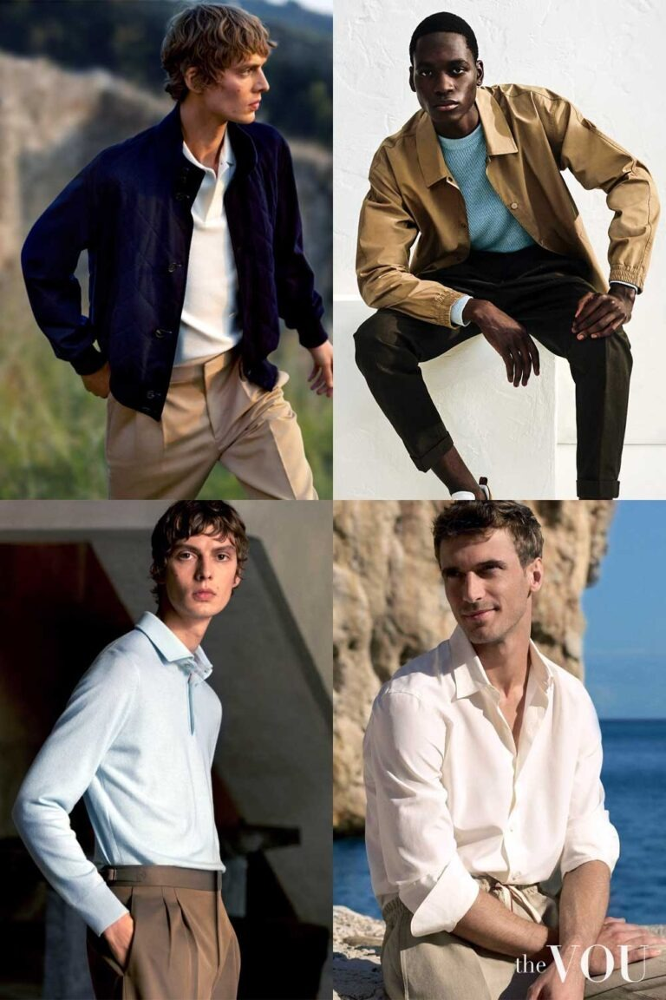
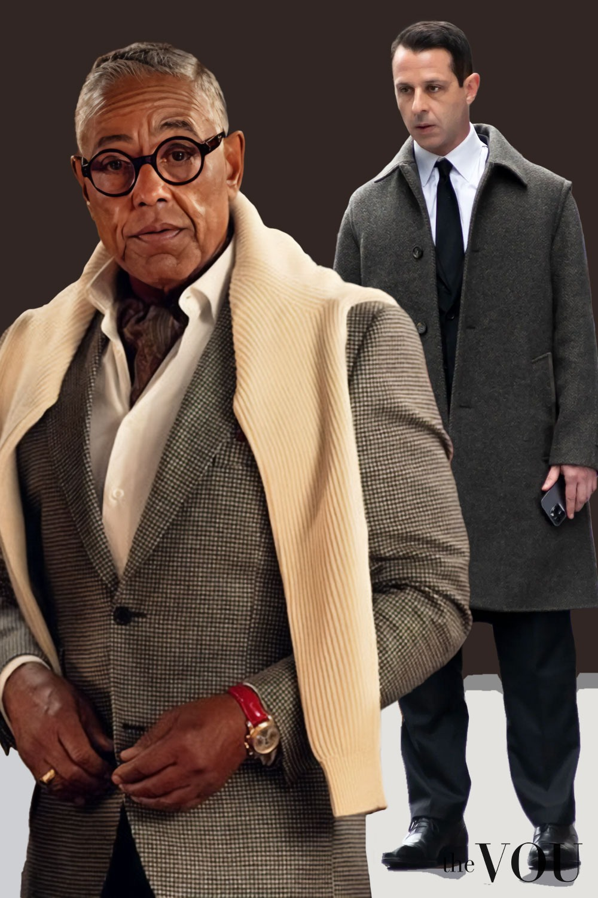
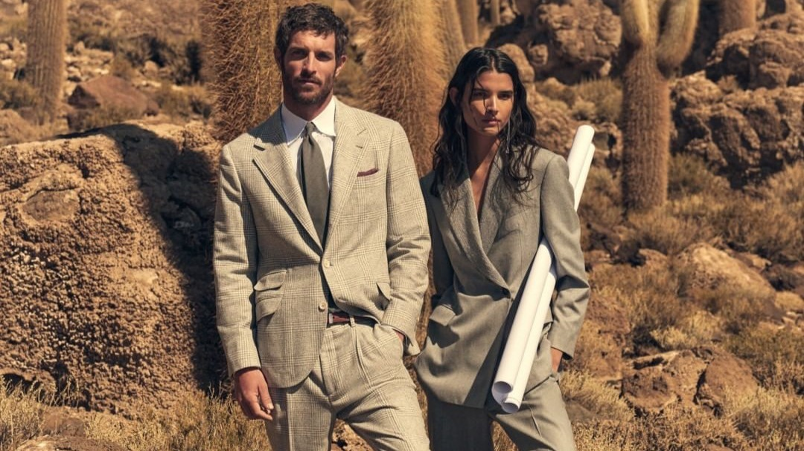

# 粗砺奢华 (Rugged Luxury)

> **状态**: `reviewed` | **最后更新**: 2026-06-13 | **趋势**: 流行趋势
> **分类**: 意式 > 当代2020s > 半正式 > 户外 > 复古调性

## 📖 概述
- **发源年代**: 2024-2025
- **发源地**: Ferragamo / Zegna 秀场 → WGSN 预测
- **风格关键词**: Safari夹克、高性能面料、棕色皮件、探险家、精致户外
- **一句话定义**: 把探险家的装备用奢侈品的工艺重新做一遍——Safari 夹克+高性能面料+巧克力棕皮件，精致冒险家造型。

## 📜 历史文化
WGSN 将 "Rugged Luxury" 预测为 2025-2026 年的关键男装趋势。Ferragamo 和 Zegna 是最早落地的奢侈品牌——以 Safari 夹克、多功能口袋、高性能天然面料为标志。它是对 Gorpcore 的"奢侈化回应"——Gorpcore 强调功能，Rugged Luxury 强调"有质感的功能"。

## 🎨 美学特征
- **Safari 夹克** — 四口袋、腰带、棉质/亚麻，核心单品
- **高性能天然面料** — 防水羊毛、打蜡棉、技术亚麻
- **巧克力棕** — 2025-2026 男装增长最快的色彩
- **设计细节** — 防手机盗窃口袋、隐藏式护照袋、可拆卸内衬

### 色板
```
主调: 巧克力棕、沙色、卡其、橄榄绿
金属: 哑光金/铜（扣子和拉链）
```

### 标志单品
| 单品 | 品牌 | 特征 |
|------|------|------|
| Safari 夹克 | Ferragamo, Zegna | 四口袋+腰带，亚麻或技术棉 |
| 高性能卡其裤 | Zegna, Loro Piana | 防水+弹力+经典外观 |
| 棕色皮质旅行包 | Ferragamo, Bottega Veneta | 大容量+手工做旧 |
| 技术面料衬衫 | Zegna | 防皱+透气+正装剪裁 |
| 徒步靴×德比鞋 | Tod's, Santoni | 户外鞋底+正装鞋面 |

## 🏷️ 代表品牌
- **Ferragamo** — Rugged Luxury 的秀场定义者
- **Zegna** — 高性能面料+意大利剪裁
- **Loro Piana** — 天然面料的顶级供应商
- **Brunello Cucinelli** — 休闲奢华的代表
- **Ralph Lauren** — Safari 夹克的经典来源

## 👤 风格偶像
- **Maximilian Davis** (Ferragamo 创意总监) — Rugged Luxury 秀场美学的定义者
- **Daniel Craig** — 007 的休闲场景穿搭（Safari夹克+卡其裤）
- **Steve McQueen** — 1960s 的 Safari 夹克+Persol 墨镜

## 📈 流行趋势
- 2025-2026 "静奢"（Quiet Luxury）向户外场景延伸
- 与 Gorpcore 互补而非替代——一个是"奢侈化的户外"，一个是"潮流化的户外"
- 对亚洲男性友好——Safari 夹克的功能口袋和腰带增加上半身体量感

## 💡 穿搭建议
1. 一件 Safari 夹克是这个风格的入场券
2. 搭配白色或沙色衬衫+巧克力棕卡其裤+棕色皮鞋
3. 金属配件（扣子/拉链）选择哑光黄铜色——这是"粗砺"感的来源


## 📸 风格图库

> 以下为风格代表性穿搭参考图，搜集自公开时尚媒体。


*风格穿搭参考*


*Here's Why Loro Piana is the Pinnacle of Quiet Luxury*


*Quiet Luxury Brand | Brunello Cucinelli India | Quiet Luxury*
