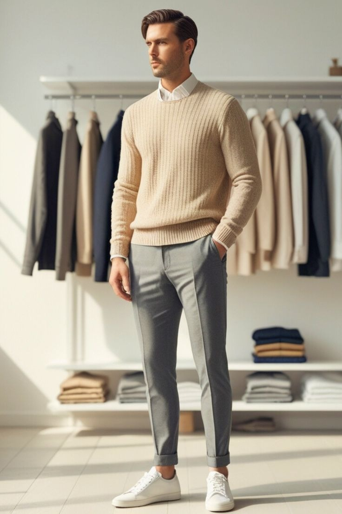
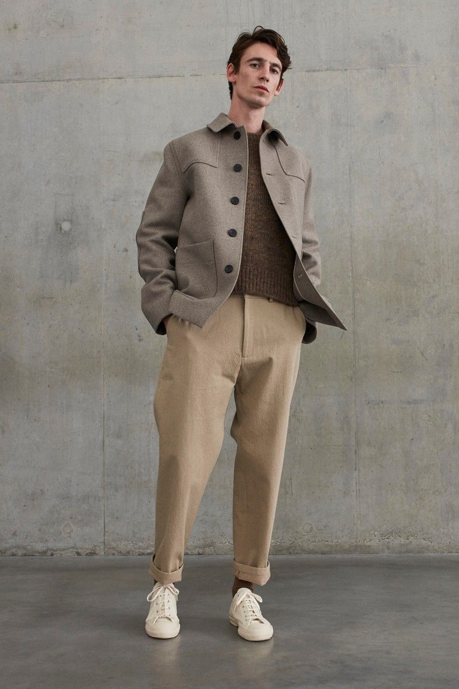
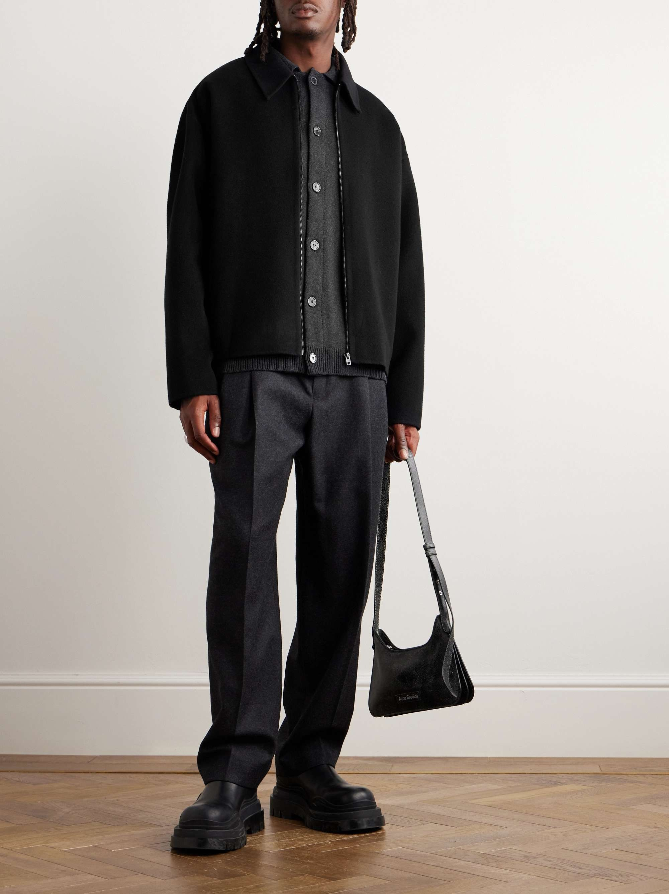

# 北欧极简 (Scandi Minimalism)

> **状态**: `reviewed` | **最后更新**: 2026-06-13 | **趋势**: 经典风格
> **分类**: 北欧 > 当代2020s > 休闲 > 极简调性

## 📖 概述
- **发源年代**: 1990s-2000s
- **发源地**: 丹麦/瑞典/挪威
- **风格关键词**: 功能性、极简剪裁、中性色、可持续、舒适、建筑感
- **一句话定义**: 以功能性为起点、以极简为美学终点的北欧设计哲学——把"实用"穿成最高级的风格。

## 📜 历史文化

### 起源
北欧极简穿搭植根于三个文化基因：

1. **包豪斯功能主义** (1930s): "形式服从功能"的设计原则从建筑和家具延伸到服装
2. **社会民主价值观**: 北欧社会对炫富的排斥——"Janteloven"（詹特法则）强调集体高于个人，穿得低调是美德
3. **气候现实**: 漫长冬季和寒冷气候使功能性成为刚需——保暖、防水、防风不是"潮流"而是生存需求

### 从 Normcore 到 Scandi
2013-2016 年 Normcore 风潮让全球注意到"穿得普通"可以是一种风格宣言。但北欧极简比 Normcore 多了一层**质感追求**——不是故意穿得平凡，而是把"平凡"做得不平凡。

### 代表品牌全球化
- **COS** (2007, H&M 集团) — 将北欧极简带入全球大众市场，建筑感剪裁是标志
- **Acne Studios** (1996, 瑞典) — 从牛仔裤起家到全球时尚品牌，北欧创意的代名词
- **Filippa K** (1993, 瑞典) — 可持续极简的先驱

## 🎨 美学特征

### 廓形
- 直筒/微宽松，不过度贴身也不过度 Oversized
- 建筑感剪裁——衣服像空间结构一样立于身体上
- 强调垂直线条，拉长身形

### 色板
```
核心: 黑、白、灰、米白、驼色、炭灰
季节点缀: 鼠尾草绿、雾霾蓝、沙色
逻辑: 全中性色，用不同材质/灰度制造层次
```

### 面料
- 羊毛/美利奴（针织品）
- 有机棉/府绸（衬衫和T恤）
- 再生聚酯/功能性面料（外套）
- 重量感面料，不软塌

### 标志单品
| 单品 | 品牌示例 | 选择要点 |
|------|---------|---------|
| 建筑感大衣 | COS, Filippa K | 直筒/茧型，无多余装饰 |
| 高领针织 | Acne Studios, Arket | 细针距，中性色，单穿或叠穿 |
| 宽腿西裤 | COS, Our Legacy | 垂坠感，高腰，九分或全長 |
| 廓形白衬衫 | COS, Toteme | 挺括面料，落肩，可作外套 |
| 极简球鞋 | Axel Arigato, Eytys | 纯白/纯黑，无Logo |
| 帆布托特包 | Arket, COS | 大容量，结构感 |

## 🏷️ 代表品牌

### 核心品牌
- **COS** — H&M 集团高端线，建筑感剪裁+大地色系，北欧极简的全球入口
- **Acne Studios** — 瑞典创意品牌，极简中带有艺术感
- **Filippa K** — 可持续极简先驱，30年坚持"少买买好"
- **Arket** — H&M 集团，比COS更注重功能性和复古感
- **Our Legacy** — 瑞典男装品牌，极简+工装元素
- **Toteme** — 瑞典女装品牌，但审美深刻影响了男装极简方向
- **Samsoe Samsoe** — 丹麦品牌，可穿性极强

### 鞋履品牌
- **Axel Arigato** — 瑞典极简球鞋品牌
- **Eytys** — 瑞典厚底帆布鞋
- **Swedish Hasbeens** — 瑞典木底鞋（夏季）

## 👤 风格偶像

| 人物 | 身份 | 说明 |
|------|------|------|
| **Jon Olsson** | 瑞典职业滑雪运动员/博主 | 北欧极简男装标杆，日常穿搭教科书 |
| **Mats Gustafson** | 瑞典时装插画家 | 个人穿搭就是极简主义的艺术表达 |
| **Copenhagen Fashion Week 街拍** | — | 哥本哈根时装周的街拍已成为全球极简穿搭的参考源 |
| **Fredrik Risvik** | 挪威博主 | 暗色调北欧极简代表 |

## 🔗 关联风格
- **父风格**: 极简主义
- **平行风格**: Clean Fit、日系侘寂、韩系极简
- **延伸风格**: Gorpcore（功能性面料的交集）、Normcore（精神前身）
- **对立风格**: Maximalism、意式 Sprezzatura

## 📈 流行趋势
- **当前状态**: 🔥 持续热门（作为"安静奢华"的核心美学基础）
- **流行区域**: 全球，尤其在创意/科技行业从业者中
- **发展方向**: 可持续材料+循环时尚、模块化胶囊衣橱
- **关键信号**: COS 全球店铺持续扩张，Arket 进入亚洲市场

## 💡 穿搭建议
### 适合体型
- ✅ 高瘦体型 — 建筑感剪裁支撑骨架
- ✅ 中等体型 — 直筒廓形包容度高
- ⚠️ 偏胖 — 选择深色、避免过于宽大的剪裁

### 入门三步
1. 买一件 COS 或 Arket 的建筑感大衣——这是北欧极简的灵魂单品
2. 把色板收窄到 5 个中性色——黑/白/灰/米白/驼色
3. 投资好面料——北欧极简的"高级感"来自面料，不是 Logo


## 📸 风格图库

> 以下为风格代表性穿搭参考图，搜集自公开时尚媒体。


*风格穿搭参考*


*Studio Nicholson FW19 Exudes Sophisticated Minimalism - Love handmade*


*ACNE STUDIOS Doverio Wool-Flannel Jacket for Men | Flannel jacket, Wool ...*
