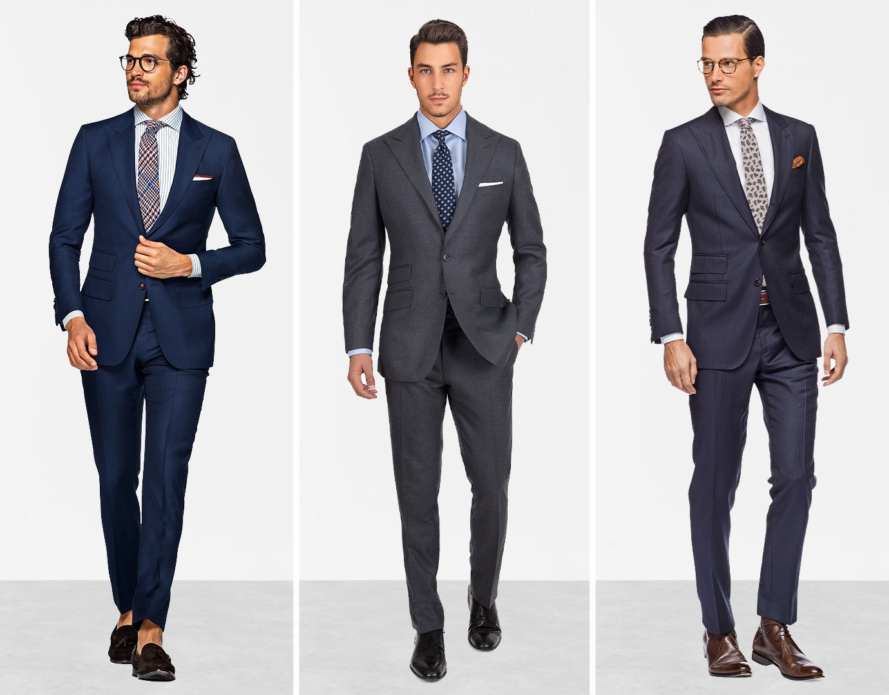
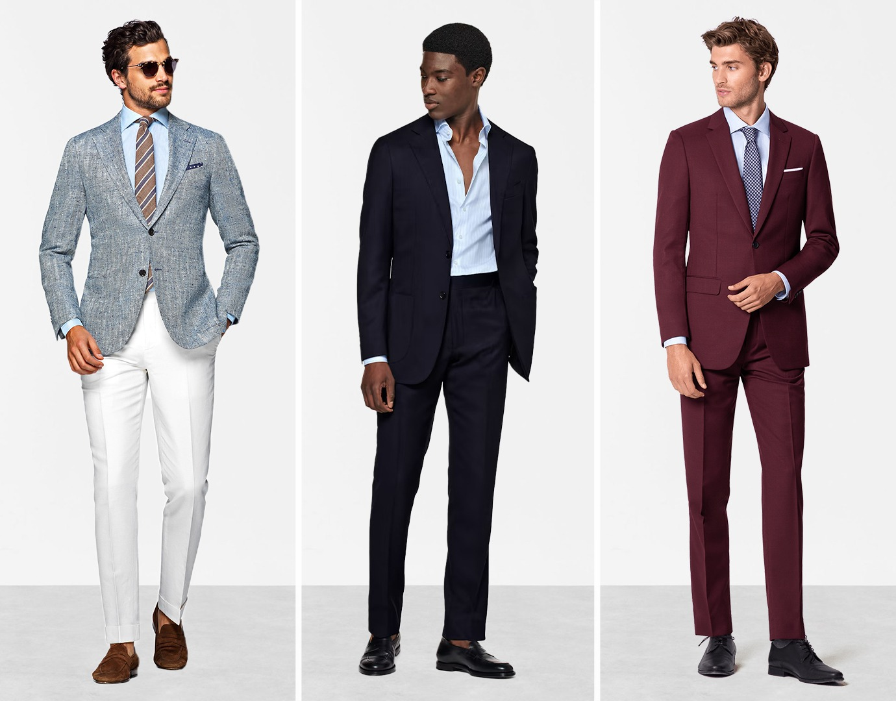
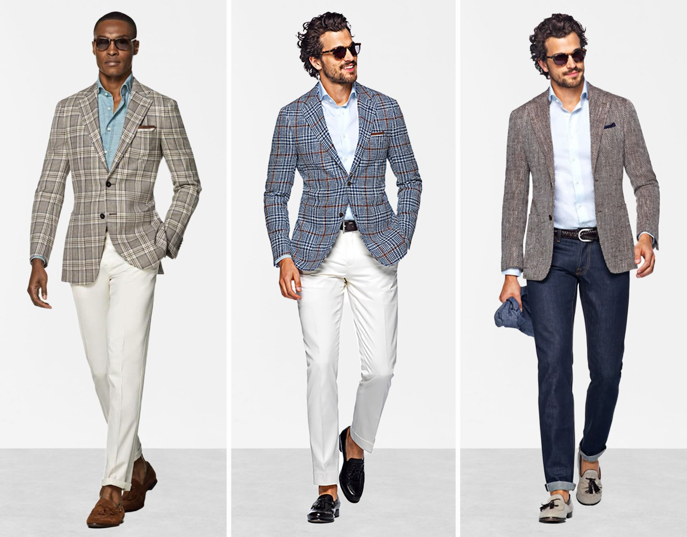

# 鸡尾酒礼服 (Cocktail Attire)
> **状态**: `reviewed` | **最后更新**: 2026-06-13

## 📖 概述
鸡尾酒礼服（Cocktail Attire）是男士半正式场合的核心着装规范，位于 **商务正装与 Black Tie（黑领结）之间**——比上班更精致，比晚宴更放松。核心制服：一件剪裁精良的深色西装 + 挺括礼服衬衫 + 皮质牛津鞋。领带在 2024–2025 年已被视为「可选」，但口袋里永远该有一条口袋巾。鸡尾酒礼服的核心智慧是：**精良、从容、为你留出表达空间**。

## 📜 历史文化
- **1920s 禁酒令时期起源**：鸡尾酒礼服随着地下鸡尾酒派对（Speakeasy）文化的兴起而产生——需要一种比日装更精致、比晚装更随意的中间着装。
- **1950s–1960s 黄金时代**：鸡尾酒文化成为中产阶级社交标配，男士鸡尾酒着装定型为深色西装 + 利落衬衫 + 领带。
- **1980s 权力西装影响**：宽肩剪裁和醒目的面料影响了鸡尾酒礼服的廓形。
- **2000s–2010s 放松**：科技行业的兴起让「商务休闲」渗透到鸡尾酒场合，领带变成可选。
- **2020s 解构**：针织 Polo 配西装、开放式领口、纹理面料混搭成为新一代鸡尾酒着装的前沿表达。

## 🎨 美学特征
| 类别 | 核心单品 |
|------|---------|
| **西装** | **深蓝色**或**炭灰色**两件套西装——最安全、最百搭的选择。黑色适合晚间极正式鸡尾酒场合，但白天可能过于严肃。酒红/深绿适合创意导向的现代场合。 |
| **衬衫** | 白色或浅蓝色礼服衬衫（挺括领座）、法式袖口（带袖扣）更正式；2025 年可选用高品质针织 Polo 替代传统衬衫 |
| **领带/开口** | 领带可选但安全——丝质斜纹/编织真丝窄领带是经典；针织领带增加现代质感；无领带时务必选择展开领/一字领（spread/cutaway collar）以维持结构感 |
| **鞋履** | **牛津鞋（Cap-toe Oxford）** — 最正式；**德比鞋** — 万能百搭；**乐福鞋** — 放松版鸡尾酒；**切尔西靴** — 冬季晚间精明选择 |
| **配饰** | **口袋巾**（不戴也要）、经典腕表、袖扣、与鞋子同色的皮带 |
| **袜子** | 精细针织长袜，颜色匹配裤子（而非鞋子） |

**季节性面料指南**：
| 季节 | 西装面料 | 衬衫面料 |
|------|---------|---------|
| 春夏 | 热带羊毛、Hopsack 编织、亚麻混纺、棉 | 府绸棉、棉麻混纺 |
| 秋冬 | 法兰绒、羊毛羊绒混纺、纹理编织 | 斜纹棉、拉绒棉 |

## 🏷️ 代表品牌
| 品牌 | 定位 |
|------|------|
| **Suitsupply** | 高性价比半定制西装，剪裁现代——入门首选 |
| **Black Lapel** | 定制西装专家，鸡尾酒着装指南的主要推动者 |
| **Drake's** | 英伦软剪裁西装 + 针织领带/口袋巾的绅士风格 |
| **Ralph Lauren Purple Label** | 美式鸡尾酒优雅的顶级代表 |
| **Thom Browne** | 缩水剪裁 + 解构传统——创意鸡尾酒的大胆选择 |
| **Brunello Cucinelli** | 意大利静奢剪裁，适合不张扬的精品场合 |
| **Crockett & Jones** | 英伦制鞋——牛津鞋和德比鞋的标杆 |

## 👤 风格偶像
| 偶像 | 标志性造型 |
|------|-----------|
| **Cary Grant** | 永远完美合身的深色西装 + 白衬衫——鸡尾酒礼服的原始经典模板 |
| **James Bond（Daniel Craig 版本）** | Tom Ford 剪裁 + 尖领衬衫 + 珍珠口袋巾——现代鸡尾酒礼服的银幕标准 |
| **Ryan Gosling** | 红毯和典礼上的深蓝色双排扣西装——颜色和剪裁的现代典范 |
| **Donald Glover (Childish Gambino)** | 大胆色彩（酒红、柑橘色）+ 传统剪裁——创意导向鸡尾酒的标杆 |

## 🔗 关联风格
- **Black Tie（黑领结）** — 比鸡尾酒礼服更正式一级，需要无尾礼服（Tuxedo）和领结
- **Business Formal（商务正装）** — 与鸡尾酒礼服高度重叠，商务正装更保守，鸡尾酒礼服允许更多个性
- **Semi-Formal（半正式）** — 常与鸡尾酒礼服互换使用，实际上半正式稍低一级
- **Smart Casual（精致休闲）** — 比鸡尾酒礼服低两级，通常不需要西装外套

## 📈 流行趋势
2024–2025 年鸡尾酒礼服的演变方向：
- **领带解放**：越来越多的邀请函明确标注「Cocktail Attire, No Tie Required」，开放式领口成为新常态
- **纹理胜于图案**：法兰绒、Hopsack、亚麻混纺——用面料本身的纹理代替印花，保持深度的同时增加趣味
- **绅士气质的运动感**：高品质针织 Polo + 定制西装裤 + 乐福鞋，是 2025 年最具辨识度的鸡尾酒轮廓
- **季节色突破**：酒红色、深绿色、甚至陶土色西装出现在鸡尾酒场合的频率显著上升
- **可持续剪裁**：定制和半定制（MTM）成为主流，消费者倾向于投资一件精品而非多件快时尚西装

## 💡 穿搭建议
1. **黄金公式**：深蓝或炭灰色两件套西装 + 白色礼服衬衫 + 黑色牛津鞋 + 白色亚麻口袋巾 → 你永远不会出错
2. **领带备选策略**：口袋里放一条领带（丝质或针织），到场后根据环境决定是否系上——可进可退
3. **颜色优先顺序**：深蓝 > 炭灰 > 中灰 > 酒红/深绿 > 黑色（仅限晚间）
4. **鞋子铁律**：黑色鞋配黑色/深蓝/炭灰西装；棕色/酒红鞋配深蓝/灰/棕西装；腰带和鞋同色
5. **夏季鸡尾酒**：热带羊毛或亚麻混纺西装 + 浅蓝府绸衬衫 + 棕色乐福鞋 + 不系领带
6. **禁忌**：牛仔裤、运动鞋、T恤、过于闪亮的 Logo 扣带、Tuxedo（留给 Black Tie 场合）

## 📸 风格图库

> 以下为风格代表性穿搭参考图，搜集自公开时尚媒体。

*风格穿搭参考*

*Semi-Formal Dress Code Attire for Men - Suits Expert*

*What Is Semi-Formal Attire For A Gala at Betty Finkelstein blog*
