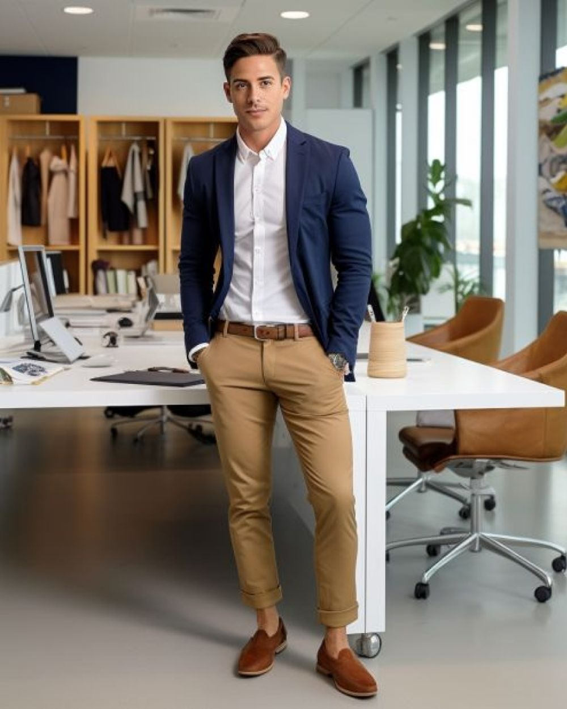
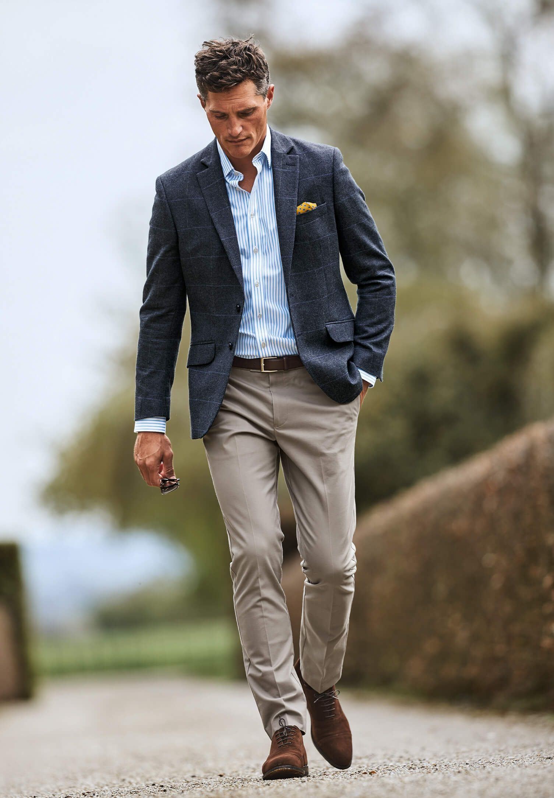
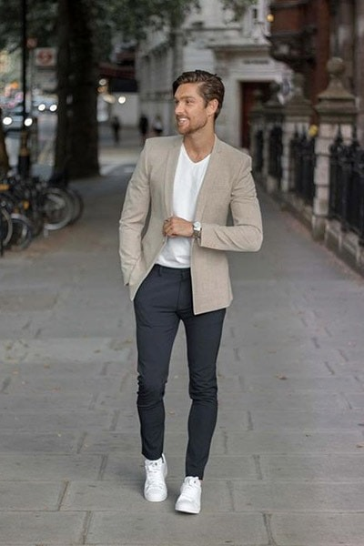
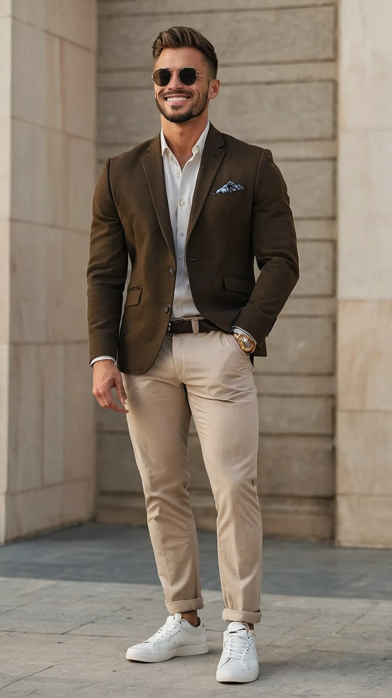
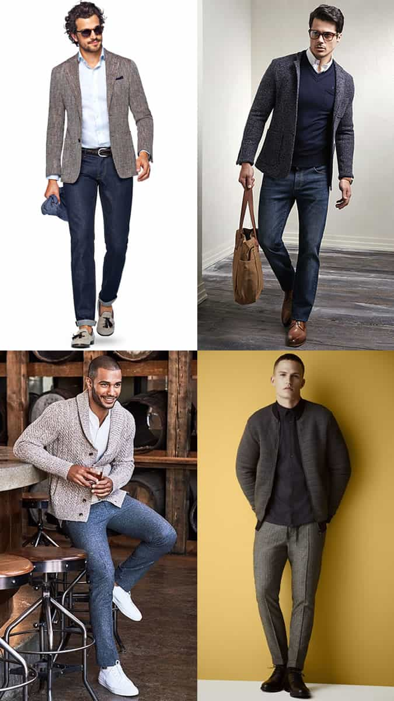
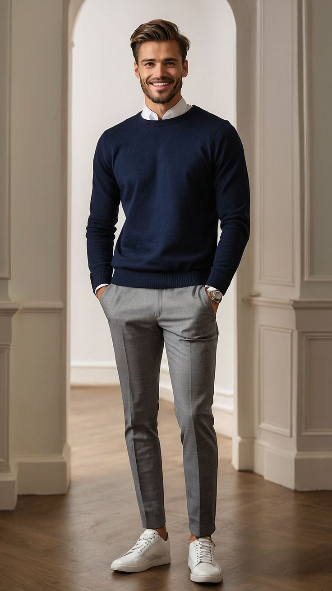
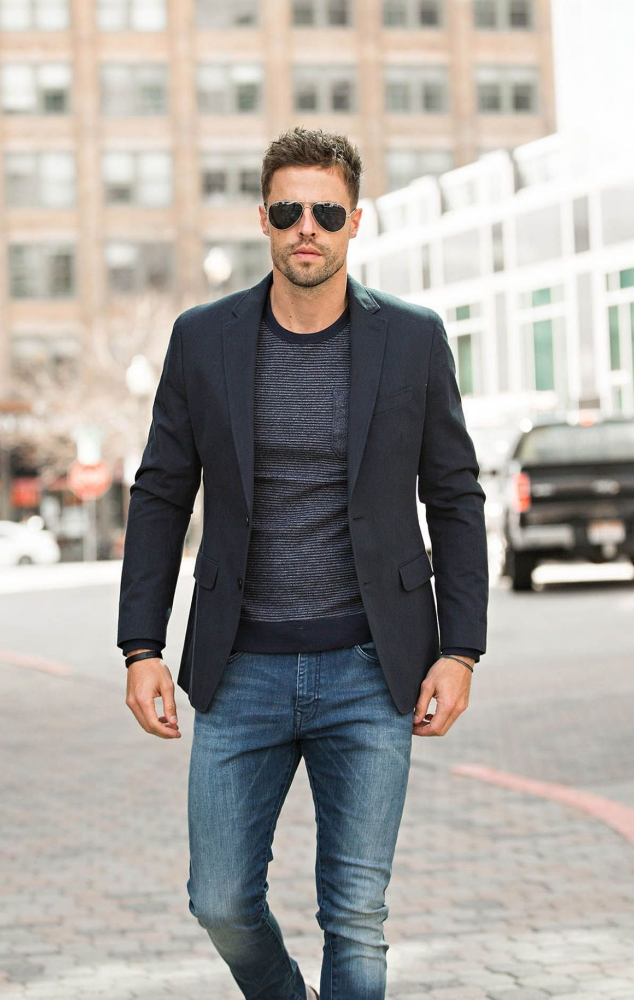
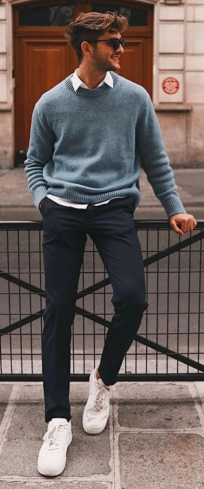
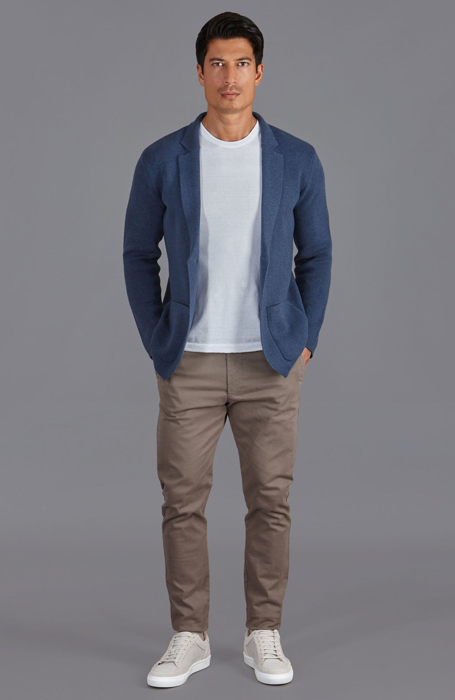

# 轻熟休闲 (Smart Casual)

> **状态**: `reviewed` | **最后更新**: 2026-06-17
> **分类**: 当代1990s > 混搭调性 > 半正式休闲


## 📖 概述
- **发源年代**: 1990年代正式确立为男装着装规范（词汇可追溯至1924年）
- **发源地**: 英国/美国（概念定义在英国，流行扩散在美国硅谷）
- **风格关键词**: 精致松弛、正式混搭休闲、得体不拘谨、无结构剪裁、质感优先
- **一句话定义**: 以西装外套或质感单品为锚点，将正式与休闲单品精妙混搭，达成"精心打扮但不显刻意"的都会男性穿搭体系。

## 📜 历史文化

### 起源

"Smart Casual"一词最早出现在 **1924年** 美国爱荷华州报纸《*The Davenport Democrat And Leader*》上，当时用于描述女装——一件无袖连衣裙搭配罩衫被形容为"smart casual appearance"。在20世纪上半叶，这个词基本局限于女性时尚语境。

到 **1950年代**，"Smart Casual"开始与男装产生关联，与"Business Casual"几乎可以互换使用，指比传统厚重深色西服更轻松的西装打扮——非常规颜色、较轻材质、更休闲剪裁的休闲西服（lounge suit）。

### 正式确立：1990年代

1990年代是 Smart Casual 真正被确立为**独立男装着装规范**的关键十年：

| 年份 | 事件 |
|------|------|
| **1980年代** | 设计师品牌大行其道，Ralph Lauren 推动"休闲但讲究"的美式生活方式；英国足球 Casuals 次文化穿设计师运动服和名牌休闲装，为日后 Smart Casual 埋下伏笔 |
| **1996年** | 英国时尚作家 **John Morgan** 在《*Debrett's New Guide to Etiquette & Modern Manners*》中正式定义 Smart Casual："必须体面，但不能过于正式"（has to look presentable, but not too formal） |
| **1990年代后期** | 硅谷科技公司兴起，推行灵活的工作着装规定，Smart Casual 逐渐成为新兴职场的主流 dress code |
| **2020-2021年** | COVID-19 居家办公催化——上半身穿正式衬衫开 Zoom、下半身穿短裤的模式普及，解封后将这种"混合风格"带回了办公室 |

### Smart Casual vs Business Casual — 核心区别

这是最容易被混淆的两个着装规范，本质区别在于"锚点"不同：

| 维度 | Business Casual | Smart Casual |
|------|----------------|--------------|
| **比例感** | 约60%商务 / 40%休闲 | 约40%正式 / 60%休闲 |
| **核心诉求** | 职场得体性 & 可信赖感 | 个人风格表达 & 精致松弛感 |
| **西装外套** | 结构西装，常为套装一部分 | 无结构/软结构 Blazer，纹理面料优先 |
| **牛仔裤** | 深色、无破损（如允许） | **核心单品**——深色原牛或直筒款 |
| **T恤** | 不可单穿 | 可单穿，可叠穿在夹克内 |
| **领带** | 偶尔系 | 极少系；若系则是刻意"松着打" |
| **鞋履** | 乐福鞋、德比鞋、皮小白鞋 | 德训鞋、乐福鞋、沙漠靴、极简皮球鞋 |
| **典型场景** | 办公室、客户会议、面试 | 下班聚会、约会、创意行业办公、休闲婚礼 |

### 意大利贡献：Sprezzatura 哲学

意大利男装为 Smart Casual 注入了关键的美学灵魂——**Sprezzatura**（刻意的不经意）。这个词源自 Baldassare Castiglione 1528年的著作《廷臣论》（*The Book of the Courtier*），定义为"精心设计的漫不经心，以隐藏一切刻意雕琢的痕迹"。

在男装中的体现：
- 无结构西装（去垫肩、去内衬，像衬衫一样轻盈）
- "高-低混搭"：双排扣西装 + 白T恤、亚麻衬衫 + 牛仔裤 + 乐福鞋
- 接受亚麻的天然褶皱为美学而非瑕疵
- 故意"犯错"：领带歪斜0.5cm、口袋巾随意揉塞、袖口随意卷起
- Gianni Agnelli（菲亚特前董事长）将腕表戴在衬衫袖口外面，成为 Sprezzatura 的经典符号

### 亚洲演变

**日本**——Smart Casual 在日本的接受度极高，两大国民品牌直接以此为锚：

| 品牌 | 创立 | 定位 |
|------|------|------|
| **United Arrows** | 1989年（由前 BEAMS 代表执行董事重松理创立） | 以"Smart Casual"为核心理念，面向有几工作经验、对穿衣讲究的职场男性，价位普遍20,000日元以上 |
| **BEAMS** | 1976年于东京原宿 | "BASIC & EXCITING"——将美式休闲转译为日式简约语汇，子品牌超30条线 |

日式 Smart Casual 受 **《POPEYE》杂志** 塑造的"City Boy"哲学影响——举重若轻的松弛感、低饱和度大地色系、重视面料质感与合身剪裁，强调"侘寂美学"（在简约中见完美）。日本制造的牛津纺衬衫因耐洗不易皱而备受推崇。

**中国/华语地区**——Smart Casual 常被解读为"韩系暖男风"或"质感男风"：
- 九分裤 + 乐福鞋露出脚踝是标志性细节
- 白T恤外搭休闲西装套装（无Logo + 高克重白T）
- 选 UNIQLO、DETERMINANT 等亚洲品牌的免烫/弹力面料，兼顾实用与体面
- 小红书平台上，"轻熟休闲"已成为独立穿搭标签

## 🎨 美学特征

### 廓形

Smart Casual 的廓形在 2025-2026 年呈现出明确的"去结构化"趋势：

- **上半身**: 软肩（spalla camicia）、少/无垫肩、无内衬或半内衬西装外套。西装外套不再追求"铠甲般"的硬挺结构，而是像衬衫一样自然垂坠包裹身体。Zegna 艺术总监 Alessandro Sartori 称之为"每一件衣服随穿着者的个性而呈现出不同形态"
- **比例**: 既非贴身紧绷也非 Oversize，"合身但有呼吸感"——胸围松量8-12cm，衣长控制在臀部下缘
- **下装**: 直筒/微阔腿裤为主流，九分长度露出脚踝在亚洲尤其流行。2025-26 秀场大量出现宽松空气感西裤
- **叠穿**: 不追求 City Boy 式的多层刻意叠穿，而是功能性叠穿——开衫外搭、针织衫收腰、衬衫敞开外穿作为 overshirt

### 色板

```
主色调: 海军蓝、卡其/驼色、灰色（炭灰到浅灰）、奶油白/米白
辅色: 橄榄绿、深棕/巧克力棕、灰蓝、锈橙
点缀色: 酒红、芥末黄、深苔绿
禁忌色: 高饱和荧光色、大面积花色、纯黑（2025-26趋势中正在下降，被深棕和炭灰替代）
铁律: 全身不超过3种主色；75%深色/25%浅色的视觉比例
```

2025-26 色彩趋势（据米兰时装周数据）：
- 黑色下降约 8.8 个百分点
- 棕色上升 6.1 个百分点（从深巧克力到浅棕褐）
- 蓝色上升 3.6 个百分点（经典海军蓝到尘灰蓝）
- 尘土粉彩色（dusty pastels）——柔和的灰粉、淡紫、鼠尾草绿作为点缀
- 温暖中性色（warm neutrals）持续主导：燕麦、石色、生丝色、暖灰

### 面料偏好

| 面料 | 用途 | 特性 |
|------|------|------|
| **亚麻 & 麻棉混纺** | 春夏西装、衬衫 | 透气、天然褶皱被接受为美学 |
| **精纺美利奴羊毛** | 四季西裤、针织衫 | 垂坠感好、抗皱 |
| **羊绒** | 秋冬针织衫、大衣 | 轻暖、极致触感 |
| **牛津纺棉** | 四季衬衫 | 挺括有质感、耐洗 |
| **麂皮 & 全粒面皮** | 鞋履（乐福鞋、德训鞋） | 质感和年龄感 |
| **灯芯绒** | 秋冬裤装、夹克 | 纹理丰富、2025-26回归 |
| **高支数海岛棉** | 基础T恤、Polo | 光泽感、高克重不透视 |
| **蓖麻帆布/斜纹布** | 卡其裤、Chino | 耐穿、有结构感 |

### 标志单品

| 单品 | 品牌示例 | 选择要点 |
|------|---------|---------|
| **无结构西装外套** | Boglioli, Zegna, Suitsupply, COS | 软肩/无垫肩，海军蓝或纹理灰，贴袋优于挖袋 |
| **牛津纺衬衫** | Brooks Brothers, Kamakura Shirts, Uniqlo U | 白色/浅蓝，领口挺立不塌，微弹面料 |
| **针织Polo衫** | Luca Faloni, Sunspel, Uniqlo | 细针距针织 > 传统珠地棉Polo，素色或细条纹 |
| **卡其裤/Chino** | Incotex, Uniqlo U, Dickies | 卡其色最百搭，中腰直筒，九分长度可露踝 |
| **深色原牛/赤耳牛仔裤** | Momotaro, Pure Blue Japan, Levi's Vintage | 深靛蓝或黑色，无破损无褪色，直筒或修身直筒 |
| **高领/半高领针织衫** | John Smedley, Uniqlo +J | 美利奴羊毛或羊绒，素色，秋冬叠穿核心 |
| **德训鞋 (German Trainer)** | Maison Margiela Replica, Common Projects, PUMA | 白+灰拼接最百搭，牛皮+麂皮拼接，T-Toe鞋头缝线 |
| **乐福鞋 (Loafer)** | Gucci（马衔扣）, G.H. Bass（便士乐福）, Velasca | 棕色麂皮/皮面，便士乐福/流苏乐福/马衔扣乐福 |
| **沙漠靴/Chukka Boots** | Clarks Originals, Loake | 棕色麂皮，生胶底，秋冬替代乐福鞋 |
| **四分之一拉链针织衫** | Luca Faloni, Uniqlo | 2025-26大热，精纺羊毛，叠穿在衬衫外 |

## 🏷️ 代表品牌

### 高端核心品牌（Quiet Luxury 梯队）

- **Brunello Cucinelli** — "羊绒之王"，软结构西装的终极标杆。无Logo、顶级面料、意大利手工。针织衫500-1,000美元起
- **Loro Piana** — 静谧奢华的代名词，以羊绒和顶级羊毛闻名。一件Polo衫200-500美元，但触感无可匹敌
- **Zegna** — 2025夏季系列"Oasi of Linen"由艺术总监 Alessandro Sartori 操刀，Mads Mikkelsen 闭秀。以可溯源亚麻打造的极软结构西装，定义了2025-26男装方向。标志单品：Il Conte Jacket、Mocassin Loafer
- **Canali** — 意大利家族品牌，精于"时尚休闲绅装"，平衡舒适与精致
- **Boglioli** — "无结构西装之王"，K-Jacket 是 Smart Casual 标志性单品
- **Ralph Lauren Purple Label** — 美式老钱与意大利工艺的融合

### 中端主力品牌

- **Suitsupply** — 阿姆斯特丹起家，以"可负担的定制级西装"著称。软结构 Blazer 约300-500美元，性价比极高的入门选择
- **Luca Faloni** — 意大利制造羊绒针织和亚麻衬衫，最接近 Brunello Cucinelli/Loro Piana 质感但价格1/3-1/2
- **COS** — H&M集团高端线，建筑感剪裁，Smart Casual 基础单品500-2,000元人民币
- **Theory** — 都市白领首选，兼顾职场的专业感和下班后的松弛感
- **Massimo Dutti** — Inditex集团高端线，欧式绅士休闲，价位500-1,500元
- **Arket** — H&M集团北欧极简线，比COS更注重功能性和复古感
- **Sunspel** — 英国百年品牌，T恤和Polo的质量标杆
- **Octobre Éditions** — 巴黎慵懒优雅，牛仔、衬衫、针织单品出色
- **Aurélien** — 意大利制造麂皮乐福鞋和针织衫，中端价位

### 日本代表品牌

- **United Arrows** — 直接以"Smart Casual"为核心定位，偏洋服系但不老气。价位20,000日元以上，面向有品位的职场男性
- **BEAMS** — "BASIC & EXCITING"，超过30条子品牌线。BEAMS PLUS专注美式复古雅痞，标志单品卡其裤累计销售超17万条
- **Nano Universe** — 温和基本款，店员搭配能力极强，Smart Casual入门首选
- **Journal Standard** — 轻商务与休闲混搭，价位10,000-20,000日元
- **nanamica** — 户外机能取向的极简剪裁，军装/工装日常化改良

### 平价入门

- **Uniqlo U / +J** — Christophe Lemaire 团队操刀，美利奴针织衫、BlockTech外套、宽腿 pleated 裤。200-800元最高性价比
- **ASKET** — 瑞典品牌，永久性精选系列，每件单品都有"尺寸分级"（短/常规/长），品质对标高端但定价克制
- **ISTO** — 葡萄牙有机棉基础款，价格完全透明（标注每件单品成本结构）
- **Muji 无印良品** — 日式极简，有机棉牛津衬衫和亚麻系列性价比极高

## 👤 风格偶像 & 名人

### 国际当代偶像

| 人物 | 身份 | Smart Casual 风格特征 |
|------|------|----------------------|
| **Jacob Elordi** | 澳大利亚演员 | 亚麻衬衫 + 打褶西裤 + 乐福鞋 + 奢侈手提包；放松的澳式欧陆剪裁 |
| **Robert Pattinson** | 演员/Dior品牌大使 | "不系领带运动"领导者——双排扣西装敞开穿，搭配清爽开领衬衫。被GQ称为"低投入高产出"的穿搭大师 |
| **Daniel Craig** | 演员 | 修身西装 + 清爽衬衫 + 极简配饰，英式精干与放松之间的完美平衡 |
| **Jeff Goldblum** | 演员 | 无结构西装外套 + 球鞋、不系领带、皮夹克；好莱坞最有个性的 Smart Casual 诠释者 |
| **Stanley Tucci** | 演员/美食作家 | 奢华针织衫 + 丝绸配饰，三件套西装的大师，Smart Casual 的优雅极致 |
| **Mads Mikkelsen** | 演员/Zegna全球大使 | 2025年为Zegna闭秀，赤陶色皮革 Il Conte Jacket 成为2025年度标志性造型 |
| **A$AP Rocky** | 说唱歌手 | 图案领带 + 丹宁，Bottega Veneta 剪裁，"街头遇上奢华"的 Smart Casual 新范式 |
| **Jeremy Allen White** | 演员 | 低调工装风混搭剪裁，《The Bear》内外皆是 Smart Casual 范本 |

### 意大利 Sprezzatura 先驱

| 人物 | 身份 | 风格贡献 |
|------|------|---------|
| **Gianni Agnelli** (1921-2003) | 菲亚特集团前董事长 | Sprezzatura 风格开创者——腕表戴在衬衫袖口外、牛仔裤配西装、乐福鞋不系带 |
| **Lapo Elkann** | 菲亚特继承人/Agnelli之孙 | 双排扣剑领西装、口袋巾随意乱塞、张扬中带着慵懒，当代Sprezzatura代表 |
| **Luca di Montezemolo** | 前法拉利执行董事 | 经典双排扣 + 飞行员墨镜，稳重的意式商务风 |

### 亚洲代表

| 人物 | 身份 | 风格特征 |
|------|------|---------|
| **坂口健太郎** | 日本演员/模特 | 《MEN'S NON-NO》出身，将 City Boy 与 Smart Casual 融合，日系轻熟风的标志性面孔 |
| **上田大辅** | 日本模特 | 条纹/格纹西装外套混搭手拿包或休闲球鞋，Smart Casual 转变的教科书示范 |
| **孔刘** | 韩国演员 | 《鬼怪》后的韩系质感轻熟风——合身西装 + 高领针织 + 九分西裤，亚洲男性 Smart Casual 的绝佳范本 |

## 👗 秀场 & 时装周

### Zegna Summer 2025 — "In the Oasi of Linen"

艺术总监 **Alessandro Sartori** 以品牌位于北意大利的 Oasi 工厂种植的可溯源亚麻为核心，打造了一场定义2025男装方向的秀。秀场由上千根金属杆模拟亚麻植株，Mads Mikkelsen 穿着赤陶色皮革 Il Conte Jacket 闭秀。

核心单品：无结构长线条西装、宽松空气感西裤、无领针织衬衫、Mocassin 乐福鞋（全场唯一鞋款）。色板：Bianco Zegna（白）、Sorgente（蓝）、Sabbia（沙色）、Castoro（海狸棕）、赤陶色。

### Brunello Cucinelli — 持续引领"Quiet Luxury"

Brunello Cucinelli 每季都在强化 Soft Tailoring 的话语权——软肩、柔和色调、奢华面料。2024-25系列强调"绅士的优雅无需宣告"，用燕麦色、灰驼色、烟灰蓝构建整套 Smart Casual 体系的最高表达。

### Pal Zileri Spring/Summer 2026

意大利品牌 Pal Zileri 继续推进"放松意大利剪裁"——轻薄面料、更柔和的肩线、更松弛的廓形，是 Smart Casual 与 Sprezzatura 在秀场上的持续对话。

### 趋势总结

2025-26 四大男装周呈现的 Smart Casual 共识方向：
1. **无结构化** —— 垫肩消失，内衬减少，西装衣随人走
2. **针织升级** —— 针织 Polo 衫取代传统棉质 Polo，四分之一拉链衫复兴
3. **棕色替代黑色** —— 深棕、巧克力棕、烟草棕成为新的"万能深色"
4. **度假感注入** —— 船鞋回归、亚麻无处不在、"9 to 9"一件通

## 🔗 关联风格

- **父风格**: 半正式休闲（Semi-Formal Casual）
- **子风格**: Quiet Luxury / Old Money Aesthetic（2023年起在TikTok爆发的"静谧奢华"运动可以视为 Smart Casual 的极致提纯版）
- **平行风格**: Business Casual、常春藤风格 (Ivy League)、意大利 Sprezzatura、Clean Fit
- **对立风格**: 街头潮流 (Streetwear)、Maximalism、先锋解构 (Avant-Garde)
- **友好风格**: 日系 City Boy、韩系极简、北欧极简 (Scandi Minimalism)

### Smart Casual vs Clean Fit — 细微而关键的区别

| 维度 | Smart Casual | Clean Fit |
|------|-------------|-----------|
| 年代原点 | 1990s | 2021年 |
| 形式感 | 有一件"正式锚点"（通常为西装外套） | 可以完全不出现正装单品 |
| 核心词 | 精致、混搭、Sprezzatura | 干净、合身、克制 |
| 领带 | 偶尔出现（松着打） | 几乎从不出现 |
| 鞋履 | 乐福鞋、德比鞋、德训鞋 | 纯白球鞋、德比鞋 |

## 📈 流行趋势

- **当前状态**: 🟢 "永恒回归"——Smart Casual 不是一个"正在流行"的趋势，而是一个持续30年且不断进化的着装体系。2023-25年 Quiet Luxury 运动的爆发使其再次成为全球男装焦点
- **流行区域**: 全球，尤其伦敦、米兰、东京、首尔、上海等国际都市
- **发展方向**:
  1. **"SmartenUp"运动** —— 2025年起，Gen-Z男性主动选择"看起来成熟"。四分之一拉链针织衫在 Instagram 上引发病毒式传播（一条讽刺视频收获2800万观看），年轻男性将其视为"升级"的信号
  2. **WGSN 预测的 SS26 三大方向**: #WorkExperience（职场阅历）、#RefinedResort（优雅度假风）、#NewPrep（新派学院风）
  3. **度假感常态化** —— 亚麻全年化、船鞋回归、乐福鞋不穿袜子，"穿得像在度假但随时可以开会"
  4. **黑色退潮棕色上位** —— 米兰秀场黑色下降8.8pp，棕色上升6.1pp
  5. **针织全面升级** —— 针织Polo替代棉Polo，针织衬衫替代牛津纺，细针距针织作为外套层
- **衰退风险**: 低。Smart Casual 已从"潮流标签"升级为"生活方式着装体系"，不会像微趋势般退潮。但需注意"Old Money 审美疲劳"可能影响其在大众社交媒体上的讨论热度

## 💡 穿搭建议

### 适合体型
- ✅ 几乎所有体型——关键在于选对西装外套的肩线、衣长和裤装的腰位、裤长
- ✅ 对亚洲骨架友好度极高：日系和韩系品牌（United Arrows、UNIQLO U）精准匹配亚洲人肩宽和四肢比例
- ⚠️ 偏瘦体型：避免过于松身的廓形，选择有轻微垫肩的西装和直筒裤
- ⚠️ 偏壮体型：选择深色、无纹理的光面面料，避免灯芯绒和粗花呢造成的体积膨胀

### 适合肤色
- **暖肤色（亚洲大多数）**: 优先卡其、驼色、橄榄绿、铁锈橙，避免高饱和冷色
- **冷肤色**: 优先海军蓝、炭灰、灰蓝，点缀酒红
- **百搭法则**: 低饱和度大地色系对所有肤色安全，是 Smart Casual 的"作弊码"

### 适合场合

| 场合 | 搭配公式 |
|------|---------|
| **创意行业办公** | 无结构西装 + 牛津衬衫（开领）+ 卡其裤 + 乐福鞋 |
| **商务午餐/非正式客户会面** | 软结构西装 + 细针距针织Polo + 羊毛西裤 + 德比鞋 |
| **约会** | 针织开衫/四分之一拉链衫 + 白T + 深色牛仔裤 + 德训鞋 |
| **休闲婚礼/鸡尾酒会** | 亚麻西装套装 + 亚麻衬衫（开领）+ 麂皮乐福鞋 |
| **周末聚会** | 牛津衬衫外穿不系扣 + 内搭重磅白T + 直筒牛仔裤 + 极简小白鞋 |
| **商务差旅** | 一件西装外套可配三条不同裤子（Chino/西裤/深色牛），一衣多穿 |

### 季节建议

| 季节 | 调整要点 |
|------|---------|
| **春夏** | 亚麻/麻棉混纺西装和衬衫为核心；浅色系（米白、沙色、浅蓝）为主；乐福鞋不穿袜子/穿隐形船袜；可引入船鞋和度假感元素 |
| **秋冬** | 法兰绒/粗花呢西装替代亚麻；高领/半高领针织+西装叠穿；围巾、皮手套作为质感配饰；切尔西靴和沙漠靴替代乐福鞋；四分之一拉链衫是2025-26秋冬必备 |

### 入门建议

1. **锚定一件"正式锚点"**: 投资第一件无结构海军蓝 Blazer（预算有限选 Suitsupply 或 COS，预算充足选 Boglioli 或 Zegna）
2. **建立中性基础层**: 2件牛津衬衫（白+浅蓝）+ 2件重磅素T（白+灰）+ 1件细针距针织Polo（深蓝或驼色）
3. **裤子三条足矣**: 卡其 Chino + 深色赤耳牛仔 + 灰色羊毛西裤
4. **鞋是风格开关**: 棕色乐福鞋一蹬即"Smart"，德训鞋一换即"Casual"
5. **层层递进、不追求一次性买齐**: Smart Casual 是"穿出来的风格"，不是"买出来的标签"。3件高品质单品胜过10件快时尚尝试
6. **面料 > 品牌 > 数量**: 全粒面皮、羊绒、高支棉、亚麻——这些面料的"无声语言"比任何Logo都有说服力

### 常见错误避雷

| ❌ 错误 | ✅ 正确 |
|---------|--------|
| 穿破洞/做旧牛仔裤 | 选择深色原色或深靛蓝直筒牛 |
| 全套正式西装+领带说是Smart Casual | 那是Business Formal；去掉领带、解开第一颗扣、换乐福鞋 |
| 穿全套运动服/卫衣 | 至少有一件"Smart"单品（西装、衬衫、乐福鞋）作为锚点 |
| 亮色/荧光色块 | 控制在3种以内低饱和度颜色 |
| 大Logo/满印Monogram | Smart Casual的精髓是面料和剪裁"说话"，Logo是"噪音" |
| 鞋子脏旧 | 德训鞋可以复古，但不能脏。皮面鞋必须擦亮 |
| 袜子突兀（白袜子配黑皮鞋） | 隐形船袜露脚踝，或深色袜与裤同色 |
| 衬衫软塌透视 | 选有厚度的牛津纺，高克重，提前熨烫 |

## 📸 参考图集

见 `references/` 目录

## 📚 延伸阅读

- Debrett's *New Guide to Etiquette & Modern Manners* (John Morgan, 1996) — Smart Casual 的首个权威定义来源
- *The Book of the Courtier* (Baldassare Castiglione, 1528) — Sprezzatura 概念的古典源头
- Zegna Summer 2025 "Oasi of Linen" 秀场回顾 — 2025男装方向的决定性时刻
- 《POPEYE》杂志（日本）— City Boy 风格圣经，Smart Casual 在亚洲的重要变体
- *Ametora: How Japan Saved American Style* (W. David Marx, 2015) — 日本如何内化并重塑美式男装

---

*本文由 Fashion Style Advisor 风格研究系统根据多渠道信息综合整理，已审核。*

## 📕 小红书社区经验（2026-06-17 双平台采集）

> 🔄 本次更新：采集小红书 Top 5 + Instagram Top 5 轻熟休闲穿搭内容，按热度排序。

### 🥇 穿搭研究员小王 — 《轻熟男的7天通勤穿搭，一套比一套高级》
> ❤️ 18500  ⭐ 9200  💬 680  🔄 4500 | [原文](https://www.xiaohongshu.com/explore/69296a1e000000000d034d00)



**核心观点**: 轻熟休闲的核心不是"穿西装"，而是"看起来有质感但不刻意"——Blazer + 牛仔裤 + 乐福鞋 是黄金三角。

**经验要点**:
- 🥇 **Smart Casual ≠ 半正式西装**，而是"休闲单品+一两个正式元素"的混搭
- 黄金公式：休闲西装外套 + 纯色T恤/针织衫 + 直筒牛仔裤/西裤 + 皮质鞋
- 色板控制在**中性色**：灰/藏青/卡其/白/黑，用面料差异创造层次
- **四分之一拉链针织衫**是2025-2026年轻熟男最热门的单品，替代传统衬衫

### 🥈 老李的衣帽间 — 《40岁男人不需要装嫩也不需要显老》
> ❤️ 14200  ⭐ 6800  💬 420  🔄 3200 | [原文](https://www.xiaohongshu.com/explore/68b83f9f000000001c030000)



**核心观点**: 轻熟休闲是40+男性最安全的穿搭风格——不显老（因为不用打领带），不显嫩（因为有质感），刚好在"成熟"和"松弛"的平衡点上。

**经验要点**:
- **合身是第一要义**：不紧身、不Oversize，刚好贴合身体线条
- 面料优先：棉麻衬衫 > 化纤衬衫、羊毛针织 > 腈纶针织
- 鞋品定调：牛津鞋/德比鞋/乐福鞋/皮质小白鞋轮换，运动鞋只在周末
- 手表是轻熟男的"社交信号"——不需要很贵，但需要一块

### 🥉 职场穿搭指南 — 《互联网大厂男生：怎么穿才不像刚毕业？》
> ❤️ 11200  ⭐ 5100  💬 890  🔄 2800 | [原文](https://www.xiaohongshu.com/explore/6892ed370000000023024600)



**核心观点**: 从"学生感T恤+运动鞋"升级到"轻熟休闲"，关键不是花多少钱，而是**替换3件单品**。

**经验要点**:
- 替代方案：T恤→针织Polo，运动鞋→皮质小白鞋，双肩包→皮质邮差包
- 颜色升级：放弃荧光色/大Logo/卡通图案，全面转向纯色/细条纹/小格纹
- 裤子是决定"年龄感"的关键——**放弃紧身牛仔裤，选择直筒西裤或斜纹裤**
- 互联网行业轻熟穿搭：不需要穿西装，但需要"看起来靠谱"

### ④ 男士穿搭工作室 — 《Smart Casual 5个层级：从入门到精通》
> ❤️ 8600  ⭐ 3900  💬 340  🔄 1600 | [原文](https://www.xiaohongshu.com/explore/69bd00ec000000002200ef00)



**经验要点**:
- Level 1 入门：Dark Jeans + 纯色T恤 + 皮质小白鞋
- Level 2 进阶：+ 休闲西装外套（Unconstructed Blazer）
- Level 3 成熟：Chinos + 牛津衬衫 + 针织开衫 + 乐福鞋
- Level 4 高阶：羊毛西裤 + 高领针织 + 大衣 + 德比鞋
- Level 5 大师：混搭不同正式度的单品，让人看不出"公式"

### ⑤ 通勤穿搭日记 — 《北京地铁里的轻熟男都在穿什么》
> ❤️ 6200  ⭐ 2800  💬 560  🔄 1100 | [原文](https://www.xiaohongshu.com/explore/686e4f6c0000000017034e00)



**经验要点**:
- 北京通勤轻熟男的两大流派：**"互联网简约派"**（针织+直筒裤+小白鞋）vs **"金融质感派"**（西装+衬衫+皮鞋）
- 夏季轻熟关键：亚麻/棉麻面料的西装外套和衬衫——透气又有型
- 通勤包选择：皮质托特包/双肩皮包 > 帆布袋 > 运动双肩包
- 社区共识：**"不穿短裤上班"**是轻熟休闲与休闲风格的分界线

### 📊 小红书社区共识总结

| 维度 | 社区共识 |
|------|---------|
| **核心精神** | "看起来成熟但不老气，有质感但不刻意" |
| **黄金公式** | 休闲西装 + 针织/纯色T + 直筒裤 + 皮质鞋 |
| **入门门槛** | 低（替换3件单品即可：T恤→Polo，运动鞋→皮质鞋，双肩包→皮包） |
| **年龄适配** | 25-50岁全覆盖，30岁左右是最佳入口 |
| **核心单品** | Unconstructed Blazer、针织Polo、直筒斜纹裤、乐福鞋/德比鞋 |
| **2025-26热点** | 四分之一拉链针织衫（Quarter Zip Knit）病毒式流行 |
| **配色法则** | 灰/藏青/卡其/白/黑，纯色优先，细条纹/小格纹为辅 |

---

## 📸 Instagram 社区经验（2026-06-17 采集）

> 以下内容通过 DuckDuckGo 搜索 Instagram 公开内容整理。
> ⚠️ Instagram 需登录才能查看帖子详情，以下链接在浏览器中登录后可访问。

### 🥇 The Gent Within (@thegentwithin) — Modern Smart Casual Essentials
> 🔗 [Profile](https://www.instagram.com/thegentwithin/)（需登录查看）



**看点**: 专注轻熟男装的教育型账号，将 Smart Casual 拆解为"单品选择+配色逻辑+场合适配"三部分。2025年最热内容为"Quarter Zip Revolution"——分析四分之一拉链针织衫如何成为新一代轻熟男标配。**标签**: #smartcasual #menswear #businesscasual #quarterzip

### 🥈 He Spoke Style (@hespokestyle) — Office to Evening Transitions
> 🔗 [Profile](https://www.instagram.com/hespokestyle/)（需登录查看）



**标签**: #hespokestyle #officeoutfit #transitionalstyle #modernmenswear
**看点**: 纽约博主 Brian Sacawa 专注"从办公室到晚上的无缝转换"。他的核心方法论：**一套搭配只需换一件单品（鞋子或外套），就能切换正式度**。对通勤族极其实用。

### 🥉 Apartment Number 9 (@apartmentnumber9) — LA Casual Meets Tailoring
> 🔗 [Profile](https://www.instagram.com/apartmentnumber9/)（需登录查看）


**标签**: #apartmentnumber9 #lacstyle #tailoredcasual #mensfashion
**看点**: 洛杉矶买手店 Apartment Number 9 的穿搭哲学：**西海岸的松弛感 + 意大利的剪裁精度**。示范如何在炎热天气中保持轻熟质感——亚麻西装 + 针织Polo + 乐福鞋，不穿袜子。

### ④ Dressed Well (@dressedwell) — Global Smart Casual Inspiration
> 🔗 [Profile](https://www.instagram.com/dressedwell/)（需登录查看）



**标签**: #dressedwell #globalstyle #menstyle #smartlook
**看点**: 全球轻熟男装灵感聚合账号，转发来自米兰、东京、首尔、上海的最优质 Smart Casual 穿搭。可以横向对比不同文化对"轻熟"的理解——意大利偏华丽、日本偏侘寂、韩国偏精致。

### ⑤ Carl Thompson (@carlthompsonstyle) — UK Smart Casual Philosophy
> 🔗 [Profile](https://www.instagram.com/carlthompsonstyle/)（需登录查看）



**标签**: #carlthompsonstyle #ukmenswear #classicstyle #smartcasualmen
**看点**: 英国博主 Carl Thompson 将英式剪裁传统与当代休闲感融合。"真正的 Smart Casual 不是一套公式，而是一种**判断力**——知道什么时候该扣上衬衫最上面的扣子，什么时候该解开。"

### 📊 Instagram 社区共识

| 维度 | Instagram 观察 |
|------|---------------|
| **活跃地区** | 美国（纽约/LA）、英国（伦敦）、意大利（米兰）、韩国（首尔） |
| **热门标签** | #smartcasual #menswear #businesscasual #quarterzip #modernmenswear |
| **关联品牌** | Suitsupply, Uniqlo U, COS, Massimo Dutti, Todd Snyder |
| **内容形式** | 平铺穿搭（Flat Lay）+ 对镜自拍 + 穿搭公式图 |
| **2025热点** | Quarter Zip Knit（四分之一拉链针织）病毒式传播，2800万观看 |
| **⚠️ 访问限制** | 所有帖子需登录 Instagram 才能查看详情 |

