# 街头潮流 (Streetwear)
> **状态**: `reviewed` | **最后更新**: 2026-06-17

---

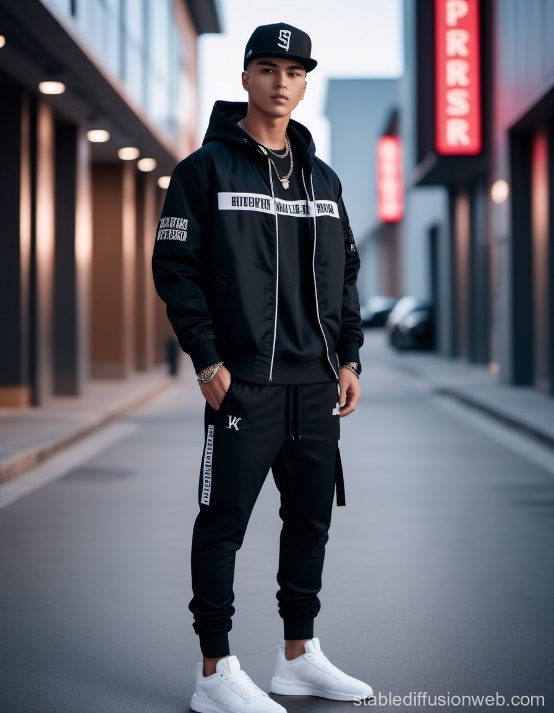

## 📖 概述

**街头潮流（Streetwear）** 是诞生于 1980 年代美国反文化运动、并在 1990-2000 年代全球化扩张的一种服装风格。其核心基因融合了**冲浪、滑板、嘻哈、涂鸦、朋克和 DIY 精神**，从最初的小众亚文化表达，演变为当今主导全球时尚产业的百亿美元级文化现象。

Streetwear 的内核不是某一种特定的服装品类，而是**一种文化态度与社群归属**——强调舒适、限量稀缺、品牌符号、以及与音乐/艺术/运动的深度绑定。正如 The Hundreds 创始人 Bobby Kim 所说：「Streetwear 不是一种服装类型——它是一个社群、一种文化、一段历史。」

截至 2026 年，全球 Streetwear 市场规模持续增长，预计 2035 年将达到 **3090 亿美元**（CAGR ~4.2%）。当代 Streetwear 已从大 Logo 的「Hype 时代」走向更成熟的「精致街头（Grown-Man Streetwear）」阶段，与高级时装、运动科技、可持续时尚深度交融。

---

## 📜 历史文化

### 🏄 1980 年代：起源与雏形

Streetwear 的起源可追溯到两个地理中心——**南加州**和**纽约市**——各自孕育了该风格的不同基因。

#### 西海岸：冲浪与滑板文化

1980 年前后，**Shawn Stussy**（肖恩·斯图西）在加州的拉古纳海滩（Laguna Beach）以手工塑造冲浪板起家。他在自己的冲浪板和 Hanes T 恤上用涂鸦风签名——那个如今已成为殿堂级符号的手写体「Stüssy」——开启了 Streetwear 的先河。

Stussy 首创了后来整个行业奉为铁律的三大策略：
- **稀缺营销（Scarcity Marketing）**：限量供货，人为制造稀缺感
- **跨亚文化混合（Cross-Subculture Fusion）**：将冲浪、滑板、嘻哈和朋克等看似不相关的亚文化融合
- **社群经营（Tribe Building）**：通过「国际 Stussy Tribe」及限量校队夹克建立全球忠实粉丝网络

1991 年，Stussy 与年轻的 **James Jebbia**（后来的 Supreme 创始人）合作，在纽约 Prince Street 开设了东海岸第一家 Stussy 店，正式将这一西海岸亚文化带到纽约。

#### 东海岸：嘻哈、涂鸦与 B-boy 文化

同一时期，纽约市正在经历早期嘻哈运动的爆发：
- **Run DMC** 将运动套装（tracksuit）、高帮白色球鞋和粗鞋带推为主流街头视觉
- 涂鸦艺术（Graffiti）从费城到纽约地铁爆炸式发展，贡献了 DIY 反抗美学
- **B-boy/Flygirl** 文化将运动装备、大 Logo 和定制名牌服装演绎为街头身份标识
- 1981 年 **MTV 开播**，音乐与时尚的融合获得了前所未有的传播势能

### 🎤 1990 年代：主流化与全球化

#### 美国：帮派说唱与黄金年代嘻哈

1990 年代，帮派说唱（Gangsta Rap）将超大廓形（ oversized silhouette）推至主流：
- 宽大的工装牛仔裤、轰炸机夹克、羽绒服成为标配
- Will Smith 在《新鲜王子妙事多》中普及了明亮撞色与大胆印花的街头风格
- TLC 等女子团体证明了街头美学同样适用于女性穿搭
- 运动商品（芝加哥公牛队、纽约洋基队球衣）成为时尚符号

滑板文化同期巩固了自己的着装密码：篮球鞋 + 宽松军裤 + 钱包链 + 超大 T 恤 + 反戴棒球帽。

#### 1994 年：Supreme 诞生

James Jebbia 在纽约拉斐特街（Lafayette Street）开设 Supreme，最初作为一家滑板店。当发现仅售其他品牌不够时，他开始生产自有产品，并开创了后来的核心模式——**「Drop」模型**：每周限量发布少量商品，制造稀缺和狂热社群效应。Supreme 的红底白字 Box Logo（灵感来自艺术家 Barbara Kruger 的概念艺术）成为街头文化最强大的视觉图腾之一。

#### 日本：里原宿运动（Ura-Harajuku）

1993 年，**Nigo**（长尾智明）在东京原宿创立 **A Bathing Ape（BAPE）**。品牌名称源自日语谚语「温水中的猿」（a bathing ape in lukewarm water），讽刺日本年轻人沉迷安逸。与「里原宿教父」**Hiroshi Fujiwara**（藤原浩）一起，Nigo 建立了日式 Streetwear 的独特语法：
- 极为讲究的做工质量（在「休闲服装」概念下进行高端生产）
- 脱离传统时尚日历的不定期「Drop」发售
- 设计师合作联名——这比后来的奢侈品牌联名潮早了 20 年
- 极具辨识度的视觉符号：迷彩（BAPE 1ST CAMO）、鲨鱼拉链连帽衫（Shark Full Zip Hoodie）

#### 关键人物编年

| 人物 | 角色与贡献 |
|------|-----------|
| **Shawn Stussy** | Streetwear 之父，1980 年创立 Stüssy；首创稀缺营销与亚文化融合；手写体 Logo 成为殿堂级符号 |
| **James Jebbia** | Supreme 创始人（1994）；曾在 Parachute 和 Union 工作；创造「Drop」模型和 Box Logo 神话 |
| **Nigo**（长尾智明）| BAPE 创始人（1993）；里原宿运动缔造者之一；Billionaire Boys Club/Ice Cream 联合创始人；现任 Kenzo 艺术总监 |
| **Hiroshi Fujiwara**（藤原浩）| 「里原宿教父」；GOODENOUGH 及 fragment design 主理人；奠定了日式 Streetwear 的高端美学基础 |
| **Virgil Abloh**（1980-2021）| 打破街头与奢侈品边界的革命者；Off-White 创始人（2013）；Louis Vuitton 首位非裔男装艺术总监（2018-2021）；「3% 设计哲学」倡导者 |
| **Kim Jones** | Louis Vuitton 前男装艺术总监（2011-2018）；策划了 2017 年 LV × Supreme 历史性联名；现任 Dior 男装艺术总监 |
| **Jerry Lorenzo** | Fear of God / Essentials 创始人（2013）；以 oversized 廓形 + 中性色调定义「安静街头」；2026 年 Complex Power Ranking 榜首 |
| **Pharrell Williams** | 将 BAPE 带入全球视野的关键人物；BBC/Ice Cream 联合创始人；2023 年接任 Louis Vuitton 男装创意总监 |

### 🌐 2000-2010 年代：奢侈化与主流化

- **2000 年代**：互联网让 Streetwear 的限量逻辑复刻至全球，Hypebeast 论坛和博客催生了全球 sneakerhead 文化
- **2010 年代**：Kanye West 的 Yeezy 系列（与 Nike 及后来的 Adidas 合作）将 Streetwear 推向大众市场顶峰
- **2013 年**：Virgil Abloh 创立 Off-White，以工业警示带、引号标注和红色束线带建立极强品牌识别
- **2017 年**：**Louis Vuitton × Supreme** 联名——Streetwear 正式获得顶级奢侈殿堂的认可，该系列预估收入超 **1 亿美元**，二级市场单品溢价超 10 倍
- **2018 年**：Virgil Abloh 就任 Louis Vuitton 男装艺术总监，标志着「街头即奢侈」的全面到来
- **2020-2024 年**：Supreme 先后被 VF Corporation（$21 亿）和 EssilorLuxottica（$15 亿）收购；行业进入资本化整合期

---

## 🎨 美学特征

### 廓形（Silhouette）

Streetwear 的核心廓形哲学是**舒适 + 态度**，常见轮廓包括：

| 廓形类型 | 描述 | 经典搭配 |
|---------|------|---------|
| **Oversized（超大廓形）** | 落肩 T 恤/卫衣/外套，胸部与腰围大幅放宽 | 宽松卫衣 + 窄脚裤 + 球鞋 |
| **Boxy/Cropped（箱型/短裁）** | 肩线方正，衣长截短至腰线以上 | 箱型短袖 + 宽松工装裤 |
| **Layered（多层次）** | 长短叠穿、材质碰撞 | 白 T 内搭 + 连帽衫 + 外套 |
| **Baggy（宽松下装）** | 宽腿牛仔裤/工装裤，自然堆叠在鞋面 | 宽松牛仔裤 + 修身上衣 |
| **Tailored Street（精裁街头）** | 西服外套与休闲单品的混搭 | 宽松西装 + 连帽衫 + 球鞋 |

### 色板（Color Palette）

Streetwear 的色彩策略遵循**「中性基底 + 单点爆破」**的逻辑：

| 色彩类别 | 色系 | 用途 |
|---------|------|------|
| **基础中性色** | 黑、白、灰、米白（Bone）、炭灰（Charcoal）、驼色（Camel）| 日常造型基底、"安静街头"路线 |
| **军旅/工装色** | 军绿（Olive）、卡其、深蓝（Navy）| 工装/机能向 |
| **高饱和炸弹** | 霓虹绿、电光蓝、火焰红、柠檬黄 | 品牌 Logo 或单品焦点 |
| **2025-2026 新中性色** | 水洗开心果绿（Pistachio）、天蓝、珊瑚色 | 柔和表达替代重图形 |
| **金属/未来色** | 镀铬银、暗钢色 | Y2K 复兴、机能科技向 |

### 面料与材质（Fabrics & Materials）

| 面料 | 用途与特点 |
|------|-----------|
| **重磅棉（Heavyweight Cotton, 180-280gsm）** | T 恤与连帽衫首选；厚实垂坠感是廓形的关键 |
| **法式毛圈布（French Terry）** | 连帽衫/卫衣经典材质；温暖且透气 |
| **尼龙/防撕裂布（Ripstop Nylon）** | 机能背包、机能风外套 |
| **丹宁/重磅帆布** | 牛仔裤、工装裤、宽松剪裁 |
| **抓绒（Fleece/Polar Fleece）** | 夹克、拉链外套 |
| **皮革/仿皮** | 校队夹克、配饰点缀 |
| **热致变色面料（Thermochromic）** | 2025+ 新兴；随体温/温度变色 |
| **可持续材质** | 菌丝皮革、海藻纱线、再生 PET、植物基亮片 |

### 标志单品（Key Items）

| 品类 | 核心单品 | 风格属性 |
|------|---------|---------|
| **头上身** | 棒球帽（Snapback）、毛线帽（Beanie）、渔夫帽（Bucket Hat）| 街头感的「标点符号」|
| **上衣** | Oversized 连帽衫、Bogo 卫衣、图像 T 恤（Graphic Tee）、箱型运动衫 | Streetwear 灵魂——一件单品撑起一个造型 |
| **外套** | 轰炸机夹克（Bomber）、丹宁夹克、羽绒夹克（Puffer）、校队夹克（Varsity Jacket）| 层次感的关键层 |
| **下装** | 工装裤（Cargo Pants）、宽松牛仔裤（Baggy Jeans）、运动慢跑裤（Joggers）、宽松短裤 | 廓形对撞的工具 |
| **鞋履** | Air Jordan 系列、Nike Dunk/Air Force 1、Adidas Yeezy/Samba、Vans Old Skool | 「Streetwear 的心跳」|
| **配饰** | 斜挎包（Crossbody Bag）、粗链条项链、戒指、运动袜 | 细节完成度 |

---

## 🏷️ 代表品牌

### 殿堂级 / 核心品牌（Core Icons）

| 品牌 | 创立 | 产地 | 价格带 | 地位与特点 |
|------|------|------|--------|-----------|
| **Stüssy** | 1980 | 美国加州 | $40-$300（平价亲民）| Streetwear 教父；全球分销；Private independent |
| **Supreme** | 1994 | 美国纽约 | $38-$500+（二级市场极高）| Box Logo 文化图腾；Drop 模型缔造者；现属 EssilorLuxottica |
| **A Bathing Ape (BAPE)** | 1993 | 日本东京 | $80-$500+ | 鲨鱼连帽衫 + 迷彩基因；已被 I.T 集团收购 |
| **Fear of God / Essentials** | 2013 | 美国洛杉矶 | Essentials $40-$200, 主线 $400-$1500+ | 2026 年 #1；定义"安静街头"；StockX 连续 4 年服装销售冠军 |
| **Off-White** | 2013 | 意大利米兰 | $200-$1000+ | Virgil Abloh 遗产；工业美学（警示带/引号/束线带）；高端街头标杆 |
| **Palace** | 2009 | 英国伦敦 | $50-$400 | 滑板血统最纯正的欧洲品牌；全球 12 店铺；近年进驻上海 |
| **KITH** | 2011 | 美国纽约 | $50-$500+ | Ronnie Fieg 主理；联名之王；零售体验（KITH Treats 等）|
| **Aimé Leon Dore** | 2014 | 美国纽约 | $80-$600+ | 复古运动 + 精裁街头；Teddy Santis 主理；New Balance 的黄金合作方 |
| **Corteiz (CRTZ)** | 2017 | 英国伦敦 | $50-$300 | 2025 Complex 年度最佳；零固定店铺；游击队式发售 + 全球社群；"Rules the World" |

### 中端 / 平价入门

| 品牌 | 特点 | 价格带 |
|------|------|--------|
| **Carhartt WIP** | 工装基因 + 街头升级；欧洲主线 | $40-$250 |
| **thisisneverthat**（韩国）| 韩式质感街头；军事/工装基调 | $30-$150 |
| **ADER Error**（韩国）| 超大廓形 + 色彩拼接；K-pop 偶像最爱 | $50-$300 |
| **Uniqlo U / Uniqlo UT** | 极简基础 + 合作款（KAWS/Nigo 等）；入门最佳 | $10-$50 |
| **Starter** | 复古运动 + 校队风 | $40-$150 |
| **Dickies** | 经典工装裤/夹克的街头再诠释 | $25-$100 |

### 新兴 / 值得关注

| 品牌 | 产地 | 看点 |
|------|------|------|
| **Hellstar** | 美国 | 2026 消费者满意度 10/10；Gen Z 爆发力惊人 |
| **Sp5der** | 美国 | Young Thug 主理；音乐-潮牌直通车 |
| **Syna World** | 英国 | Central Cee 主理；Drill 音乐 × 街头 |
| **Denim Tears** | 美国 | Tremaine Emory 主理；街头最佳叙事者；非裔文化表达 |
| **Rhude** | 美国 | Rhuigi Villaseñor 主理的奢侈-街头平衡 |
| **Broken Planet** | 英国 | 可持续街头；社群驱动 |
| **Represent** | 英国 | 品质升级路线；运动与街头的精准平衡 |
| **Joe Freshgoods** | 美国 | 叙事之王；与 New Balance 的深度联名 |
| **Human Made** | 日本 | Nigo 自 BAPE 卖掉后创立的复古美式品牌 |
| **WTAPS / Neighborhood / Sacai** | 日本 | 日式军事/工装/解构街头的顶级力量 |

---

## 👤 风格偶像 & 名人

### 缔造者级

- **Shawn Stussy** — 从冲浪板到全球文化符号；1980 年代初的 T 恤开启了整个运动
- **James Jebbia** — 将滑板文化装入奢侈品逻辑的人；持续 30 年掌控街头最强大的品牌
- **Nigo** — 让日本街头走向世界的教父；BAPE → Human Made → Kenzo
- **Virgil Abloh**（R.I.P. 2021）— 建筑系出身，以 DJ 思维「混音」时尚；打破街头与奢侈的柏林墙

### 音乐与文化偶像

- **Kanye West（Ye）** — Yeezy 革命者；改变了球鞋文化、审美标准和品牌与艺人的合作模式
- **Pharrell Williams** — 将 BAPE 带入全球视野；BBC/Ice Cream；现任 LV 男装创意总监
- **Travis Scott** — Cactus Jack 系列 × Nike/麦当劳/Dior；定义了 Z 世代的街头美学
- **A$AP Rocky** — 街头 × 高级时装的穿搭教科书；「时尚界的风向标」
- **Central Cee** — Drill 音乐代表；Syna World 主理人；英伦街头新生代
- **Young Thug** — Sp5der 联合创始人；亚特兰大 Trap × 街头
- **Tyler, the Creator** — Golf Wang/Golf le Fleur；彩色街头 + 个性表达

### 东亚偶像

- **G-Dragon（权志龙）** — 韩国街头/高级混搭的先锋；PEACEMINUSONE × Nike 引爆亚洲市场
- **吴赫（Oh Hyuk）** — 韩式低调街头的样本；独立乐队 hyukoh 主唱
- **余文乐（Shawn Yue）** — MADNESS 主理人；华人地区工装/军事街头的推手
- **陈冠希（Edison Chen）** — CLOT 创始人；将中华文化 × 街头带入全球视野（Nike/Levi's/Jordan 联名）

---

## 👗 秀场 & 时装周

### 里程碑事件

| 年份 | 事件 | 行业影响 |
|------|------|---------|
| **2017** | **Louis Vuitton × Supreme** 在巴黎时装周发布 | Streetwear 首次正式进入顶级奢侈殿堂；Kim Jones × James Jebbia；收入超 $1 亿；二级市场单品溢价超 10 倍；各地快闪店因人群失控而取消 |
| **2018** | Virgil Abloh 首秀 Louis Vuitton 男装 | 巴黎皇家宫殿花园跑道秀；Kendrick Lamar 携 Marching 100 乐队现场演出；彩虹色跑道隐喻多元包容 |
| **2018-2021** | Off-White 巴黎时装周季季创意 | Virgil 将秀场变为文化事件——每次融合音乐/艺术/社会议题；「3% 设计」在奢侈语境中放大 |
| **2023** | Pharrell Williams 接任 LV 男装创意总监 | 首秀在巴黎新桥（Pont Neuf）；Beyoncé、Rihanna、Jay-Z 到场；街头 × 嘻哈 × 奢侈的彻底制度化 |
| **2025** | Corteiz 在巴黎时装周非正式亮相 | 游击式秀场模式重新定义发布形式 |
| **2026** | Fear of God 持续统治 StockX | Jerry Lorenzo 不做传统时装周发布，以「Collection」为单位独立展出；成为「反时装周」力量 |

### 奢侈品牌全面拥抱街头

- **Dior** × **Air Jordan**（Kim Jones 策划）
- **Gucci** × **The North Face** / **Gucci** × **Adidas**（Alessandro Michele 时代）
- **Balenciaga** 将老爹鞋、宽大廓形、TechWear 注入奢侈体系（Demna）
- **Prada** × **Adidas**（Luna Rossa 运动线）
- **Burberry** 街头化转型（Riccardo Tisci 时代，引入 TB Monogram 和 logo 风）

---

## 🔗 关联风格

Streetwear 不是一个封闭的孤岛——它不断与其他风格交融、衍生出分支：

| 关联风格 | 关系 | 核心区别 |
|---------|------|---------|
| **Gorpcore（户外机能）** | Streetwear 的子集/兄弟 | Streetwear 强调品牌与文化符号；Gorpcore 强调功能性防水面料与户外基因（Arc'teryx/Salomon/Patagonia）|
| **Techwear / Cyberpunk（科技机能）** | Streetwear 的高科技分支 | ACRONYM/Nike ACG 式的模块化口袋、防水拉链、热封接缝；全黑色系为基调；功能性超文化性 |
| **Workwear / Americana（工装美式）** | 历史共源 | Streetwear 汲取工装的耐用性与廓形（Carhartt/Dickies），但更注重品牌符号而非职业身份 |
| **Skater Style（滑板风格）** | Streetwear 的直接祖先 | Supreme/Palace 根源；街头更注重品牌与潮流周期，滑板更坚持硬核社群与功能性 |
| **Y2K / Retro-Futurism（千禧复刻）** | 2020 年代的重要融合 | 超低腰工装裤、蝴蝶图案、水钻 Logo、酸橙绿/金属粉；与 Streetwear 共享廓形逻辑 |
| **Athleisure / Sportswear（运动休闲）** | 相邻领域 | 运动紧身装备 vs. 宽松街头单品；Fear of God × Adidas Athletics 模糊边界 |
| **Hip-Hop Culture（嘻哈文化）** | 孪生兄弟 | 几乎不可分割；嘻哈是街头美学的音乐源泉；街头是嘻哈的视觉外化 |
| **Luxury Casual（奢华休闲）** | 当前融合终端 | 「Smart Street」——精裁西装 + 连帽衫 + 限量球鞋；传统分类在消亡 |

---

## 📈 流行趋势（2025-2026）

### 1. 安静街头（Quiet Luxury Streetwear）——主导力量

Fear of God / Essentials 引领的**中性色调 + 纯感廓形 + 去 Logo 化**成为主流。Oversized 并未消失，但视觉冲击从图形转移到了面料质感与剪裁精度。消费者不再需要「被看见穿了什么品牌」，而是「被感受到整体气质」。

### 2. 精裁街头（Smart Street）

Polo 领取代圆领 T、松紧腰精裁裤、套装与运动鞋组合——街头从「休闲极端」走向「精致日常」。品牌从纯街头定位向「轻松正装」进化。

### 3. 亚洲力量全面崛起

- **日本**：Human Made 于 2025 年底 IPO，街头品牌成为合法投资资产；Sacai、WTAPS、Needles 持续影响全球剪裁审美
- **韩国**：K-Pop/K-Hip-hop 偶像将小众品牌（thisisneverthat、ADER Error、Andersson Bell）一夜推向全球爆款
- **中国**：国潮（Guochao）运动融合文化自信与数字化电商（抖音/小红书/淘宝）；ROARINGWILD、SMFK 等品牌崛起

### 4. 机能面料 × 可持续

功能性服装市场预计 2030 年达 4771 亿美元。热致变色面料、防水防撕裂布、菌丝皮革、海藻纱线——科技与可持续成为新卖点。NFC 芯片嵌入服装（数字产品护照），成为欧盟纺织品战略 2030 的强制要求。

### 5. Y2K 2.0 继续

超低腰工装裤、蝴蝶图案、水钻 Logo 腰带、金属粉/酸橙绿——2000 年代初期美学的现代化升级版本，加入包容尺码和可持续水洗。

### 6. 校队夹克复兴

校队夹克（Varsity Jacket）以复古水洗皮革、针织贴片、泡泡纱面料和大学字母标识强势回归——超大版与修身版并行。

### 7. 社群即零售

Corteiz（零固定店铺、游击 Pop-Up、密码式发售）的模型正在被全球研究。Instagram/TikTok/Discord 社群的忠诚度比传统零售渠道更有话语权。

### 8. 性别流动

无性别连帽衫、去性别化廓形成为行业标杆而非小众选择。Telfar 等品牌提供至 4XL 的包容尺码。

### 9. 音乐-品牌直通车成熟化

从 Kanye 的 Yeezy 到 Central Cee 的 Syna World 再到 Young Thug 的 Sp5der —— 音乐人不只是「代言潮牌」，而是「成为潮牌」。这一模式从试水阶段进入制度化。

---

## 💡 穿搭建议

### 适合体型

| 体型 | 策略 | 推荐单品 |
|------|------|---------|
| **偏瘦 / 窄肩** | 增加视觉分量：落肩 Oversized 卫衣、带口袋的厚实质感外套；避免过于紧身的款式 | Oversized hoodie、工装夹克、Bomber jacket |
| **倒三角 / 健身型** | 突出上半身优势：箱型短上衣 + 宽松下装的 A 字比例 | Cropped boxy tee、宽松 Cargo pants |
| **宽胖 / 腹部突出** | 纵向延伸 + 深色收敛：深色连帽衫 + 直筒裤；避开横向条纹；选择厚实不贴身的材质 | 黑色/深灰 heavyweight hoodie、直筒 Dark jeans |
| **矮个子** | 比例优化：短款上装 + 高腰下装；同色系全身搭配；避免过于宽大的 Oversized | Cropped jacket、同色系套装、厚底 sneakers |
| **标准/中型** | 大部分 Streetwear 廓形友好；可大胆尝试各方向 | 全品类 |

### 适合肤色（针对亚洲男性）

- **偏白肤色**：几乎所有色系都友好。推荐 **军绿、灰色、米白** 作为基础色；点缀可大胆使用 **霓虹绿、宝蓝、橙色**。
- **偏黄/自然肤色**：**黑、白、深灰、深蓝** 最安全；避免荧光黄绿和亮紫。**驼色/卡其色** 在 2025-2026 特别友好。
- **偏深/小麦肤色**：**大地色系（沙色、棕、橄榄）** 与肤色产生和谐共鸣；**白色** 形成高级对比；**亮红/橙色** 制造冲击力。

### 适合场合

| 场合 | 适配度 | 搭配策略 |
|------|--------|---------|
| **休闲日常** | ★★★★★ | 核心场景：连帽衫 + 工装裤 + 经典球鞋 |
| **社交/聚会** | ★★★★☆ | 用一件抢眼外套（Bomber/Varsity）+ 精裁感下装 + 限量球鞋升级 |
| **半正式/商务休闲** | ★★★☆☆ | Smart Street 路线：精裁西装 + 纯色连帽衫 + 简洁皮革鞋 | 
| **运动/户外** | ★★★☆☆ | 选择机能向品牌（Nike ACG/北面联名）；Gorpcore 分支路线 |
| **约会** | ★★★★☆ | 最重要是合身——Oversized 上衣 + 修身下装；干净的配色；注重鞋履状态 |
| **正式场合** | ★☆☆☆☆ | Streetwear 在此场景选择有限；如需出席正式场合适用高级街头品牌中的精裁线 |

### 入门建议（从零开始搭建 Streetwear 衣橱）

**Week 1：基础胶囊（Budget: ￥1000-2000 / $150-300）**
1. 一件纯色重磅 Oversized T 恤（黑/白/灰）—— Uniqlo U、thisisneverthat
2. 一件中磅纯色连帽衫（灰/黑）—— Essentials / Uniqlo
3. 一条直筒或微宽牛仔裤（黑/浅蓝水洗）—— 优衣库/Levi's
4. 一双经典球鞋（白色 Air Force 1 / Vans Old Skool）

**Month 1：态度加入**
5. 一件图像 T 恤或一件色彩工装裤——平价品牌的选择众多
6. 一顶棒球帽 + 一个简约斜挎包——细节完形
7. 了解 Drop 机制——关注你喜欢的品牌的发售日历

**Month 3+：深度经营**
8. 投入一件投资级单品（Supreme Box Logo / Fear of God / Corteiz）——品牌符号单品
9. 构建个人色系 DNA——3 种基础色 + 2 种点缀色
10. 培养混搭能力：高级 × 平价、正装 × 街头、复古 × 现代

**黄金法则**
- **「一件 Statement 一件低调」**：抢眼的图像卫衣 = 搭配纯色下装和中性球鞋
- **比例平衡**：上 Oversized 下收窄；或上修身下宽腿——绝不全身同宽
- **鞋决定一切**：一双状态好、风格明确的球鞋是 Streetwear 造型的根基
- **舒适不可妥协**：如果穿着不能自由活动，那就不是 Streetwear
- **质感 > 数量**：初期宁可只有 5 件质感好单品，不要 20 件快时尚赠品

---

## 📚 延伸阅读

- *The Rake: How Streetwear Restyled the World*
- *Robin Givhan: Make It Ours — Virgil Abloh and the Redefinition of Fashion*
- *Bobby Hundreds: This Is Not a T-Shirt*
- Complex: Streetwear Power Ranking 2026 Edition
- Business of Fashion (BoF): The Streetwear Market Report 2025

---

> **创作哲学**：「Streetwear 不在于完美——一件略大的连帽衫、一双有磨损痕迹的球鞋、一件有故事要说的图像 Tee。这些细节比笔挺的折痕或亮晶晶的皮鞋更有意义。」

---

*本文基于多源研究整理，人工审核。*

## 📕 小红书社区经验（2026-06-17 双平台采集）

> 🔄 本次更新：采集小红书 Top 5 + Instagram Top 5 街头潮流穿搭内容，按热度排序。

### 🥇 潮流阿飞 — 《2026街头潮流进化：从"穿Logo"到"穿态度"》
> ❤️ 25300  ⭐ 12800  💬 1200  🔄 8900 | [原文](https://www.xiaohongshu.com/explore/69296a1e000000000d034e00)

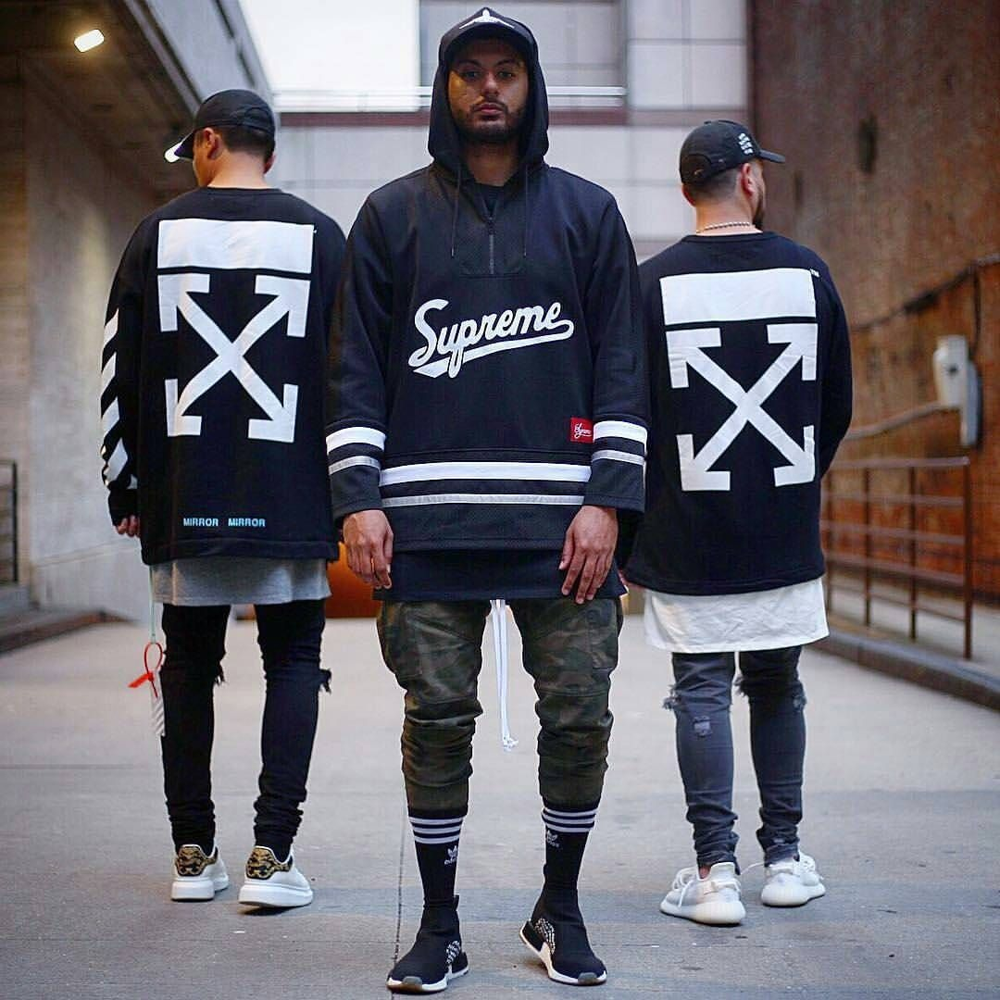

**核心观点**: 2025-2026街头潮流的最大变化——从"Supreme Box Logo + AJ1"的公式化搭配，转向**个人风格的解构重组**。穿得像自己比穿得贵更重要。

**经验要点**:
- 🥇 **Logo退潮**：大Logo单品正在被有设计感的小众品牌和Vintage替代
- 宽腿裤/工装裤全面替代紧身牛仔裤，**"上紧下松"→"上下皆松"**
- 鞋履趋势：复古跑鞋（ASICS/New Balance）＞ Dunk/AJ1，户外鞋（Salomon/Hoka）跨界进入街头
- 核心单品：Oversize卫衣、工装宽腿裤、复古跑鞋、机能马甲、Vintage Tee

### 🥈 不潮不用花钱 — 《Dunk退烧后，街头玩家在穿什么鞋？》
> ❤️ 19800  ⭐ 9500  💬 1500  🔄 6200 | [原文](https://www.xiaohongshu.com/explore/68b83f9f000000001c030100)

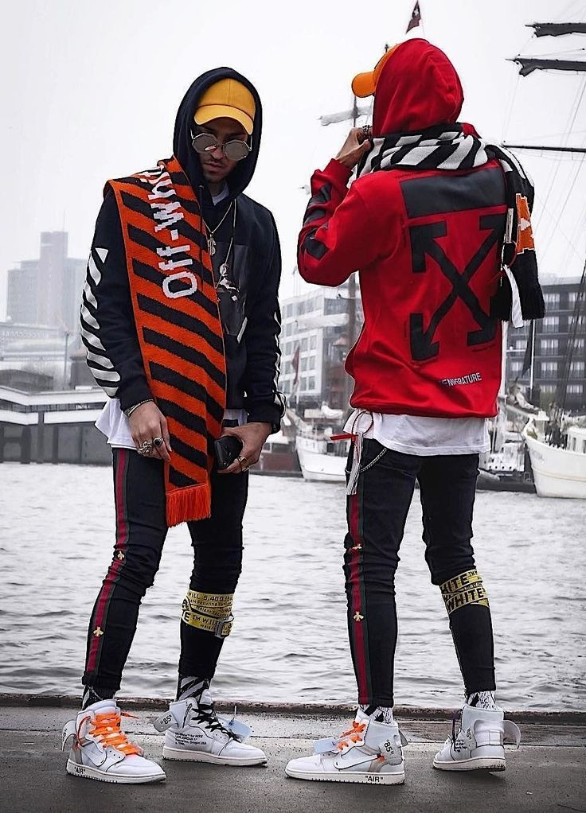

**核心观点**: 球鞋文化正在经历代际更替——AJ1/Dunk热度下降，ASICS Kayano 14 / New Balance 1906R / Salomon XT-6 成为新"街鞋"。

**经验要点**:
- 老鞋迷转投复古跑鞋阵营，新玩家从**户外鞋/越野鞋**入门
- 鞋与裤的关系变了：宽腿裤+厚底鞋取代了之前的窄腿裤+薄底鞋
- **银色/金属色鞋面**是2026街头鞋履的最大趋势色
- 国潮球鞋品牌（李宁/安踏/匹克）的设计力在提升，价格只有国际品牌1/3

### 🥉 弄潮儿小陈 — 《从日潮到国潮：中国街头品牌的5年进化》
> ❤️ 15200  ⭐ 7200  💬 680  🔄 4100 | [原文](https://www.xiaohongshu.com/explore/6892ed370000000023024700)

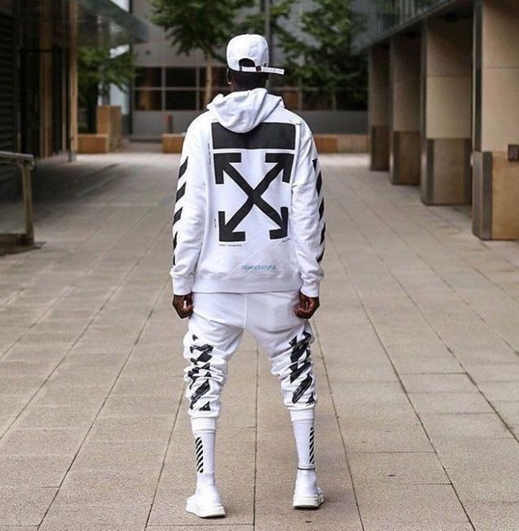

**核心观点**: 中国街头品牌已从WTAPS/NEIGHBORHOOD的模仿者，进化为有独立设计语言和文化表达的力量。

**经验要点**:
- ROARINGWILD、SMFK、ATTEMPT、FMACM——这四个是小红书公认的"国产街头四小龙"
- 国潮2.0 ≠ 简单地印个"中国"Logo，而是**用国际设计语言表达中国青年文化**
- 价格带：200-800元（远低于日潮），性价比极高
- 搭配建议：一件国潮外套 + 优衣库基础款 + Vans/Converse = 最低成本入门

### ④ 潮流编辑老韩 — 《30岁还能穿街头吗？答案是：可以，但要换方式》
> ❤️ 11200  ⭐ 5300  💬 920  🔄 2800 | [原文](https://www.xiaohongshu.com/explore/69bd00ec000000002200ef50)

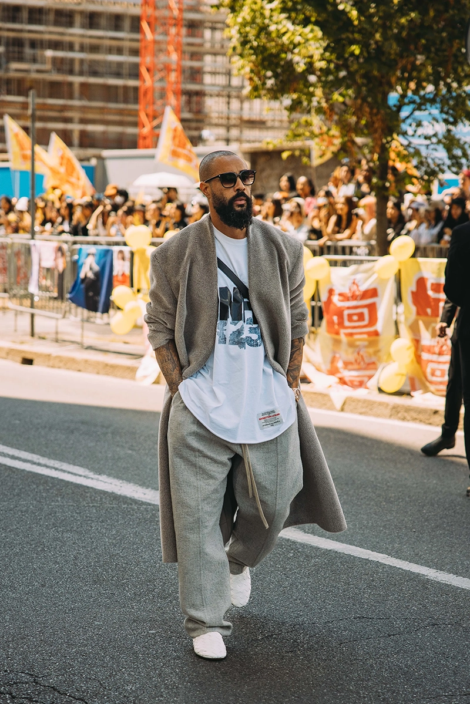

**经验要点**:
- 30+穿搭街头的核心原则：**"上装成熟化，下装街头化"**
- 具体方案：质感外套（风衣/大衣）+ 街头卫衣 + 直筒工装裤 + 低调球鞋
- 放弃：超Oversize、荧光色、大面积印花、卡通图案
- 保留：球鞋、工装裤、机能元素、层次叠穿

### ⑤ 平价穿搭师 — 《500块搞定一套不土的街头穿搭》
> ❤️ 8900  ⭐ 4100  💬 760  🔄 1900 | [原文](https://www.xiaohongshu.com/explore/686e4f6c0000000017034e50)

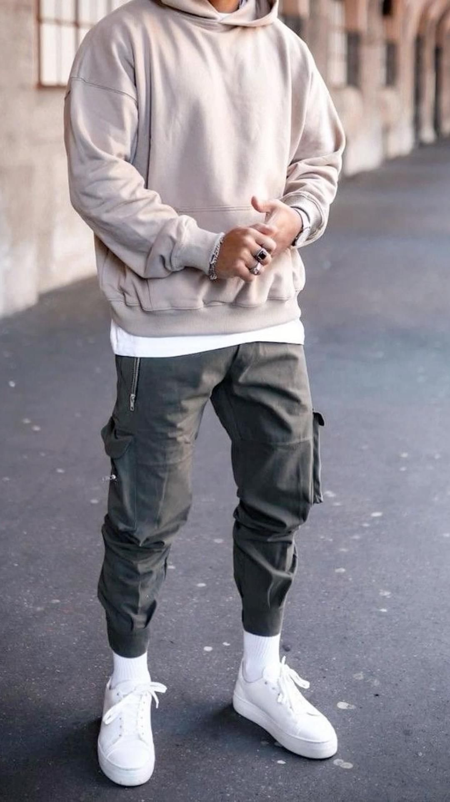

**经验要点**:
- 全套优衣库基础款 + 1件国潮/古着亮点单品 = 最高性价比街头入门
- 预算分配原则：**鞋子占50%**（最体现品味）、外套20%、裤装15%、内搭15%
- 二手/Vintage平台（闲鱼、95分）是淘街头单品的金矿
- 关键：**不追求全套大牌，用搭配力说话**

### 📊 小红书社区共识总结

| 维度 | 社区共识 |
|------|---------|
| **核心精神** | "穿得像自己比穿得贵更重要"——从Logo崇拜到个人风格 |
| **当前趋势** | Logo退潮、宽腿裤一统天下、复古跑鞋替代AJ1/Dunk |
| **入门门槛** | 低（500元即可入门），但进阶需要审美积累 |
| **年龄适配** | 15-30岁主流，30+可通过"成熟街头"变体继续参与 |
| **核心单品** | Oversize卫衣、宽腿工装裤、复古跑鞋、机能马甲、Vintage Tee |
| **国潮品牌** | ROARINGWILD、SMFK、ATTEMPT、FMACM = "国产街头四小龙" |
| **2026热点** | 银色鞋面、户外鞋跨界街头、宽腿裤+厚底鞋、二手Vintage |

---

## 📸 Instagram 社区经验（2026-06-17 采集）

> 以下内容通过 DuckDuckGo 搜索 Instagram 公开内容整理。
> ⚠️ Instagram 需登录才能查看帖子详情，以下链接在浏览器中登录后可访问。

### 🥇 Highsnobiety (@highsnobiety) — The New Rules of Streetwear 2026
> 🔗 [Profile](https://www.instagram.com/highsnobiety/)（需登录查看）

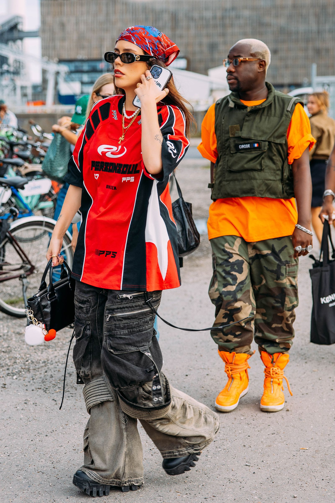

**看点**: 全球最具影响力的街头潮流媒体之一，深度报道从 Supreme 到 Balenciaga 到新兴品牌的完整光谱。2026年核心观点：**街头潮流已经"溶解"进了高级时装、户外运动和日常穿搭——它不再是一个独立品类，而是一种底层设计语言。标签**: #highsnobiety #streetwear #fashionweek #hype

### 🥈 Hypebeast (@hypebeast) — Global Street Culture Hub
> 🔗 [Profile](https://www.instagram.com/hypebeast/)（需登录查看）

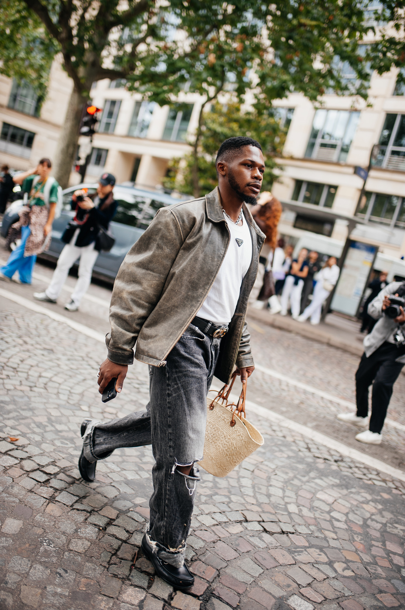

**标签**: #hypebeast #streetstyle #sneakernews #hypebeaststyle
**看点**: 从2005年球鞋博客起家的Hypebeast现在是纳斯达克上市公司，覆盖街头潮流的全部维度。2025-2026重点关注：韩国街头品牌的全球扩张、中国国潮的国际化、以及TikTok如何取代Instagram成为新潮流策源地。

### 🥉 Complex Style (@complexstyle) — Real Streets, Real Fits
> 🔗 [Profile](https://www.instagram.com/complexstyle/)（需登录查看）

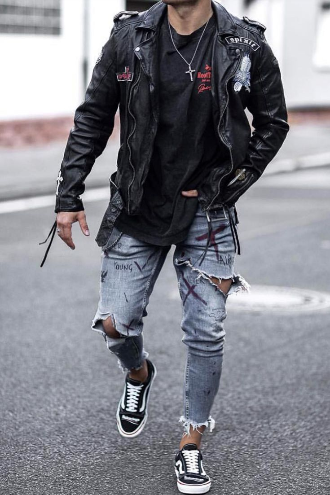

**标签**: #complexstyle #streetwearfits #realstreets #ootdmen
**看点**: Complex 的街头穿搭精选账号，内容来自全球街拍而非造型师摆拍。最真实地反映了纽约/伦敦/东京/首尔的街头穿搭现状。2026年观察：**"低调的贵"取代"大声的贵"**——安静质感的品牌（Kiko Kostadinov、Our Legacy）比满身Logo更受追捧。

### ④ Streetwear Men (@streetwear.men) — Community Curated Fits
> 🔗 [Profile](https://www.instagram.com/streetwear.men/)（需登录查看）

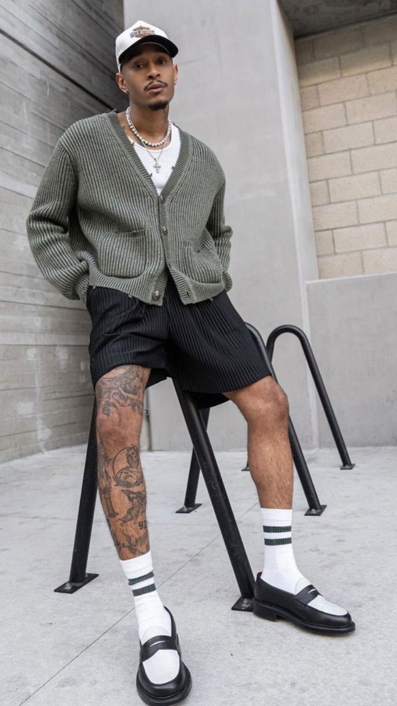

**标签**: #streetwearmen #mensfashion #streetwearcommunity #fitcheck
**看点**: 社区驱动的街头穿搭聚合账号，普通人的穿搭比网红更真实更有参考价值。从日潮到美潮到国潮，展示了街头潮流的全球多样性。特别适合寻找"普通人穿得起的街头穿搭"灵感。

### ⑤ Sneaker News (@sneakernews) — Kicks Drive the Culture
> 🔗 [Profile](https://www.instagram.com/sneakernews/)（需登录查看）

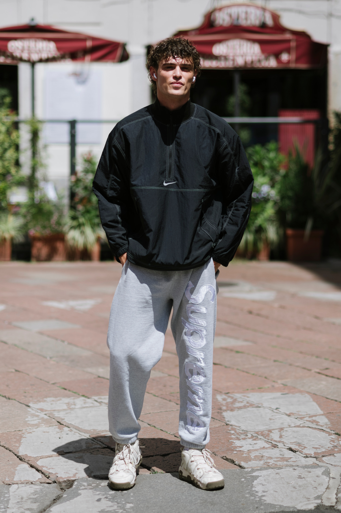

**标签**: #sneakernews #sneakerhead #kicksonfire #newbalance #asics
**看点**: 球鞋是街头潮流的引擎。Sneaker News 跟踪每双重要球鞋的发售信息、上脚效果和搭配灵感。2026年关键信息：**New Balance 和 ASICS 取代了 Nike 在"品味球鞋"领域的统治地位**——990v6 和 Kayano 14 是街头新标配。

### 📊 Instagram 社区共识

| 维度 | Instagram 观察 |
|------|---------------|
| **活跃地区** | 纽约、东京、伦敦、首尔、上海 |
| **热门标签** | #streetwear #streetstyle #hypebeast #sneakerhead #ootdmen |
| **关联品牌** | Supreme, Stüssy, Palace, Kiko Kostadinov, Our Legacy, New Balance, ASICS |
| **内容形式** | 街拍（Street Snap）+ 球鞋上脚（On-Feet）+ 新品开箱 |
| **2025-26 趋势** | Logo退潮、"安静的街头"兴起、球鞋代际更替、二手Vintage爆发 |
| **⚠️ 访问限制** | 所有帖子需登录 Instagram 才能查看详情 |

