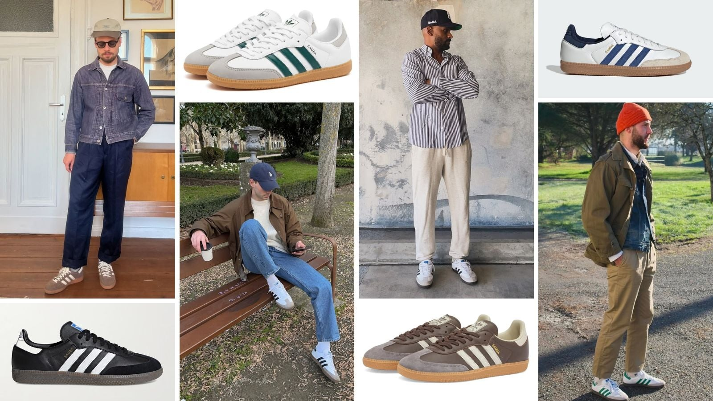
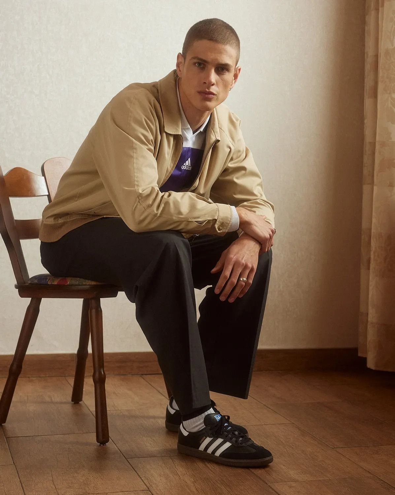
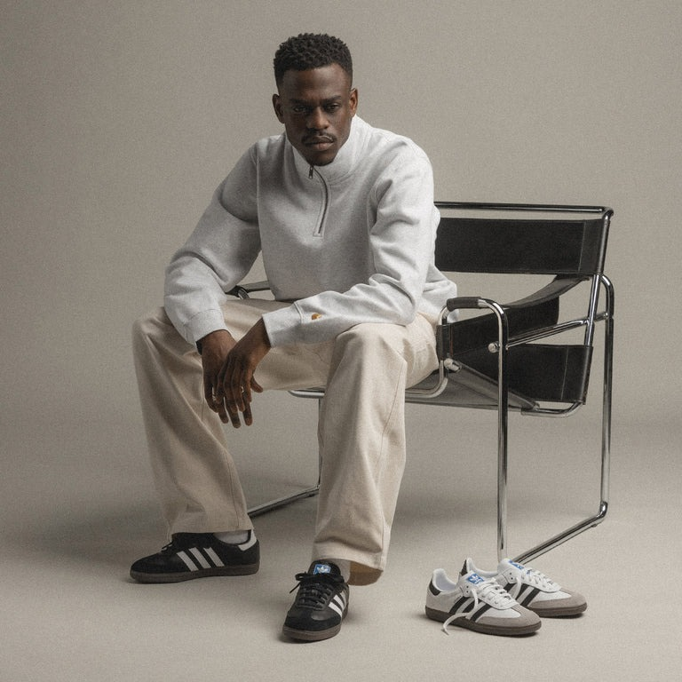

# 薄底跑鞋风 (Torpedo Sneakers)

> **状态**: `reviewed` | **最后更新**: 2026-06-13 | **趋势**: 流行趋势
> **分类**: 意式 > 当代2020s > 休闲 > 社交 > 极简调性

## 📖 概述
- **发源年代**: 2024-2025
- **发源地**: 欧洲（Prada/Dries Van Noten 秀场推动）
- **风格关键词**: 薄底、修长鞋身、复古跑鞋、轻盈、精致
- **一句话定义**: 告别厚底老爹鞋的"笨重时代"——超薄鞋底的复古跑鞋成为新的鞋履身份符号。

## 📜 历史文化
老爹鞋（Chunky Sneakers）从 2017 Balenciaga Triple S 开始统治了七年。2024-2025 年，鞋底开始变薄。Prada Collapse 和 Dries Van Noten 的薄底跑鞋成为转折点——Adidas SL72 等复古薄底跑鞋被重新发现。

## 🎨 美学特征
- 鞋底厚度 < 2cm（对比老爹鞋 4-6cm）
- 鞋身修长狭长，不臃肿
- 复古跑鞋轮廓（1970s-80s 马拉松鞋型）
- 配色低调：白/灰/黑/海军蓝为主

### 代表鞋款
| 鞋款 | 品牌 | 特征 |
|------|------|------|
| SL72 | Adidas | 1972奥运马拉松鞋 |
| Collapse | Prada | 奢侈薄底跑鞋开创者 |
| Samba | Adidas | 室内足球鞋→时尚符号 |
| Gazelle | Adidas | 比Samba更薄更复古 |
| Onitsuka Tiger Mexico 66 | Onitsuka Tiger | 李小龙穿过的经典 |
| Cortez | Nike | 1972元年跑鞋 |

## 🏷️ 品牌
- **Prada** — Collapse 系列定义奢侈薄底跑鞋
- **Dries Van Noten** — 秀场薄底跑鞋
- **Adidas** — SL72/Samba/Gazelle 三件套
- **Onitsuka Tiger** — Mexico 66 经典
- **Nike** — Cortez/Waffle Trainer

## 📈 流行趋势
- 2025-2026 持续升温，Lyst 数据支持
- 对瘦长体型的亚洲男性非常友好——薄底鞋与瘦腿的比例协调

## 💡 穿搭建议
1. 搭配直筒裤或微阔腿裤——裤脚刚好盖住鞋面或九分露踝
2. 避开过于宽松的裤子（与薄底比例失衡）
3. 白袜/灰袜+薄底鞋=2026标准公式

## 📸 风格图库

> 以下为风格代表性穿搭参考图，搜集自公开时尚媒体。

*风格穿搭参考*

*adidas Samba - landmark of the Terrace Culture | Adidas outfit men ...*

*How to style the adidas Samba OG - Sneakerjagers*
